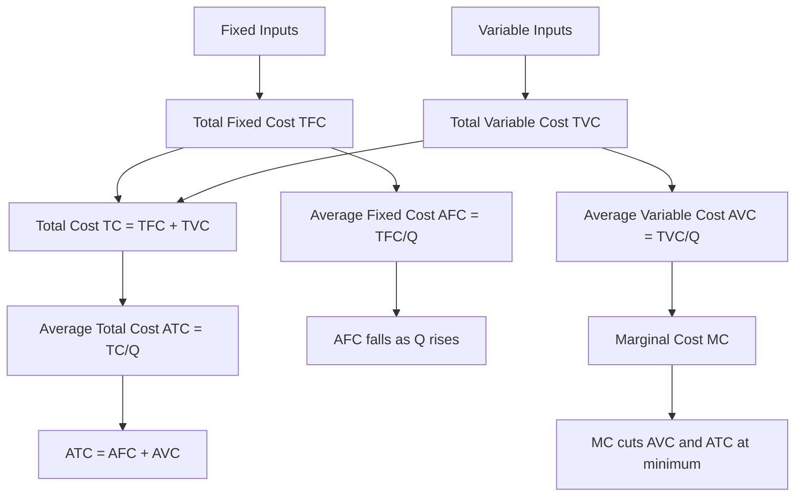
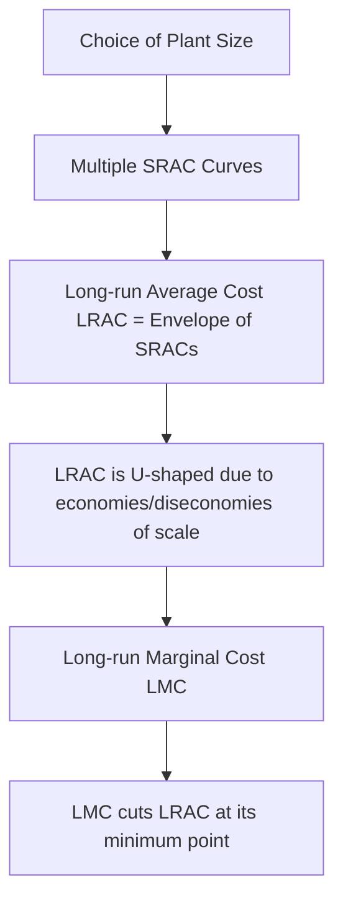

# Short-run and Long-run Cost Curves: Graphical Illustration

## 1. Definition

Short-run cost curves show the relationship between the cost of production and the level of output when at least one factor of production is fixed. Long-run cost curves show this relationship when all factors of production are variable, and the firm can choose the optimum scale of plant for each output level.

---

## 2. Concept Explanation

**Basic Idea:** A firm incurs costs to produce goods. In the short run, some costs like rent and machinery depreciation are fixed, regardless of output. Others, like raw material and labour, vary with production. In the long run, everything can be changed, so there are no fixed costs. The cost curves graphically depict how total, average, and marginal costs behave as output changes.

**How it works:** In the short run, total cost (TC) is the sum of total fixed cost (TFC) and total variable cost (TVC). TFC is a horizontal line; TVC starts at zero and rises with output, first at a decreasing rate then at an increasing rate due to the law of variable proportions. Average fixed cost (AFC) falls continuously. Average variable cost (AVC) and average total cost (ATC) are U-shaped. Marginal cost (MC) is also U-shaped and cuts AVC and ATC at their minimum points.

In the long run, the firm can adjust its plant size. Each plant size has its own set of short-run cost curves. The long-run average cost (LRAC) curve is the envelope (lower boundary) of all possible short-run average cost (SRAC) curves. It shows the minimum average cost of producing each output when the firm is free to choose the best plant size. The LRAC curve is typically U-shaped due to economies and diseconomies of scale.

**Why it is important:** These curves are essential tools for production planning, pricing, and investment decisions. They help managers understand cost behaviour, identify the most efficient output level, and decide whether to expand or contract the scale of operations.

---

## 3. Key Characteristics / Features

- **Short run:** At least one input fixed; costs divided into fixed and variable.
- **Long run:** All inputs variable; all costs are variable.
- **U-shaped curves:** AVC, ATC, and MC in the short run, and LRAC in the long run, are generally U-shaped.
- **TFC horizontality:** Total fixed cost remains constant irrespective of output.
- **Envelope relationship:** LRAC is the lower envelope of all SRAC curves corresponding to different plant sizes.
- **MC cuts minimum points:** MC curve intersects AVC and ATC at their lowest points in the short run; similarly, long-run marginal cost (LMC) cuts LRAC at its minimum.
- **Smooth LRAC:** LRAC is a planning curve and usually smoother than SRAC curves.
- **Scale economies:** The shape of LRAC reflects increasing, constant, and decreasing returns to scale.

---

## 4. Types / Classification

### Short-run Cost Curves

- **Total Costs:** Total Fixed Cost (TFC), Total Variable Cost (TVC), Total Cost (TC = TFC + TVC).
- **Average Costs:** Average Fixed Cost (AFC), Average Variable Cost (AVC), Average Total Cost (ATC or AC).
- **Marginal Cost:** Marginal Cost (MC).

### Long-run Cost Curves

- **Long-run Total Cost (LTC):** The minimum total cost of producing each output level when all inputs are variable.
- **Long-run Average Cost (LRAC):** LTC divided by output; the envelope of SRAC curves.
- **Long-run Marginal Cost (LMC):** Change in LTC when output changes by one unit.

---

## 5. Working / Mechanism

1. **Short-run cost derivation:** Start with a fixed plant. Add variable inputs (labour) gradually. Record output and total variable cost. Add fixed cost to get TC. Compute AVC, AFC, ATC, and MC.
2. **TFC:** A horizontal line because fixed cost is constant.
3. **TVC:** Curve starts at origin, rises at a decreasing rate initially (increasing returns to variable input), then at an increasing rate (diminishing returns).
4. **TC:** Combines TFC and TVC; parallel to TVC, shifted up by TFC.
5. **AFC:** Declines continuously (rectangular hyperbola) because a constant is divided by increasing output.
6. **AVC and ATC:** Both are U-shaped. They fall when MC is below them, reach minimum where MC equals them, and rise thereafter.
7. **MC:** U-shaped; falls briefly, then rises. It cuts both AVC and ATC from below at their minimum points.
8. **Long-run planning:** The firm chooses a plant size for a target output. For each possible plant size, there is a SRAC curve. The LRAC curve connects the points of minimum SRAC for each output, thus forming the envelope.
9. **LMC:** Derived from LTC; it intersects LRAC at its lowest point, just like short-run MC intersects ATC at its minimum.
10. **Graphical illustration:** Draw TFC horizontal; TVC and TC rising; below, plot U-shaped AVC, ATC, MC. In long-run graph, draw multiple U-shaped SRAC curves (each representing a plant size) and the LRAC envelope touching them at their minimum points. The LMC passes through the minimum of LRAC.

---

## 6. Diagram

**Short-run cost curves relationship:**

**Long-run cost curves relationship:**

*Note: In a standard graph, TFC is a horizontal line; TVC and TC are upward-sloping curves. AFC falls continuously. AVC, ATC, and MC are U-shaped. In the long run, LRAC is a smooth U-shaped envelope that touches each SRAC at its minimum scale point. At the optimal scale, LRAC reaches its minimum.*

---

## 7. Mathematical Formulation

### Short-run cost functions

Total cost:
$$
TC = TFC + TVC
$$

Average costs:
$$
AFC = \frac{TFC}{Q}, \quad AVC = \frac{TVC}{Q}, \quad ATC = \frac{TC}{Q} = AFC + AVC
$$

Marginal cost:
$$
MC = \frac{\Delta TC}{\Delta Q} = \frac{d(TC)}{dQ}
$$

### Long-run cost functions

Long-run total cost:
$$
LTC = f(Q)
$$

Long-run average cost:
$$
LRAC = \frac{LTC}{Q}
$$

Long-run marginal cost:
$$
LMC = \frac{d(LTC)}{dQ}
$$

Envelope condition: At the output where a particular plant size is optimal, the short-run average cost for that plant is tangent to the LRAC curve, i.e.,
$$
SRAC_i(Q^*) = LRAC(Q^*)
$$
and at that tangency point, the corresponding short-run marginal cost equals long-run marginal cost:
$$
SMC_i(Q^*) = LMC(Q^*)
$$

---

## 8. Example

**Short run:** A bakery has a monthly fixed cost of ₹50,000 (rent, oven lease). The variable cost (flour, labour) increases with the number of cakes. For 1,000 cakes, TVC = ₹30,000, TC = ₹80,000, ATC = ₹80. For 2,000 cakes, TVC = ₹65,000, TC = ₹1,15,000, ATC = ₹57.50. Between 1,000 and 2,000 cakes, MC = (1,15,000 – 80,000) / 1,000 = ₹35. As output grows further, due to congestion in the kitchen, MC rises, pulling ATC up after its minimum point.

**Long run:** The bakery can move to a larger kitchen. For a small kitchen, the SRAC curve is higher at high outputs. For a larger kitchen, SRAC curve shifts right and lower. The LRAC envelope shows the minimum cost of making any number of cakes when the owner is free to choose the kitchen size. At 5,000 cakes per month, the optimal size gives LRAC = ₹40. At 10,000 cakes, an even larger plant yields LRAC = ₹38. After that, managing huge operations causes diseconomies, and LRAC starts rising.

---

## 9. Analogy

Think of cost curves like the performance of a student across different class sizes. In the short run, the classroom (fixed input) is fixed. Adding a few students (variable input) uses the teacher effectively, and cost per student (average cost) falls. Too many students cause overcrowding, and per-student learning (marginal product) drops, so cost per student rises—U-shape.

In the long run, the school can build more classrooms (adjust plant size). For each number of students, there is an ideal number of classrooms that minimizes cost per student. The LRAC curve is a line connecting these minimum points for each possible student enrollment. Adding administrative layers eventually raises the per-student cost again, giving the LRAC its U-shape.

---

## 10. Comparison (Short-run vs Long-run Cost Curves)

| Feature | Short-run Cost Curves | Long-run Cost Curves |
|--------|-----------------------|----------------------|
| Fixed inputs | Exist; TFC > 0 | None; all inputs variable |
| Cost classification | TFC, TVC, TC, AFC, AVC, ATC, MC | LTC, LAC, LMC |
| Shape of AC | U-shaped due to law of variable proportions | U-shaped due to economies and diseconomies of scale |
| Number of curves | Many: TFC, TVC, TC, AFC, AVC, ATC, MC | Fewer: LTC, LAC, LMC |
| Planning horizon | Operational decisions | Strategic decisions on plant size |
| Envelope relationship | Not applicable | LRAC is envelope of SRAC curves |

---

## 11. Advantages

- Helps firms identify the profit-maximising output level where MC = MR.
- Short-run curves show how cost per unit changes with output, guiding day-to-day pricing.
- Long-run curves guide investment decisions about plant capacity and expansion.
- The envelope concept helps understand the economies of scale and the optimum scale of production.
- Graphical illustration makes complex cost relationships intuitive and communicable.
- Forms the foundation for break-even analysis and budgeting.

---

## 12. Disadvantages / Limitations

- Assumes cost functions are smooth and continuous, which may not hold in discrete production processes.
- Fixed costs are not always perfectly constant; step-fixed costs exist.
- The short-run classification into perfectly fixed and variable may be unrealistic for some industries.
- Long-run envelope diagrams assume many possible plant sizes, which may not be available.
- External factors like technological change are not reflected in static curves.
- Short-run curves assume input prices constant; real-world input prices may change with output levels.

---

## 13. Important Points / Exam Notes

- TFC is horizontal; TVC rises with output; TC is parallel to TVC.
- AFC declines continuously; it is a rectangular hyperbola.
- AVC and ATC are U-shaped; MC is also U-shaped.
- MC < ATC (or AVC) when ATC (AVC) falls; MC > ATC (AVC) when they rise.
- MC cuts AVC and ATC exactly at their minimum points.
- In the long run, all costs are variable; there is no fixed cost.
- LRAC is the envelope of SRAC curves; it is U-shaped due to economies and diseconomies of scale.
- Optimal plant size is where SRAC is tangent to LRAC at the minimum point of LRAC (if constant returns not present).
- LMC cuts LRAC at its minimum point.
- Short-run cost decisions are temporal; long-run cost analysis is for strategic capacity planning.

---

## 14. Applications / Use Cases

- **Production planning:** A factory uses AVC and MC curves to decide whether to increase output when receiving a bulk order.
- **Plant expansion:** A manufacturing company draws LRAC curves to determine the most cost-effective factory size before committing capital.
- **Break-even analysis:** Firms calculate the output level where ATC equals price to ensure no loss.
- **Pricing strategy:** Airlines use understanding of fixed versus variable cost to offer last-minute tickets at low prices (above AVC).
- **Policy evaluation:** Governments examine cost curves of industries to assess the impact of subsidies or taxes on output decisions.

---

## 15. MCQs

**Q1. Which of the following cost curves is a horizontal line in the short run?**  
A. Total variable cost  
B. Total cost  
C. Total fixed cost  
D. Marginal cost  
**Answer:** C  
**Explanation:** TFC remains constant regardless of output, so it is represented by a horizontal line.

**Q2. The AFC curve is typically shaped like:**  
A. A horizontal line  
B. A U-shape  
C. A rectangular hyperbola  
D. An inverted U  
**Answer:** C  
**Explanation:** AFC = TFC/Q; as Q increases, AFC falls continuously, taking the form of a rectangular hyperbola.

**Q3. The MC curve intersects the ATC and AVC curves at:**  
A. Their maximum points  
B. Their minimum points  
C. The point where output is zero  
D. The break-even point  
**Answer:** B  
**Explanation:** Marginal cost equals average cost at the minimum point of the average cost curves.

**Q4. In the long run, which of the following costs exists?**  
A. Total fixed cost  
B. Average fixed cost  
C. Total variable cost only  
D. All costs are variable, so only variable-related aggregates  
**Answer:** D  
**Explanation:** In the long run, all inputs are variable; hence, there are no fixed costs. All costs are variable.

**Q5. The LRAC curve is also known as:**  
A. Planning curve  
B. Envelope curve  
C. Both A and B  
D. Sunk cost curve  
**Answer:** C  
**Explanation:** LRAC is the planning curve showing minimum cost per unit for any output, and it is the envelope of SRAC curves.

**Q6. Which of the following statements about the LMC curve is correct?**  
A. It cuts the LRAC at its maximum  
B. It always lies above the LRAC  
C. It cuts the LRAC at its minimum point  
D. It is a horizontal line  
**Answer:** C  
**Explanation:** Similar to the short-run relationship, LMC intersects LRAC at the lowest point on LRAC.

**Q7. The U-shape of the short-run AVC and ATC curves is primarily due to:**  
A. Economies of scale  
B. Law of diminishing marginal returns  
C. Constant returns to variable input  
D. Diseconomies of scale  
**Answer:** B  
**Explanation:** In the short run, as more variable input is added to a fixed input, marginal product eventually falls, causing AVC and ATC to rise after a point.

**Q8. Which curve acts as an envelope of short-run average cost curves?**  
A. Long-run marginal cost curve  
B. Long-run average cost curve  
C. Short-run total cost curve  
D. Short-run marginal cost curve  
**Answer:** B  
**Explanation:** LRAC is drawn as the lower envelope of all possible SRAC curves for different plant sizes.

**Q9. If a firm is operating at a point where SRAC = LRAC, this implies that:**  
A. The firm is making a loss  
B. The plant size is optimal for that output level  
C. The firm is experiencing diseconomies of scale  
D. Marginal cost is infinite  
**Answer:** B  
**Explanation:** Tangency of SRAC to LRAC means that for that output, the plant size is cost-minimizing among all possible sizes.

**Q10. A rectangular hyperbola shape of AFC implies that:**  
A. AFC remains constant as output changes  
B. Total fixed cost remains constant as output changes  
C. AVC is also constant  
D. TFC increases with output  
**Answer:** B  
**Explanation:** AFC = TFC/Q; since TFC is constant, the product AFC × Q is constant, which describes a rectangular hyperbola.