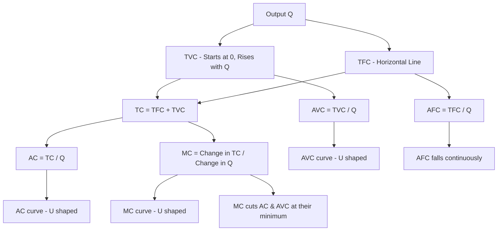

# 02 Total cost fixed cost variable cost marginal cost average cost diagrammatic concept

## 1. Definition

In short‑run production theory, cost is divided into several related concepts:

- **Total Fixed Cost (TFC):** The cost that does not change with the level of output. It remains constant even if production is zero.
- **Total Variable Cost (TVC):** The cost that varies directly with the quantity of output. It increases as more is produced.
- **Total Cost (TC):** The sum of fixed and variable costs at any output level (TC = TFC + TVC).
- **Marginal Cost (MC):** The additional cost incurred by producing one more unit of output.
- **Average Cost (AC):** The cost per unit of output (TC ÷ Quantity). It can be split into Average Fixed Cost (AFC) and Average Variable Cost (AVC).

The diagrammatic concept refers to the graphical representation of these cost curves and how they relate to output and to each other.

## 2. Concept Explanation

Every production process uses inputs. Some inputs (like buildings, heavy machinery, a leasehold) cannot be changed quickly; their cost is fixed in the short run. Other inputs (raw materials, hourly labour, energy) can be changed as output varies; their cost is variable. Total cost is the sum of the two.

When output increases, fixed cost stays unchanged, while variable cost rises. Total cost, therefore, rises at the same rate as variable cost. Average cost first falls because the fixed cost gets spread over more units; later it may rise if variable cost per unit increases. Marginal cost shows the true cost of expanding output by one unit and is the main guide for profit‑maximising decisions.

Understanding these costs with the help of a diagram is essential for engineers and project managers. It helps them find the most efficient production level, plan break‑even points, and decide whether to accept or reject additional orders.

## 3. Key Characteristics / Features

- **TFC does not vary with output:** Its curve is a horizontal straight line.
- **TVC starts from the origin and increases with output:** Initially it may rise slowly, then more steeply.
- **TC curve is parallel to TVC:** The vertical gap between TC and TVC equals TFC.
- **MC curve is U‑shaped:** Due to the law of variable proportions, MC first falls, reaches a minimum, and then rises.
- **AC and AVC curves are also U‑shaped:** They fall when MC is below them and rise when MC is above them.
- **MC cuts AC and AVC at their minimum points:** This relationship is a fundamental rule of cost theory.
- **AFC declines continuously:** As output grows, constant fixed cost is divided by larger quantity.

## 4. Types / Classification

The cost concepts naturally group into:

- **Fixed vs. Variable Costs:** Based on whether the cost changes with output in the short run.
- **Total Costs:** The absolute spending – further divided into TFC, TVC, and TC.
- **Per‑Unit Costs:** Average measures (AFC, AVC, AC) and the extra cost of one more unit (MC).

All these are part of the short‑run cost structure, which is what the diagrammatic concept illustrates.

## 5. Working / Mechanism

The process of calculating and plotting these costs works step by step.

1.  **Identify fixed and variable inputs:** Separate expenses like rent (fixed) and raw materials (variable).
2.  **Determine TFC:** Sum all costs that stay constant regardless of output.
3.  **Calculate TVC for each output level:** Multiply variable inputs by their unit cost and sum.
4.  **Compute TC:** Add TFC and TVC for each output level.
5.  **Derive MC:** For each extra unit, find the change in TC (or TVC).  
    \( MC = \Delta TC / \Delta Q \).
6.  **Derive AC, AVC, AFC:** Divide TC, TVC, and TFC by quantity Q.
7.  **Plot curves:** Put cost on the vertical axis and output Q on the horizontal axis. Draw TFC as a horizontal line, TVC rising from zero, TC parallel above TVC. Draw U‑shaped MC, AC, and AVC, with AFC falling continuously and MC cutting AC and AVC at their lowest points.
8.  **Interpret:** Use the diagram to see the output range where costs are lowest per unit and where additional production becomes expensive.

## 6. Diagram

## 7. Mathematical Formulation

The basic equations are:

$$
TC = TFC + TVC
$$

$$
MC = \frac{\Delta TC}{\Delta Q} \quad \text{or} \quad MC = \frac{d(TC)}{dQ}
$$

$$
AC = \frac{TC}{Q}
$$

$$
AVC = \frac{TVC}{Q}
$$

$$
AFC = \frac{TFC}{Q}
$$

Where:
- \( Q \) = Quantity of output
- \( TFC \) = Total fixed cost (constant)
- \( TVC \) = Total variable cost (function of \( Q \))
- \( \Delta \) = Small change

## 8. Example

A small engineering workshop has a monthly rent and machine lease costing ₹30,000 (TFC). The variable cost per job is ₹1,500 for materials and labour. If the workshop completes 20 jobs in a month:
- \( TVC = 20 \times 1,500 = ₹30,000 \)
- \( TC = 30,000 + 30,000 = ₹60,000 \)
- \( AC = 60,000 / 20 = ₹3,000 \) per job
- \( MC \) for the 21st job is ₹1,500 (only the extra variable cost).

If the workshop is extremely busy, overtime pay might raise the marginal cost to ₹2,000. Then the MC curve would rise, showing the U‑shape when plotted.

## 9. Analogy

Think of hiring a taxi for a day. The daily rental is a fixed cost – you pay it even if you travel zero kilometres. The fuel you burn depends on the distance travelled – that is the variable cost. Your total cost is the daily rental plus fuel. The cost per kilometre (average cost) is high if you travel only a short distance because the rental is divided over few kilometres. Each extra kilometre costs only the fuel (marginal cost). This simple picture illustrates how fixed and variable costs, and average and marginal costs, work.

## 10. Comparison

| Feature | Fixed Cost (TFC) | Variable Cost (TVC) | Marginal Cost (MC) | Average Cost (AC) |
|--------|----------|----------|----------|----------|
| **Meaning** | Cost of fixed inputs, unaffected by output | Cost of variable inputs, changes with output | Extra cost of producing one additional unit | Per unit cost of total output |
| **Behaviour as Q rises** | Remains constant | Increases, first slowly then rapidly | Typically U‑shaped (falls then rises) | U‑shaped (falls then rises) |
| **Graph shape** | Horizontal line | Upward sloping curve | U‑shaped curve | U‑shaped curve |
| **Formula** | \( TFC \) | \( TVC \) | \( \Delta TC / \Delta Q \) | \( TC / Q \) |

## 11. Advantages

- **Clear classification helps in decision making:** Knowing fixed and variable costs is essential for break‑even analysis and pricing.
- **Short‑run production planning:** The diagram shows the output level where average costs are lowest.
- **Profit maximisation:** By comparing MC with price, a firm can decide how much to produce.
- **Cost control:** Managers can target variable costs for reduction without changing fixed commitments.
- **Capacity utilisation:** The shape of average cost curves indicates whether a plant is under‑ or over‑utilised.

## 12. Disadvantages / Limitations

- **Only valid in the short run:** In the long run all costs become variable.
- **Real‑world fixed costs may not be perfectly constant:** Step‑fixed costs change after a large capacity increase.
- **U‑shaped curves assume given technology:** Technological improvements may alter the typical shapes.
- **MC is difficult to measure precisely:** Actual production data may not be smooth; small output changes are hard to isolate.
- **Ignores external costs:** The diagram shows only private costs of the firm, not social or environmental costs.

## 13. Important Points / Exam Notes

- TC = TFC + TVC → TC curve is parallel to TVC with vertical gap = TFC.
- TFC curve is horizontal; TVC starts from origin.
- AFC = TFC / Q → AFC declines continuously but never becomes zero.
- AVC and AC are U‑shaped; AC = AFC + AVC.
- MC cuts both AVC and AC at their minimum points.
- When MC < AC, AC is falling; when MC > AC, AC is rising.
- MC is derived from TVC or TC; \(\Delta TFC = 0\), so MC also equals \(\Delta TVC / \Delta Q\).
- The diagrammatic concept shows all seven cost curves: TFC, TVC, TC, AFC, AVC, AC, MC.
- Short‑run cost curves are used in break‑even analysis and profit planning.

## 14. Applications / Use Cases

- **Manufacturing:** A factory manager uses fixed and variable cost data to compute break‑even point and to decide on accepting a bulk order at a lower price.
- **Construction projects:** Civil engineers separate site establishment cost (fixed) from material and labour cost (variable) to bid accurately.
- **IT service firms:** Office rental and server leases are fixed; developer hours are variable. The MC of executing one more project helps in pricing contracts.
- **Power sector:** Thermal plant fixed cost (installation) and variable fuel cost determine dispatch order and electricity tariff design.
- **Transport fleet management:** Vehicle registration and insurance are fixed; fuel and maintenance are variable, guiding per‑trip charges.

## 15. MCQs

**Q1. Which of the following costs remains constant in the short run irrespective of the level of output?**

A. Total variable cost  
B. Marginal cost  
C. Total fixed cost  
D. Average variable cost  

**Answer:** C  
**Explanation:** Total fixed cost does not change with output in the short run.

---

**Q2. Total cost is the sum of**

A. MC and AVC  
B. TFC and TVC  
C. AFC and AVC  
D. TVC and MC  

**Answer:** B  
**Explanation:** By definition, TC = TFC + TVC.

---

**Q3. Marginal cost is calculated as**

A. TC / Q  
B. TFC / Q  
C. Change in TC divided by change in output  
D. TVC – TFC  

**Answer:** C  
**Explanation:** MC = ΔTC / ΔQ, the extra cost for one more unit.

---

**Q4. The average fixed cost curve**

A. Is U‑shaped  
B. Increases as output rises  
C. Remains constant  
D. Declines continuously as output increases  

**Answer:** D  
**Explanation:** AFC = TFC/Q, so it falls as Q rises.

---

**Q5. The marginal cost curve intersects the average cost curve at**

A. The minimum point of MC  
B. The maximum point of AC  
C. The minimum point of AC  
D. The point where AC is zero  

**Answer:** C  
**Explanation:** MC cuts AC at its lowest point; when MC = AC, AC is at its minimum.

---

**Q6. Which statement is correct regarding short‑run cost curves?**

A. TVC curve is horizontal  
B. TC curve is parallel to TVC  
C. AVC curve is always declining  
D. AFC curve is U‑shaped  

**Answer:** B  
**Explanation:** TC and TVC are parallel because the vertical difference is constant TFC.

---

**Q7. A firm’s total fixed cost is ₹10,000, and at 100 units TVC is ₹20,000. Average total cost is**

A. ₹300  
B. ₹200  
C. ₹100  
D. ₹400  

**Answer:** A  
**Explanation:** TC = 10,000 + 20,000 = 30,000. AC = 30,000 / 100 = ₹300.

---

**Q8. When marginal cost is below average variable cost, AVC is**

A. Rising  
B. Constant  
C. Falling  
D. At its maximum  

**Answer:** C  
**Explanation:** If MC < AVC, the average is pulled down, so AVC falls.

---

**Q9. Which cost can be obtained by dividing TFC by quantity?**

A. MC  
B. AVC  
C. AFC  
D. AC  

**Answer:** C  
**Explanation:** AFC = TFC / Q.

---

**Q10. The U‑shape of the marginal cost curve is primarily explained by**

A. Economies of scale  
B. The law of variable proportions (diminishing returns)  
C. Constant returns to scale  
D. Rising fixed costs  

**Answer:** B  
**Explanation:** As variable input is added to a fixed factor, marginal product first rises then falls, making MC fall first and then rise, giving a U‑shape.