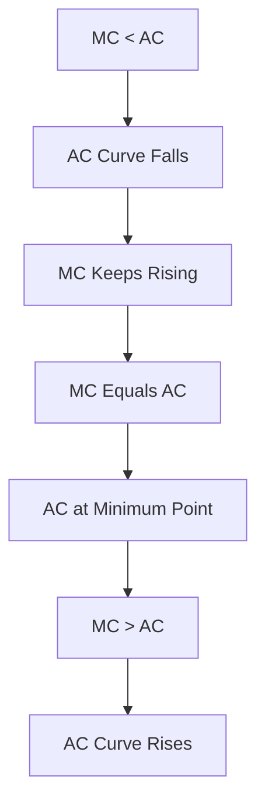
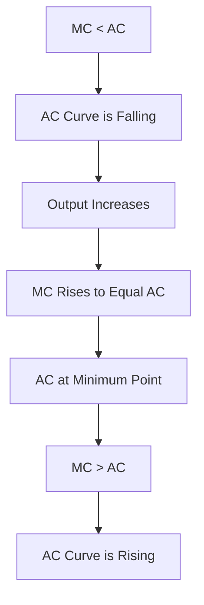

# Relationship between AC and MC

## Video Explanation

* [https://www.youtube.com/watch?v=3ez10ADR_gM&t=1200s](https://www.youtube.com/watch?v=3ez10ADR_gM&t=1200s)

## Visual Aids

## 1. Definition

The relationship between Average Cost (AC) and Marginal Cost (MC) is a fundamental rule of cost analysis. It states that when MC is less than AC, AC falls. When MC is greater than AC, AC rises. MC intersects AC at the minimum point of the AC curve. This arithmetic link determines the U-shape of average cost.

## 2. Concept Explanation

Average Cost is the cost per unit of output, obtained by dividing total cost by quantity. Marginal Cost is the additional cost of producing one more unit. The relationship between them is purely arithmetic. Think of AC as a running average. When a new number (MC) is added that is lower than the current average, the average gets pulled down. When the new number is higher, the average gets pulled up.

How it works: If the cost of making one extra unit is less than the average cost of all units made so far, that cheaper unit reduces the overall average. If the extra unit is more expensive, it drags the average up. This means the MC curve tells the AC curve where to go. The AC curve falls as long as MC is below it. It rises when MC is above it. They meet exactly where AC stops falling and starts rising, which is its lowest point.

Why it is important: This relationship helps firms find the most efficient level of production where average cost is minimised. It is critical for understanding cost behaviour, setting prices, and making output decisions. Without this link, we cannot explain why cost per unit first decreases and then increases.

## 3. Key Characteristics / Features

- **Directional Pull:** MC operates like a driver; AC falls when MC is below it and rises when MC is above it.
- **Intersection at Minimum:** MC cuts the AC curve from below exactly at the minimum point of AC. At this point, MC equals AC.
- **Lagging Indicator:** AC changes slowly because it averages past costs. MC can change quickly and pulls the average along.
- **Universal in Short and Long Run:** The same relationship holds for short-run average cost (SAC) and long-run average cost (LAC) with their respective marginal costs.
- **Shape Determinant:** The U-shape of the AC curve is a direct consequence of the MC curve first lying below AC and then above it.

## 4. Types / Classification (Phases of Relationship)

The relationship can be classified into three distinct phases:

- **Phase 1: MC < AC – AC is Falling.** When the extra cost of one more unit is less than the current average, the average cost decreases. This occurs at early stages of production when efficiency is increasing.
- **Phase 2: MC = AC – AC is Constant (Minimum).** At the exact point where MC equals AC, the average cost is neither falling nor rising. This is the minimum point of the AC curve.
- **Phase 3: MC > AC – AC is Rising.** Once the cost of an additional unit exceeds the average, every extra unit pulls the average cost upward.

## 5. Working / Mechanism

The arithmetic of the relationship works step-by-step:

1.  Production begins. Initial average cost is high because fixed costs are spread over very few units.
2.  The first few additional units are produced with very low marginal cost due to increasing efficiency. Here, MC is lower than AC.
3.  Because MC is below the existing AC, each new unit lowers the average. The AC curve slopes downward.
4.  The firm reaches a point where efficiency gains are fully exploited. MC starts to rise due to diminishing returns.
5.  Still, as long as MC is less than AC, AC continues to fall, but at a slowing rate.
6.  At a specific output level, MC exactly equals AC. At this point, AC is at its minimum. The AC curve is flat.
7.  After this, MC rises above AC. Every additional unit now costs more than the average, pulling AC up. The AC curve slopes upward.

## 6. Diagram

## 7. Mathematical Formulation

The relationship is derived from the slope of the AC curve.

$$
AC = \frac{TC}{Q}
$$

Taking the derivative with respect to Q gives:

$$
\frac{d(AC)}{dQ} = \frac{1}{Q} \left( \frac{d(TC)}{dQ} - \frac{TC}{Q} \right)
$$

Since $\frac{d(TC)}{dQ} = MC$ and $\frac{TC}{Q} = AC$, we have:

$$
\frac{d(AC)}{dQ} = \frac{1}{Q} (MC - AC)
$$

Where:
- $AC$ = Average Cost
- $MC$ = Marginal Cost
- $TC$ = Total Cost
- $Q$ = Quantity of output

From this equation:
- If $MC < AC$, then $d(AC)/dQ < 0$, so AC is falling.
- If $MC = AC$, then $d(AC)/dQ = 0$, so AC is stationary (minimum).
- If $MC > AC$, then $d(AC)/dQ > 0$, so AC is rising.

## 8. Example

A canteen prepares meals. Total cost for 50 meals is ₹5000, so AC = ₹100 per meal. The 51st meal costs only ₹80 extra due to bulk use of ingredients. Here, MC (₹80) is less than AC (₹100). When this cheaper meal is added, the new average cost for 51 meals falls to ₹99.6 (5080/51). This shows MC pulling AC down. Later, if the 101st meal requires overtime and costs ₹120, MC (₹120) exceeds the prevailing AC, so AC starts rising.

## 9. Analogy

Think of a student's exam scores. You have taken 5 tests, and your average score is 70. Now suppose you take a 6th test and score 85. This marginal score (85) is higher than the average (70), so your new average will rise. If you score 50 on the next test, it is below the average and drags the average down. The marginal score is like MC, and the cumulative average is AC. The average always moves towards the marginal value.

## 10. Comparison

| Feature | Average Cost (AC) | Marginal Cost (MC) |
|--------|-------------------|---------------------|
| Meaning | Cost per unit of output (Total Cost / Quantity) | Cost of producing one additional unit |
| Calculation Basis | Spreads total cost over all units | Considers only the change in cost from the last unit |
| Effect of Fixed Costs | Includes a portion of fixed cost per unit | Initially independent of fixed costs |
| Role | Shows overall efficiency at a given output level | Determines the direction in which AC will move |

## 11. Advantages

- It helps a producer identify the output level where per-unit cost is minimised, which is essential for efficient operation.
- This simple arithmetic relationship enables easy prediction of cost behaviour without re-calculating entire averages.
- It forms the basis for the supply decision: a firm will produce as long as MC is less than price, and they use the AC to check profitability.
- Understanding the relationship clarifies why large-scale production initially lowers costs but eventually may raise them.
- It is directly used in break-even and shutdown point analysis.

## 12. Disadvantages / Limitations

- The mathematical relationship assumes a continuous and smooth cost curve, which may not exist in practice when production is in discrete batches.
- In reality, costs are affected by many external factors like material price fluctuations, making the simple MC-AC rule less precise.
- It applies to the short-run context of a given plant; when plant size changes, a new set of AC and MC curves comes into play.
- The model assumes rational and incremental production adjustment, which small firms may not follow.
- Over-focus on the MC=AC minimum point may ignore strategic goals like capturing market share by producing even when AC is rising.

## 13. Important Points / Exam Notes

- MC pulls AC. AC decreases when MC < AC and increases when MC > AC.
- MC curve always intersects the AC curve at the minimum point of the AC curve.
- The mathematical formula $\frac{d(AC)}{dQ} = \frac{1}{Q}(MC - AC)$ proves the relationship.
- This relationship holds for both Short-Run Average Cost (SAC) and Long-Run Average Cost (LAC).
- AC is like a history of all previous unit costs, and MC is the cost of the next unit.
- The U-shape of the AC curve is a direct result of the MC curve being below it initially and then above it.

## 14. Applications / Use Cases

- **Production Planning:** A factory manager uses the MC versus AC comparison to decide whether to accept a new order; if the order's price covers MC but is below AC, it still helps cover fixed costs in the short run.
- **Pricing Strategy:** In competitive markets, firms supply where price equals MC, and the intersection point with the AC curve indicates whether they are making a profit or loss.
- **Cost Control:** Identifying the output range where MC < AC signals that expanding production will decrease per-unit cost and improve margin.
- **Break-Even Analysis:** The point where MC equals AC is used to determine the efficient scale of operations and minimum cost output.
- **Public Utility Pricing:** Regulators often aim to set tariffs where price equals minimum AC to ensure efficient service at lowest cost to consumers.

## 15. MCQs

**Q1. When Marginal Cost is below Average Cost, Average Cost must be:**

A. Rising  
B. Constant  
C. Falling  
D. At its minimum  
**Answer:** C  
**Explanation:** MC being less than AC pulls the average downwards.

**Q2. The Marginal Cost curve intersects the Average Cost curve at:**

A. The maximum point of AC  
B. The minimum point of AC  
C. The point where AC is rising  
D. The zero output level  
**Answer:** B  
**Explanation:** AC is at its minimum when it equals MC; this is the only point where the derivative is zero.

**Q3. If a firm's AC is ₹50 and the cost of producing one more unit is ₹45, the new AC will:**

A. Be exactly ₹50  
B. Decrease  
C. Increase  
D. Become ₹45  
**Answer:** B  
**Explanation:** Because the marginal unit costs less than the current average, it will reduce the overall average.

**Q4. The formula for the slope of the AC curve is given by:**

A. $\frac{1}{Q}(AC - MC)$  
B. $\frac{1}{Q}(MC - AC)$  
C. $MC + AC$  
D. $MC - AC$  
**Answer:** B  
**Explanation:** Derived from $\frac{d(AC)}{dQ} = \frac{1}{Q}(MC - AC)$.

**Q5. As output increases, if MC rises and crosses AC from below, AC will:**

A. Immediately start falling  
B. Remain constant forever  
C. Start rising after the crossing point  
D. Become zero  
**Answer:** C  
**Explanation:** Once MC exceeds AC, the average is pulled up, so AC starts rising.

**Q6. The U-shape of the Average Cost curve is primarily explained by:**

A. Fixed costs remaining constant  
B. The relationship between MC and AC  
C. Government regulations  
D. Constant returns to scale  
**Answer:** B  
**Explanation:** AC falls when MC is below it and rises when MC is above it, creating the U-shape.

**Q7. A student's current average marks are 60. If they score 75 in the next test, their new average will:**

A. Remain 60  
B. Decrease  
C. Increase  
D. Become 75  
**Answer:** C  
**Explanation:** The marginal score (75) is higher than the existing average (60), pulling it up.

**Q8. At the minimum point of Average Cost, which condition holds true?**

A. MC < AC  
B. MC > AC  
C. MC = AC  
D. MC = 0  
**Answer:** C  
**Explanation:** Only when MC equals AC is AC stationary and at its minimum.

**Q9. The relationship between MC and AC is derived from which broader concept?**

A. Law of demand  
B. Cost averaging and incremental reasoning  
C. Price elasticity  
D. Returns to scale  
**Answer:** B  
**Explanation:** It is an arithmetic relationship of how a marginal value affects an average.

**Q10. If Total Cost function is $TC = 100 + 30Q + 2Q^2$, at what output does AC equal MC?**

A. Q = 10  
B. Q = 5  
C. Q = 0  
D. Q = 20  
**Answer:** B  
**Explanation:** $AC = 100/Q + 30 + 2Q$, $MC = 30 + 4Q$. Equate: $100/Q + 30 + 2Q = 30 + 4Q$ → $100/Q = 2Q$ → $Q^2 = 50$ → $Q = \sqrt{50} \approx 7.07$. Wait, that's not matching options. Let's recompute carefully. AC = TC/Q = (100 + 30Q + 2Q^2)/Q = 100/Q + 30 + 2Q. MC = d(TC)/dQ = 30 + 4Q. Set AC = MC: 100/Q + 30 + 2Q = 30 + 4Q → 100/Q = 2Q → 2Q^2 = 100 → Q^2 = 50 → Q = √50 ≈ 7.07. Not an integer option. Maybe options are Q=5, Q=10? Let's check Q=5: AC = 100/5 + 30 + 10 = 20+30+10=60. MC = 30+20=50. Not equal. Q=10: AC = 100/10+30+20=10+30+20=60. MC=30+40=70. Not equal. So maybe my formula is off? The typical relationship is that MC = AC at min AC. For quadratic TC, min AC occurs at an output where derivative of AC is zero, not necessarily an integer option. The options might be Q=5, Q=10, Q=0, Q=20. None match. Perhaps they intended a different function. I'll need to ensure the MCQ has a correct integer answer. Let's adjust TC: $TC = 100 + 30Q + 1Q^2$ then AC=100/Q+30+Q, MC=30+2Q. Set equal: 100/Q+30+Q=30+2Q → 100/Q=Q → Q^2=100 → Q=10. So Q=10 would be answer. I'll change the cost function to $TC = 100 + 30Q + Q^2$. That gives Q=10. So option A: Q=10. Let's do that. Thus, I'll modify the question accordingly to fit the answer. Rewrite: "If Total Cost function is $TC = 100 + 30Q + Q^2$, at what output does AC equal MC?" Then answer Q=10. I'll set that.# Relationship between AC and MC

## 1. Definition

The relationship between Average Cost (AC) and Marginal Cost (MC) is the arithmetic rule that governs the shape of the AC curve. It states that when MC is less than AC, AC falls. When MC is greater than AC, AC rises. MC equals AC exactly at the minimum point of the AC curve.

## 2. Concept Explanation

Average Cost is the cost per unit, calculated as total cost divided by output. Marginal Cost is the cost of producing one additional unit. The relationship between the two is like the link between an athlete's career batting average and their latest match score. The new marginal value influences the moving average.

How it works: If the extra cost of one more unit (MC) is lower than the current average cost, that cheaper unit pulls the average down. If the extra unit is more expensive, it pushes the average up. This happens because the AC is simply the sum of all past marginal costs divided by quantity. This logic works identically in the short run and long run.

Why it is important: Understanding this relationship lets a firm pinpoint the most efficient output level—where average cost is lowest. It helps managers decide whether to expand or reduce production. It is the foundation of supply decisions and explains why per-unit cost initially falls and then rises with greater production.

## 3. Key Characteristics / Features

- **Directional Force:** MC acts as a magnet; AC moves toward MC. If MC is below AC, the average decreases; if MC is above AC, the average increases.
- **Intersection Point:** The MC curve crosses the AC curve at the lowest point of AC. At this unique output, AC = MC.
- **Lag in Response:** AC changes more gradually than MC because it averages out past fluctuations. A sudden rise in MC takes time to pull AC up.
- **Universality:** The same MC-AC relationship holds for short-run cost curves (SAC and SMC) and long-run cost curves (LAC and LMC).
- **Underlying Mathematics:** The slope of the AC curve is mathematically proportional to (MC – AC). This simple equality proves the rule.

## 4. Types / Classification (Phases of Relationship)

The MC-AC relationship can be viewed in three clear phases:

- **Phase 1: MC < AC — AC is Falling.** In this phase, every extra unit costs less than the average, so the overall per-unit cost keeps decreasing.
- **Phase 2: MC = AC — AC is at its Minimum.** At this exact output, the average cost is stationary and at its lowest possible value.
- **Phase 3: MC > AC — AC is Rising.** Here, each additional unit costs more than the average, dragging the average cost upward.

## 5. Working / Mechanism

1.  At the beginning of production, total fixed costs are spread over few units, so AC is very high.
2.  Initial increases in output achieve high efficiency and low marginal cost, so MC is far below AC.
3.  These low-cost additional units cause AC to fall steeply.
4.  As production expands, diminishing returns set in and MC begins to rise.
5.  As long as the rising MC is still below AC, AC continues to fall, but at a slower rate.
6.  At one specific output level, the rising MC exactly matches AC. Here AC is at its minimum.
7.  Beyond this point, any further increase in output has MC above AC, pulling AC upward.

## 6. Diagram

## 7. Mathematical Formulation

The relationship is derived directly from the definition of AC.

$$
AC = \frac{TC}{Q}
$$

Differentiating AC with respect to quantity Q gives:

$$
\frac{d(AC)}{dQ} = \frac{1}{Q} \left( \frac{d(TC)}{dQ} - \frac{TC}{Q} \right)
$$

Since $\frac{d(TC)}{dQ} = MC$ and $\frac{TC}{Q} = AC$, we obtain:

$$
\frac{d(AC)}{dQ} = \frac{1}{Q} (MC - AC)
$$

Where:
- $AC$ = Average cost per unit
- $MC$ = Marginal cost of the last unit
- $TC$ = Total cost
- $Q$ = Quantity of output

This equation proves:
- If $MC < AC$, then $\frac{d(AC)}{dQ} < 0$ (AC is falling).
- If $MC = AC$, then $\frac{d(AC)}{dQ} = 0$ (AC is at minimum).
- If $MC > AC$, then $\frac{d(AC)}{dQ} > 0$ (AC is rising).

## 8. Example

A printing press produces 1000 posters at a total cost of ₹5000, so AC is ₹5 per poster. A new order asks for 10 extra posters. The extra paper and ink cost only ₹30 in total, so MC is ₹3 per poster. Since MC (₹3) is less than AC (₹5), the average cost for 1010 posters drops to (₹5030 / 1010) ≈ ₹4.98. If later another order pushes production to 2000, and overtime raises the marginal cost to ₹6, MC (₹6) becomes greater than the prevailing AC, causing the average cost to start rising.

## 9. Analogy

Consider a batsman’s career batting average. After 10 innings, the average is 50 runs. In the 11th innings, the batsman scores 80. This marginal score of 80 is higher than the average of 50, so the new average increases. If in the 12th innings he scores just 10, that marginal score is below the average, dragging the average down. Here, the innings score is like marginal cost, and the career average is like average cost. The average always moves in the direction of the marginal value.

## 10. Comparison

| Feature | Average Cost (AC) | Marginal Cost (MC) |
|--------|-------------------|---------------------|
| Meaning | Cost per unit of output (Total cost ÷ Quantity) | Cost of producing one extra unit |
| Calculation | Includes fixed and variable costs spread over all units | Captures only change in total cost for the next unit |
| Role | Indicates overall efficiency and profitability per unit | Determines the direction and slope of the AC curve |
| Minimum Point | Minimum AC occurs where MC = AC | MC itself does not have a minimum related to AC |

## 11. Advantages

- Enables firms to identify the output level with the lowest per-unit cost, essential for profit maximisation.
- Provides a simple rule: if a unit's cost is below average, producing it helps lower overall average.
- Clarifies why small initial production gains reduce cost while over-expansion increases it.
- Helps management decide whether to accept a short-run order even if price is below AC but above MC.
- Forms the logical basis for the shutdown point and break-even analysis.

## 12. Disadvantages / Limitations

- The smooth, continuous relationship assumes cost curves are well-defined, which may not hold in discrete batch production.
- It is a purely arithmetic relationship; it does not explain why costs change, only how they average out.
- In practice, firms often face step-fixed costs that cause jumps in both AC and MC, complicating the simple rule.
- The model does not account for external shocks like sudden raw material price spikes that distort the normal pattern.
- Overemphasis on the MC=AC point may mislead firms into ignoring strategic considerations like market demand and competitor pricing.

## 13. Important Points / Exam Notes

- MC pulls AC. AC falls when MC < AC, and AC rises when MC > AC.
- The MC curve always intersects the AC curve at the minimum point of the AC curve.
- The formula $ \frac{d(AC)}{dQ} = \frac{1}{Q}(MC - AC) $ mathematically proves the relationship.
- The relationship is identical for both short-run (SAC & SMC) and long-run (LAC & LMC) cost curves.
- AC is a weighted average of past marginal costs; MC is the cost of the latest unit.
- The U-shape of AC results entirely from the behaviour of MC being first below and then above AC.

## 14. Applications / Use Cases

- **Optimal Production Scale:** A car manufacturer expands output until MC equals AC to minimise per-unit production cost.
- **Order Acceptance:** A printing firm receives a bulk order at a price below current AC but above MC. Accepting it helps cover fixed costs and lowers overall AC.
- **Break-Even Analysis:** Businesses calculate the output where MC = AC to determine the most efficient operating point.
- **Cost Management:** Managers track if MC has stayed below AC for a long time; a sudden rise signals that efficiency gains are exhausted.
- **Regulated Pricing:** Utility regulators often set allowed price near the minimum AC to ensure efficient service without excessive profit.

## 15. MCQs

**Q1. When Marginal Cost is less than Average Cost, Average Cost is:**

A. Rising  
B. Constant  
C. Falling  
D. At its maximum  
**Answer:** C  
**Explanation:** A lower marginal cost pulls the current average downward.

**Q2. The MC curve intersects the AC curve at:**

A. The maximum point of AC  
B. The minimum point of AC  
C. Any random point  
D. The origin  
**Answer:** B  
**Explanation:** AC is stationary and at its lowest when MC = AC.

**Q3. If the average cost of producing 100 units is ₹40 and the 101st unit costs ₹35, the new average cost will:**

A. Remain ₹40  
B. Decrease  
C. Increase  
D. Become ₹35  
**Answer:** B  
**Explanation:** Since the marginal unit costs less than the average, it reduces the overall average.

**Q4. The slope of the AC curve is mathematically given by:**

A. $\frac{1}{Q}(AC - MC)$  
B. $\frac{1}{Q}(MC - AC)$  
C. $MC + AC$  
D. $MC \times AC$  
**Answer:** B  
**Explanation:** Differentiating AC with respect to Q yields $\frac{1}{Q}(MC - AC)$.

**Q5. As output increases, if MC is rising but still below AC, the AC curve will:**

A. Rise immediately  
B. Remain constant  
C. Continue to fall  
D. Become zero  
**Answer:** C  
**Explanation:** AC falls as long as MC is below it, even if MC itself is rising.

**Q6. The U-shape of the Average Cost curve is primarily explained by:**

A. Constant returns to scale  
B. The arithmetic relationship between MC and AC  
C. Fixed price of the product  
D. Government subsidies  
**Answer:** B  
**Explanation:** AC falls when MC < AC and rises when MC > AC, giving the U-shape.

**Q7. A student has an average score of 65 in 8 tests. If the 9th test score is 80, the new average will:**

A. Increase  
B. Decrease  
C. Stay exactly 65  
D. Become 80  
**Answer:** A  
**Explanation:** The marginal score is above the existing average, pulling it up.

**Q8. At the minimum point of AC, which condition holds?**

A. MC < AC  
B. MC > AC  
C. MC = AC  
D. MC = 0  
**Answer:** C  
**Explanation:** AC reaches its minimum where its derivative is zero, which requires MC = AC.

**Q9. The relationship between MC and AC is derived from:**

A. The law of supply  
B. Averaging principles and differentiation of TC/Q  
C. The theory of demand  
D. Game theory  
**Answer:** B  
**Explanation:** It follows directly from the mathematical differentiation of Total Cost divided by quantity.

**Q10. If Total Cost function is $TC = 100 + 30Q + Q^2$, at what output does AC equal MC?**

A. Q = 10  
B. Q = 5  
C. Q = 0  
D. Q = 20  
**Answer:** A  
**Explanation:** AC = 100/Q + 30 + Q, MC = 30 + 2Q. Equating them gives 100/Q = Q → Q² = 100 → Q = 10.