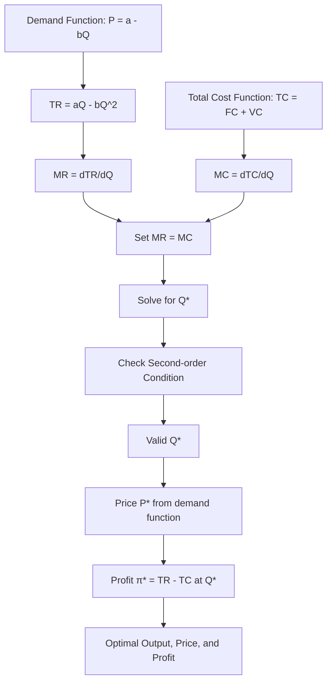

# Profit Maximization Numerical Problems

## 1. Definition

Profit maximization is the process by which a firm determines the level of output that yields the highest possible profit. In numerical problems, we use given demand, cost, and revenue functions to calculate the profit-maximizing quantity, price, and the maximum profit amount.

---

## 2. Concept Explanation

Every business wishes to earn the largest possible profit. Profit is the difference between total revenue (money coming in from sales) and total cost (money going out for production). The output level that makes this difference as large as possible is the profit-maximizing output.

How it works: The firm examines how revenue and cost change when it produces one more unit. As long as the additional revenue (marginal revenue) from selling one more unit is greater than the additional cost (marginal cost) of producing it, producing that unit adds to profit. The firm keeps expanding output until the marginal revenue exactly equals the marginal cost. Beyond that point, marginal cost exceeds marginal revenue, and profit would fall.

Why it is important: Profit maximization is the fundamental assumption behind most economic analysis of firm behaviour. It guides production planning, pricing, and resource allocation. Engineers and project managers use these principles to determine the optimum level of output for a project, decide on production capacity, and estimate the financial returns of an investment.

---

## 3. Key Characteristics / Features

- **Central objective:** Profit maximization is traditionally considered the primary goal of a business firm.
- **Output decision rule:** Produce the quantity where marginal revenue (MR) equals marginal cost (MC).
- **Second-order condition:** For a true maximum, the MC curve must cut the MR curve from below (slope of MR < slope of MC).
- **Price determination:** Once the optimal quantity is found, the selling price is read from the demand curve.
- **Two equivalent methods:** The optimal output can be found using the Total Revenue–Total Cost (TR–TC) approach or the Marginal Revenue–Marginal Cost (MR–MC) approach.
- **Short-run and long-run:** The principle applies in both time frames, though cost structures differ.

---

## 4. Types / Classification

Numerical problems on profit maximization are generally solved using one of two approaches:

- **Total Revenue – Total Cost (TR–TC) approach:** Compute profit (π = TR – TC) at different output levels and choose the output where profit is maximum. This method is often used with tabular data.
- **Marginal Revenue – Marginal Cost (MR–MC) approach:** Set the derivative of profit with respect to output to zero (dπ/dQ = 0). This gives the condition MR = MC. Verify that the slope of MR is less than the slope of MC (second-order condition). This approach is used when continuous functions are given.

---

## 5. Working / Mechanism (Steps to Solve Numerical Problems)

Follow these steps to determine the profit-maximizing output, price, and profit using the MR–MC approach:

1. Write down the demand function (price as a function of quantity) or total revenue function.
2. Derive the Total Revenue function: TR = Price × Quantity.
3. Obtain the Marginal Revenue function by differentiating TR with respect to Q. MR = d(TR)/dQ.
4. Write down the Total Cost function: TC = Fixed Cost + Variable Cost.
5. Obtain the Marginal Cost function by differentiating TC with respect to Q. MC = d(TC)/dQ.
6. Set MR = MC and solve for the profit-maximizing quantity Q*.
7. Verify the second-order condition: the slope of MR (d(MR)/dQ) must be less than the slope of MC (d(MC)/dQ) at Q*.
8. Substitute Q* into the demand function to get the profit-maximizing price P*.
9. Calculate Total Revenue (TR) and Total Cost (TC) at Q* to find maximum profit π* = TR – TC.
10. Present the results: optimal quantity, price, and profit.

For the TR–TC approach (tabular data), list Q, TR, TC, and π in columns; identify the Q that gives the highest π.

---

## 6. Diagram

---

## 7. Mathematical Formulation

Profit (π) is the difference between total revenue and total cost:

$$
\pi = TR - TC = P \cdot Q - TC
$$

Given demand: \( P = f(Q) \), then \( TR = P \times Q \).  
Marginal Revenue: \( MR = \frac{d(TR)}{dQ} \)  
Marginal Cost: \( MC = \frac{d(TC)}{dQ} \)

**First-order condition for maximum:**

$$
\frac{d\pi}{dQ} = MR - MC = 0 \quad \Rightarrow \quad MR = MC
$$

**Second-order condition:**

$$
\frac{d^2\pi}{dQ^2} < 0 \quad \Rightarrow \quad \frac{d(MR)}{dQ} < \frac{d(MC)}{dQ}
$$

Profit-maximizing price: \( P^* = f(Q^*) \)  
Maximum profit: \( \pi^* = TR(Q^*) - TC(Q^*) \)

---

## 8. Example

**Problem:**  
A firm faces the demand function \( P = 100 - Q \) (price in rupees, quantity in units). Its total cost function is \( TC = 500 + 20Q + Q^2 \). Find:  
(a) Profit-maximizing output  
(b) Profit-maximizing price  
(c) Maximum profit  
(d) Verify the second-order condition

**Solution:**

**Step 1: Total Revenue**  
\( TR = P \times Q = (100 - Q)Q = 100Q - Q^2 \)

**Step 2: Marginal Revenue**  
\( MR = \frac{d(TR)}{dQ} = 100 - 2Q \)

**Step 3: Marginal Cost**  
\( TC = 500 + 20Q + Q^2 \)  
\( MC = \frac{d(TC)}{dQ} = 20 + 2Q \)

**Step 4: First-order condition (MR = MC)**  
\( 100 - 2Q = 20 + 2Q \)  
\( 100 - 20 = 2Q + 2Q \)  
\( 80 = 4Q \)  
\( Q^* = 20 \) units

**Step 5: Profit-maximizing price**  
\( P^* = 100 - Q^* = 100 - 20 = ₹80 \)

**Step 6: Maximum profit**  
\( TR = 100(20) - (20)^2 = 2000 - 400 = ₹1600 \)  
\( TC = 500 + 20(20) + (20)^2 = 500 + 400 + 400 = ₹1300 \)  
\( \pi^* = TR - TC = 1600 - 1300 = ₹300 \)

**Step 7: Second-order condition**  
Slope of MR: \( \frac{d(MR)}{dQ} = -2 \)  
Slope of MC: \( \frac{d(MC)}{dQ} = +2 \)  
Since \( -2 < +2 \), the second-order condition is satisfied. The profit is indeed maximized.

**Answers:** (a) 20 units (b) ₹80 (c) ₹300 (d) Condition holds.

---

## 9. Analogy

Imagine a farmer deciding how many bags of fertilizer to apply. Each additional bag increases the harvest (marginal revenue) but also costs money (marginal cost). Initially, the harvest gain outweighs the cost, so profit rises. Eventually, adding more fertilizer gives a smaller boost until the cost of the last bag equals the value of the extra crop it produces. If the farmer applied one more bag beyond that, the cost would exceed the gain, and profit would drop. The profit-maximizing point is exactly that bag where MR = MC.

---

## 10. Comparison (TR–TC vs. MR–MC Approach)

| Feature | TR–TC Approach | MR–MC Approach |
|--------|----------------|----------------|
| Basis | Direct subtraction of total values | Equating marginal values |
| Data needed | Total revenue and total cost at various outputs | Functions or derivatives of TR and TC |
| Decision rule | Choose Q where π = TR – TC is maximum | Choose Q where MR = MC and MC cuts MR from below |
| Graphical identification | Maximum vertical distance between TR and TC curves | Intersection point of MR and MC curves |
| Suitability | Discrete data, tables | Continuous mathematical functions |
| Complexity | Simple for small data sets | Efficient for calculus-based solutions |

---

## 11. Advantages

- Provides a clear, quantitative target for production planning.
- Helps managers set prices that cover costs and yield targeted profits.
- Identifies whether increasing or decreasing production will improve financial performance.
- Allows the firm to respond to market changes (demand shifts, cost fluctuations) by recalculating the optimum output.
- Supports break-even analysis and contribution margin calculations.
- Essential for project feasibility studies and investment decision-making.

---

## 12. Disadvantages / Limitations

- Assumes the firm can accurately measure demand and cost functions; real data may be uncertain.
- Profit maximization may ignore social, ethical, or long-run sustainability goals.
- The model assumes ceteris paribus, but competitor reactions and external factors can alter the optimal output.
- In some markets, especially monopoly, the profit-maximizing price may lead to public backlash or regulation.
- Only looks at one period; dynamic pricing and multi-period planning may require more sophisticated analysis.
- Does not consider non-price competition factors like brand image and customer loyalty that influence demand.

---

## 13. Important Points / Exam Notes

- Profit (π) = Total Revenue (TR) – Total Cost (TC).
- First-order condition for maximum: MR = MC (Necessary condition).
- Second-order condition: Slope of MR < Slope of MC (Sufficient condition).
- Steps: Derive MR and MC from given functions → equate → solve for Q* → find P* from demand → compute π*.
- In tabular problems, look for the output with maximum (TR – TC) or where MR = MC approximately.
- If MC is lower than MR at a given output, increase production; if MC is higher, reduce production.
- Under perfect competition, MR = Price (AR), so condition is Price = MC.
- Profit-maximizing does not mean maximum revenue; revenue can still rise after profit starts falling.

---

## 14. Applications / Use Cases

- **Manufacturing:** A steel plant uses MR–MC analysis to decide how many tons to produce each month given current steel prices and input costs.
- **Project tendering:** A construction firm computes the optimal bid price and contract size that will maximize profit, not just win the bid.
- **Retail:** A supermarket chain uses data to determine the profit-maximizing markdown percentages on perishable goods.
- **Software as a Service:** A cloud company sets its subscription price based on the demand curve and the marginal cost of serving one more user.
- **Agriculture:** A farmer maximizes profit by selecting the amount of pesticide up to the point where its marginal cost equals the marginal value of crop saved.

---

## 15. MCQs

**Q1. The necessary condition for profit maximization is:**  
A. TR = TC  
B. MR = MC  
C. AR = AC  
D. TR is maximum  
**Answer:** B  
**Explanation:** Profit is maximized where the additional revenue from the last unit sold equals its additional cost, i.e., MR = MC.

**Q2. If MR = 50 – 4Q and MC = 10 + 2Q, the profit-maximizing output is:**  
A. 5  
B. 10  
C. 6.67  
D. 8  
**Answer:** C  
**Explanation:** 50 – 4Q = 10 + 2Q → 40 = 6Q → Q = 6.67.

**Q3. A firm’s demand function is P = 200 – 2Q. If Q* = 40, the profit-maximizing price is:**  
A. ₹80  
B. ₹120  
C. ₹160  
D. ₹200  
**Answer:** B  
**Explanation:** P = 200 – 2(40) = 200 – 80 = 120.

**Q4. The second-order condition for profit maximization requires that at the point where MR = MC:**  
A. Slope of MR = Slope of MC  
B. Slope of MR > Slope of MC  
C. Slope of MR < Slope of MC  
D. Slope of MR is zero  
**Answer:** C  
**Explanation:** For a maximum, the slope of MR must be less than the slope of MC (i.e., MC curve must cut MR from below).

**Q5. When using the TR–TC approach, profit is maximized where:**  
A. The difference between TR and TC is minimized  
B. TR equals TC  
C. The vertical distance between TR and TC curves is largest, with TR above TC  
D. TC is at its minimum  
**Answer:** C  
**Explanation:** Profit = TR – TC is represented by the vertical distance; maximum distance with TR > TC gives max profit.

**Q6. If Total Cost is TC = 200 + 5Q + 2Q² and Total Revenue is TR = 50Q – Q², the marginal cost function is:**  
A. MC = 5 + 2Q  
B. MC = 5 + 4Q  
C. MC = 50 – 2Q  
D. MC = 200 + 5Q + 4Q²  
**Answer:** B  
**Explanation:** Differentiate TC: d(TC)/dQ = 5 + 4Q.

**Q7. A firm finds that at Q = 100, MR = ₹15 and MC = ₹18. To increase profit, the firm should:**  
A. Keep output at 100  
B. Increase output  
C. Decrease output  
D. Shut down  
**Answer:** C  
**Explanation:** MC > MR means last unit cost more than it brought in, so reducing output will raise profit.

**Q8. If the demand function is P = 80 – 2Q and MC = 20 is constant, the profit-maximizing quantity for a monopoly is:**  
A. 15  
B. 20  
C. 30  
D. 10  
**Answer:** A  
**Explanation:** MR = 80 – 4Q; set MR=MC → 80 – 4Q = 20 → 60 = 4Q → Q = 15.

**Q9. At the profit-maximizing output, if Total Revenue is ₹5000 and Total Cost is ₹4200, the maximum profit is:**  
A. ₹800  
B. ₹5000  
C. ₹4200  
D. ₹9200  
**Answer:** A  
**Explanation:** Profit = TR – TC = 5000 – 4200 = 800.

**Q10. Which of the following statements is true?**  
A. Profit maximization always occurs at the output where average cost is minimum.  
B. Profit maximization occurs at the output where the gap between price and average cost is largest.  
C. Profit maximization requires MR = MC and MC curve cutting MR from below.  
D. A firm should produce as long as MR is positive.  
**Answer:** C  
**Explanation:** Both first-order (MR=MC) and second-order (MC cuts MR from below) conditions must be satisfied for maximum profit.