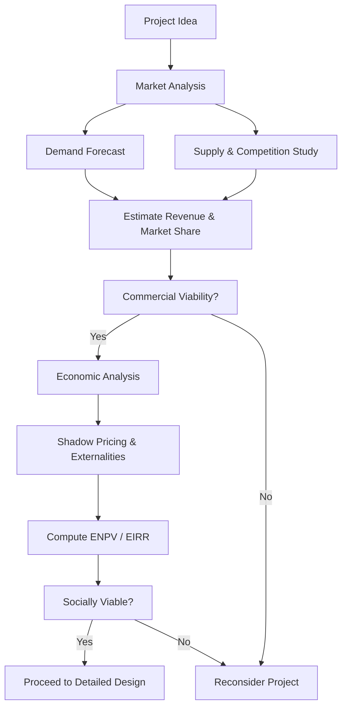

# 01 Economic and Market analysis

## 1. Definition

**Market analysis** is the systematic study of the demand, supply, price, and competition for a product or service that a project will offer. It answers the question: “Can we sell enough at a profitable price?”

**Economic analysis** is the evaluation of a project from the viewpoint of the whole economy or society. It measures the project’s contribution to national welfare, using shadow prices for resources and considering external benefits and costs.

Together, they form a vital part of project feasibility study before investment decisions are made.

## 2. Concept Explanation

When an engineer or a company plans a project, the first question is usually about the market. Will there be enough buyers? What price can the product command? Who are the competitors? Market analysis answers these questions by studying demand and supply trends, customer preferences, and the competitive landscape.

Economic analysis goes a step further. While a project may be profitable for the owner, it might use resources in a way that is not best for the country. Economic analysis uses corrected (shadow) prices to reflect the true scarcity of inputs like skilled labour, foreign exchange, or energy. It also counts benefits like reduced pollution, employment generation, and infrastructure development that market analysis ignores.

The basic idea is: market analysis tells if the project is commercially viable, and economic analysis tells if it is desirable for society. A project that passes both tests stands on solid ground. Ignoring either can lead to business failure or wastage of scarce national resources.

## 3. Key Characteristics / Features

- **Market analysis is demand‑driven:** It focuses on sales volume, revenue potential, and market share.
- **Economic analysis uses shadow prices:** Inputs and outputs are valued at their true opportunity cost to society, not just market price.
- **Market analysis considers tangible benefits:** It works with measurable cash flows.
- **Economic analysis includes intangible externalities:** Effects like pollution, public health, or community displacement are accounted for.
- **Market analysis is short to medium term in outlook:** It forecasts the product lifecycle.
- **Economic analysis takes a long‑term societal view:** It assesses intergenerational benefits and costs.
- **Both use quantitative tools:** Demand forecasting, regression, cost‑benefit ratios, and net present value are common.

## 4. Types / Classification

The analyses can be broken down as:

- **Market analysis types:**
  - *Demand analysis:* Estimating total market size, growth rate, and the project’s likely share.
  - *Supply and competition analysis:* Checking existing and potential competitors, their capacity, and pricing.
  - *Price analysis:* Forecasting the price that will balance demand and supply.
  - *Distribution and marketing channel analysis:* Deciding how the product will reach customers.

- **Economic analysis types:**
  - *Cost‑Benefit Analysis (CBA):* All social benefits and costs are listed, valued, and compared.
  - *Cost‑Effectiveness Analysis:* Used when benefits are hard to monetise; the alternative with the least cost for a given outcome is chosen.
  - *Social Cost‑Benefit Analysis:* A comprehensive approach that includes income distribution effects and shadow pricing.

## 5. Working / Mechanism

A feasibility study integrates market and economic analysis in a step‑by‑step manner.

1.  **Define the product or service:** Clearly specify what the project will deliver.
2.  **Conduct primary and secondary market research:** Collect data on potential customers, existing sales, prices, and competitors.
3.  **Estimate total market demand:** Use statistical methods (trend projection, regression) and surveys to find how much the market can absorb now and in future.
4.  **Determine the demand‑supply gap:** Compare total demand with the existing and planned supply capacity.
5.  **Estimate project’s market share and revenue:** Based on competitive strength, assign a realistic share and compute revenue over the project’s life.
6.  **Perform economic analysis:** Convert market prices to shadow prices (e.g., for labour, land, foreign exchange). Calculate the economic cost of inputs and the economic value of outputs.
7.  **Identify external effects:** Quantify benefits and costs like pollution, congestion, or employment that are not in the financial statements.
8.  **Compute economic viability indicators:** Use Economic Net Present Value (ENPV) or Economic Internal Rate of Return (EIRR) with a social discount rate.
9.  **Compare with alternatives:** If ENPV > 0 and ENPV is better than other projects, the project is economically justified.

## 6. Diagram

## 7. Mathematical Formulation

Market analysis often uses a demand function:

$$
Q_d = f(P, I, P_s, T, A)
$$

Where:  
\( Q_d \) = Quantity demanded  
\( P \) = Own price  
\( I \) = Consumer income  
\( P_s \) = Price of substitutes  
\( T \) = Consumer taste  
\( A \) = Advertising effort

For economic analysis, the Economic Net Present Value (ENPV) is key:

$$
ENPV = \sum_{t=0}^{n} \frac{B_t - C_t}{(1 + r)^t}
$$

Where:  
\( B_t \) = Economic benefits in year \( t \) (using shadow prices)  
\( C_t \) = Economic costs in year \( t \) (using shadow prices)  
\( r \) = Social discount rate  
\( n \) = Project life in years

If ENPV > 0, the project is economically acceptable.

## 8. Example

A state government plans a rural road project. The market analysis looks at the number of vehicles that will use the road, the toll that can be charged, and the reduction in travel time valued at market wage rates. Revenue from toll alone may be insufficient. However, the economic analysis uses shadow prices: lower labour cost (since many rural workers are underemployed), includes the value of saved travel time for all users, better access to markets for farmers, and reduced vehicle operating costs. The ENPV with these social benefits becomes positive, justifying the project even if the financial return is low.

## 9. Analogy

Think of buying a home near good public transport. The market analysis is like checking if the house price is within your budget and if the neighbourhood is good. The economic analysis is like thinking about the long‑term family benefit: less stress, shorter commute for everyone, and better air quality in the city. The house may seem expensive, but when you count the hidden savings and happiness for the whole family, the decision makes sense.

## 10. Comparison

| Feature | Market Analysis | Economic Analysis |
|--------|----------|----------|
| **Viewpoint** | Individual firm or investor | Society or nation as a whole |
| **Prices used** | Market prices | Shadow prices (opportunity cost) |
| **Benefits considered** | Only cash inflows to the project | All social benefits, including intangible externalities |
| **Discount rate** | Market interest rate (cost of capital) | Social discount rate (time preference of society) |
| **Profit measure** | Financial NPV or IRR | Economic NPV (ENPV) or Economic IRR |
| **Main question** | “Will the project make money?” | “Should the nation use resources this way?”

## 11. Advantages

- **Market analysis reduces demand risk:** It prevents launching products that have no buyers.
- **Helps in pricing and marketing strategy:** Understanding demand and competition lets firms set the right price.
- **Economic analysis ensures national welfare:** It stops projects that are privately profitable but damage the environment or waste public funds.
- **Guides government investment:** Public projects are selected based on economic returns, not just financial returns.
- **Improves resource allocation:** Shadow pricing highlights the true cost of scarce inputs like water or foreign exchange.

## 12. Disadvantages / Limitations

- **Data uncertainty:** Forecasting market demand or shadow prices involves assumptions that may be wrong.
- **Subjectivity in economic analysis:** Valuing a life saved or clean air is difficult and varies by approach.
- **Time consuming and expensive:** A full market survey and detailed economic cost‑benefit analysis require significant effort.
- **Market analysis can become obsolete quickly:** Consumer tastes and technology change fast, making forecasts invalid.
- **Ignoring distribution effects:** Standard economic analysis may not show who gains and who loses from a project.

## 13. Important Points / Exam Notes

- Market analysis is the first step of feasibility; no project should proceed without a positive market outlook.
- Demand forecasting methods include trend analysis, regression, and expert opinion (Delphi).
- Economic analysis uses shadow prices: for example, market wage may be higher than the actual opportunity cost of labour if there is unemployment.
- The social discount rate is usually lower than the commercial discount rate because society values future benefits more.
- Externalities (pollution, health improvements) are counted in economic analysis but not in financial statements.
- Projects with high economic returns but low financial returns may require government subsidy or partnership.
- The main economic decision criterion is ENPV > 0 or Economic IRR > Social Discount Rate.
- Both analyses must be integrated into the Detailed Project Report (DPR).

## 14. Applications / Use Cases

- **Infrastructure projects:** Highway, metro, dam – economic analysis justifies public spending.
- **New product launch by a private company:** Market analysis verifies demand; economic analysis may be done if the project seeks government support.
- **Pharmaceutical industry:** Market analysis for a new drug; economic analysis for vaccination programmes (social benefits).
- **Energy projects:** Solar or wind farms – market analysis for power sales; economic analysis counts carbon emission reduction.
- **Agricultural projects:** Market analysis for crop prices; economic analysis includes food security benefits.

## 15. MCQs

**Q1. Market analysis primarily answers which question?**

A. Is the project good for society?  
B. Will the project have environmental impact?  
C. Can the product be sold at a profitable price?  
D. What is the shadow price of labour?  

**Answer:** C  
**Explanation:** Market analysis concerns demand, supply, and commercial feasibility.

---

**Q2. Economic analysis uses shadow prices to**

A. Maximise company profit  
B. Reflect true opportunity cost to society  
C. Increase market share  
D. Reduce tax liability  

**Answer:** B  
**Explanation:** Shadow prices correct market distortions and show real resource cost.

---

**Q3. Which of the following is a typical tool of economic analysis?**

A. Demand forecasting  
B. Competitor pricing analysis  
C. Economic Net Present Value (ENPV)  
D. Market segmentation  

**Answer:** C  
**Explanation:** ENPV is computed with shadow prices and social discount rate.

---

**Q4. A project has a positive financial NPV but a negative economic NPV. This means**

A. It is good for the company and society  
B. It is good for the company but harms society overall  
C. It must be closed immediately  
D. It should get a government subsidy  

**Answer:** B  
**Explanation:** Financial profit does not guarantee net social benefit; external costs may exceed benefits.

---

**Q5. In economic analysis, if a project employs workers from a pool of unemployed labour, the shadow wage is likely**

A. Higher than market wage  
B. Lower than market wage  
C. Equal to minimum wage  
D. Zero always  

**Answer:** B  
**Explanation:** The opportunity cost of unemployed labour is often less than the market wage.

---

**Q6. The social discount rate is generally**

A. Higher than the commercial bank rate  
B. Lower than the market interest rate  
C. Exactly the same as inflation rate  
D. Always zero  

**Answer:** B  
**Explanation:** Society values future benefits more highly, so a lower discount rate is used.

---

**Q7. Which of the following is an example of an externality counted in economic analysis but not in financial analysis?**

A. Raw material cost  
B. Interest on loan  
C. Reduced air pollution due to tree planting by the project  
D. Salaries of staff  

**Answer:** C  
**Explanation:** Environmental benefits or costs are externalities.

---

**Q8. The first step in market analysis is**

A. Computing economic IRR  
B. Defining the product and conducting demand research  
C. Applying for government clearance  
D. Hiring workers  

**Answer:** B  
**Explanation:** Understanding the market through research is the foundation.

---

**Q9. Which statement is true?**

A. Market analysis is only about supply.  
B. Economic analysis ignores intangible benefits.  
C. Both market and economic analysis are part of project feasibility.  
D. Shadow pricing uses only market prices.  

**Answer:** C  
**Explanation:** A sound feasibility study includes both analyses.

---

**Q10. A public health project installing clean water supply has low financial return. Its economic justification comes mainly from**

A. High ticket sales  
B. Reduction in disease and increased productivity  
C. Increase in imports  
D. Higher profit margin  

**Answer:** B  
**Explanation:** The health benefits and productivity gains are economic benefits, often much larger than cash inflows.