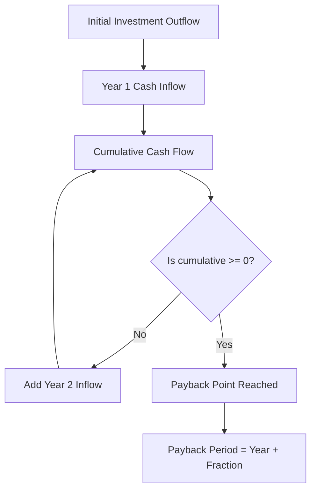

# Payback period method

## Video Explanation

* [https://www.youtube.com/watch?v=2q3K5xX0WmE](https://www.youtube.com/watch?v=2q3K5xX0WmE)

## Visual Aids

## 1. Definition

The payback period method is a simple capital budgeting technique that measures the time required for a project's net cash inflows to recover its initial investment. It tells the investor how many years it will take to get back the money originally invested.

## 2. Concept Explanation

The basic idea behind the payback period is to assess the liquidity risk of a project. Investors want to know how fast their money will come back. A short payback period means the money is recovered quickly, reducing the time exposed to risk.

How it works: Cash flows generated by the project are added up year by year. When the cumulative cash inflows equal or exceed the initial investment, the payback point is reached. If cash inflows are uniform each year, the calculation is simply the initial investment divided by the annual cash inflow. If cash flows vary, we must find the exact year by accumulating cash flows.

Why it is important: This method is widely used because it is easy to understand and compute. It is particularly useful for small businesses, for projects in rapidly changing technology sectors, and as a first screening tool. It helps managers focus on projects that recover costs quickly, which is critical when the firm has limited cash or faces high uncertainty.

## 3. Key Characteristics / Features

- **Simple and Intuitive:** The method uses only basic arithmetic and is easy to explain to non-financial managers.
- **Focus on Liquidity:** It measures how quickly the invested funds are recovered, highlighting the project’s short-term risk.
- **Does Not Consider Time Value of Money (Standard Payback):** The basic method treats all cash flows equally, regardless of when they occur.
- **Ignores Cash Flows After Payback:** Once the initial cost is recovered, any further profits are completely ignored.
- **Break-Even Time Concept:** It represents the time taken to break even in terms of cash flows, not in accounting profit.

## 4. Types / Classification

The payback method can be classified into two types:

- **Standard Payback Period:** It does not consider the time value of money. Future cash flows are taken at their face value. It is the simplest form.
- **Discounted Payback Period:** It corrects the main drawback by using discounted cash flows (present values). The period is longer than the standard payback but provides a more accurate recovery timeline. This type considers the cost of capital.

## 5. Working / Mechanism

1.  Determine the initial investment required for the project.
2.  Estimate the annual net cash inflows (after taxes, before depreciation) for each year of the project life.
3.  If cash flows are equal every year, divide the initial investment by the annual cash inflow to get the payback period in years.
4.  If cash flows vary, create a cumulative cash flow column. Start with the initial investment as a negative amount.
5.  Add the cash inflow of the first year to the cumulative amount. Repeat for subsequent years.
6.  Identify the year in which the cumulative cash flow turns from negative to zero or positive.
7.  If the cumulative cash flow becomes zero exactly at the end of a year, that year is the payback period. If it happens partway through a year, use interpolation: Payback = Last negative year + (Unrecovered amount / Cash flow of next year).

## 6. Diagram

## 7. Mathematical Formulation

For uniform annual cash inflows:

$$
\text{Payback Period} = \frac{\text{Initial Investment}}{\text{Annual Cash Inflow}}
$$

For uneven cash flows:

$$
\text{Payback Period} = A + \frac{B}{C}
$$

Where:
- $A$ = Number of full years immediately before the recovery year
- $B$ = Unrecovered cost at the beginning of the recovery year
- $C$ = Cash inflow during the recovery year

Example in equation form: For a project with year-wise cash flows $CF_1, CF_2, ... , CF_n$, find the smallest $t$ such that $\sum_{i=1}^{t} CF_i \geq \text{Initial Investment}$. The payback is $t$ plus the fraction of year.

## 8. Example

A bakery buys a new oven for ₹5,00,000. The oven saves and earns net cash flows of ₹2,00,000 every year. The payback period is:

$$
\text{Payback Period} = \frac{5,00,000}{2,00,000} = 2.5 \text{ years}
$$

Now suppose a different project costs ₹6,00,000 and generates year-wise cash flows of ₹3,00,000 (Year 1), ₹2,00,000 (Year 2), and ₹2,50,000 (Year 3). After Year 1, cumulative is -3,00,000. After Year 2, cumulative is -1,00,000. The remaining ₹1,00,000 is recovered in Year 3. Payback Period = 2 + (1,00,000 / 2,50,000) = 2.4 years.

## 9. Analogy

Think of lending money to a friend. You give them ₹1000 today. They promise to repay ₹500 each month. The payback period is 2 months—the time you wait until your total receipts equal the amount you lent. If they start repaying only after six months, you first mark the months you have been out of pocket. The payback period tells you exactly when your wallet returns to its original state.

## 10. Comparison

| Feature | Payback Period Method | Net Present Value (NPV) Method |
|--------|------------------------|--------------------------------|
| Basic Idea | Time taken to recover initial investment | Present value of all cash flows minus initial investment |
| Time Value of Money | Ignored in standard payback | Fully considered through discounting |
| Cash Flows Considered | Only up to the payback point | All cash flows over the entire project life |
| Decision Rule | Accept if payback ≤ target period | Accept if NPV > 0 |
| Complexity | Very simple | Requires discounting and more calculations |

## 11. Advantages

- It is extremely simple to compute and understand, making it accessible for small firm owners.
- The method is useful for screening projects where the primary concern is liquidity and quick recovery of funds.
- It helps in industries with rapid technological obsolescence where quick return of capital is essential.
- It reduces the risk of loss from an uncertain future by preferring projects with shorter payback.
- It requires no assumption about a discount rate, avoiding debates on the cost of capital.

## 12. Disadvantages / Limitations

- It completely ignores the time value of money; a rupee received today is treated the same as one received years later.
- All cash flows that occur after the payback period are ignored, so project profitability is not fully assessed.
- The method does not measure the overall return on investment; a project with a fast payback may yield very low total profits.
- The target payback period is often set arbitrarily, lacking any logical link to wealth maximisation.
- It cannot distinguish between projects with the same payback period but with very different post-payback cash flows.

## 13. Important Points / Exam Notes

- Payback period = Time taken to recover the original investment from net cash inflows.
- For equal annual cash flows, Payback = Initial Investment / Annual Cash Inflow.
- For unequal cash flows, use cumulative cash flow method to find the exact year plus fraction.
- Decision rule: Accept project if its payback is less than or equal to management's predetermined cutoff period.
- The standard method ignores time value of money; the discounted payback method corrects this.
- It is a liquidity and risk assessment tool, not a profitability measure.

## 14. Applications / Use Cases

- **Small Business Decisions:** A small restaurant owner uses payback to decide between buying a new freezer or an additional tandoor based on how quickly the cost is recovered.
- **Technology Upgrades:** An IT firm evaluates whether to buy new servers; the payback must be less than 2 years because the tech becomes obsolete quickly.
- **Energy Efficiency Projects:** A factory calculates the payback for installing solar panels; if the payback is 4 years and electricity prices are stable, the project is approved.
- **Emergency Replacement:** When critical machinery breaks down, the payback method quickly compares repair versus replace options based on immediate cash flow recovery.
- **Initial Project Screening:** Large corporations use payback as a preliminary filter before applying more detailed DCF methods like NPV and IRR.

## 15. MCQs

**Q1. What does the payback period method primarily measure?**

A. Total profit of the project  
B. Time to recover the initial investment  
C. Present value of future cash flows  
D. The internal rate of return  
**Answer:** B  
**Explanation:** The payback period calculates the number of years needed to get back the original investment from cash inflows.

**Q2. If a project costs ₹4,00,000 and generates uniform annual cash flows of ₹1,00,000, the payback period is:**

A. 2 years  
B. 3 years  
C. 4 years  
D. 5 years  
**Answer:** C  
**Explanation:** Payback = 4,00,000 / 1,00,000 = 4 years.

**Q3. Which of the following is a major limitation of the standard payback method?**

A. It is too complex for small firms  
B. It ignores the time value of money  
C. It considers all cash flows  
D. It requires a discount rate  
**Answer:** B  
**Explanation:** Standard payback treats all future cash as equal to today's rupees, ignoring interest or inflation.

**Q4. For uneven cash flows, the payback period is found using:**

A. Simple division  
B. Net present value  
C. Cumulative cash flows  
D. Depreciation schedule  
**Answer:** C  
**Explanation:** With varying annual cash inflows, you accumulate them until the total equals the initial investment.

**Q5. An investment of ₹10,00,000 has cash inflows: Year 1: ₹4,00,000, Year 2: ₹5,00,000, Year 3: ₹3,00,000. The payback period is:**

A. 2 years  
B. 2.2 years  
C. 3 years  
D. 2.5 years  
**Answer:** B  
**Explanation:** After Year 1, unrecovered: 6,00,000. After Year 2, unrecovered: 1,00,000. Fraction = 1,00,000 / 5,00,000 = 0.2. Payback = 2.2 years.

**Q6. The discounted payback method improves upon the standard payback by:**

A. Ignoring cash flows  
B. Using accounting profits  
C. Incorporating the time value of money  
D. Reducing the payback period  
**Answer:** C  
**Explanation:** Discounted payback uses present values of future cash flows, thereby accounting for the cost of capital.

**Q7. Which of the following is an advantage of the payback method?**

A. It measures overall profitability  
B. It is simple and easy to interpret  
C. It considers cash flows after payback  
D. It requires complex software  
**Answer:** B  
**Explanation:** Its simplicity and focus on liquidity make it popular for quick assessments.

**Q8. A project's cash flows after the payback period are ignored. This means the method does not measure:**

A. Liquidity  
B. Risk  
C. Total project profitability  
D. Initial cost  
**Answer:** C  
**Explanation:** Because all post-payback cash flows are excluded, the method cannot evaluate the full profit potential.

**Q9. A company's predetermined payback cutoff is 3 years. Which project should be accepted?**

A. Project P with payback 3.5 years  
B. Project Q with payback 2.8 years  
C. Project R with payback 4.0 years  
D. Project S with payback 3.0 years and no further cash flows  
**Answer:** B  
**Explanation:** Only project Q has a payback less than the maximum allowed cutoff of 3 years.

**Q10. The payback period method is most suitable for:**

A. Measuring long-term strategic value  
B. Evaluating projects under high uncertainty where quick recovery is critical  
C. Comparing projects of different sizes without any further analysis  
D. Replacing discounted cash flow techniques entirely  
**Answer:** B  
**Explanation:** Its strength lies in assessing liquidity risk, making it ideal for projects in volatile environments where early recovery is paramount.