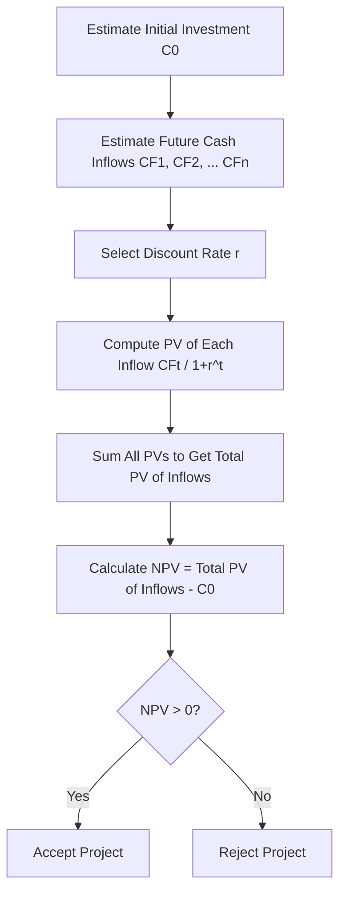

# Net Present Value Method

## 1. Definition

The Net Present Value (NPV) method is a capital budgeting technique that measures the profitability of a project by calculating the difference between the present value of all expected cash inflows and the present value of all cash outflows, discounted at a given rate of return.

---

## 2. Concept Explanation

The basic idea behind NPV is the time value of money: a rupee received today is worth more than a rupee received in the future because money can be invested to earn interest. NPV converts all future cash flows to their equivalent value today so they can be compared fairly.

How it works: First, estimate all future net cash inflows that the project will generate over its life. Then choose a discount rate—usually the minimum return the firm requires or the cost of capital. Discount each future cash inflow back to the present using this rate. Sum all the discounted inflows and subtract the initial investment outlay. The result is the Net Present Value.

Why it is important: A positive NPV means the project is expected to increase the wealth of the investors and add value to the firm. A negative NPV means the project would destroy value. It is the most theoretically sound and widely recommended method for evaluating investment proposals.

---

## 3. Key Characteristics / Features

- **Considers time value of money:** Future cash flows are discounted to account for the opportunity cost of waiting.
- **Uses all cash flows over the project’s life:** Every expected cash inflow and outflow is included in the calculation.
- **Absolute measure of profitability:** It gives the net rupee amount of value added or lost.
- **Requires a predetermined discount rate:** The discount rate is usually the firm’s cost of capital or required rate of return.
- **Consistent with shareholder wealth maximisation:** A project is accepted if NPV > 0, which directly increases the market value of the firm.
- **Handles uneven cash flows:** It can be used for any pattern of cash flows, not just equal annual amounts.

---

## 4. Types / Classification (Based on Cash Flow Pattern)

- **Even cash flows (Annuity):** When the net cash inflow is the same each year, the present value of inflows can be computed using the annuity formula.
- **Uneven cash flows (Mixed stream):** When cash inflows differ from year to year, each inflow must be discounted individually and then summed.

*(There is no other standard classification of the NPV method itself.)*

---

## 5. Working / Mechanism

1. Determine the initial investment (cash outflow at time zero).
2. Estimate the expected net cash inflows for each year of the project’s life.
3. Choose an appropriate discount rate (r), usually the cost of capital.
4. Find the present value factor for each year: \( \frac{1}{(1+r)^t} \).
5. Multiply each year’s cash inflow by its corresponding present value factor.
6. Sum all the present values of inflows to get the total present value of benefits.
7. Subtract the initial investment from the total present value of inflows.
8. If the resulting NPV is greater than zero, accept the project. If NPV is exactly zero, the firm is indifferent. If NPV is less than zero, reject the project.
9. For mutually exclusive projects, select the one with the highest positive NPV.

---

## 6. Diagram

---

## 7. Mathematical Formulation

The Net Present Value is given by:

$$
NPV = \sum_{t=1}^{n} \frac{CF_t}{(1 + r)^t} - C_0
$$

Where:  
- \( NPV \) = Net Present Value  
- \( CF_t \) = Expected net cash inflow in year t  
- \( r \) = Discount rate (cost of capital or required rate of return)  
- \( n \) = Life of the project in years  
- \( C_0 \) = Initial investment (cash outflow at time t = 0)  

If cash inflows are an equal annual annuity, the formula can be written as:

$$
NPV = CF \times \left[ \frac{1 - (1+r)^{-n}}{r} \right] - C_0
$$

Where \( CF \) is the constant annual cash inflow.

---

## 8. Example

**Problem:** A project requires an initial investment of ₹1,00,000. It is expected to generate net cash inflows of ₹40,000, ₹50,000, and ₹60,000 at the end of years 1, 2, and 3 respectively. The required rate of return is 10%. Compute NPV and decide whether the project should be accepted.

**Solution:**

- Initial Investment, \( C_0 = ₹1,00,000 \)  
- Discount rate, \( r = 10\% = 0.10 \)

Present values of cash inflows:  
Year 1: \( \frac{40,000}{(1.10)^1} = \frac{40,000}{1.10} = ₹36,363.64 \)  
Year 2: \( \frac{50,000}{(1.10)^2} = \frac{50,000}{1.21} = ₹41,322.31 \)  
Year 3: \( \frac{60,000}{(1.10)^3} = \frac{60,000}{1.331} = ₹45,079.64 \)  

Total PV of inflows = 36,363.64 + 41,322.31 + 45,079.64 = ₹1,22,765.59

NPV = Total PV – Initial Investment  
= ₹1,22,765.59 – ₹1,00,000 = ₹22,765.59

Since NPV is positive, the project is financially acceptable.

---

## 9. Analogy

Imagine you are offered a deal: invest ₹100 today in a sapling and you will receive a basket of fruits for the next three years. But future fruits are less valuable to you than today’s fruits because you could have eaten today’s fruits, saved the seeds, and grown more. You value each future basket less the longer you wait—that is discounting. The NPV method helps you compare the present worth of all future fruit baskets with the ₹100 you are paying now. If the total present worth of baskets is more than ₹100, it is a good deal.

---

## 10. Comparison (NPV vs. Internal Rate of Return (IRR))

| Feature | Net Present Value (NPV) | Internal Rate of Return (IRR) |
|--------|--------------------------|-------------------------------|
| Meaning | Present value of inflows minus present value of outflows | Discount rate at which NPV equals zero |
| Output | Absolute rupee amount | Percentage rate of return |
| Reinvestment assumption | Reinvests intermediate cash flows at the discount rate (cost of capital) | Assumes reinvestment at the IRR itself |
| Decision rule | Accept if NPV > 0 | Accept if IRR > required rate |
| Ranking mutually exclusive projects | Always gives correct ranking | May conflict with NPV for non-conventional cash flows |
| Suitability | Directly measures value added | Easy to communicate as a percentage |

---

## 11. Advantages

- It recognises the time value of money and provides a clear rupees measure of value added.
- All cash flows over the entire life of the project are considered.
- It is consistent with the primary goal of maximising shareholders’ wealth.
- The method works for both even and uneven cash flow patterns.
- It can be easily used to compare multiple projects of similar size and life.
- The discount rate used reflects the risk of the project through the cost of capital.

---

## 12. Disadvantages / Limitations

- The accuracy of NPV depends heavily on correct estimation of future cash flows, which can be uncertain.
- Selecting the appropriate discount rate can be challenging and subjective.
- It does not directly show the margin of safety in percentage terms like IRR.
- NPV alone does not indicate the scale of the project; a larger NPV may simply reflect a larger investment.
- Comparing projects with unequal lives requires additional adjustments (e.g., Equivalent Annual Annuity).
- It assumes that intermediate cash flows can be reinvested at the discount rate, which may not always hold.

---

## 13. Important Points / Exam Notes

- NPV = Present Value of Cash Inflows – Initial Investment.
- Decision Rule: Accept if NPV > 0, Reject if NPV < 0, Indifferent at NPV = 0.
- It is a discounting technique; it considers the time value of money.
- Formula: \( NPV = \sum \frac{CF_t}{(1+r)^t} - C_0 \).
- The discount rate (r) is usually the firm’s cost of capital or hurdle rate.
- NPV measures absolute wealth increase; it is the best method for capital budgeting from a theoretical standpoint.
- For mutually exclusive projects, choose the one with the highest positive NPV.
- A zero NPV means the project earns exactly the required rate of return.

---

## 14. Applications / Use Cases

- **Industrial plant expansion:** A cement company uses NPV to decide whether to set up a new grinding unit based on projected sales and costs.
- **Infrastructure projects:** Government agencies evaluate the NPV of a toll bridge project by discounting future toll revenues.
- **Energy sector:** A solar power firm assesses the NPV of a new installation by estimating electricity savings over 25 years.
- **Software development:** A tech company calculates NPV of a new app launch, using expected subscription revenues and development costs.
- **Equipment replacement:** A factory compares the NPV of keeping an old machine versus buying a new energy-efficient one.

---

## 15. MCQs

**Q1. NPV is calculated as:**  
A. Present value of inflows – Present value of outflows  
B. Present value of inflows + Initial investment  
C. Total inflows – Total outflows (without discounting)  
D. Future value of inflows – Initial investment  
**Answer:** A  
**Explanation:** NPV equals the present value of all expected cash inflows minus the present value of all cash outflows (initial investment).

**Q2. A project should be accepted if its NPV is:**  
A. Equal to the cost of capital  
B. Less than zero  
C. Greater than zero  
D. Exactly zero with a large investment  
**Answer:** C  
**Explanation:** Positive NPV indicates that the project adds value to the firm; hence it should be accepted.

**Q3. If the discount rate increases, the NPV of a project will generally:**  
A. Increase  
B. Decrease  
C. Remain unchanged  
D. Become zero  
**Answer:** B  
**Explanation:** A higher discount rate reduces the present value of future cash inflows, thus lowering the NPV.

**Q4. In the NPV formula, the discount rate is also known as:**  
A. Internal rate of return  
B. Reinvestment rate  
C. Cost of capital or hurdle rate  
D. Payback reciprocal  
**Answer:** C  
**Explanation:** The discount rate used is typically the firm’s cost of capital or minimum required rate of return.

**Q5. An initial investment of ₹2,00,000 yields cash inflows of ₹70,000 for 4 years at a discount rate of 10%. The annuity factor for 4 years at 10% is 3.17. The NPV is approximately:**  
A. ₹2,21,900  
B. ₹21,900  
C. –₹21,900  
D. ₹2,00,000  
**Answer:** B  
**Explanation:** PV = 70,000 × 3.17 = ₹2,21,900; NPV = 2,21,900 – 2,00,000 = ₹21,900.

**Q6. Which of the following is NOT an advantage of the NPV method?**  
A. It considers the time value of money  
B. It uses all cash flows of the project  
C. It expresses result as a percentage  
D. It is consistent with wealth maximization  
**Answer:** C  
**Explanation:** NPV gives an absolute rupee value, not a percentage; IRR expresses result as a percentage.

**Q7. NPV assumes that intermediate cash inflows are reinvested at the:**  
A. Internal rate of return  
B. Discount rate used in NPV  
C. Risk-free rate  
D. Zero rate of return  
**Answer:** B  
**Explanation:** The NPV method implicitly assumes reinvestment of intermediate cash flows at the discount rate (cost of capital).

**Q8. A project with NPV exactly equal to zero indicates that:**  
A. The project destroys value  
B. The project earns more than the required rate  
C. The project earns exactly the required rate of return  
D. There is a calculation error  
**Answer:** C  
**Explanation:** Zero NPV means that the present value of inflows equals the initial outlay, yielding a return equal to the discount rate.

**Q9. When comparing two mutually exclusive projects with different lives, the NPV method:**  
A. Can be applied directly without any adjustment  
B. Requires the projects to be evaluated over a common life or using equivalent annual annuity  
C. Cannot be used at all  
D. Always chooses the project with the shorter payback  
**Answer:** B  
**Explanation:** Unequal lives require adjustment, such as using the equivalent annual annuity (EAA) or least common multiple method.

**Q10. If a project has an initial cost of ₹50,000 and total present value of inflows of ₹55,000, the NPV is:**  
A. –₹5,000  
B. ₹5,000  
C. ₹1,05,000  
D. ₹50,000  
**Answer:** B  
**Explanation:** NPV = 55,000 – 50,000 = ₹5,000. Positive NPV adds value.