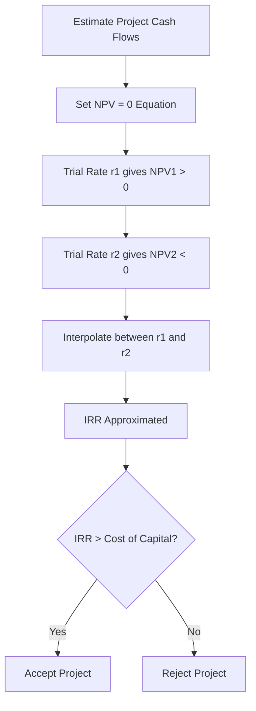

# 03 Internal Rate of Return method

## 1. Definition

The Internal Rate of Return (IRR) is the discount rate at which the net present value (NPV) of all cash flows from a project becomes zero. In other words, IRR is the rate of return that makes the present value of expected cash inflows equal to the present value of cash outflows.

## 2. Concept Explanation

When a business invests money in a project, it expects to earn returns over time. The Internal Rate of Return tells the management exactly what percentage rate of return the project is expected to generate. If this rate is higher than the cost of capital (the minimum acceptable return), the project is considered good.

It works on the time value of money principle. Every rupee earned in the future is worth less than a rupee today. The IRR is the discount rate that exactly balances the initial investment with the discounted future cash flows. Finding it requires trial and error or interpolation because the equation cannot be solved directly in most cases.

Why is it important? IRR gives a single percentage figure that makes comparing projects very easy. Investors and engineers can quickly see if a project beats the required rate of return. It is widely used in capital budgeting, infrastructure planning, and equipment purchase decisions because it shows the project’s profitability in percentage terms, which everyone understands.

## 3. Key Characteristics / Features

- **It is a percentage measure of return.** The IRR is expressed as a percentage, making it easy to compare with interest rates or required returns.
- **Based on the time value of money.** All cash flows are discounted to their present value.
- **It is a break‑even discount rate.** At IRR, NPV equals exactly zero; the project neither gains nor loses value in present value terms.
- **It considers the entire life of the project.** All cash flows from start to end are included in the calculation.
- **The decision rule is simple:** Accept the project if IRR > cost of capital; reject if IRR < cost of capital.
- **It can be calculated by trial and error or interpolation.** There is no direct formula to extract IRR; numerical methods are used.

## 4. Types / Classification

In the context of capital budgeting, IRR analysis can be classified based on the project cash flow pattern:

- **Conventional cash flow IRR:** The project has an initial outflow followed by a series of inflows. This is the normal case and yields a unique IRR.
- **Non‑conventional cash flow IRR:** Cash flows change sign more than once. This may produce multiple IRRs or no IRR, making the method difficult to apply directly. A modified internal rate of return (MIRR) is sometimes used in such situations.

## 5. Working / Mechanism

The process of calculating and applying the IRR method follows these steps.

1.  **Estimate all project cash flows:** Identify the initial investment (outflow) and the expected net cash inflows for each year of the project’s life.
2.  **Set up the NPV equation:** Write the equation with an unknown discount rate \( r \) and set NPV equal to zero.
3.  **Select an initial trial rate:** Guess a discount rate, for example 10%, and compute the NPV.
4.  **Adjust the rate based on NPV result:** If the NPV is positive, try a higher rate. If NPV is negative, try a lower rate.
5.  **Use linear interpolation when you get one positive and one negative NPV:** Apply the interpolation formula to find the approximate IRR.
6.  **Apply the decision rule:** Compare the computed IRR with the firm’s cost of capital or hurdle rate. Accept the project if IRR exceeds the required rate, otherwise reject.

## 6. Diagram

## 7. Mathematical Formulation

The IRR is the discount rate \( r \) that satisfies the following equation.

$$
0 = -C_0 + \frac{C_1}{(1+r)^1} + \frac{C_2}{(1+r)^2} + \dots + \frac{C_n}{(1+r)^n}
$$

Where:
- \( C_0 \) = Initial investment (cash outflow at time 0)
- \( C_t \) = Net cash flow in period \( t \) (can be inflow or outflow)
- \( r \) = Internal Rate of Return (the unknown to be solved)
- \( n \) = Total number of periods

**Interpolation formula for approximate IRR:**

$$
IRR = r_1 + \frac{NPV_1}{NPV_1 - NPV_2} \times (r_2 - r_1)
$$

Where:
- \( r_1 \) = Lower trial discount rate (giving positive NPV)
- \( r_2 \) = Higher trial discount rate (giving negative NPV)
- \( NPV_1 \) = Net Present Value at rate \( r_1 \)
- \( NPV_2 \) = Net Present Value at rate \( r_2 \)

## 8. Example

A company invests ₹1,00,000 in a machine. It expects cash inflows of ₹35,000, ₹40,000, and ₹50,000 at the end of year 1, 2, and 3 respectively. Find the IRR.

**Trial 1: r = 12%**
NPV = -1,00,000 + 35,000/(1.12) + 40,000/(1.12²) + 50,000/(1.12³)
= -1,00,000 + 31,250 + 31,888 + 35,595 = -1,267 (slightly negative)

**Trial 2: r = 10%**
NPV = -1,00,000 + 35,000/(1.10) + 40,000/(1.10²) + 50,000/(1.10³)
= -1,00,000 + 31,818 + 33,058 + 37,566 = +2,442 (positive)

Using interpolation:
IRR ≈ 10% + [2,442 / (2,442 - (-1,267))] × (12% - 10%)
IRR ≈ 10% + (2,442 / 3,709) × 2%
IRR ≈ 10% + 0.6587 × 2%
IRR ≈ 10% + 1.32% = 11.32%

Since the IRR (11.32%) is higher than the company’s cost of capital, say 10%, the project is financially acceptable.

## 9. Analogy

Imagine opening a fixed deposit that promises a certain interest rate. The IRR is that equivalent interest rate that your project gives. If a bank FD gives 7% but your project’s IRR is 12%, you are better off putting money into the project (ignoring risk). The IRR tells you the annual percentage yield of your investment over its entire life.

## 10. Comparison

| Feature | IRR Method | NPV Method |
|--------|----------|----------|
| **Output** | Gives a percentage rate of return | Gives an absolute rupee value of wealth created |
| **Decision basis** | Accept if IRR > required rate of return | Accept if NPV > 0 |
| **Reinvestment assumption** | Assumes interim cash flows are reinvested at the IRR itself | Assumes reinvestment at the discount rate (cost of capital) |
| **Multi‑project comparison** | Easy to compare with interest rates | Shows which project adds most value |
| **Multiple roots problem** | May give multiple IRRs for non‑conventional cash flows | Always gives a single NPV |

## 11. Advantages

- **Easy to understand and communicate:** A percentage return is familiar to managers and investors.
- **Considers time value of money:** Unlike payback period, it discounts future cash flows.
- **Considers all project cash flows:** It looks at the entire life, not just early years.
- **Provides a clear hurdle comparison:** Simply compare IRR with the cost of capital or a predetermined benchmark.
- **Useful for single project evaluation:** It directly shows the project’s intrinsic earning rate.

## 12. Disadvantages / Limitations

- **Trial and error computation:** It is not direct; manual calculation requires interpolation.
- **Reinvestment rate assumption unrealistic:** It assumes that intermediate cash flows can be reinvested at the IRR itself, which may be too high.
- **May give multiple IRRs:** If cash flows change sign more than once, more than one IRR can exist, causing confusion.
- **Cannot rank projects by value:** A project with a higher IRR may create less total wealth than one with a lower IRR if sizes differ.
- **Ignores project scale:** A very small project with a high IRR may be preferred over a large, value‑creating project with a slightly lower IRR.

## 13. Important Points / Exam Notes

- IRR is the discount rate at which NPV = 0.
- Accept the project if IRR > cost of capital (or hurdle rate).
- If IRR equals cost of capital, the project breaks even and is marginally acceptable.
- When IRR < cost of capital, reject the project.
- For conventional cash flows (initial outflow then inflows), IRR is unique.
- Linear interpolation formula: \( IRR = r_1 + \frac{NPV_1}{NPV_1 - NPV_2} \times (r_2 - r_1) \).
- The interpolation gives only an approximate IRR; the closer r1 and r2 are, the better the approximation.
- IRR is also called the “yield on investment” or “discounted cash flow (DCF) rate of return”.
- IRR is not suitable for projects with large reinvestment of cash flows at unrealistic rates.
- In capital budgeting, IRR is often used together with NPV to provide a fuller picture.

## 14. Applications / Use Cases

- **Equipment purchase:** A manufacturing firm computes IRR to decide whether buying a new CNC machine yields a return higher than its bank loan rate.
- **Infrastructure projects:** Government agencies calculate IRR for toll roads, metro rail, and bridges to check if project returns justify public spending.
- **Energy projects:** Solar and wind farm developers use IRR to evaluate if the expected tariff over 25 years gives a good return compared to alternative investments.
- **Software development:** IT companies use IRR to prioritise which enterprise software project to build considering licensing and maintenance inflows.
- **Real estate development:** Builders compute IRR for residential projects to compare with other investment opportunities.

## 15. MCQs

**Q1. The Internal Rate of Return is the discount rate at which**

A. NPV is maximum  
B. NPV is positive  
C. NPV equals zero  
D. Payback period is minimum  

**Answer:** C  
**Explanation:** IRR is exactly the rate that makes NPV = 0.

---

**Q2. A project should be accepted under the IRR method when**

A. IRR is less than the cost of capital  
B. IRR is exactly equal to zero  
C. IRR is greater than the cost of capital  
D. IRR is negative  

**Answer:** C  
**Explanation:** If the return exceeds the minimum required rate, the project adds value.

---

**Q3. Which of the following is a limitation of the IRR method?**

A. It considers time value of money  
B. It can give multiple rates for non‑conventional cash flows  
C. It considers all cash flows  
D. It is easy to understand  

**Answer:** B  
**Explanation:** Multiple sign changes can yield multiple IRRs, confusing the decision.

---

**Q4. The IRR method assumes that intermediate cash flows are reinvested at**

A. The cost of capital  
B. The risk‑free rate  
C. The IRR itself  
D. Zero rate  

**Answer:** C  
**Explanation:** The IRR calculation implies that reinvestment occurs at the same IRR.

---

**Q5. The linear interpolation formula for IRR is**

A. \( IRR = r_1 + \frac{NPV_1}{NPV_1 + NPV_2} \times (r_2 - r_1) \)  
B. \( IRR = r_1 + \frac{NPV_1}{NPV_1 - NPV_2} \times (r_2 - r_1) \)  
C. \( IRR = r_1 - \frac{NPV_1}{NPV_1 - NPV_2} \times (r_2 - r_1) \)  
D. \( IRR = r_1 \times \frac{NPV_1}{NPV_2} \)  

**Answer:** B  
**Explanation:** That is the correct formula using a positive and a negative NPV.

---

**Q6. An investment of ₹50,000 gives a positive NPV at 10% and a negative NPV at 15%. The IRR lies**

A. Exactly at 10%  
B. Exactly at 15%  
C. Between 10% and 15%  
D. Below 10%  

**Answer:** C  
**Explanation:** When NPV changes sign between two rates, IRR lies between them.

---

**Q7. When a project has an initial outflow followed by ten years of inflows, the IRR is**

A. Always zero  
B. Always unique  
C. Always multiple  
D. Impossible to calculate  

**Answer:** B  
**Explanation:** A conventional cash flow pattern gives a single unique IRR.

---

**Q8. If the IRR of a project is equal to the firm’s cost of capital, the NPV will be**

A. Positive  
B. Negative  
C. Zero  
D. Infinite  

**Answer:** C  
**Explanation:** At the IRR, NPV equals zero. If cost of capital equals IRR, NPV=0 exactly.

---

**Q9. In which situation would you NOT rely solely on IRR to accept a project?**

A. When comparing two mutually exclusive projects of very different sizes  
B. When project cash flows are conventional  
C. When there is only one project being evaluated  
D. When the cost of capital is known  

**Answer:** A  
**Explanation:** IRR can mislead in ranking if project sizes differ; NPV should also be examined.

---

**Q10. A project has an initial cost of ₹1,00,000 and a single inflow of ₹1,21,000 at the end of year 2. The IRR is**

A. 5%  
B. 10%  
C. 15%  
D. 21%  

**Answer:** B  
**Explanation:** 1,00,000 = 1,21,000 / (1+r)^2 → (1+r)^2 = 1.21 → 1+r = 1.1 → r = 0.10 = 10%.