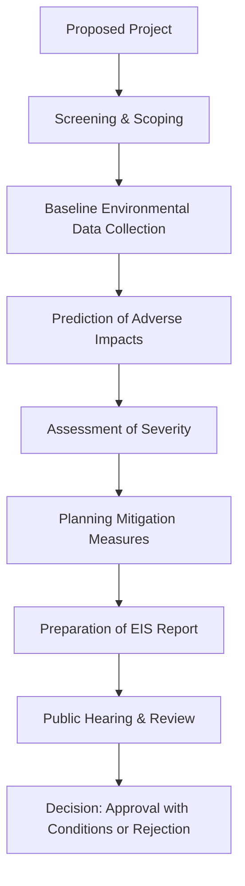

# Environmental Impact Study: Adverse Impact of the Project on the Environment

## 1. Definition

An environmental impact study is a formal assessment that identifies and evaluates the potential negative effects a proposed project can have on the natural and human environment. It examines how air, water, land, ecosystems, and communities may be harmed, before the project is approved or built.

## 2. Concept Explanation

Every construction, industrial, or infrastructure project changes the surrounding environment. An environmental impact study focuses specifically on the adverse, or harmful, consequences. The basic idea is to forecast these negative changes in advance, so they can be understood and managed.

How it works: A team of experts studies the proposed project location and design. They predict how the project will affect air quality, water resources, soil, plants, animals, and human communities during construction, operation, and even after closure. They document all possible damage, like pollution, deforestation, or displacement. This study is then shared with decision-makers and the public.

Why it is important: Ignoring adverse impacts can lead to irreversible environmental destruction, huge clean-up costs, and legal battles. By studying them beforehand, a project can be modified to avoid the worst harms, mitigation measures can be planned, and the true cost of the project can be weighed against its benefits. It ensures that development does not come at an unacceptable price for nature and society.

## 3. Key Characteristics / Features

- **Predictive Analysis:** The study forecasts future impacts based on project design, emission estimates, and ecological data, not after damage occurs.
- **Focus on Negative Effects:** It deliberately looks for harms such as pollution, habitat loss, and social disruption, rather than only highlighting benefits.
- **Multidisciplinary Approach:** It combines knowledge from civil engineering, biology, chemistry, geology, and social science to assess all types of damage.
- **Quantification Where Possible:** It tries to measure the expected level of impact, such as the amount of effluents released or the area of forest lost.
- **Legal and Regulatory Basis:** It is often a mandatory requirement by government environmental agencies before granting project clearance.

## 4. Types / Classification of Adverse Environmental Impacts

Adverse impacts can be classified based on the environmental component they affect.

- **Air and Climate Impacts:** Increase in air pollutants like dust, smoke, and carbon emissions. This can cause respiratory diseases and contribute to climate change.
- **Water Impacts:** Contamination of surface water and groundwater due to discharge of chemicals, sewage, or heated water. It threatens aquatic life and drinking water sources.
- **Land and Soil Impacts:** Soil erosion, loss of fertile topsoil, and land degradation. Improper waste disposal can lead to toxic land contamination.
- **Ecological and Biodiversity Impacts:** Destruction of forests, wetlands, and wildlife habitats. This can lead to loss of plant and animal species and disruption of food chains.
- **Social and Cultural Impacts:** Displacement of local communities, loss of livelihood for farmers and fishermen, noise pollution, and damage to heritage or religious sites.

## 5. Working / Mechanism

1.  **Screening:** The project is first checked against regulations to determine if a full-scale environmental impact study is required.
2.  **Scoping:** Experts identify the key environmental aspects that the project could harm, setting the boundaries of the study.
3.  **Baseline Data Collection:** Data about the existing environment is gathered – current air quality, water quality, noise levels, and list of species present.
4.  **Impact Prediction and Assessment:** Using project details and baseline data, all likely adverse impacts are predicted for construction, operation, and decommissioning phases. The nature, magnitude, and duration of each harm are described.
5.  **Mitigation and Alternatives:** For each serious adverse impact, a plan is developed to either avoid, minimise, or compensate for the damage. Alternative project sites or technologies may be proposed.
6.  **Environmental Impact Statement (EIS) Report:** The entire study is compiled into a document that is submitted to the regulatory authority and made available for public hearing.
7.  **Review and Decision:** The authority reviews the report and public feedback, then grants approval, asks for modifications, or rejects the project.

## 6. Diagram

## 7. Mathematical Formulation

For projects like thermal power plants, the Ground Level Concentration (GLC) of a pollutant from a stack is often modelled to predict air quality impact. One commonly used model is the Gaussian Plume Model.

$$
C(x, y, z) = \frac{Q}{2 \pi u \sigma_y \sigma_z} \cdot \exp\left( -\frac{y^2}{2\sigma_y^2} \right) \cdot \left[ \exp\left( -\frac{(z-H)^2}{2\sigma_z^2} \right) + \exp\left( -\frac{(z+H)^2}{2\sigma_z^2} \right) \right]
$$

Where:
- $C$ = Concentration of the pollutant at a given location $(x, y, z)$
- $Q$ = Pollutant emission rate from the source
- $u$ = Wind speed at the release height
- $H$ = Effective stack height (physical height + plume rise)
- $\sigma_y, \sigma_z$ = Dispersion coefficients in horizontal and vertical directions, which depend on distance $x$ and atmospheric stability

If the calculated concentration $C$ exceeds the permissible ambient air quality standard, it indicates an unacceptable adverse impact.

## 8. Example

Consider a proposed highway through a dense forest. An environmental impact study on its adverse effects would reveal that the construction will cut down around 50,000 trees, destroy the nesting ground of a rare bird, and block an elephant migration corridor. During operation, noise and vehicle emissions would pollute the pristine area. The study would then recommend building an animal underpass and planting twice the number of trees elsewhere to partially compensate for the loss.

## 9. Analogy

Imagine you plan to build a swimming pool in your small backyard. Before digging, you check the location of underground water pipes, tree roots, and the stability of your neighbour’s wall. An environmental impact study is exactly this but on a much larger scale. You are checking what you might break, kill, or pollute if you go ahead with your construction, so you can either change your plan or be ready to fix the damage.

## 10. Comparison

| Feature | Adverse Environmental Impact Study | Regular Technical Feasibility Study |
|--------|-------------------------------------|--------------------------------------|
| Primary Focus | Harm to air, water, land, and communities | Whether the project can be built and will work |
| Key Output | Environmental Impact Statement (EIS) | Engineering design and cost estimates |
| Concerned Stakeholders | Local residents, wildlife, future generations | Project investors, engineers, and owners |
| Decision Basis | Part of environmental clearance; can stop the project | Informs design and investment; usually precedes environmental study |

## 11. Advantages

- It prevents or reduces severe damage to the natural environment before it occurs.
- It helps a project avoid costly future clean-ups, lawsuits, and public protests by addressing concerns upfront.
- It encourages the inclusion of mitigation measures in the project design from the beginning.
- It provides a transparent process for the public to understand potential risks and voice their objections.
- It promotes sustainable development by ensuring that economic growth does not come at an unacceptable environmental cost.

## 12. Disadvantages / Limitations

- Conducting a thorough study can be expensive and time-consuming, sometimes delaying urgent development projects.
- The accuracy of predicted adverse impacts depends heavily on the quality of available data; poor data leads to poor predictions.
- The study can be manipulated by powerful project proponents who hide or downplay negative findings.
- Mitigation measures suggested may not be fully implemented once the project is approved.
- It often focuses heavily on biophysical effects and may not adequately capture deep-rooted social and cultural disruptions.

## 13. Important Points / Exam Notes

- The adverse impact study is a core part of the Environmental Impact Assessment (EIA) process.
- It identifies and evaluates specific damages like pollution, deforestation, and displacement caused by a project.
- The final report is called the Environmental Impact Statement (EIS).
- Mitigation hierarchy: First try to avoid the impact, then minimise it, then repair or compensate for the damage.
- Public hearing is a mandatory step in many countries, giving local communities a voice.
- Examples of major adverse impacts: discharge of untreated industrial effluents into rivers, emission of fly ash from thermal plants, submergence of forest land by dams.

## 14. Applications / Use Cases

- **Dam Construction:** Studying the adverse impact of submerging vast areas of forest and farmland, displacing entire villages, and blocking fish migration.
- **Mining Projects:** Assessing the impact of open-cast mining on groundwater depletion, dust pollution, and loss of agricultural land.
- **Chemical Industry:** Predicting the risk of toxic gas leaks and groundwater contamination from hazardous waste storage.
- **Coastal Development:** Evaluating how a new port or resort will affect mangroves, coral reefs, and the breeding grounds of turtles.
- **Industrial Estates:** Modelling the combined air pollution from multiple chimneys and its effect on the health of residents in nearby towns.

## 15. MCQs

**Q1. The primary purpose of an environmental impact study is to:**

A. Calculate the project's profit  
B. Identify and evaluate potential environmental harms of a project  
C. Design the project's technical layout  
D. Estimate the number of jobs a project will create  
**Answer:** B  
**Explanation:** An environmental impact study is conducted to forecast and assess the negative environmental effects of a proposed project.

**Q2. Which of the following is an example of an adverse impact on the water environment?**

A. Increase in background music  
B. Discharge of hot water from a factory into a lake  
C. Planting trees on the factory premises  
D. Installing a solar panel array  
**Answer:** B  
**Explanation:** Hot water discharge, or thermal pollution, reduces oxygen levels and harms aquatic life, making it a negative water impact.

**Q3. The document that summarises the findings of an environmental impact study is called:**

A. Detailed Project Report (DPR)  
B. Environmental Impact Statement (EIS)  
C. Balance Sheet  
D. Request for Quotation (RFQ)  
**Answer:** B  
**Explanation:** The EIS is the comprehensive report that describes all predicted impacts and proposed mitigation measures.

**Q4. What is the first step in conducting an adverse impact study for a project?**

A. Public hearing  
B. Mitigation planning  
C. Screening to determine if a study is required  
D. Detailed measurement of construction cost  
**Answer:** C  
**Explanation:** Screening is the initial step where the competent authority decides whether the project needs a full environmental impact assessment.

**Q5. Which adverse impact is most directly linked to the construction of a large dam?**

A. Increase in urban air quality  
B. Submergence of forest land and displacement of communities  
C. Growth of software industry  
D. Improvement in road connectivity across the dam  
**Answer:** B  
**Explanation:** Dams create large reservoirs that submerge vast areas of land, leading to deforestation and displacement of people.

**Q6. The Gaussian plume model is used to predict adverse impacts on:**

A. Soil fertility  
B. Air quality around a pollution source  
C. Fish population in rivers  
D. Noise levels near an airport  
**Answer:** B  
**Explanation:** The Gaussian plume model mathematically predicts how pollutants from a stack will spread and concentrate in the atmosphere.

**Q7. A public hearing in an environmental impact study process allows:**

A. Only the project owner to present benefits  
B. The government to sell the project land  
C. Local affected communities to raise their concerns about the project  
D. International companies to bid for the construction contract  
**Answer:** C  
**Explanation:** The public hearing gives local people a formal platform to express their objections and worries about the project's adverse impacts.

**Q8. Which mitigation hierarchy sequence is correct?**

A. Compensate → Minimise → Avoid  
B. Avoid → Minimise → Compensate  
C. Minimise → Avoid → Compensate  
D. Compensate → Avoid → Minimise  
**Answer:** B  
**Explanation:** The preferred order is to first avoid the impact entirely, then minimise unavoidable damage, and finally compensate for residual impacts.

**Q9. The loss of a rare bird's nesting ground due to a project is classified as an adverse impact on:**

A. Air and climate  
B. Water resources  
C. Ecology and biodiversity  
D. Social culture  
**Answer:** C  
**Explanation:** Destruction of wildlife habitats directly impacts biodiversity and ecological balance.

**Q10. One limitation of an environmental impact study is that:**

A. It is too cheap to perform  
B. It requires no expert knowledge  
C. Predictions depend on data quality and can be manipulated  
D. It always cancels projects unconditionally  
**Answer:** C  
**Explanation:** The effectiveness of the study relies on accurate baseline data; poor or biased data can lead to misleading conclusions.