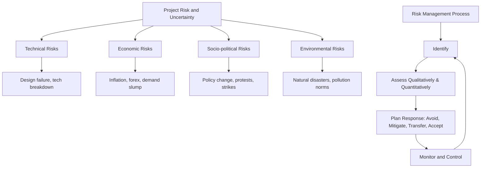

# Project Risk and Uncertainty: Technical, Economic, Socio-Political, Environmental Risks

## 1. Definition

Project risk refers to uncertain events or conditions that, if they occur, have a positive or negative effect on a project’s objectives like scope, time, cost, and quality. Uncertainty is the lack of complete information about future events, making it impossible to assign precise probabilities to outcomes.

---

## 2. Concept Explanation

All projects operate in an environment full of unknowns. Risk and uncertainty mean that actual results may differ from the plan. The difference is that for risk, we can list possible outcomes and estimate their likelihood. For uncertainty, we do not know the probabilities or even all possible outcomes.

How it works: Project managers identify sources of risk and uncertainty. These can be internal (such as new technology failing) or external (such as a sudden change in government policy). They assess how likely these events are and how much they could affect the project. Then they plan responses: avoiding the risk, reducing its chance or impact, transferring it (e.g., insurance), or accepting it. The goal is to keep the project on track despite surprises.

Why it is important: Ignoring risk and uncertainty leads to cost overruns, delays, quality failures, and sometimes project cancellation. Systematic risk analysis is a key part of project feasibility and ensures that stakeholders are prepared. It helps allocate contingency funds and time buffers, builds confidence among investors, and improves decision-making.

---

## 3. Key Characteristics / Features

- **Inherent to all projects:** No project is completely certain; every plan carries some level of risk.
- **Can be positive or negative:** Opportunities (upside risk) can also arise, though threat management is the main focus.
- **Categorisable by source:** Common categories include technical, economic, socio-political, and environmental.
- **Measurable impact:** Risks affect project constraints: cost, time, quality, scope, and safety.
- **Time-sensitive:** Risks change during the project life cycle; early identification is crucial.
- **Requires proactive management:** Waiting for a risk to occur is reactive; effective management plans responses in advance.

---

## 4. Types / Classification (Based on Source)

Project risks and uncertainties are broadly classified into the following categories:

- **Technical risks:** Arise from the engineering, design, technology, and production aspects of the project. These include equipment failure, technology not performing as expected, design errors, integration problems, and obsolescence during execution.
- **Economic risks:** Stem from the financial and market environment. Examples are unexpected inflation, exchange rate fluctuations, interest rate changes, raw material price volatility, demand shortfall, and funding or cash flow problems.
- **Socio-political risks:** Result from the social and political context. They include changes in government policies or regulations, delay in permits, land acquisition disputes, local opposition, labour strikes, corruption, and political instability.
- **Environmental risks:** Related to natural surroundings and ecology. These cover natural disasters (floods, earthquakes), adverse weather conditions affecting construction, environmental clearance delays, pollution incidents, stricter environmental norms, and waste disposal liabilities.

---

## 5. Working / Mechanism (Risk Management Process)

1. **Risk identification:** List all possible risk events under each category. Use checklists, brainstorming, expert interviews, and historical data.
2. **Risk assessment (qualitative):** Rate each risk for its probability of occurrence and its impact on project objectives (often using a 1–5 scale). Prioritise using a probability-impact matrix.
3. **Risk assessment (quantitative):** For critical risks, numerically analyse the effects. Techniques include sensitivity analysis, decision trees, and expected monetary value calculation (EMV = Probability × Impact).
4. **Risk response planning:** For each high-priority risk, decide a strategy: avoid (eliminate the cause), mitigate (reduce probability or impact), transfer (shift to third party via insurance or contracts), or accept (monitor and use contingency reserves).
5. **Risk monitoring and control:** Track identified risks, look for new risks, evaluate response effectiveness, and adjust plans throughout the project.
6. **Contingency reserve management:** Allocate time and cost reserves based on risk assessment to absorb impacts of accepted risks.

---

## 6. Diagram

---

## 7. Mathematical Formulation (Quantification of Risk)

A simple quantitative method for evaluating risk is Expected Monetary Value (EMV):

$$
EMV = P \times I
$$

Where:  
- \( P \) = Probability of the risk event occurring (expressed as a decimal)  
- \( I \) = Monetary impact (loss) if the event occurs  

The sum of EMVs for all identified risks gives a basis for determining the total contingency reserve.

For decision under uncertainty, the expected value of a project outcome can be computed as:

$$
EV = \sum_{i=1}^{n} P_i \times O_i
$$

Where \( P_i \) is the probability of scenario \( i \), and \( O_i \) is the net profit or cash flow in that scenario.

---

## 8. Example

A company plans to build a 50 km road in a hilly region.

- **Technical risk:** Unexpected weak soil strata are discovered after excavation begins, requiring additional foundation treatment costing ₹2 crore and delaying work by 3 months. Probability: 30%.
- **Economic risk:** Steel prices rise by 20% due to a global supply shock during the project year, increasing cost by ₹1.5 crore. Probability: 40%.
- **Socio-political risk:** Local community protests lead to a court stay for 4 months, causing idle equipment and labour cost of ₹3 crore. Probability: 20%.
- **Environmental risk:** Heavy monsoon rains trigger a landslide that damages a completed section, repair cost ₹80 lakh, delay 2 months. Probability: 25%.

The project manager uses these assessed risks to create time and cost contingency buffers and to prepare mitigation plans like purchasing price-guarantee contracts for steel, conducting early geotechnical surveys, engaging with community leaders, and scheduling earthworks before monsoon.

---

## 9. Analogy

Think of a farmer planning a harvest season. Technical risk: the tractor might break down. Economic risk: the selling price of the crop could crash. Socio-political risk: a sudden ban on water use or an export restriction. Environmental risk: a hailstorm wipes out the crop. A wise farmer saves some money for repairs, takes crop insurance, keeps alternate market contacts, and plants diverse crops. The project manager does the same: identifies what can go wrong, and has a backup plan.

---

## 10. Comparison (Risk vs. Uncertainty)

| Feature | Risk | Uncertainty |
|--------|------|-------------|
| Meaning | The probability of occurrence and impact can be estimated | Cannot be quantified; insufficient information |
| Measurable | Yes, using probability distributions and EMV | No, no reliable data or past patterns |
| Management approach | Proactive response strategies (mitigate, transfer, insure) | Use of flexibility, robust decision-making, scenario planning |
| Example | 30% chance of equipment failure costing ₹5 lakh | A new technology’s performance is completely unknown |
| Decision tools | Expected value, decision trees, Monte Carlo simulation | Payoff matrices, minimax rules, scenario analysis |

---

## 11. Advantages (of categorising and analysing these risks)

- Helps in developing a comprehensive risk register covering all major areas.
- Facilitates allocation of appropriate contingency reserves for cost and schedule.
- Improves stakeholder confidence as they see a systematic risk management approach.
- Enables early warning systems to detect potential threats before they escalate.
- Supports better project planning by incorporating foreseeable events into schedules and budgets.
- Reduces fire-fighting during execution; teams are prepared with pre-planned responses.

---

## 12. Disadvantages / Limitations

- Analysis is based on assumptions and estimates; the actual event may be far worse.
- Some risks, especially unknown-unknowns, cannot be identified in advance.
- Detailed risk analysis can be time-consuming and expensive for small projects.
- Over-reliance on quantitative methods may give a false sense of precision.
- Socio-political and environmental risks often involve human behaviour and nature, which are highly unpredictable.
- Risk management plans may become obsolete if the project context changes rapidly.

---

## 13. Important Points / Exam Notes

- Project risk is an uncertain event that can affect project objectives; uncertainty means inability to quantify its likelihood.
- Major categories: Technical, Economic, Socio-political, Environmental.
- Technical risks: technology failure, design issues, obsolescence.
- Economic risks: inflation, interest rates, demand shortfall, material cost volatility.
- Socio-political risks: regulatory changes, protests, political instability.
- Environmental risks: natural disasters, climate impacts, pollution norms.
- Risk management process: Identify – Assess – Plan response – Monitor.
- Expected Monetary Value: EMV = Probability × Impact.
- Responses: Avoid, Mitigate, Transfer (insurance, contracts), Accept (contingency reserves).
- A risk matrix (Probability vs Impact grid) is used for prioritisation.
- Contingency reserves are set aside to handle accepted risks.

---

## 14. Applications / Use Cases

- **Infrastructure projects:** Highway or dam projects conduct environmental and social impact assessments to identify risks of floods, earthquakes, and land acquisition protests.
- **IT projects:** Technical risks such as cybersecurity vulnerabilities and software integration failures are managed through rigorous testing and backup systems.
- **Energy projects:** A wind farm assesses economic risks (fluctuating power tariffs) and technical risks (turbine failure) before investment.
- **Pharmaceutical projects:** Drug development faces socio-political risk (delayed regulatory approvals) and technical risk (clinical trial failure).
- **Real estate development:** Builders evaluate economic risk (housing demand dip) and environmental risk (water table depletion affecting construction).

---

## 15. MCQs

**Q1. Which of the following is an example of technical risk in a project?**  
A. Sudden increase in interest rates  
B. Newly installed machine fails during commissioning  
C. Local community protests  
D. Heavy rain delaying site work  
**Answer:** B  
**Explanation:** Technical risks relate to engineering, technology, or equipment failures.

**Q2. Economic risk in a project includes:**  
A. Design error  
B. Earthquake  
C. Raw material price escalation  
D. Change in government policy  
**Answer:** C  
**Explanation:** Economic risks arise from market and financial factors such as inflation and price volatility.

**Q3. Socio-political risk is best illustrated by:**  
A. Flooding at the construction site  
B. A critical software bug  
C. Sudden enforcement of new labour law  
D. Failure of a prototype  
**Answer:** C  
**Explanation:** Socio-political risks stem from social and political changes, including regulatory amendments.

**Q4. Which response strategy involves shifting the risk to a third party?**  
A. Avoid  
B. Mitigate  
C. Transfer  
D. Accept  
**Answer:** C  
**Explanation:** Transferring risk (e.g., through insurance or outsourcing) passes the financial impact to another party.

**Q5. The formula for Expected Monetary Value (EMV) is:**  
A. Probability + Impact  
B. Probability × Impact  
C. Impact – Probability  
D. Probability / Impact  
**Answer:** B  
**Explanation:** EMV = Probability × Impact; it quantifies the weighted average loss from a risk.

**Q6. Uncertainty differs from risk because under uncertainty:**  
A. The outcome is known exactly  
B. The probability distribution can be calculated  
C. Probabilities cannot be objectively assigned  
D. The impact is always zero  
**Answer:** C  
**Explanation:** Uncertainty implies an inability to determine the likelihood of outcomes due to lack of information.

**Q7. Environmental risks include:**  
A. Design changes  
B. Foreign exchange loss  
C. Earthquake or cyclone  
D. Supplier bankruptcy  
**Answer:** C  
**Explanation:** Natural disasters and weather phenomena are environmental risks.

**Q8. A risk matrix uses two dimensions to prioritise risks; these are:**  
A. Cost and Quality  
B. Time and Scope  
C. Probability and Impact  
D. Resource and Milestone  
**Answer:** C  
**Explanation:** The probability-impact matrix helps categorise risks as high, medium, or low priority.

**Q9. Contingency reserves are most closely associated with which risk response strategy?**  
A. Avoid  
B. Mitigate  
C. Transfer  
D. Accept  
**Answer:** D  
**Explanation:** For risks that are accepted, contingency reserves (time or money) are established to absorb their impact if they occur.

**Q10. Which of the following is a socio-political risk for a multinational pipeline project?**  
A. Pipeline corrosion  
B. Global steel price drop  
C. Civil unrest or war in the host country  
D. Unusual rainfall pattern  
**Answer:** C  
**Explanation:** Civil unrest and war are socio-political events that can severely disrupt project execution.