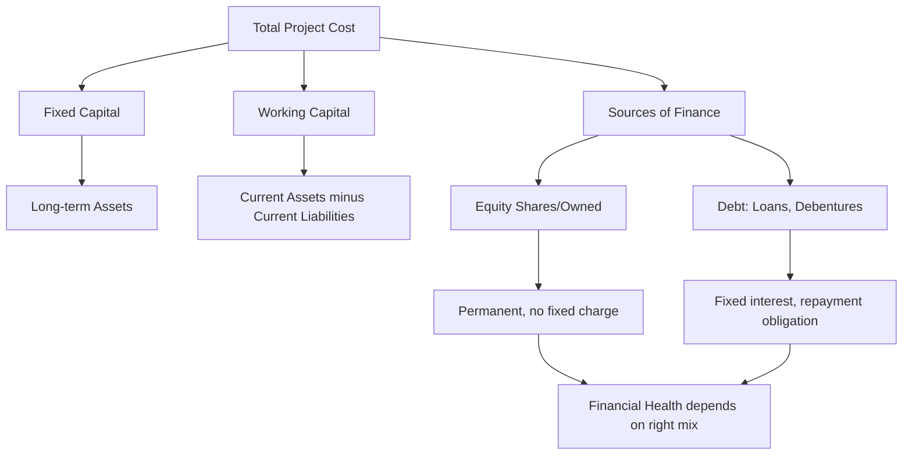

# 01 Fixed  Working Capital  Debt  Equity Shares Debentures

## 1. Definition

**Fixed Capital** is the portion of total capital that is invested in long‑term assets like land, buildings, machinery, and equipment. These assets are used in the business for many years and are not consumed in one accounting period.

**Working Capital** is the capital needed for day‑to‑day operations. It is the difference between current assets (cash, inventory, receivables) and current liabilities (creditors, short‑term loans).

**Debt** is borrowed money that a company must repay, usually with interest, over a fixed period. It can be short‑term or long‑term.

**Equity Shares** represent ownership in a company. Equity shareholders are the real owners who bear the risk and enjoy profits after all other claims are paid.

**Debentures** are long‑term debt instruments issued by a company to the public, carrying a fixed rate of interest. They are not backed by physical assets but by the company’s creditworthiness.

## 2. Concept Explanation

A project needs money to start and run. That money comes from different sources and is used for different purposes. Think of capital in two parts: one that stays in the business for the long run (fixed capital) and another that circulates daily to keep operations moving (working capital).

Fixed capital buys the factory, the machines, the land, and the office building. These are one‑time investments that last for the project’s entire life. Without adequate fixed capital, there is no production capacity.

Working capital ensures that the company can buy raw materials, pay wages, and meet daily expenses until cash comes in from sales. If working capital is short, even a profitable project can fail because it cannot pay its bills on time.

Now, where does the money come from? It can be **debt** (loans, debentures) or **equity** (own funds from shareholders). Debt must be repaid with interest; it is a liability. Equity shareholders take the residual profit and also bear losses; their money stays with the company permanently.

This combination of fixed and working capital, financed through an appropriate mix of debt and equity, determines the financial health of a project. A well‑designed capital structure reduces risk and ensures smooth operations.

## 3. Key Characteristics / Features

- **Fixed capital is long‑term in nature.** It is recovered through depreciation over many years.
- **Working capital is short‑term and circulating.** It gets converted from cash to inventory to receivables and back to cash within an operating cycle.
- **Debt carries a fixed financial obligation.** Interest must be paid regardless of profit.
- **Equity shares offer ownership and voting rights.** Dividends are paid only when profits exist and at the board’s discretion.
- **Debentures are a stable source of debt finance.** They have a fixed interest rate and a redemption date.
- **The mix of sources affects financial risk.** High debt increases fixed obligations; high equity dilutes ownership but reduces pressure.

## 4. Types / Classification

**Based on time horizon (capital):**
- *Fixed Capital:* Locked in assets lasting > 1 year.
- *Working Capital:* Circulating capital within one operating cycle. Further split into:
  - *Gross Working Capital:* Total current assets.
  - *Net Working Capital:* Current assets minus current liabilities.

**Based on source of funds:**
- *Owned Capital:* Equity shares, retained earnings.
- *Borrowed Capital:* Debentures, term loans, public deposits, bonds.
- *Debt can be:* Secured (backed by assets) or unsecured (debentures can be secured or unsecured).

**Equity shares can be:**
- Ordinary shares (voting, dividend varies).
- Preference shares (fixed dividend, priority over equity, but no voting usually). *(though not explicitly in subtitle, may mention.)*

## 5. Working / Mechanism

A project’s financial health is evaluated by seeing how these elements interact.

1.  **Estimate fixed capital requirement:** Cost of land, building, machinery, installation, and pre‑operative expenses.
2.  **Estimate working capital requirement:** Based on the operating cycle – how long raw materials are stored, production time, finished goods inventory, and collection period from debtors minus credit period from suppliers.
3.  **Determine total project cost:** Total Project Cost = Fixed Capital + Working Capital.
4.  **Decide financing mix:** Decide what percentage will come from equity (owners’ own money) and what from debt (loans, debentures). This is the capital structure decision.
5.  **Issue equity shares to raise owned capital.** Shares may be issued at par or premium.
6.  **Raise debt through term loans or debentures.** Debentures are issued with a fixed interest coupon and a maturity date.
7.  **Deploy funds:** Fixed capital buys assets; working capital maintains daily operations.
8.  **Monitor financial health:** Use ratios like Debt‑Equity Ratio (Total Debt / Equity), Current Ratio (Current Assets / Current Liabilities), and Interest Coverage Ratio. A healthy project keeps these within safe limits.

## 6. Diagram

## 7. Mathematical Formulation

**Net Working Capital:**

$$
NWC = CA - CL
$$

Where:
- \( CA \) = Current Assets (Cash, Inventory, Receivables)
- \( CL \) = Current Liabilities (Creditors, Short‑term loans)

**Debt‑Equity Ratio (a measure of financial leverage):**

$$
DER = \frac{\text{Long‑term Debt (including Debentures)}}{\text{Shareholders' Equity}}
$$

**Interest Coverage Ratio:**

$$
ICR = \frac{\text{Earnings Before Interest and Taxes (EBIT)}}{\text{Interest}}
$$

These formulas help assess whether a project has enough safety margin to service debt.

## 8. Example

A project sets up a small cement brick manufacturing unit. The total project cost is ₹50 lakh.

- **Fixed Capital:** ₹35 lakh for land development, shed, brick‑making machine.
- **Working Capital:** ₹15 lakh for raw materials (cement, sand), wages for one month, and finished brick stock until payment is received.
- **Financing:** The promoters bring ₹20 lakh as equity share capital. They raise ₹20 lakh as a term loan from bank (debt) and ₹10 lakh by issuing debentures to the public at 9% interest.

Thus, the capital structure is ₹20 lakh equity and ₹30 lakh debt (loan ₹20L + debentures ₹10L). The Debt‑Equity ratio is 30/20 = 1.5. The project maintains a healthy current ratio of 2:1 to ensure working capital sufficiency.

## 9. Analogy

Imagine building a food truck business. The truck, kitchen equipment, and generator are **fixed capital** – you buy them once and use them daily. The vegetables, oil, and cash for daily fuel are **working capital** – they get used up and need replenishment. Some money comes from your own savings (**equity**), and some from a bank loan (**debt**). If you also borrow from many friends by issuing fixed‑interest notes, those notes are like **debentures**. You must repay the loan and debenture interest even on a rainy day when sales are low, but your own equity is the cushion that absorbs the shock first.

## 10. Comparison

| Feature | Equity Shares | Debentures |
|--------|----------|----------|
| **Nature** | Ownership capital | Loan capital |
| **Return** | Dividend – not fixed, depends on profit | Fixed interest – must be paid every year |
| **Repayment** | Not repaid during the life of the company | Repaid on a specified maturity date |
| **Voting rights** | Equity shareholders have voting rights | Debenture holders have no voting rights |
| **Risk** | High risk, reward varies with profit | Low risk, fixed and priority payment |
| **Security** | No charge on assets | May be secured by a charge on assets |

| Feature | Fixed Capital | Working Capital |
|--------|----------|----------|
| **Purpose** | Purchasing long‑term assets | Financing day‑to‑day operations |
| **Duration** | Long‑term, blocked for years | Short‑term, revolving |
| **Conversion** | Depreciated gradually | Converts to cash within an operating cycle |
| **Sources** | Equity, long‑term debt | Short‑term borrowing, trade credit, bank overdraft |

## 11. Advantages

- **Adequate fixed capital** ensures modern technology and capacity utilisation.
- **Sufficient working capital** prevents cash flow crises and maintains creditworthiness.
- **Equity shares** provide permanent funds and absorb losses without the obligation to repay.
- **Debt and debentures** allow raising large sums without diluting ownership.
- **A balanced capital mix** minimises the cost of capital and maximises returns to equity holders through trading on equity.

## 12. Disadvantages / Limitations

- **Excessive fixed capital** may lead to idle capacity and higher depreciation costs.
- **Too much working capital** ties up funds unnecessarily, reducing overall profitability.
- **High debt increases financial risk.** Interest payment is a fixed burden; default risks insolvency.
- **Excess reliance on equity** dilutes control and may result in higher overall cost if investors expect high returns.
- **Debentures create a charge on assets** (if secured), reducing the company’s borrowing capacity later.

## 13. Important Points / Exam Notes

- Fixed capital + Working capital = Total project cost.
- Net working capital = Current Assets – Current Liabilities.
- Positive net working capital indicates liquidity; negative indicates potential cash trouble.
- Equity shareholders are the owners; they get residual profit after paying interest and preference dividend.
- Debenture interest is a tax‑deductible expense, unlike dividends on equity shares.
- Debt is cheaper than equity because interest is tax‑deductible and debtholders bear lower risk.
- A debt‑equity ratio of 2:1 is often considered reasonable for capital‑intensive projects.
- Trading on equity means: if return on total capital > interest rate, the extra profit goes to equity holders.
- Working capital cycle = raw material → work‑in‑progress → finished goods → receivables → cash.
- Sources of finance must match the type of capital: fixed assets financed by long‑term funds, working capital partly by short‑term sources.

## 14. Applications / Use Cases

- **New manufacturing plant:** Financial health evaluation checks if fixed capital investment is backed by long‑term equity/debentures and if working capital facility from bank covers purchase of steel and wages.
- **Real estate project:** Builder uses equity for land cost, debentures and bank loan for construction (fixed capital), and buyer advances as working capital.
- **IT start‑up:** Fixed capital for servers and office; equity capital from angel investors; little debt initially; working capital for salary and cloud bills.
- **Infrastructure BOT project:** Long‑term debt from institutions (70‑80% of project cost), equity from sponsor, and careful working capital modeling during operation to service debt.
- **Working capital management in a seasonal industry:** Sugar mills borrow heavily as working capital during crushing season and repay after sales.

## 15. MCQs

**Q1. Fixed capital is used to purchase**

A. Raw materials  
B. Short‑term marketable securities  
C. Machinery and building  
D. Monthly wages  

**Answer:** C  
**Explanation:** Fixed capital is tied up in long‑term assets like plant and machinery.

---

**Q2. Net working capital is defined as**

A. Total assets – Fixed assets  
B. Current assets – Current liabilities  
C. Equity + Debt  
D. Fixed capital + Working capital  

**Answer:** B  
**Explanation:** NWC = CA – CL; it indicates short‑term liquidity.

---

**Q3. Which of the following is a characteristic of equity shares?**

A. Fixed interest payment  
B. Redemption after 5 years  
C. Ownership and voting rights  
D. Secured loan status  

**Answer:** C  
**Explanation:** Equity shares represent ownership and carry voting rights.

---

**Q4. A debenture is a form of**

A. Equity capital  
B. Short‑term trade credit  
C. Long‑term loan capital with fixed interest  
D. Preference share  

**Answer:** C  
**Explanation:** Debentures are debt instruments with a fixed rate and maturity.

---

**Q5. The debt‑equity ratio is calculated as**

A. Total debt divided by shareholders’ equity  
B. Current assets divided by current liabilities  
C. Fixed assets divided by working capital  
D. EBIT divided by interest  

**Answer:** A  
**Explanation:** Debt‑equity ratio = Long‑term Debt / Equity.

---

**Q6. Which source of finance is permanent and does not have to be repaid during the life of the company?**

A. Debentures  
B. Term loan  
C. Equity shares  
D. Bank overdraft  

**Answer:** C  
**Explanation:** Equity capital is returned only if the company is wound up.

---

**Q7. High debt in the capital structure increases**

A. Liquidity  
B. Financial risk  
C. Sales automatically  
D. Working capital  

**Answer:** B  
**Explanation:** Fixed interest obligations raise financial risk if earnings fluctuate.

---

**Q8. Interest paid on debentures is**

A. A dividend distributed to owners  
B. A tax‑deductible expense  
C. Added to equity capital  
D. Paid only if the company makes a profit  

**Answer:** B  
**Explanation:** Debenture interest is a charge against profit and reduces taxable income.

---

**Q9. The operating cycle concept is primarily associated with**

A. Fixed capital  
B. Working capital  
C. Equity shares  
D. Debenture redemption  

**Answer:** B  
**Explanation:** Working capital circulates through the operating cycle (raw material → cash).

---

**Q10. A company has equity ₹40 lakh and long‑term debt ₹60 lakh. Its debt‑equity ratio is**

A. 0.67:1  
B. 1.5:1  
C. 2:1  
D. 1:1  

**Answer:** B  
**Explanation:** 60/40 = 1.5. So DER is 1.5:1.