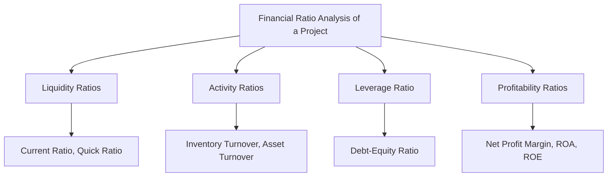

# Financial ratios Liquidity Ratios Activity Ratios Debt equity ratio Profitability Ratio

## Video Explanation

* [https://www.youtube.com/watch?v=9dZp1kz0L3E](https://www.youtube.com/watch?v=9dZp1kz0L3E)

## Visual Aids

## 1. Definition

Financial ratios are numerical tools that compare two or more financial figures from a project's balance sheet or income statement. They help measure the financial health, efficiency, and performance of a project. The main categories are liquidity ratios, activity ratios, debt-equity ratio, and profitability ratios.

## 2. Concept Explanation

Evaluating the financial health of a project means checking if it can pay its bills, use its assets well, remain solvent, and earn a good return. Financial ratios provide simple, quick answers to these questions. Each category serves a specific diagnostic purpose.

Liquidity ratios check if the project can cover short-term debts. Activity ratios show how efficiently the project uses its resources. The debt-equity ratio measures the proportion of borrowed funds to owner's funds, indicating financial risk. Profitability ratios reveal the project's ability to generate profit relative to sales, assets, or equity. Together, they form a complete picture of a project's financial strength.

Why it is important: Before investing or lending money, stakeholders must know the project's true financial condition. Ratios convert raw financial data into meaningful signals. They help managers make decisions, bankers assess loan eligibility, and investors gauge return potential.

## 3. Key Characteristics / Features

- **Standardised Comparison:** Ratios eliminate the problem of scale, allowing comparison of projects of different sizes.
- **Category-Specific Insight:** Each category targets a specific financial dimension: solvency, efficiency, leverage, or profitability.
- **Trend Analysis:** Ratios computed over several periods reveal whether the project’s financial health is improving or deteriorating.
- **Benchmarking Tool:** Ratios can be compared against industry norms to see if a project is performing above or below average.
- **Interrelationship:** No single ratio tells the whole story; a combination of ratios from all categories is essential for a complete evaluation.

## 4. Types / Classification

Financial ratios are classified into four key categories relevant to project evaluation:

- **Liquidity Ratios:** Measure the ability to meet short-term obligations.
- **Activity Ratios (Efficiency Ratios):** Measure how well the project utilises its assets.
- **Debt-Equity Ratio (Leverage Ratio):** Measures the proportion of debt used to finance the project relative to owners' equity.
- **Profitability Ratios:** Measure the project's ability to generate profits.

## 5. Working / Mechanism (with Formulas and Explanations)

The mechanism involves extracting relevant line items from financial statements and computing ratios.

### A. Liquidity Ratios

1.  **Current Ratio:** It compares total current assets to total current liabilities. It shows whether short-term assets are enough to pay short-term debts.
    $$
    \text{Current Ratio} = \frac{\text{Current Assets}}{\text{Current Liabilities}}
    $$
    A ratio of 2:1 is generally considered safe.

2.  **Quick Ratio (Acid-Test Ratio):** It is a stricter measure that excludes inventory from current assets, as inventory may not be quickly convertible to cash.
    $$
    \text{Quick Ratio} = \frac{\text{Current Assets} - \text{Inventory}}{\text{Current Liabilities}}
    $$
    A ratio of 1:1 is generally considered satisfactory.

### B. Activity Ratios (Efficiency Ratios)

1.  **Inventory Turnover Ratio:** It shows how many times inventory is sold and replaced over a period. A higher ratio indicates efficient inventory management.
    $$
    \text{Inventory Turnover Ratio} = \frac{\text{Cost of Goods Sold}}{\text{Average Inventory}}
    $$

2.  **Total Asset Turnover Ratio:** It indicates how efficiently the project uses all its assets to generate revenue.
    $$
    \text{Total Asset Turnover Ratio} = \frac{\text{Net Sales}}{\text{Total Assets}}
    $$
    A higher ratio means better utilisation of assets.

### C. Debt-Equity Ratio (Leverage Ratio)

1.  **Debt-Equity Ratio:** It shows the mix of debt and equity used to finance the project's assets. It is a measure of financial risk. A very high ratio means the project relies heavily on borrowed money.
    $$
    \text{Debt-Equity Ratio} = \frac{\text{Total Debt (Long-term)}}{\text{Shareholders' Equity}}
    $$
    A lower ratio (less than 1) is usually considered less risky, though it depends on industry norms.

### D. Profitability Ratios

1.  **Net Profit Margin:** It shows what percentage of sales remains as net profit after all expenses.
    $$
    \text{Net Profit Margin} = \frac{\text{Net Profit}}{\text{Net Sales}} \times 100
    $$

2.  **Return on Investment (ROI) or Return on Assets (ROA):** It measures how efficiently the project generates profit from its total assets.
    $$
    \text{ROA} = \frac{\text{Net Profit}}{\text{Total Assets}} \times 100
    $$

3.  **Return on Equity (ROE):** It measures the return earned on the owners' invested funds.
    $$
    \text{ROE} = \frac{\text{Net Profit}}{\text{Shareholders' Equity}} \times 100
    $$

## 6. Diagram

## 7. Mathematical Formulation

The key formulas have been provided in Section 5. Below is a summary with variable definitions:

- **Current Ratio:** $CR = \frac{CA}{CL}$
  - $CA$ = Current Assets, $CL$ = Current Liabilities
- **Quick Ratio:** $QR = \frac{CA - I}{CL}$
  - $I$ = Inventory
- **Inventory Turnover Ratio:** $ITR = \frac{COGS}{\text{Avg. Inventory}}$
  - $COGS$ = Cost of Goods Sold
- **Total Asset Turnover:** $TAT = \frac{NS}{TA}$
  - $NS$ = Net Sales, $TA$ = Total Assets
- **Debt-Equity Ratio:** $DER = \frac{TD}{EQ}$
  - $TD$ = Total Long-term Debt, $EQ$ = Shareholders' Equity
- **Net Profit Margin:** $NPM = \frac{NP}{NS} \times 100$
  - $NP$ = Net Profit, $NS$ = Net Sales
- **Return on Assets:** $ROA = \frac{NP}{TA} \times 100$
- **Return on Equity:** $ROE = \frac{NP}{EQ} \times 100$

## 8. Example

A newly set up manufacturing project has the following financial data at the end of its first year:
- Current Assets = ₹15,00,000 (including Inventory = ₹5,00,000)
- Current Liabilities = ₹10,00,000
- Cost of Goods Sold = ₹20,00,000
- Net Sales = ₹30,00,000
- Total Assets = ₹40,00,000
- Long-term Debt = ₹10,00,000
- Equity = ₹20,00,000
- Net Profit = ₹4,50,000

Calculations:
- Current Ratio = 15,00,000 / 10,00,000 = 1.5 (slightly below safe norm of 2)
- Quick Ratio = (15,00,000 - 5,00,000) / 10,00,000 = 1.0 (satisfactory)
- Inventory Turnover = 20,00,000 / 5,00,000 = 4 times (inventory is sold 4 times a year)
- Total Asset Turnover = 30,00,000 / 40,00,000 = 0.75 (each rupee of asset generates ₹0.75 sales)
- Debt-Equity Ratio = 10,00,000 / 20,00,000 = 0.5 (low, safe leverage)
- Net Profit Margin = (4,50,000 / 30,00,000) × 100 = 15%
- ROA = (4,50,000 / 40,00,000) × 100 = 11.25%
- ROE = (4,50,000 / 20,00,000) × 100 = 22.5%

The project shows good profitability and low debt risk, but may need to improve its current ratio.

## 9. Analogy

Imagine a person's financial health check-up. The liquidity ratio is like checking if you have enough cash in your wallet to pay your monthly rent. Activity ratios are like seeing how often you use your bicycle; a bike that is ridden daily is more useful than one gathering dust. The debt-equity ratio is like checking how much of your house you own versus how much is still on a loan. Profitability ratios are like measuring what percentage of your salary you save each month. All these together tell if you are financially fit.

## 10. Comparison

| Feature | Liquidity Ratios | Profitability Ratios |
|--------|------------------|----------------------|
| Main Focus | Ability to pay short-term debts | Ability to generate profit |
| Key Question | Can the project survive day-to-day? | Is the project earning enough for owners? |
| Typical Ratios | Current Ratio, Quick Ratio | Net Profit Margin, ROE, ROA |
| Stakeholder Interest | Bankers and suppliers | Investors and owners |
| Time Horizon | Short-term survival | Long-term earning power |

## 11. Advantages

- They simplify complex financial statements into understandable indicators.
- They allow quick identification of financial strengths and problem areas.
- They enable comparison with competitors and industry norms.
- They are useful for trend analysis to monitor financial health over time.
- They help in making informed decisions regarding lending, investing, and management.

## 12. Disadvantages / Limitations

- Ratios are based on historical data and may not predict future performance accurately.
- Different accounting methods can distort the ratios, making comparisons misleading.
- They ignore non-financial factors like management quality, technology, and market conditions.
- A single ratio in isolation can give a wrong signal; a group of ratios must be analysed together.
- The benchmarks like "Current Ratio = 2" are general rules of thumb and may not apply to all industries.

## 13. Important Points / Exam Notes

- Liquidity ratios measure short-term solvency; main ratios are Current Ratio and Quick Ratio.
- Activity ratios measure efficiency; Inventory Turnover and Asset Turnover are key examples.
- Debt-Equity Ratio measures financial leverage; higher ratio means higher risk.
- Profitability ratios measure earning capacity; Net Profit Margin, ROA, and ROE are commonly used.
- The adequacy of ratios must be judged against industry norms and not just textbook benchmarks.
- For a project to be financially healthy, it needs a balance of adequate liquidity, controlled debt, efficient operations, and strong profitability.

## 14. Applications / Use Cases

- **Bank Loan Appraisal:** A bank will check the project's current ratio and debt-equity ratio before sanctioning a working capital or term loan.
- **Venture Capital Investment:** An investor focuses heavily on profitability ratios like ROE and net profit margin to gauge return potential.
- **Internal Project Audit:** Project managers track inventory turnover and asset turnover monthly to improve operational efficiency.
- **Credit Rating Agencies:** Agencies use these ratios to assign a credit rating to debt instruments issued by the project.
- **Government Subsidy Evaluation:** The government may assess profitability ratios to ensure subsidised projects are not making excessive profits.

## 15. MCQs

**Q1. Which ratio is the strictest measure of a project's short-term liquidity?**

A. Current Ratio  
B. Debt-Equity Ratio  
C. Quick Ratio  
D. Net Profit Margin  
**Answer:** C  
**Explanation:** The quick ratio excludes inventory, making it a more stringent test of liquidity than the current ratio.

**Q2. What does the Inventory Turnover Ratio indicate?**

A. Total debt relative to equity  
B. How many times inventory is sold and replaced  
C. Net profit earned per unit of sales  
D. The ability to pay long-term loans  
**Answer:** B  
**Explanation:** Inventory turnover measures the efficiency with which a project manages its stock.

**Q3. A debt-equity ratio of 0.8 means:**

A. Total debt is 80% of equity  
B. Equity is 80% of debt  
C. Total assets are 80% of equity  
D. Net profit is 80% of equity  
**Answer:** A  
**Explanation:** A ratio of 0.8:1 indicates that for every ₹100 of equity, the project has ₹80 of debt.

**Q4. Return on Equity (ROE) is calculated as:**

A. Net Profit / Total Assets  
B. Net Profit / Sales  
C. Net Profit / Shareholders' Equity  
D. Sales / Total Assets  
**Answer:** C  
**Explanation:** ROE measures the return on the money invested by the owners.

**Q5. If Current Assets are ₹8,00,000 and Current Liabilities are ₹4,00,000, the Current Ratio is:**

A. 0.5  
B. 1.5  
C. 2.0  
D. 2.5  
**Answer:** C  
**Explanation:** Current Ratio = 8,00,000 / 4,00,000 = 2.0.

**Q6. Which category of ratios is most important for a supplier deciding whether to extend 30-day credit to a project?**

A. Profitability Ratios  
B. Activity Ratios  
C. Liquidity Ratios  
D. Debt-Equity Ratio  
**Answer:** C  
**Explanation:** A supplier wants to know if the project can pay its short-term bills, which is answered by liquidity ratios.

**Q7. A high Total Asset Turnover Ratio generally indicates:**

A. Poor use of assets  
B. Efficient use of assets to generate sales  
C. High level of debt  
D. Low profitability  
**Answer:** B  
**Explanation:** A high ratio means the project is generating a lot of sales relative to its asset base.

**Q8. Net Profit Margin is a type of:**

A. Liquidity ratio  
B. Activity ratio  
C. Leverage ratio  
D. Profitability ratio  
**Answer:** D  
**Explanation:** Net Profit Margin directly measures how much profit is earned per rupee of sales.

**Q9. The Quick Ratio is also known as:**

A. Current ratio  
B. Acid-test ratio  
C. Debt ratio  
D. Turnover ratio  
**Answer:** B  
**Explanation:** The quick ratio is called the acid-test ratio because it tests the immediate liquidity without relying on inventory sales.

**Q10. A project with a very high debt-equity ratio is considered:**

A. Financially very safe  
B. Highly liquid  
C. Financially risky  
D. Highly profitable  
**Answer:** C  
**Explanation:** High debt relative to equity means heavy reliance on borrowed funds, which increases financial risk due to interest obligations.