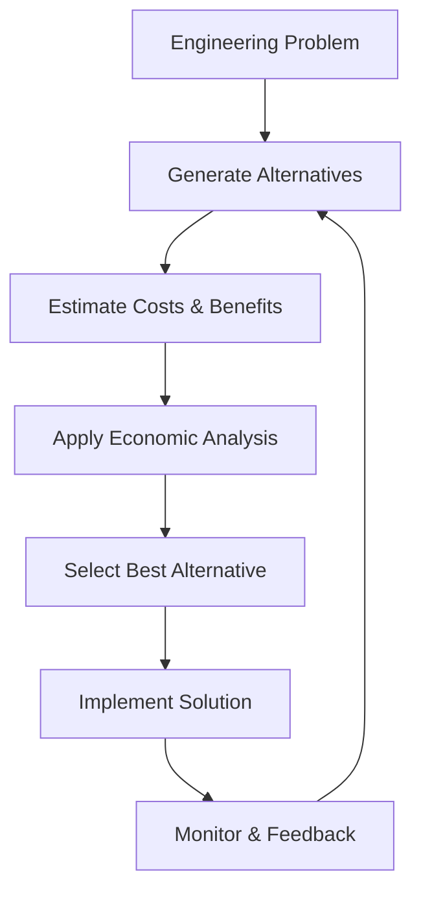

# 01_Relationship_between_Engineering_and_Economics

## 1. Definition

Engineering economics is the discipline that combines engineering knowledge with economic analysis. It helps engineers make decisions by comparing the costs and benefits of different technical solutions. In simple words, it answers the question: “Is this engineering project worth doing from a financial point of view?”

## 2. Concept Explanation

Engineering focuses on designing, building, and improving products, structures, and systems. Economics focuses on the efficient use of limited resources like money, time, and materials. The relationship between the two arises because every engineering decision has an economic impact.

An engineer may create a bridge that is extremely strong, but if it costs ten times more than an equally safe alternative, resources are wasted. Economics provides tools to evaluate whether a design is not only technically sound but also financially viable. It brings balance – making sure that safety, performance, and quality are achieved without unnecessary expenditure.

This connection is important because real-world projects have budgets. Without economic thinking, even the most brilliant engineering idea can fail due to high cost, low return, or poor resource planning. Therefore, engineering and economics work together to create solutions that are both functional and affordable.

## 3. Key Characteristics / Features

- **Interdisciplinary nature:** It blends principles of engineering design with financial analysis methods.
- **Decision-making focus:** The main purpose is to help select the best alternative among many technical options.
- **Long-term perspective:** It considers costs and benefits over the entire life of a project, not just initial expenses.
- **Time value of money:** It recognizes that money today is worth more than the same amount in the future.
- **Measurement in monetary terms:** Most outcomes are converted into cash flows so different options can be compared fairly.
- **Feasibility check:** It helps determine whether a project is economically justified before large resources are committed.

## 4. Types / Classification

In the context of the engineering–economics relationship, engineering economic decisions can be classified into several types:

- **Cost minimization studies:** Choosing the least expensive way to achieve a required technical performance.
- **Revenue or benefit maximization studies:** Selecting the design that will generate the highest income or public benefit for a given budget.
- **Investment evaluation:** Deciding whether a new machine, factory, or infrastructure project is worth the capital invested.
- **Replacement analysis:** Determining when an old asset should be replaced by a new one, considering maintenance and operating costs.
- **Break-even analysis:** Finding the point where total cost equals total revenue, so no loss or profit occurs.

Each type uses economic tools to support a specific kind of engineering choice.

## 5. Working / Mechanism

A typical engineering economic decision follows a logical step-by-step process.

1.  **Identify the problem or opportunity:** Clearly define what needs to be improved, built, or solved.
2.  **Generate feasible alternatives:** List all technically possible designs, materials, or processes.
3.  **Estimate cash flows for each alternative:** Calculate initial costs, operating costs, maintenance costs, and expected revenues or savings.
4.  **Choose an economic evaluation method:** Select tools like Net Present Value (NPV), Internal Rate of Return (IRR), or payback period.
5.  **Apply the method and compare alternatives:** Perform calculations to see which option gives the best economic result.
6.  **Select the most economic alternative:** Pick the one that satisfies technical requirements at the lowest cost or highest net benefit.
7.  **Implement and monitor:** Execute the chosen solution and track actual costs and benefits to learn for future projects.

These steps show how engineering creativity is guided by economic discipline.

## 6. Diagram

## 7. Mathematical Formulation

A basic way to express the relationship is the **value equation**:

$$
\text{Value} = \text{Benefits} - \text{Costs}
$$

Where:
- **Benefits** = All positive outcomes of the engineering solution expressed in monetary terms (revenue, savings, increased safety value).
- **Costs** = All expenses needed to create and run the solution (materials, labor, maintenance).

A project is justified only when **Value > 0**, meaning benefits exceed costs. More advanced formulas, like Net Present Value, also include the time value of money, but this simple equation captures the core idea.

## 8. Example

Imagine a city needs a new bridge. Engineers propose two designs:
- **Design A:** A regular reinforced concrete bridge costing ₹50 crore with an expected life of 50 years and low maintenance.
- **Design B:** A high-tech steel bridge costing ₹90 crore with the same life and load capacity, but with slightly lower maintenance.

The technical performance is equal, but the economic analysis shows Design B’s extra cost is not recovered through maintenance savings. Therefore, the city engineers, applying engineering economics, select Design A. Here, engineering provided options, and economics directed the final choice to save public money without compromising safety.

## 9. Analogy

Think of buying a smartphone. The **engineering** part is the processor speed, camera quality, battery life, and screen. The **economics** part is the price and whether those features are worth the cost for your daily needs. You may love the best camera phone, but if it costs twice your budget and you rarely take photos, the economic sense tells you to choose a cheaper, equally reliable model. Similarly, an engineer cannot simply chase the best possible technology; they must ask if the extra performance is worth the extra money.

## 10. Comparison

| Feature | Engineering Perspective | Economics Perspective |
|--------|----------|----------|
| **Primary Goal** | Achieve best technical performance and reliability | Maximize value or minimize cost for a given performance |
| **Key Question** | “Can we build it?” | “Should we build it, and at what cost?” |
| **Measurement** | Strength, speed, efficiency, material quality | Money (capital, operating cost, profit, savings) |
| **Time View** | Often focused on design and construction phase | Considers entire life cycle (from planning to disposal) |
| **Decision Basis** | Physical laws and standards | Cash flow analysis and return on investment |

## 11. Advantages

- **Optimal resource use:** It ensures materials, labor, and money are not wasted on unnecessarily expensive designs.
- **Better project justification:** A project backed by sound economics is easier to get approved and funded.
- **Risk reduction:** Economic analysis reveals financially weak projects before large sums are spent.
- **Improved design choices:** Engineers can compare multiple ideas and pick the one that gives the most value.
- **Long-term thinking:** It encourages looking at maintenance and operating costs, not just the initial price.

## 12. Disadvantages / Limitations

- **Overemphasis on cost can hurt quality:** Strict cost-cutting may lead to choosing weak materials or skipping safety features.
- **Difficulty in quantifying everything:** Some benefits like aesthetics, brand reputation, or environmental beauty are hard to put a price on.
- **Assumption sensitivity:** Small errors in estimating future costs or revenues can completely change the decision.
- **Time and effort:** Proper economic analysis takes time and skilled personnel, which itself costs money.
- **Not a substitute for engineering judgment:** Numbers alone cannot decide if a design is technically sound; they only support the decision.

## 13. Important Points / Exam Notes

- Engineering economics is the bridge between technical feasibility and financial viability.
- Every engineering decision involves a trade-off between performance and cost.
- The time value of money is a core concept: a rupee today is worth more than a rupee tomorrow.
- Economic analysis is done before committing major resources; it is a planning tool, not just accounting.
- The most technically advanced solution is not always the most economic one.
- Life cycle costing looks at purchase, operation, maintenance, and disposal costs together.
- Sunk costs (money already spent and cannot be recovered) should be ignored in future decisions.
- Engineering economics uses structured methods like NPV, IRR, and benefit-cost ratio.
- Good decisions require accurate data; garbage in, garbage out applies here.
- It is used in both profit-making firms and public sector projects (e.g., roads, dams).

## 14. Applications / Use Cases

- **Construction projects:** Selecting materials and designs that meet safety codes at lowest life cycle cost.
- **Manufacturing:** Deciding whether to buy a new machine or repair an old one based on long-term savings.
- **Energy sector:** Comparing the cost per kilowatt-hour of a solar plant versus a coal plant over 25 years.
- **Software development:** Estimating whether building a feature will bring enough additional revenue to cover developer time.
- **Transportation:** Planning metro rail routes by comparing construction cost with expected ticket revenue and reduced traffic congestion value.
- **Product design:** Setting specifications (like phone battery capacity) so that cost increase does not exceed what customers are willing to pay.

## 15. MCQs

**Q1. What is the main purpose of engineering economics?**

A. To design stronger structures  
B. To apply economic principles to engineering decisions  
C. To calculate material strength only  
D. To replace engineers with accountants  

**Answer:** B  
**Explanation:** Engineering economics combines technical and financial thinking to guide better project choices.

---

**Q2. Which of the following best describes the relationship between engineering and economics?**

A. They are completely independent fields  
B. Economics stops engineering creativity  
C. Engineering creates options; economics helps select the most valuable one  
D. Economics is needed only after construction is finished  

**Answer:** C  
**Explanation:** Engineers propose technical solutions, and economic analysis helps pick the one with the highest net value.

---

**Q3. The time value of money concept implies that**

A. Money loses value only during inflation  
B. A rupee today is worth more than a rupee in the future  
C. Future money is always more valuable  
D. Time does not affect the worth of money  

**Answer:** B  
**Explanation:** Money can earn interest, so having it sooner gives it greater potential value.

---

**Q4. An engineer must choose between two pumps that perform identically. One costs ₹1,00,000 and the other costs ₹1,20,000. According to engineering economics, which should be selected if all other factors are equal?**

A. The more expensive pump for better quality  
B. The cheaper pump to minimize cost  
C. Both pumps, as a backup  
D. Neither pump, wait for a new model  

**Answer:** B  
**Explanation:** When technical performance is the same, the economic choice is the one with the lower cost.

---

**Q5. Which term refers to considering all costs from initial purchase to disposal when making an engineering decision?**

A. First cost analysis  
B. Life cycle costing  
C. Sunk cost method  
D. Payback period only  

**Answer:** B  
**Explanation:** Life cycle costing includes purchase, operation, maintenance, and disposal costs over the asset’s life.

---

**Q6. A company spent ₹5 lakh on research for a project that is later found unprofitable. The ₹5 lakh is an example of**

A. Opportunity cost  
B. Sunk cost  
C. Variable cost  
D. Future cost  

**Answer:** B  
**Explanation:** A sunk cost has already been spent and cannot be recovered; it should not affect future decisions.

---

**Q7. In the benefit-cost analysis of a public bridge, which of the following is a benefit?**

A. Cement and steel expenses  
B. Labour wages during construction  
C. Reduced travel time for commuters  
D. Interest paid on loans  

**Answer:** C  
**Explanation:** Benefits are positive outcomes, such as time saved by the public; construction expenses are costs.

---

**Q8. The simple equation Value = Benefits – Costs indicates that a project should be accepted only when**

A. Value equals zero  
B. Value is greater than zero  
C. Benefits are zero  
D. Costs are greater than benefits  

**Answer:** B  
**Explanation:** A positive value means benefits exceed costs, which is the minimum condition for economic justification.

---

**Q9. Which of the following is a limitation of engineering economics?**

A. It always guarantees profit  
B. It helps compare technical alternatives  
C. Some important benefits are difficult to measure in money terms  
D. It considers both initial and operating costs  

**Answer:** C  
**Explanation:** Non-monetary factors like aesthetic appeal or environmental impact are hard to quantify, which is a known limitation.

---

**Q10. In engineering economics, the step that comes right after generating alternative solutions is**

A. Implement the solution  
B. Estimate costs and benefits of each alternative  
C. Ignore less attractive options  
D. Select the final design immediately  

**Answer:** B  
**Explanation:** The logical sequence is: identify problem → generate alternatives → estimate cash flows → evaluate → select → implement.
