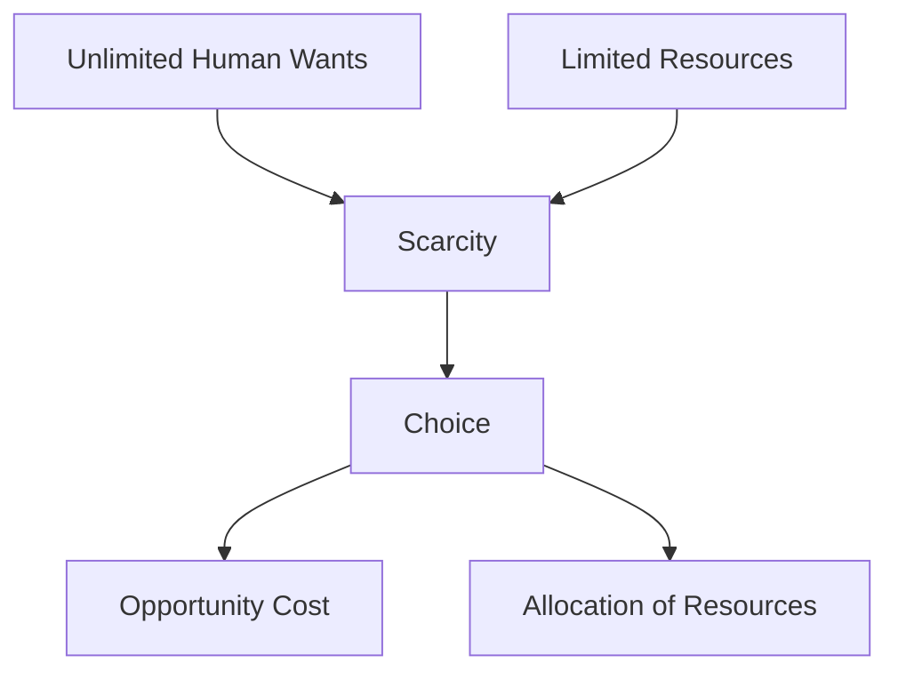

# Scarcity of Resources

## 1. Definition

Scarcity of resources means that the available resources are limited, while human wants are unlimited. This forces individuals, businesses, and governments to make choices about how to use resources efficiently.

## 2. Concept Explanation

The basic idea of scarcity is that we cannot have everything we want. Resources like land, labour, capital, and time are finite. However, our desires for goods and services are endless. This gap between limited resources and unlimited wants creates the economic problem.

Scarcity works as a universal condition. Every society, whether rich or poor, faces it. Because resources are scarce, we must decide what to produce, how to produce, and for whom to produce. These decisions involve trade-offs and opportunity costs. Understanding scarcity is important because it is the foundation of economics. It explains why prices exist, why we budget, and why efficient use of resources is essential for survival and growth.

## 3. Key Characteristics / Features

- **Universality:** Scarcity exists in all economies, regardless of their level of development or wealth.
- **Relative Concept:** A resource is scarce only in relation to its demand. If demand is low, the same resource may not feel scarce.
- **Forces Choice:** Because we cannot satisfy all wants, scarcity compels individuals and societies to prioritise and make choices.
- **Leads to Opportunity Cost:** Choosing one option means giving up the next best alternative, which is the real cost of any decision.
- **Basis of Economic Activities:** Production, consumption, and distribution all arise from the need to manage scarce resources.

## 4. Types / Classification

Scarcity can be classified into two broad types:

- **Absolute Scarcity:** This occurs when the physical quantity of a resource is fixed and insufficient to meet basic needs. For example, a severe drought causes an absolute shortage of water in a region.
- **Relative Scarcity:** This occurs when a resource is available but demand for it exceeds supply at a given price. For instance, skilled software developers are relatively scarce because many companies want to hire them, driving up salaries.

## 5. Working / Mechanism

The mechanism of scarcity operates through the interplay of demand and supply:

1.  Limited resources are available to produce goods and services.
2.  Consumers, firms, and governments express unlimited wants and needs.
3.  Because resources are insufficient, not all wants can be satisfied simultaneously.
4.  Decision-makers must rank their wants and allocate resources to the most urgent ones.
5.  Choosing one use of a resource means sacrificing another, creating an opportunity cost.
6.  Prices emerge as a signal of relative scarcity, guiding resources to their most valued uses.

## 6. Diagram

## 7. Mathematical Formulation

Scarcity is not expressed as a single formula, but the concept is embedded in the basic budget constraint of a consumer:

$$
P_x \cdot X + P_y \cdot Y \leq I
$$

Where:
- $P_x$ = Price of good X
- $P_y$ = Price of good Y
- $X$ = Quantity of good X
- $Y$ = Quantity of good Y
- $I$ = Limited income of the consumer

The inequality shows that due to limited income (a scarce resource), a consumer cannot buy unlimited quantities of goods and must choose a combination within their means.

## 8. Example

A student has only 3 hours of free time in the evening. The student wants to study for an exam, watch a movie, and play a video game. Since time is a scarce resource, it is impossible to do all three activities fully. The student must choose, perhaps studying for 2 hours and watching the movie for 1 hour, giving up the video game entirely.

## 9. Analogy

Imagine a pizza with only 8 slices, but 10 hungry friends. The pizza is the scarce resource, and the friends’ appetites are unlimited wants. No matter how you distribute the slices, some wants will remain unsatisfied. You must decide who gets a slice and who does not, highlighting the need for choice and fair allocation.

## 10. Comparison

| Feature | Scarcity | Shortage |
|--------|----------|----------|
| Meaning | A permanent condition where resources are always limited relative to wants. | A temporary situation where quantity demanded exceeds quantity supplied at the current price. |
| Duration | Long-term and universal. | Short-term and can be resolved. |
| Cause | Finite resources and infinite wants. | Usually caused by price controls, supply disruptions, or sudden demand spikes. |
| Solution | Cannot be eliminated; only managed. | Can be eliminated by allowing prices to rise or by increasing supply. |

## 11. Advantages

- Encourages efficient use and conservation of resources.
- Drives innovation and the development of substitutes.
- Promotes careful budgeting and financial planning at all levels.
- Helps in the formation of prices, which direct resource allocation.
- Motivates individuals and nations to improve productivity.

## 12. Disadvantages / Limitations

- Forces difficult choices and trade-offs, leading to opportunity costs.
- Can cause economic inequality if scarce resources are concentrated in a few hands.
- May lead to conflict over resource control and distribution.
- Creates stress and dissatisfaction when many wants remain unfulfilled.
- In developing economies, scarcity of capital can slow down growth.

## 13. Important Points / Exam Notes

- Scarcity is the fundamental economic problem that gives rise to the study of economics.
- It is not the same as poverty; even wealthy individuals face scarcity of time.
- All resources are scarce, including natural resources, labour, capital, and entrepreneurship.
- Scarcity forces society to answer three basic questions: What to produce? How to produce? For whom to produce?
- Without scarcity, there would be no need for markets, prices, or economics.

## 14. Applications / Use Cases

- Governments allocate limited tax revenue across defence, healthcare, and education, reflecting scarcity of public funds.
- A manufacturing firm decides between investing in new machinery or expanding the factory floor using scarce capital.
- An individual creates a monthly household budget to manage the scarcity of personal income.
- Environmental policies on carbon emissions target the scarcity of clean air and a stable climate.

## 15. MCQs

**Q1. What is the basic reason for the existence of scarcity?**

A. Unlimited resources and limited wants  
B. Limited resources and unlimited wants  
C. High prices of goods  
D. Government regulations  
**Answer:** B  
**Explanation:** Scarcity arises because resources are finite while human desires are infinite.

**Q2. Scarcity is a problem faced by:**

A. Only poor people  
B. Only developing countries  
C. All individuals and societies  
D. Only capitalist economies  
**Answer:** C  
**Explanation:** Scarcity is universal and affects everyone, irrespective of wealth or economic system.

**Q3. When a resource is available but demand exceeds supply at a given price, it is called:**

A. Absolute scarcity  
B. Relative scarcity  
C. Permanent shortage  
D. Surplus  
**Answer:** B  
**Explanation:** Relative scarcity refers to a situation where a resource exists but is insufficient to meet all demand at the current price.

**Q4. The value of the next best alternative that is given up is known as:**

A. Scarcity cost  
B. Total cost  
C. Opportunity cost  
D. Sunk cost  
**Answer:** C  
**Explanation:** Opportunity cost is the sacrifice of the best alternative foregone due to scarcity of resources.

**Q5. Which of the following is an example of a scarce resource for a student?**

A. Air to breathe  
B. Sunlight  
C. Time to study and play  
D. Sea water at the beach  
**Answer:** C  
**Explanation:** Time is limited for a student, making it a scarce resource when allocating hours between activities.

**Q6. Scarcity forces an economy to:**

A. Produce everything its citizens want  
B. Make choices about resource allocation  
C. Eliminate all human wants  
D. Fix prices of all goods  
**Answer:** B  
**Explanation:** Because resources are insufficient, an economy must decide how to allocate them among competing uses.

**Q7. Which of the following is NOT a direct consequence of scarcity?**

A. Making a choice  
B. Paying an opportunity cost  
C. Unlimited consumption  
D. Priority setting  
**Answer:** C  
**Explanation:** Unlimited consumption is impossible under scarcity; choices and limits are the direct outcomes.

**Q8. A temporary situation where quantity demanded exceeds quantity supplied at the current price is a:**

A. Scarcity  
B. Shortage  
C. Surplus  
D. Dream  
**Answer:** B  
**Explanation:** A shortage is a short-term market condition, unlike the permanent and universal condition of scarcity.

**Q9. The three fundamental economic questions arise because of:**

A. Government intervention  
B. Trade deficits  
C. Scarcity of resources  
D. High interest rates  
**Answer:** C  
**Explanation:** Because resources are scarce, every society must determine what, how, and for whom to produce.

**Q10. In economics, scarcity means that:**

A. The poor have very little money  
B. Resources are insufficient to satisfy all wants  
C. Natural resources are depleting  
D. Food is not available  
**Answer:** B  
**Explanation:** The economic definition of scarcity focuses on the gap between finite resources and infinite wants, not just physical shortage.