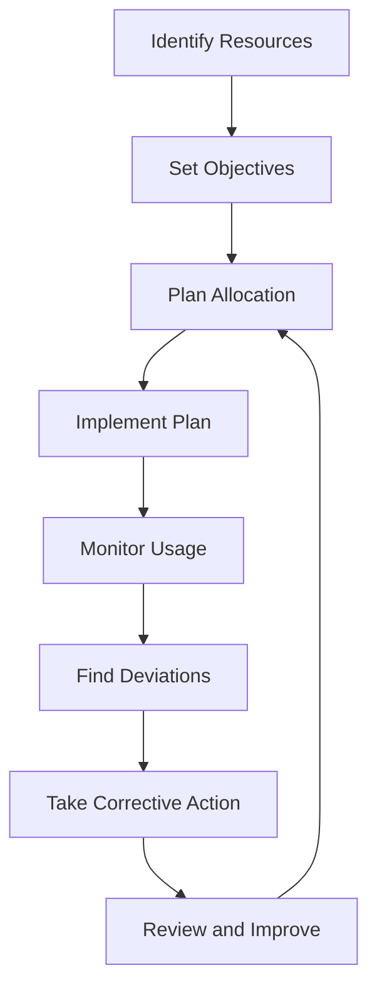

# Efficient Utilization of Resources

## Video Explanation

* [https://www.youtube.com/watch?v=8hKqvTz0Q1M](https://www.youtube.com/watch?v=8hKqvTz0Q1M)

## Visual Aids

## 1. Definition

Efficient utilization of resources means using available inputs like land, labour, capital, and materials in such a way that maximum possible output is achieved with minimum waste and cost.

---

## 2. Concept Explanation

The basic idea is to get the most value from limited resources. Every organization or economy has limited resources but many wants. Efficient utilization ensures that these scarce resources are not wasted. It means producing the right quantity of goods or services using the least amount of inputs.

How it works: First, we identify all available resources. Then we plan their use carefully, avoiding overuse or underuse. We monitor progress continuously and make adjustments. This reduces idle time, scrap, and rework.

Why it is important: Efficient use of resources lowers production costs, increases profits, and supports sustainable growth. It also helps in meeting deadlines without extra pressure on men, machines, or money. In engineering projects, it ensures timely completion within the budget.

---

## 3. Key Characteristics / Features

- **Minimum waste:** All inputs are used fully, leaving little or no waste of materials, time, or effort.
- **Optimum output:** The goal is to reach the highest possible output with the given inputs.
- **Cost reduction:** Efficient utilization leads to lower per-unit cost of production.
- **Time saving:** Processes are streamlined so that work is completed in the shortest possible time.
- **Quality maintenance:** Efficiency does not mean cutting corners. Quality standards are maintained or improved.
- **Continuous improvement:** Regular analysis helps find better ways to use resources over time.
- **Sustainability:** Wastage of natural resources is minimized, supporting long-term availability.

---

## 4. Types / Classification

Efficient utilization of resources can be classified into the following types:

- **Technical efficiency:** This focuses on producing maximum output from a given set of physical inputs. No material or machine time is wasted due to poor methods.
- **Allocative efficiency:** Resources are directed to produce the combination of goods and services most valued by society or the market. This ensures resources are not used for less important outputs.
- **Economic efficiency:** A broader concept where both technical and allocative efficiencies are achieved together. It means producing the right amount of goods at the lowest possible cost.

---

## 5. Working / Mechanism

Efficient utilization of resources follows a systematic process:

1. Identify all available resources, including manpower, machinery, materials, money, and time.
2. Set clear objectives regarding the quantity and quality of output needed.
3. Plan the allocation of each resource to different tasks based on priority and capacity.
4. Implement the plan with standard operating procedures to avoid misuse.
5. Monitor resource consumption regularly and compare actual usage with planned usage.
6. Identify deviations like overuse, idle time, or bottlenecks.
7. Take corrective actions such as reallocation, training, or process adjustment.
8. Review outcomes and document lessons to improve future resource planning.

---

## 6. Diagram

---

## 7. Mathematical Formulation

A simple measure of resource utilization efficiency is:

$$
\text{Efficiency} = \frac{\text{Actual Output}}{\text{Expected Output}} \times 100\%
$$

Where:  
- **Actual Output** = the real output produced using given resources  
- **Expected Output** = the standard or planned output from the same resources  

For material utilization:

$$
\text{Material Utilization Rate} = \frac{\text{Weight of Finished Product}}{\text{Weight of Input Materials}} \times 100\%
$$

These ratios help quantify how well resources are being used.

---

## 8. Example

Consider a small manufacturing unit that produces 1000 metal brackets per day using 500 kg of steel. After process improvement, it begins producing the same 1000 brackets with only 450 kg of steel. The material saved is 50 kg per day. This shows more efficient utilization of the steel resource without reducing production. The cost of production falls, and profit per unit increases.

---

## 9. Analogy

Imagine you have a tube of toothpaste. If you squeeze carefully from the bottom and roll the tube, you can use almost all the paste inside. If you squeeze from the middle carelessly, some paste gets stuck and wasted. Here, the tube is a resource, and careful squeezing represents efficient utilization. You get more brushing sessions from the same tube.

---

## 10. Comparison

| Feature | Efficient Utilization | Inefficient Utilization |
|--------|----------------------|--------------------------|
| Meaning | Maximum output from minimum input without waste | Output is less than possible; inputs are wasted |
| Cost | Low per-unit cost | High per-unit cost due to wastage |
| Time | Timely completion of tasks | Delays and idle time are common |
| Quality | Maintained standards | Quality may fall or require rework |
| Sustainability | Supports long-term resource availability | Depletes resources faster and harms sustainability |

---

## 11. Advantages

- Reduces overall production cost and improves profitability.
- Helps complete projects on time without last-minute rush.
- Minimizes wastage of materials, energy, and human effort.
- Enhances competitiveness of a firm in the market.
- Supports environmental sustainability by reducing resource extraction.
- Improves employee morale as processes become smoother and less stressful.

---

## 12. Disadvantages / Limitations

- Requires careful planning and monitoring, which can initially increase administrative work.
- Overemphasis on efficiency may lead to neglecting innovation or employee well-being.
- Accurate data on standard output and input is needed; poor data can mislead decisions.
- In some cases, being too lean can leave no buffer for unexpected breakdowns or urgent orders.

---

## 13. Important Points / Exam Notes

- Efficient utilization of resources means maximizing output while minimizing input and waste.
- It involves technical, allocative, and economic efficiency.
- A simple formula: Efficiency = (Actual Output / Expected Output) × 100%.
- Benefits include lower costs, timely delivery, and sustainable growth.
- Requires continuous monitoring and corrective action.
- Wastage of any resource—material, time, or talent—reduces efficiency.

---

## 14. Applications / Use Cases

- **Manufacturing industry:** Reducing scrap and optimizing machine runtime to produce more units with same raw material.
- **Construction projects:** Planning labour and machinery movement to avoid idle time on site.
- **Software development:** Allocating developer hours to high-priority features to meet deadlines without overtime.
- **Agriculture:** Using drip irrigation to deliver water directly to roots, reducing water waste.
- **Energy sector:** Operating power plants at optimal load to get maximum electricity per unit of fuel.

---

## 15. MCQs

**Q1. What is efficient utilization of resources?**  
A. Using maximum resources for minimum output  
B. Using minimum resources for maximum output  
C. Using resources without any plan  
D. Stockpiling resources for future  
**Answer:** B  
**Explanation:** Efficient utilization aims to achieve the highest possible output using the least amount of inputs, minimizing waste.

**Q2. Which of the following is a type of efficiency?**  
A. Predictive efficiency  
B. Technical efficiency  
C. Financial efficiency  
D. Market efficiency  
**Answer:** B  
**Explanation:** Technical efficiency means producing maximum physical output from a given set of inputs. It is a recognized type of efficiency.

**Q3. The formula for efficiency is:**  
A. (Input / Output) × 100  
B. (Output / Input) × 100  
C. (Input + Output) / 2  
D. Output - Input  
**Answer:** B  
**Explanation:** Efficiency is usually computed as (Actual Output / Expected Output or Input) × 100%.

**Q4. Which term describes directing resources to the most valued goods and services?**  
A. Technical efficiency  
B. Allocative efficiency  
C. Productive efficiency  
D. Dynamic efficiency  
**Answer:** B  
**Explanation:** Allocative efficiency is about using resources where they are most valued by society or consumers.

**Q5. What is the main benefit of efficient resource utilization?**  
A. Increased wastage  
B. Higher cost per unit  
C. Lower production cost  
D. Slower project completion  
**Answer:** C  
**Explanation:** When resources are used efficiently, waste decreases, so production cost per unit goes down.

**Q6. An analogy for efficient utilization is:**  
A. Leaving water tap running  
B. Squeezing toothpaste from the middle  
C. Carefully rolling a toothpaste tube to get all paste out  
D. Buying a new tube when old one is half full  
**Answer:** C  
**Explanation:** The toothpaste tube analogy illustrates getting maximum use from a resource by using it diligently.

**Q7. Which of these is a limitation of focusing only on efficiency?**  
A. Higher profits  
B. Less wastage  
C. May ignore innovation  
D. Faster production  
**Answer:** C  
**Explanation:** Overemphasis on efficiency can lead to ignoring new ideas or employee well-being for the sake of cost-cutting.

**Q8. In the working mechanism, what follows after “Monitor Usage”?**  
A. Set objectives  
B. Implement plan  
C. Find deviations  
D. Review and improve  
**Answer:** C  
**Explanation:** After monitoring actual resource use, the next step is to find deviations from the plan.

**Q9. Material Utilization Rate is calculated as:**  
A. Weight of input materials / Weight of finished product × 100  
B. Weight of finished product / Weight of input materials × 100  
C. Weight of waste / Weight of finished product × 100  
D. Weight of finished product × Weight of input materials  
**Answer:** B  
**Explanation:** Material Utilization Rate = (Weight of Finished Product / Weight of Input Materials) × 100%.

**Q10. Which sector benefits from efficient water use through drip irrigation?**  
A. Software  
B. Construction  
C. Agriculture  
D. Banking  
**Answer:** C  
**Explanation:** Drip irrigation is an agricultural technique that delivers water efficiently to plants, minimizing waste.