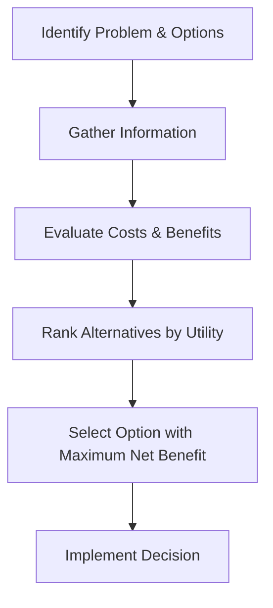

# Rational Choice Theory

## 1. Definition

Rational choice theory states that individuals always make decisions that provide them with the greatest benefit or satisfaction, given the available information and constraints. They logically weigh the costs and benefits of each option before choosing the one that maximises their personal advantage.

## 2. Concept Explanation

The basic idea is that people are rational actors. When faced with a choice, they first consider all possible alternatives. Next, they evaluate the expected outcomes of each alternative. They then compare the benefits and costs. Finally, they select the option that gives them the highest net benefit.

This theory assumes that individuals have clear preferences and can rank them consistently. It also assumes they have access to enough information to make an informed decision. Rational choice theory is important because it helps economists and managers predict human behaviour. It forms the basis of many economic models, such as demand analysis and market equilibrium. By assuming rationality, we can understand why consumers buy certain goods, why investors choose specific assets, and how societies allocate scarce resources.

## 3. Key Characteristics / Features

- **Goal-Oriented Behaviour:** Every decision is made to achieve a specific objective, such as maximum utility or profit.
- **Cost-Benefit Analysis:** A rational individual weighs the marginal cost against the marginal benefit of an action before deciding.
- **Consistent Preferences:** Choices are transitive, meaning if a person prefers A over B and B over C, then they must prefer A over C.
- **Perfect Information:** The decision-maker is assumed to have all relevant information, or at least acts optimally with the information available.
- **Self-Interest:** The theory presumes that individuals act primarily for their own benefit, maximising personal welfare.

## 4. Types / Classification

Rational choice theory does not have strict formal subtypes, but it is applied in different contexts:

- **Consumer Rationality:** A consumer chooses a combination of goods that maximises utility within a budget constraint.
- **Producer Rationality:** A firm selects inputs and output levels to maximise profit given production costs and market prices.
- **Political Rationality:** Voters, politicians, and bureaucrats make decisions that maximise their own political gains or personal benefits.

## 5. Working / Mechanism

1.  The decision-maker identifies a set of feasible alternatives or options.
2.  For each alternative, they gather and process all necessary information.
3.  They assign a utility or value to each potential outcome, ranking the alternatives.
4.  They calculate the expected costs and benefits associated with each choice.
5.  By comparing net benefits, they select the alternative with the highest utility or satisfaction.
6.  Finally, they act on this optimal choice and observe the result, which feeds back into future decision-making.

## 6. Diagram

## 7. Mathematical Formulation

A common representation of rational choice theory is the maximisation of utility subject to a budget constraint.

$$
\text{Maximise } U = f(x_1, x_2, \dots, x_n)
$$
$$
\text{Subject to } P_1x_1 + P_2x_2 + \dots + P_nx_n \leq M
$$

Where:
- $U$ = Total utility or satisfaction from consuming goods
- $x_i$ = Quantity of good $i$
- $P_i$ = Price of good $i$
- $M$ = Consumer's income (budget)

The rational consumer chooses quantities of goods to maximise $U$ without spending more than $M$.

## 8. Example

A student has ₹500 to spend on dinner. They can choose a pizza for ₹300, a burger for ₹200, or a full thali for ₹450. The student likes pizza the most, then thali, and finally the burger. Considering cost, they calculate that pizza gives the highest satisfaction per rupee spent. They rationally decide to buy the pizza and save ₹200 for another need, maximising overall utility.

## 9. Analogy

Imagine you are at an ice cream parlour with only ₹100. You see three flavours: chocolate (₹80), vanilla (₹60), and strawberry (₹40). You love chocolate the most. A rational choice is to buy chocolate because it gives you the highest satisfaction for your money, even though the others are cheaper. You balance your desire and budget just like a businessman balances profit and cost.

## 10. Comparison

| Feature | Rational Choice Theory | Behavioural Economics |
|--------|----------|----------|
| Core Assumption | Humans are fully rational and self-interested | Humans are boundedly rational and influenced by biases |
| Decision Process | Logical cost-benefit analysis | Often emotional, intuitive, or rule-of-thumb based |
| Information | Assumes perfect or adequate information | Accepts that information is often incomplete and processed imperfectly |
| Goal | Maximise utility or profit | Satisfice (choose an acceptable outcome, not necessarily the maximum) |

## 11. Advantages

- Provides a clear and structured framework for analysing human decisions.
- Models can be easily applied to a wide range of problems, from economics to politics.
- Enables predictions about market behaviour and consumer demand.
- Simplifies complex human behaviour into manageable variables.
- Helps in designing policies that align with people's self-interest.

## 12. Disadvantages / Limitations

- Ignores emotional, ethical, and altruistic motives behind many real-life choices.
- Assumes people have complete information and unlimited cognitive ability, which is unrealistic.
- Cannot explain impulsive, habitual, or inconsistent behaviour.
- Overlooks social and cultural influences on decision-making.
- Fails to account for situations where individuals deliberately do not maximise personal gain, such as charity.

## 13. Important Points / Exam Notes

- Rational choice theory is the foundation of microeconomic demand theory and consumer behaviour.
- A rational individual always seeks to maximise utility or profit.
- The theory works under the assumptions of consistent preferences and well-defined constraints.
- In reality, rational decisions are bounded by limited information and cognitive limitations.
- The concept of "rationality" does not mean the choice is morally right, only that it is logically consistent with the decision-maker's goals.

## 14. Applications / Use Cases

- **Consumer Buying Decisions:** Marketers use the theory to predict how price changes affect demand for products.
- **Investment Analysis:** Investors evaluate risk and return to build a portfolio that maximises expected profit.
- **Public Policy:** Governments assume citizens will respond rationally to tax incentives or penalties.
- **Game Theory:** Strategic interactions in business and politics are modelled assuming rational players.
- **Criminology:** Some theories of crime suggest that criminals rationally weigh the benefits and risks before committing an act.

## 15. MCQs

**Q1. What is the central assumption of rational choice theory?**

A. People behave randomly  
B. People maximise social welfare  
C. People are altruistic  
D. People act to maximise their own utility  
**Answer:** D  
**Explanation:** The theory assumes that individuals make decisions to maximise their personal satisfaction or benefit.

**Q2. In rational choice theory, what do consumers compare before making a decision?**

A. Income and savings  
B. Costs and benefits  
C. Supply and demand  
D. Production and distribution  
**Answer:** B  
**Explanation:** A rational consumer performs a cost-benefit analysis to choose the option with the greatest net advantage.

**Q3. The term 'utility' in rational choice theory refers to:**

A. A public service like electricity  
B. The cost of a product  
C. Satisfaction or pleasure from consuming a good  
D. The price of a good  
**Answer:** C  
**Explanation:** Utility is the measure of satisfaction or happiness that a consumer derives from a choice.

**Q4. Which of the following is an assumption of rational choice theory?**

A. Incomplete information  
B. Consistent preferences  
C. Emotional bias  
D. Altruistic motives  
**Answer:** B  
**Explanation:** Consistent preferences mean if a person prefers A over B, and B over C, they will also prefer A over C.

**Q5. A firm that chooses the level of output where marginal cost equals marginal revenue is acting according to which theory?**

A. Game theory  
B. Chaos theory  
C. Rational choice theory  
D. Behavioural economics  
**Answer:** C  
**Explanation:** This profit-maximising behaviour is a direct application of rational choice principles for producers.

**Q6. What is a major criticism of rational choice theory?**

A. It is too easy to understand  
B. It assumes humans always have perfect information  
C. It does not use mathematical models  
D. It focuses only on social groups  
**Answer:** B  
**Explanation:** Critics argue that real people often have limited information and cannot process all possible outcomes perfectly.

**Q7. In the rational choice mechanism, the last step after selecting the optimal alternative is:**

A. Gathering information  
B. Ranking preferences  
C. Implementing the decision  
D. Identifying the problem  
**Answer:** C  
**Explanation:** The process ends with carrying out the chosen option; evaluation of the result may then inform future decisions.

**Q8. A student decides to attend a free workshop instead of watching a movie. According to rational choice theory, the student likely believes that:**

A. The workshop has a higher opportunity cost  
B. The movie is more entertaining  
C. The workshop gives greater net benefit  
D. Decisions are random  
**Answer:** C  
**Explanation:** A rational actor compares the satisfaction from both activities and picks the one with the highest perceived advantage.

**Q9. Which concept is most closely related to rational choice theory when choices are made under budget constraints?**

A. Economies of scale  
B. Utility maximisation  
C. Law of diminishing returns  
D. Division of labour  
**Answer:** B  
**Explanation:** Rational consumers allocate limited income to maximise total utility, which is the essence of utility maximisation.

**Q10. Rational choice theory is least useful for explaining decisions that are:**

A. Well-informed and calculated  
B. Profit-seeking  
C. Impulsive and emotional  
D. Strategic and long-term  
**Answer:** C  
**Explanation:** Impulsive actions often bypass careful cost-benefit analysis and are better explained by behavioural economics.