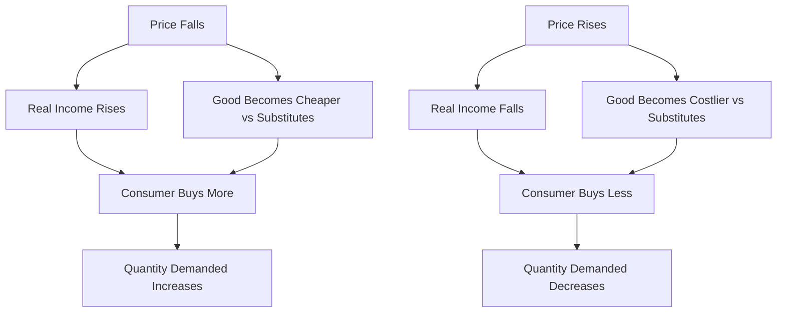

# Law of Demand

## 1. Definition

The law of demand states that, other things remaining constant, there is an inverse relationship between the price of a good and the quantity demanded of that good. When the price rises, the quantity demanded falls; when the price falls, the quantity demanded rises.

---

## 2. Concept Explanation

The basic idea of the law of demand is very simple: consumers tend to buy more of a product when its price is low and less when its price is high. This happens because people have limited income. When the price of a good drops, it becomes cheaper relative to other goods, so people can afford to buy more of it. Conversely, a price rise makes the good costlier, so people cut back on its consumption.

How it works: Suppose a consumer regularly buys rice. If the price of rice falls, the consumer may buy extra rice for stock or consume more. If the price rises sharply, the consumer may reduce consumption or switch partly to a cheaper substitute like wheat. This behavioral response by all consumers gives a downward-sloping demand curve.

Why it is important: The law of demand is the foundation of market analysis. It helps producers decide the price at which to sell their goods, assists governments in tax and subsidy policies, and explains many daily economic choices. For engineers and project managers, understanding demand helps in forecasting sales and planning production.

---

## 3. Key Characteristics / Features

- **Inverse relationship:** Price and quantity demanded move in opposite directions assuming other factors are unchanged.
- **Ceteris paribus assumption:** The law holds true only when factors like income, tastes, and prices of related goods remain constant.
- **Qualitative relationship:** It indicates the direction of change in quantity demanded, not the exact magnitude.
- **Individual and market level:** The law applies to a single consumer’s demand as well as to the total market demand.
- **Slopes downward:** The demand curve based on this law always slopes downwards from left to right.
- **Based on substitution and income effects:** A price change alters purchasing power (income effect) and makes the good cheaper or costlier relative to substitutes (substitution effect).

---

## 4. Types / Classification

The law of demand itself is a general principle, but we can understand its operation under two main analytical cases:

- **Individual demand:** The inverse price–quantity relationship for a single consumer. For example, one person buying milk.
- **Market demand:** The sum of all individual demands in the market. The market demand curve also slopes downward, reflecting the law of demand at an aggregate level.

---

## 5. Working / Mechanism

1. Start with an initial price at which a consumer buys a certain quantity of a good.
2. Assume the price of the good falls while all other factors (income, tastes, prices of other goods) remain unchanged.
3. The consumer’s real income increases because the same money income now buys more goods (income effect).
4. The good becomes cheaper compared to its substitutes, causing the consumer to replace costlier items with this good (substitution effect).
5. Both effects encourage the consumer to purchase a larger quantity of the good.
6. If the price rises instead, the real income falls and consumers move toward cheaper substitutes, reducing quantity demanded.
7. Summing the behavior of all consumers gives the market demand, which shows the same inverse relationship.

---

## 6. Diagram

---

## 7. Mathematical Formulation

A simple linear demand function representing the law of demand is:

$$
Q_d = a - bP
$$

Where:  
- \( Q_d \) = Quantity demanded  
- \( P \) = Price of the good  
- \( a \) = Intercept (quantity demanded when price is zero)  
- \( b \) = Slope coefficient (rate at which demand falls with a unit rise in price)  

The negative sign before \( b \) shows the inverse relationship. For example, \( Q_d = 100 - 5P \) means a ₹1 increase in price reduces quantity demanded by 5 units.

---

## 8. Example

Imagine a canteen selling samosas. At a price of ₹10 per samosa, students buy 200 samosas daily. The canteen raises the price to ₹15. Because the price is now higher, many students switch to other snacks or buy fewer samosas. The daily demand drops to 120 samosas. This real-world behaviour clearly shows the law of demand: an increase in price leads to a decrease in quantity demanded.

---

## 9. Analogy

Think of a balance scale. On one side is the price, on the other side is the quantity demanded. When the price side goes up, the demand side goes down to keep the scale balanced. Similarly, if you put a heavier price tag on an item, the consumer’s willing-to-buy ‘weight’ becomes lighter.

---

## 10. Comparison

| Feature | Law of Demand (Normal Goods) | Exception (Giffen/Veblen Goods) |
|--------|-----------------------------|----------------------------------|
| Price–demand relationship | Inverse (price up, demand down) | Direct (price up, demand up) |
| Cause | Income and substitution effects work normally | Income effect outweighs substitution effect (Giffen) or conspicuous consumption (Veblen) |
| Example | Demand for vegetables falls when prices rise | Staple food like coarse grain in extreme poverty may see rising demand with price rise |
| Demand curve slope | Downward | Upward (in theory) |

---

## 11. Advantages

- Helps firms set optimum pricing to maximize sales revenue.
- Assists government in predicting the effect of taxation and subsidies.
- Provides the basis for demand forecasting in project planning.
- Simplifies consumer behaviour analysis.
- Aids in production scheduling by linking price levels to likely order quantities.

---

## 12. Disadvantages / Limitations

- The law applies only when the ‘ceteris paribus’ assumption holds; in reality, income and tastes change often.
- It does not explain exceptional goods like Giffen goods, Veblen goods, or speculative goods (like stocks).
- The law is qualitative; it cannot predict exact percentage change without data on elasticity.
- Brand loyalty and advertising can sometimes override the pure price effect.

---

## 13. Important Points / Exam Notes

- Law of demand: Inverse relation between price and quantity demanded, all else constant.
- The demand curve is negatively sloped from left to right.
- Reason: Income effect and substitution effect.
- Assumptions: Constant income, tastes, and no change in prices of related goods, no expectation of future price change.
- Exceptions: Giffen goods, Veblen (prestige) goods, speculative demand, necessity of life.
- Simple demand function: Qd = a – bP.

---

## 14. Applications / Use Cases

- **Pricing strategy:** Companies lower prices during festive sales to boost demand and clear inventory.
- **Government policy:** Tax on cigarettes raises price to reduce consumption, using the law of demand.
- **Project feasibility:** Engineers estimate demand for a new bridge by analysing how toll price affects traffic volume.
- **Agriculture:** Minimum support price (MSP) decisions consider how price changes will affect farmer income and consumer demand.
- **Transport sector:** Lower off-peak fares attract more passengers, demonstrating the inverse price–demand link.

---

## 15. MCQs

**Q1. The law of demand states that, other things being equal, quantity demanded of a good:**  
A. Rises when price rises  
B. Falls when price falls  
C. Rises when price falls  
D. Remains constant regardless of price  
**Answer:** C  
**Explanation:** The law states an inverse relationship: when price falls, quantity demanded rises.

**Q2. Which of the following is assumed constant under the law of demand?**  
A. Price of the good  
B. Quantity supplied  
C. Income of the consumer  
D. Demand for substitutes  
**Answer:** C  
**Explanation:** The ‘ceteris paribus’ assumption includes constant income, tastes, and prices of related goods.

**Q3. If the demand function is Qd = 200 – 10P, what happens to quantity demanded when price increases by ₹1?**  
A. Increases by 10 units  
B. Decreases by 10 units  
C. Increases by 200 units  
D. Decreases by 200 units  
**Answer:** B  
**Explanation:** The slope coefficient -10 means each ₹1 rise in price reduces quantity demanded by 10 units.

**Q4. A downward-sloping demand curve represents which law?**  
A. Law of supply  
B. Law of diminishing returns  
C. Law of demand  
D. Law of increasing costs  
**Answer:** C  
**Explanation:** The law of demand gives an inverse price–quantity relationship, shown by a downward-sloping curve.

**Q5. Which effect explains that a lower price increases consumers’ purchasing power?**  
A. Substitution effect  
B. Income effect  
C. Speculative effect  
D. Demonstration effect  
**Answer:** B  
**Explanation:** The income effect means a fall in price allows consumers to buy more goods with the same money income.

**Q6. A Giffen good is an exception to the law of demand because:**  
A. It is a luxury good  
B. Its demand rises when its price falls  
C. Its demand rises when its price rises  
D. It has many substitutes  
**Answer:** C  
**Explanation:** Giffen goods show a positive price–demand relationship, defying the law of demand.

**Q7. The market demand curve is derived by:**  
A. Multiplying individual demands by price  
B. Summing individual quantities demanded at each price  
C. Taking the average of individual incomes  
D. Subtracting individual supplies from market supply  
**Answer:** B  
**Explanation:** Market demand is the horizontal sum of all individual quantities demanded at each price level.

**Q8. If the price of petrol rises and consumers buy fewer cars, this reflects:**  
A. Law of supply  
B. Law of demand for cars  
C. Exception to law of demand  
D. Income effect only  
**Answer:** B  
**Explanation:** A rise in a complementary good’s price (petrol) reduces demand for cars, consistent with downward-sloping demand.

**Q9. Which of these is NOT an assumption of the law of demand?**  
A. No change in consumer income  
B. No change in population  
C. No change in technology of production  
D. Constant tastes and preferences  
**Answer:** C  
**Explanation:** Technology of production relates to supply, not demand assumptions. Demand assumptions include constant income and tastes.

**Q10. A good that people buy more of when its price rises to show status is called:**  
A. Giffen good  
B. Inferior good  
C. Veblen good  
D. Normal good  
**Answer:** C  
**Explanation:** Veblen goods are prestigious items; higher price increases their desirability, making them an exception to the law of demand.