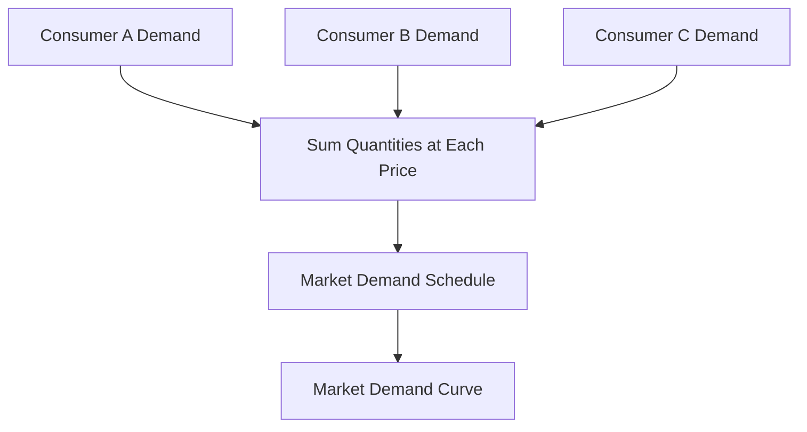

# 02 Types of demand Individual demand Market demand

## 1. Definition

**Demand** is the quantity of a commodity that a consumer is willing and able to buy at a given price during a specific period of time.

**Individual demand** refers to the quantity of a good or service that a single consumer is ready to purchase at various prices.

**Market demand** is the total quantity of a good or service that all consumers in the market are willing and able to buy at various prices over a given time. It is the horizontal sum of all individual demands.

## 2. Concept Explanation

Every consumer behaves differently based on their income, taste, and needs. Individual demand captures the buying behaviour of one person or household. For example, how many litres of milk a single family buys at different prices.

Market demand, on the other hand, represents the whole picture. It shows how much of a product the entire group of consumers wants to buy. To find market demand, we add up the quantities demanded by all individual consumers at each possible price.

This distinction is very important. A producer cannot set production targets based on one person’s demand. The business must know the size of the total market to plan output, pricing, and inventory. Without understanding market demand, firms risk overproduction or shortages. Thus, moving from individual to market demand is a fundamental step in demand analysis.

## 3. Key Characteristics / Features

- **Individual demand reflects personal choice:** It is shaped by a single consumer’s income, preferences, and the price of the good.
- **Individual demand is limited in scope:** It cannot directly guide large-scale production decisions.
- **Market demand is an aggregate concept:** It is the sum total of all individual demands in the market for a particular product.
- **Market demand depends on the number of consumers:** If the population or number of buyers increases, market demand rises even if individual demand remains unchanged.
- **Market demand curve is generally flatter:** Because individual differences even out, the market demand curve tends to be more elastic than many individual demand curves.
- **Both are price-sensitive:** In both cases, a higher price usually reduces quantity demanded, other factors remaining constant.

## 4. Types / Classification

Demand can be classified into two broad types under this topic.

- **Individual demand:** This is the demand of one single consumer for a given commodity. It is represented by an individual demand schedule and curve. For example, Ram’s demand for notebooks at different prices is individual demand.
- **Market demand:** This is the sum of the individual demands of all consumers in the market. It is obtained by adding the quantity demanded by each consumer at each price level. The market demand schedule and curve show the total quantity that will be bought at different prices. For example, the total notebook demand of all students in a class or city represents market demand.

## 5. Working / Mechanism

The process of deriving market demand from individual demand works in a clear step-by-step way.

1.  **Identify all consumers in the market:** List the individual buyers of the product.
2.  **Obtain individual demand schedules:** For each consumer, record the quantity they would buy at alternative prices.
3.  **Fix a price level:** Start with one specific price, for example, ₹20.
4.  **Add individual quantities at that price:** Sum the quantities demanded by all consumers at ₹20. This sum is the market demand at that price.
5.  **Repeat for all price levels:** Do the same horizontal addition for every price in the schedule.
6.  **Construct the market demand schedule and curve:** Plot the price against the total quantity demanded. This curve shows the market demand.

Whenever any individual demand changes, the market demand curve shifts accordingly.

## 6. Diagram

## 7. Mathematical Formulation

Market demand is the horizontal summation of individual demand functions.

$$
Q_m = q_1 + q_2 + q_3 + \dots + q_n
$$

Where:
- \( Q_m \) = Market demand quantity at a given price
- \( q_1, q_2, \dots, q_n \) = Quantities demanded by individual consumers 1 to n at that same price

For example, at price P = ₹10, if consumer 1 demands 5 units, consumer 2 demands 3 units, and consumer 3 demands 2 units, then market demand \( Q_m = 5 + 3 + 2 = 10 \) units.

## 8. Example

Consider the market for lunch packets in an office canteen. At a price of ₹50, Employee A demands 1 packet, Employee B demands 2 packets, and Employee C demands 1 packet. The individual demands are 1, 2, and 1. The market demand at ₹50 is the total sum: 1 + 2 + 1 = 4 lunch packets. If the price falls to ₹40, A demands 2, B demands 3, and C demands 2, making market demand equal to 7 packets. This aggregation helps the canteen manager decide how many packets to prepare each day.

## 9. Analogy

Imagine a classroom election where each student votes for their favourite colour. One student votes for blue, another for blue, another for red. The individual choices are like individual demand. The total number of votes for blue is the market demand for blue colour. Just as the final result depends on adding every student’s vote, the market demand depends on adding every consumer’s purchase quantity.

## 10. Comparison

| Feature | Individual Demand | Market Demand |
|--------|----------|----------|
| **Meaning** | Demand by a single consumer or household | Sum of quantities demanded by all consumers in the market |
| **Representation** | Shown by an individual demand schedule | Shown by a market demand schedule obtained by horizontal summation |
| **Dependence** | Depends on own income, taste, and price of the good | Depends on all factors affecting individual demand plus number of consumers |
| **Scale** | Very small, cannot be used for mass production decisions | Large enough to guide firms and government policy |
| **Curve nature** | Can be steeper or more irregular | Usually smoother and flatter due to averaging of differences |

## 11. Advantages

- **Understanding individual demand helps in micro-level analysis:** It explains how a particular person reacts to price and income changes.
- **Market demand is essential for business planning:** It tells a producer how many units can be sold at different price levels.
- **Pricing decisions rely on market demand:** Firms can estimate total revenue and set optimum prices using the market demand curve.
- **Policy making becomes easier:** Government can assess the total need for essential commodities and plan imports or subsidies.
- **Market forecasting is possible:** By studying market demand trends, a company can predict future sales and avoid overproduction.

## 12. Disadvantages / Limitations

- **Individual demand can be too erratic:** One person’s whim or sudden change in taste may not indicate a market trend.
- **Market demand may hide important differences:** Aggregation can mask the fact that some consumer groups cannot afford even the lowest price.
- **Collecting individual data is difficult:** To build an accurate market demand curve, information from every consumer is needed, which is time-consuming and costly.
- **Market demand assumes identical product:** In reality, consumers may buy slightly different varieties, making simple addition less accurate.
- **It does not explain consumer motivations:** A market demand schedule shows numbers but not the reasons behind each individual’s choice.

## 13. Important Points / Exam Notes

- Demand must always be backed by both willingness and ability to pay; a mere desire is not demand.
- Individual demand is the basic building block; market demand is the horizontal sum of all individual demands.
- Horizontal summation means adding quantities at each given price, not adding prices.
- The market demand curve is flatter (more elastic) than most individual demand curves.
- A change in the number of consumers directly shifts the market demand curve.
- Market demand is more stable and reliable for business decisions than any single individual demand.
- Both individual and market demand obey the law of demand: price up, quantity demanded down, ceteris paribus.
- Derived demand (demand for inputs) is different from direct demand, but both can be analysed at individual and market level.

## 14. Applications / Use Cases

- **Retail business planning:** A supermarket estimates total weekly demand for bread by adding up purchases of all local families.
- **Infrastructure projects:** The government sums water demand from all households in a city to design a water supply system.
- **Pricing strategies:** A mobile phone company studies market demand to fix the launch price of a new budget smartphone.
- **Revenue forecasting:** A cinema hall predicts total ticket sales by summing expected individual demands for a new movie.
- **Public transport:** City bus services determine fleet size based on the market demand of daily commuters on a route.

## 15. MCQs

**Q1. Individual demand refers to the demand of**

A. All consumers in a country  
B. A single consumer  
C. Two or more firms  
D. Only government agencies  

**Answer:** B  
**Explanation:** Individual demand is the quantity a single consumer is willing and able to buy at different prices.

---

**Q2. Market demand is obtained by**

A. Multiplying individual prices  
B. Adding individual incomes  
C. Horizontally adding individual quantities at each price  
D. Averaging individual tastes  

**Answer:** C  
**Explanation:** We sum up the quantities demanded by all individuals at each specific price to get market demand.

---

**Q3. If at price ₹5, Ram buys 4 units and Shyam buys 3 units, the market demand at ₹5 is**

A. 1 unit  
B. 4 units  
C. 7 units  
D. 12 units  

**Answer:** C  
**Explanation:** Market demand = Ram’s quantity + Shyam’s quantity = 4 + 3 = 7 units.

---

**Q4. Which curve is generally flatter, showing greater price responsiveness?**

A. Individual demand curve  
B. Market demand curve  
C. Both are equally steep  
D. Supply curve  

**Answer:** B  
**Explanation:** The market demand curve smooths out individual extremes and usually appears flatter and more elastic.

---

**Q5. An increase in the number of buyers in the market will**

A. Shift the market demand curve to the left  
B. Shift the market demand curve to the right  
C. Make the market demand curve vertical  
D. Have no effect on market demand  

**Answer:** B  
**Explanation:** More consumers mean greater total quantity demanded at each price, shifting market demand rightwards.

---

**Q6. Horizontal summation of individual demand schedules means**

A. Adding up prices for a given quantity  
B. Adding up quantities for a given price  
C. Taking the average of all prices  
D. Multiplying price and quantity  

**Answer:** B  
**Explanation:** For each price level, we sum the quantities demanded by all individuals; that is horizontal summation.

---

**Q7. Which of the following is a correct statement?**

A. Individual demand is always larger than market demand  
B. Market demand is the sum of all individual demands  
C. Market demand is independent of individual demand  
D. Individual demand sets the final market price  

**Answer:** B  
**Explanation:** Market demand is built from individual demands by summing them at each price.

---

**Q8. If one consumer suddenly stops buying a product, market demand**

A. Stays exactly the same  
B. Falls by that consumer’s quantity at each price  
C. Becomes zero  
D. Doubles  

**Answer:** B  
**Explanation:** Removing one consumer’s quantities from the summation reduces the total market demand at each price.

---

**Q9. The law of demand applies to**

A. Only individual demand  
B. Only market demand  
C. Both individual and market demand  
D. Neither type of demand  

**Answer:** C  
**Explanation:** Both individual and market demand curves slope downward, assuming other factors remain constant.

---

**Q10. A company uses market demand data to**

A. Set individual consumer tastes  
B. Plan total production and pricing  
C. Ignore consumer preferences  
D. Replace engineering decisions  

**Answer:** B  
**Explanation:** Market demand helps estimate how many units can be sold, guiding production volume and price setting.