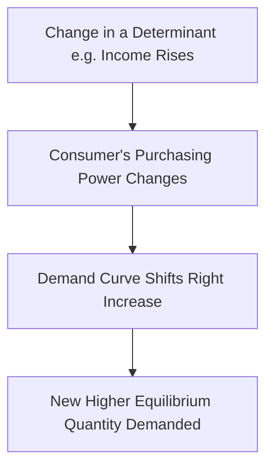

# Determinants of Demand

## Video Explanation

* [https://www.youtube.com/watch?v=3ez10ADR_gM&t=600s](https://www.youtube.com/watch?v=3ez10ADR_gM&t=600s)

## Visual Aids

## 1. Definition

Determinants of demand are the various factors, other than the good's own price, that influence the quantity of a product that consumers are willing and able to buy. A change in any of these factors causes the entire demand curve to shift.

## 2. Concept Explanation

Demand for a product does not depend only on its price. Several other elements affect how much of a good people want to purchase. Together, these elements are called the determinants of demand. The basic idea is simple. If any of these influencing factors changes, a consumer's willingness or ability to buy the product also changes.

The mechanism works as follows. Suppose a determinant like income rises. Consumers now have more purchasing power, so they buy more of a normal good even if its price stays the same. This increases the overall demand. Conversely, if a determinant like taste shifts against the product, demand falls. Understanding these determinants is critically important for businesses, economists, and policymakers. They allow better forecasting of market behaviour, planning of production levels, and formulation of economic policies.

## 3. Key Characteristics / Features

- **Multiplicity:** Demand is influenced by many factors simultaneously, not just a single one.
- **Shift Factor:** A change in any determinant shifts the demand curve to the right (increase) or left (decrease).
- **'Ceteris Paribus' Assumption:** The law of demand holds only when these determinants are assumed to remain constant.
- **Interdependence:** Determinants often interact; a change in one may trigger changes in another.
- **Market-Level Impact:** Determinants affect individual consumer demand as well as the total market demand.

## 4. Types / Classification

The main types of determinants of demand are classified as follows:

- **Price of the Commodity:** The most direct factor. A fall in price increases the quantity demanded (movement along the curve).
- **Income of the Consumer:** For normal goods, demand rises with income. For inferior goods, demand falls as income rises.
- **Prices of Related Goods:**
    - *Substitute Goods*: An increase in the price of one good raises the demand for its substitute (e.g., tea and coffee).
    - *Complementary Goods*: An increase in the price of one good reduces the demand for its complement (e.g., car and petrol).
- **Tastes and Preferences:** Favourable changes in fashion, advertising, or habits increase demand; unfavourable changes decrease it.
- **Consumer Expectations:** If consumers expect prices to rise in the future, current demand increases. If they expect a fall, current demand decreases.
- **Number of Buyers (Population):** An increase in the number of consumers in the market shifts total market demand to the right.
- **Distribution of Income:** Changes in how income is distributed among people can alter the pattern of demand for different goods.

## 5. Working / Mechanism

1.  Identify a non-price determinant that has changed, such as an increase in consumer income.
2.  Determine the direction of the change: Income rises, so purchasing power goes up.
3.  Assess the nature of the good: For a normal good, demand will increase.
4.  The demand curve shifts to the right, indicating that at every price level, more is now demanded.
5.  The market moves to a new equilibrium with a higher quantity traded, assuming supply remains constant.
6.  If a determinant like the price of a substitute rises, the demand curve for the original good shifts rightward in a similar stepwise manner.

## 6. Diagram

## 7. Mathematical Formulation

A general demand function expresses the relationship between demand and its determinants.

$$
Q_d = f(P, Y, P_r, T, E, N)
$$

Where:
- $Q_d$ = Quantity demanded of the good
- $P$ = Price of the good itself
- $Y$ = Consumer's income
- $P_r$ = Prices of related goods (substitutes and complements)
- $T$ = Tastes and preferences
- $E$ = Consumer expectations about future prices/income
- $N$ = Number of buyers in the market

## 8. Example

Consider the market for branded coffee. If the price of tea (a substitute) increases significantly, many tea drinkers will switch to coffee. Even though the price of coffee has not changed, the demand for coffee rises. The entire demand curve for coffee shifts to the right, increasing the quantity sold at the same price.

## 9. Analogy

Think of demand as a plant. The plant's core health depends on its own stem (the good's price), but it also needs sunlight, water, soil, and fertiliser to grow and shift its position. Income is sunlight, tastes are water, substitutes are fertiliser, and expectations are the season. A change in any of these elements causes the whole plant (demand curve) to shift and flourish or wither.

## 10. Comparison

| Feature | Change in Quantity Demanded | Change in Demand |
|--------|----------|----------|
| Cause | Change in the own price of the good | Change in any non-price determinant (income, tastes, etc.) |
| Graphical Effect | Movement along the same demand curve | Shift of the entire demand curve to the left or right |
| Assumption | All other factors remain constant | The good's own price remains constant |
| Example | A drop in apple price increases quantity demanded | A health study praising apples shifts the demand curve rightward |

## 11. Advantages

- Helps businesses accurately forecast future sales and plan production.
- Enables firms to design targeted marketing and pricing strategies.
- Assists governments in predicting the impact of taxes, subsidies, and welfare schemes.
- Provides a comprehensive view of consumer behaviour beyond just price.
- Allows economists to analyse market dynamics and predict equilibrium changes.

## 12. Disadvantages / Limitations

- Consumers in the real world often act irrationally, ignoring logical determinants.
- It is difficult to measure and isolate the exact impact of each determinant.
- Determinants are highly interconnected, which can make prediction complex.
- Tastes, preferences, and expectations are subjective and change unpredictably.
- The theory assumes that consumers have perfect information, which is rarely true.

## 13. Important Points / Exam Notes

- Determinants of demand cause the demand curve to shift, not a movement along it.
- The law of demand assumes 'ceteris paribus' meaning all determinants are held constant.
- An increase in demand means the entire curve shifts right; a decrease shifts it left.
- A change in the good's own price does not shift the demand curve; it causes a change in quantity demanded.
- Normal goods and inferior goods respond differently to income changes.

## 14. Applications / Use Cases

- **Business Strategy:** A car manufacturer monitors fuel prices (complement) to predict demand for large SUVs.
- **Government Policy:** Tax rebates (increasing disposable income) are given to boost demand during a recession.
- **Marketing Campaigns:** Advertising aims to shift tastes and preferences in favour of a product.
- **Investment Decisions:** Firms analyse population growth and income trends to enter new markets.
- **International Trade:** Understanding complement and substitute relations helps predict the impact of import tariffs on domestic demand.

## 15. MCQs

**Q1. Which of the following will cause a shift in the demand curve for a good?**

A. A change in the good's own price  
B. A change in the price of a substitute good  
C. A movement along the demand curve  
D. A change in the quantity supplied  
**Answer:** B  
**Explanation:** A change in the price of a related good (substitute) shifts the entire demand curve, while a change in own price causes movement along it.

**Q2. For an inferior good, an increase in consumer income will lead to:**

A. A rightward shift in demand  
B. A leftward shift in demand  
C. An upward movement along the same demand curve  
D. No change in demand  
**Answer:** B  
**Explanation:** Demand for inferior goods falls when incomes rise, causing the demand curve to shift left.

**Q3. Two goods are considered complements if an increase in the price of one leads to:**

A. An increase in demand for the other  
B. A decrease in demand for the other  
C. No change in demand for the other  
D. A movement along the other's demand curve  
**Answer:** B  
**Explanation:** Complements are used together; a rise in the price of one reduces the demand for its complement.

**Q4. Which determinant directly reflects changes in fashion and habits?**

A. Income  
B. Price of related goods  
C. Tastes and preferences  
D. Consumer expectations  
**Answer:** C  
**Explanation:** Tastes and preferences capture changes in consumer liking, which can shift demand.

**Q5. The 'ceteris paribus' assumption in the law of demand means:**

A. Only price changes, all other determinants vary  
B. All determinants change together  
C. All other determinants are held constant  
D. Demand is independent of all determinants  
**Answer:** C  
**Explanation:** Ceteris paribus means 'other things being equal', keeping non-price factors constant.

**Q6. A sudden expectation of a price rise in the future will most likely cause:**

A. A decrease in current demand  
B. An increase in current demand  
C. No change in current demand  
D. A movement along the demand curve to a lower quantity  
**Answer:** B  
**Explanation:** Consumers buy more now to avoid higher future prices, shifting the current demand curve right.

**Q7. An increase in the number of buyers in a market will:**

A. Shift the demand curve to the left  
B. Shift the demand curve to the right  
C. Cause a downward movement along the curve  
D. Keep total market demand unchanged  
**Answer:** B  
**Explanation:** More consumers mean greater total quantity demanded at each price, shifting market demand right.

**Q8. Which of the following is NOT a determinant of demand?**

A. Consumer income  
B. Cost of production  
C. Price of substitute goods  
D. Tastes and preferences  
**Answer:** B  
**Explanation:** Cost of production affects supply, not demand. The others are demand-side factors.

**Q9. If the price of a good remains constant, a successful advertising campaign will most likely:**

A. Decrease the quantity demanded  
B. Cause a movement along the demand curve  
C. Shift the demand curve to the right  
D. Make the demand curve vertical  
**Answer:** C  
**Explanation:** Advertising changes tastes and preferences, a non-price determinant, shifting the demand curve right.

**Q10. A demand function Qd = f(P, Y, T) shows that demand depends on price, income, and tastes. A change in Y with constant P will:**

A. Shift the demand curve  
B. Cause movement along the demand curve  
C. Reduce supply  
D. Not affect demand  
**Answer:** A  
**Explanation:** Since price is held constant, a change in income (a determinant) shifts the entire demand curve.