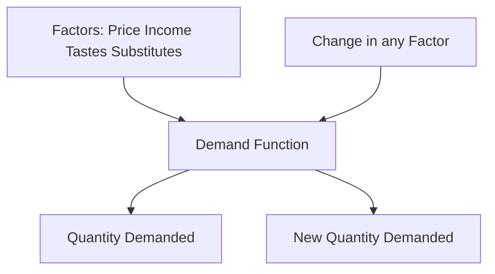

# Demand Function

## Video Explanation

* [https://www.youtube.com/watch?v=HfZy6sUeP6A&t=200s](https://www.youtube.com/watch?v=HfZy6sUeP6A&t=200s)

## Visual Aids

## 1. Definition

A demand function is a mathematical equation that shows the relationship between the quantity demanded of a good and all the factors that influence that demand. It tells us how quantity demanded changes when any determining factor changes.

---

## 2. Concept Explanation

The basic idea is that demand for a product does not depend only on its own price. Many other factors, like consumer income, prices of related goods, tastes, and expectations, also play a role. The demand function brings all these factors together in a structured form.

How it works: We express quantity demanded as a dependent variable and all influencing factors as independent variables. For example, if income rises, the demand function predicts how much more will be bought at the same price. By inserting actual numbers into the function, a firm can forecast demand.

Why it is important: The demand function is a powerful tool for forecasting, pricing, and production planning. It helps engineers and managers understand the market, estimate future sales, and assess the impact of changes in the economy or consumer preferences on their projects.

---

## 3. Key Characteristics / Features

- **Multivariate relationship:** It includes many independent variables, not just price.
- **Quantitative tool:** It provides a formula to calculate the exact quantity demanded under different conditions.
- **Time dimension:** It can be estimated for short-run or long-run periods, where the set of variables may differ.
- **Linear or non-linear:** The function can take a straight-line form or a curved form depending on actual behavior.
- **Based on assumptions:** It assumes that the relationship between quantity demanded and its determinants is stable enough to be expressed mathematically.
- **Derived from data:** A real-world demand function is estimated using statistical methods from observed market data.

---

## 4. Types / Classification

Based on mathematical form:

- **Linear demand function:** The quantity demanded changes at a constant rate with respect to each determinant. Example: \( Q_d = a - bP + cY \).
- **Non-linear demand function:** The rate of change varies; the function may involve powers or logarithms. Example: \( Q_d = aP^{-b}Y^{c} \).

Based on coverage:

- **Individual demand function:** Shows the demand relationship for a single consumer or household.
- **Market demand function:** Shows total demand of all consumers in a market; it is the sum of individual demand functions.

Based on time period:

- **Short-run demand function:** Focuses on variables that can change quickly, like price and advertising, while some factors like tastes or number of firms remain constant.
- **Long-run demand function:** All variables including population, tastes, and technology are allowed to change.

---

## 5. Working / Mechanism

1. Identify all the important factors that affect the demand for the product, such as its own price, income of consumers, and prices of substitutes.
2. Collect data on these variables and the observed quantity demanded over a period.
3. Choose a suitable mathematical form, such as a linear equation, based on the nature of the relationship.
4. Estimate the parameters (constants) of the equation using statistical regression analysis.
5. Write the final demand function, e.g., \( Q_d = 500 - 2P + 0.5Y \).
6. Use the function to forecast demand: insert expected future values of price, income, etc., into the equation.
7. Analyze the impact of a change in any one factor by holding others constant (partial effect).
8. Update the function periodically as new data becomes available to maintain accuracy.

---

## 6. Diagram

---

## 7. Mathematical Formulation

A general demand function is written as:

$$
Q_d = f(P_x, Y, P_r, T, E, N)
$$

Where:  
- \( Q_d \) = Quantity demanded of good X  
- \( P_x \) = Price of good X  
- \( Y \) = Consumer’s income  
- \( P_r \) = Price of related goods (substitutes or complements)  
- \( T \) = Tastes and preferences  
- \( E \) = Consumer expectations about future prices and income  
- \( N \) = Number of consumers in the market  

A specific linear form may be:

$$
Q_d = \alpha - \beta P_x + \gamma Y + \delta P_r
$$

Where:  
- \( \alpha \) = Intercept (constant term)  
- \( \beta, \gamma, \delta \) = Coefficients showing the rate of change in \( Q_d \) per unit change in respective variable.  

For example, \( Q_d = 1000 - 5P_x + 0.2Y + 3P_r \).

---

## 8. Example

A mobile phone company estimates its monthly demand function as:  
\( Q_d = 20{,}000 - 8P + 0.05Y + 2A \)  
where \( P \) is price of the phone in rupees, \( Y \) is average consumer income in rupees, and \( A \) is advertising expenditure in rupees. If the price is ₹15,000, average income is ₹30,000, and advertising is ₹50,000, then:  
\( Q_d = 20{,}000 - 8(15{,}000) + 0.05(30{,}000) + 2(50{,}000) \)  
\( = 20{,}000 - 1{,}20{,}000 + 1{,}500 + 1{,}00{,}000 = 1{,}500 \) units.  
The company can use this function to decide price and advertising budget.

---

## 9. Analogy

Think of the demand function as a recipe for a cake. The quantity of cake demanded depends on ingredients like sugar (price), flour (income), and eggs (advertising). Changing the amount of one ingredient alters the final cake. The demand function is the written recipe that tells exactly how much each ingredient contributes to the final quantity.

---

## 10. Comparison

| Feature | Demand Function | Demand Curve |
|--------|-----------------|--------------|
| Meaning | Mathematical relation between quantity demanded and all determinants | Graphical representation of quantity demanded vs own price only |
| Variables | Many variables (price, income, tastes, etc.) | Only two: own price and quantity |
| Use | Forecasting and causal analysis | Visualizing law of demand |
| Shift | A change in any non-price variable shifts the whole function | A change in non-price factors shifts the curve |

---

## 11. Advantages

- Enables accurate demand forecasting for business and project planning.
- Helps isolate the effect of individual factors on demand.
- Assists in pricing strategy by showing price sensitivity.
- Supports public policy decisions like taxation and subsidies.
- Provides a basis for revenue and profit estimation.
- It is a scientific tool that reduces guesswork in managerial decisions.

---

## 12. Disadvantages / Limitations

- Requires reliable data; inaccurate data leads to wrong predictions.
- Assumes that past relationships will continue in the future, which may not always be true.
- Consumer behavior changes due to psychological or social reasons that are difficult to quantify.
- Real-world relationships can be complex and may not fit simple linear equations.
- Collecting and processing data for all variables can be time-consuming and costly.

---

## 13. Important Points / Exam Notes

- The demand function expresses quantity demanded as a function of its determinants: \( Q_d = f(P, Y, P_r, T, \dots) \).
- A linear demand function has a constant rate of change, e.g., \( Q_d = a - bP + cY \).
- It is more complete than a demand curve because it includes all demand factors.
- The demand curve is derived from the demand function by assuming other factors constant.
- Shifts in the demand curve are caused by changes in non-price variables in the function.
- Accurate demand functions are essential for forecasting and project feasibility.

---

## 14. Applications / Use Cases

- **Business pricing:** A firm uses the demand function to decide how a price cut will increase sales volume.
- **Revenue forecasting:** A new infrastructure project estimates toll road usage based on a demand function with toll price, fuel cost, and population.
- **Government taxation:** Authorities estimate how a tax on sugary drinks will reduce consumption using demand function estimates.
- **Agriculture policy:** Demand for a crop is modeled as a function of its price, income, and support prices of competing crops.
- **Energy planning:** Electricity demand function includes price, industrial output, and seasonal factors for capacity planning.

---

## 15. MCQs

**Q1. A demand function shows the relationship between quantity demanded and:**  
A. Only the price of the good  
B. All factors affecting demand  
C. Only consumer income  
D. Only prices of related goods  
**Answer:** B  
**Explanation:** The demand function includes all determinants like price, income, and related goods’ prices.

**Q2. In the linear demand function \( Q_d = a - bP \), the coefficient ‘b’ represents:**  
A. The intercept  
B. The change in price per unit change in quantity  
C. The change in quantity demanded per unit change in price  
D. The income effect  
**Answer:** C  
**Explanation:** ‘b’ is the slope coefficient showing how much Qd changes when P changes by one unit.

**Q3. Which of the following is a non-price determinant in a demand function?**  
A. Own price of the good  
B. Quantity supplied  
C. Tastes and preferences  
D. Production cost  
**Answer:** C  
**Explanation:** Tastes and preferences affect demand but are not the own price of the good.

**Q4. A shift in the demand curve is caused by a change in:**  
A. Own price of the good  
B. A non-price variable in the demand function  
C. Quantity supplied  
D. Technology of production  
**Answer:** B  
**Explanation:** The demand curve shifts when any factor in the demand function other than own price changes.

**Q5. What type of demand function is \( Q_d = 0.5 P^{-2} Y^{1.5} \)?**  
A. Linear  
B. Non-linear  
C. Inverse linear  
D. Quadratic  
**Answer:** B  
**Explanation:** It involves powers (exponents), making it a non-linear function.

**Q6. The market demand function is obtained by:**  
A. Multiplying individual demand functions  
B. Summing individual demand functions horizontally  
C. Adding prices and dividing by quantity  
D. Taking the difference between supply and demand  
**Answer:** B  
**Explanation:** Market demand is the horizontal summation of all individual demands at each price.

**Q7. Which variable in the general demand function represents consumer expectations?**  
A. Y  
B. T  
C. E  
D. N  
**Answer:** C  
**Explanation:** ‘E’ stands for expectations about future prices, income, etc.

**Q8. A demand function \( Q_d = 200 - 4P + 0.1Y \) implies that if income increases by ₹1000, demand will:**  
A. Decrease by 100 units  
B. Increase by 100 units  
C. Increase by 400 units  
D. Decrease by 0.1 units  
**Answer:** B  
**Explanation:** 0.1 × 1000 = 100 unit increase in quantity demanded.

**Q9. Which of the following is a limitation of a demand function?**  
A. It is simple to estimate  
B. It always predicts exact future demand  
C. It relies on historical data and stable relationships  
D. It requires no statistical analysis  
**Answer:** C  
**Explanation:** Demand functions depend on past data and may fail if relationship changes.

**Q10. For the demand function \( Q_d = 500 - 5P + 0.2Y \), if price is ₹20 and income is ₹1000, quantity demanded is:**  
A. 500  
B. 500 - 100 + 200 = 600  
C. 500 - 100 + 200 = 600 (calculations: 5*20=100, 0.2*1000=200, so 500-100+200=600)  
D. 200  
**Answer:** C  
**Explanation:** Qd = 500 - 5(20) + 0.2(1000) = 500 - 100 + 200 = 600.