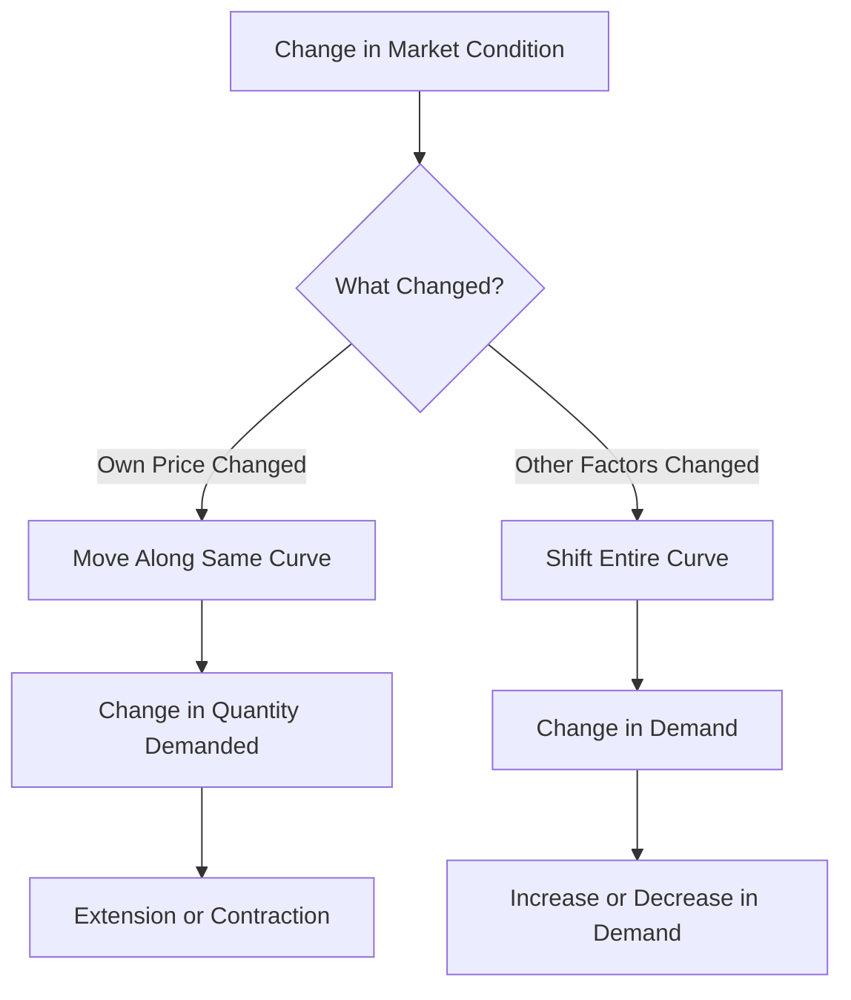

# Change in Demand: Shift of Demand Curve vs Change in Quantity Demanded

## 1. Definition

**Change in quantity demanded** refers to a movement along the same demand curve due to a change in the own price of the commodity.

**Change in demand** (also called shift in demand) refers to a complete shift of the entire demand curve to the right or left caused by changes in factors other than the own price, such as income, tastes, or prices of related goods.

## 2. Concept Explanation

The basic idea is that quantity demanded can vary for two completely different reasons. The first is when the price of the good itself goes up or down. If the price of a pen falls, you buy more pens; this is a movement along the existing demand curve. The demand curve itself does not change its position.

The second reason is when something else in the background changes. For example, your income increases, or you suddenly prefer digital notes over handwritten ones, or the price of pencils rises sharply. Then, even if the pen’s price stays the same, you will now buy a different quantity at each price. The entire demand curve shifts to a new position – rightward for an increase in demand, leftward for a decrease.

Why is this distinction important? It helps engineers, managers, and policymakers correctly diagnose what is happening in the market. A price cut from the firm will increase quantity demanded along the curve, but a successful advertising campaign can shift the whole curve outward, allowing the firm to sell more units even without reducing price. Mixing up the two concepts leads to wrong business strategies.

## 3. Key Characteristics / Features

- **Change in quantity demanded is caused only by own price change.** No other factor influences this movement.
- **Shift in demand is caused by changes in factors other than own price.** These include income, consumer tastes, price of substitutes or complements, population, and expectations.
- **Movement along the curve is shown as a change from one point to another on the same demand curve.** The curve itself does not move.
- **Shift of demand is shown as the entire demand curve moving to a new position.** At every price, a different quantity is demanded than before.
- **Movement is also called “extension” or “contraction” of demand.** When price falls and quantity demanded rises, it is extension; when price rises and quantity demanded falls, it is contraction.
- **Shift is also called “increase” or “decrease” in demand.** Rightward shift is an increase in demand; leftward shift is a decrease in demand.

## 4. Types / Classification

This topic itself deals with two distinct concepts, which can be classified as:

- **Movement along the demand curve (Change in quantity demanded):**
  - *Extension of demand:* Quantity demanded rises due to a fall in price.
  - *Contraction of demand:* Quantity demanded falls due to a rise in price.

- **Shift of the demand curve (Change in demand):**
  - *Increase in demand:* The whole curve shifts to the right. At the same price, consumers buy more.
  - *Decrease in demand:* The whole curve shifts to the left. At the same price, consumers buy less.

## 5. Working / Mechanism

The two processes operate differently. Here is how each works step by step.

**Movement along the demand curve (Change in quantity demanded):**
1.  The own price of the commodity changes, either decreasing or increasing.
2.  The consumer decides to adjust the quantity purchased because the good has become cheaper or dearer relative to their budget.
3.  This adjustment results in a new point on the exact same demand curve.
4.  The demand schedule remains unchanged; only the chosen quantity at that particular price is different.

**Shift of the demand curve (Change in demand):**
1.  A factor other than own price changes, such as income, fashion, or the price of a substitute good.
2.  The consumer’s willingness and ability to buy the product alters at every possible price level.
3.  The original demand schedule becomes invalid. A completely new schedule representing higher or lower quantities at each price comes into effect.
4.  The demand curve moves to a new location, either rightward (increase) or leftward (decrease).

## 6. Diagram

## 7. Mathematical Formulation

A simple demand function helps distinguish the two:

$$
Q_d = f(P_o, I, T, P_s, P_c, E)
$$

Where:
- \( Q_d \) = Quantity demanded of the good
- \( P_o \) = Own price of the good
- \( I \) = Consumer’s income
- \( T \) = Tastes and preferences
- \( P_s \) = Price of substitute goods
- \( P_c \) = Price of complementary goods
- \( E \) = Consumer expectations

- **Change in quantity demanded:** Only \( P_o \) varies while all other factors (\( I, T, P_s, P_c, E \)) remain constant. This traces a movement along the curve.
- **Change in demand:** One or more of the other factors (\( I, T, P_s, P_c, E \)) change, causing a new relationship. The entire function shifts, and at the same \( P_o \), \( Q_d \) is different.

## 8. Example

Suppose the market for steel bars used in construction sees a drop in price from ₹60,000 per ton to ₹55,000 per ton. Builders increase their purchase from 100 tons to 120 tons. This is a movement along the demand curve – a change in quantity demanded (extension).

Now imagine the government announces a massive infrastructure push, increasing construction activity. Even if the steel price remains at ₹60,000, builders now want 150 tons instead of 100 tons because their requirements have grown. This shifts the entire demand curve to the right – a change (increase) in demand.

## 9. Analogy

Think of a fixed railway track. If a train moves from station A to station B along the same track, it is like a change in quantity demanded – the track (demand curve) is unchanged; only the position on it changes. But if an earthquake shifts the entire railway track to a new location, the train will now stop at a completely different point even without moving along the track. That shift of the whole track is like a change in demand – the entire relationship has moved.

## 10. Comparison

| Feature | Change in Quantity Demanded | Change in Demand (Shift) |
|--------|----------|----------|
| **Cause** | Change in own price of the good | Change in income, tastes, prices of related goods, etc. |
| **Graphical effect** | Movement from one point to another on the same demand curve | Entire demand curve shifts rightward or leftward |
| **Other names** | Extension or contraction of demand | Increase or decrease in demand |
| **Demand schedule** | Original schedule remains valid | A new demand schedule comes into effect |
| **Price-quantity relationship** | Inverse relationship unchanged | New quantities demanded at every price |

## 11. Advantages

- **Clear diagnosis of market events:** Knowing the difference helps correctly identify whether a sales increase is due to a price cut or a genuine rise in product popularity.
- **Accurate pricing strategy:** If the demand curve itself is shifting outward, a firm may raise price and still sell more; if it is a movement, price reduction is the cause.
- **Better demand forecasting:** By separating the two, companies can predict future sales based on which factor is likely to change.
- **Effective policy design:** Government can judge whether a subsidy (lowering price) will only move along the curve or if awareness campaigns (shifting demand) are needed.
- **Prevents miscommunication:** In engineering economics, project viability calculations differ if the demand forecast is based on price changes or market expansion.

## 12. Disadvantages / Limitations

- **Conceptual confusion among beginners:** Students often use the terms “increase in demand” and “increase in quantity demanded” interchangeably, which is incorrect.
- **Difficult isolation in reality:** In the real world, own price and other factors often change simultaneously, making it hard to isolate pure movement from a shift.
- **Assumption of ceteris paribus:** The distinction relies on keeping other factors constant, which is an assumption that may not hold exactly in dynamic markets.
- **Limited immediate use for very short-term decisions:** For daily pricing, firms may only care about quantity response to price changes without worrying about the curve’s position.
- **Data requirement:** To know whether a shift has occurred, detailed market research on income, substitutes, and preferences is necessary, which can be costly.

## 13. Important Points / Exam Notes

- The demand curve is drawn assuming factors other than own price remain constant.
- When own price changes, we move along the curve; the term is “change in quantity demanded”.
- When any other factor changes, the entire curve shifts; the term is “change in demand”.
- A rightward shift is called an increase in demand; a leftward shift is a decrease in demand.
- Extension of demand: fall in price leads to rise in quantity demanded.
- Contraction of demand: rise in price leads to fall in quantity demanded.
- The phrase “change in demand” should never be used for a movement due to own price change.
- Factors shifting the demand curve include income, tastes, price of substitutes and complements, number of buyers, and future expectations.
- In diagrams, movement is shown as a single arrow along the curve; shift is shown as two separate parallel curves.

## 14. Applications / Use Cases

- **New product launch:** A company lowers introductory price to capture market share, causing movement along the demand curve. Simultaneously, a celebrity endorsement campaign shifts the demand curve outward.
- **Fuel pricing:** When petrol prices rise, motorists reduce usage (contraction of demand). Over time, if public transport improves, the entire demand curve for petrol may shift left.
- **Construction sector:** A reduction in cement price increases quantity demanded (movement). A housing loan interest rate cut increases new home construction, shifting demand for cement rightward.
- **Project feasibility:** In highway toll projects, traffic volume forecasts must separate vehicle growth (shift in demand) from changes due to toll rate adjustments (movement along the curve).
- **Government subsidy:** A per-unit subsidy on solar panels effectively reduces the buyer’s price, causing movement along the demand curve. An awareness campaign about electricity savings shifts the demand curve outward.

## 15. MCQs

**Q1. A change in quantity demanded is caused by a change in**

A. Consumer income  
B. Price of the good itself  
C. Price of substitute goods  
D. Taste and preferences  

**Answer:** B  
**Explanation:** Only own price change causes movement along the demand curve; all other factors shift the curve.

---

**Q2. A rightward shift of the demand curve indicates**

A. Contraction of demand  
B. Decrease in demand  
C. Increase in demand  
D. Extension of demand  

**Answer:** C  
**Explanation:** Rightward shift means at the same price consumers want to buy more, which is an increase in demand.

---

**Q3. When the price of a commodity falls and its quantity demanded rises, it is called**

A. Increase in demand  
B. Extension of demand  
C. Decrease in demand  
D. Shift of demand  

**Answer:** B  
**Explanation:** A movement down along the same demand curve due to a price fall is termed extension of demand.

---

**Q4. Which of the following will cause a shift in the demand curve for a product?**

A. A change in its own price  
B. A change in consumer income  
C. A movement along the curve  
D. A sale discount on the product  

**Answer:** B  
**Explanation:** Change in income alters buying capacity at all prices, shifting the whole curve. Own price change only moves along the curve.

---

**Q5. “Increase in demand” means**

A. More quantity is purchased at a lower price  
B. The demand curve shifts to the left  
C. More quantity is purchased at the same price due to shift of curve  
D. The supply curve shifts rightward  

**Answer:** C  
**Explanation:** Increase in demand refers to an outward shift, so at any given price, quantity demanded is higher than before.

---

**Q6. A fall in the price of a complementary good will lead to**

A. A movement upward along the demand curve  
B. A leftward shift of the demand curve  
C. A rightward shift of the demand curve  
D. No change in the demand curve  

**Answer:** C  
**Explanation:** Cheaper complements make the main product more desirable, shifting its demand curve to the right.

---

**Q7. The phrase “change in demand” is correctly used when**

A. The price of the good changes  
B. There is a movement from one point to another on the same curve  
C. The entire demand curve shifts due to a change in taste  
D. Quantity demanded decreases because of a price rise  

**Answer:** C  
**Explanation:** Change in demand means a shift of the curve caused by non-price factors like taste and preferences.

---

**Q8. Contraction of demand means**

A. Quantity demanded rises due to a fall in price  
B. Demand curve shifts to the left  
C. Quantity demanded falls due to a rise in price  
D. Demand curve becomes vertical  

**Answer:** C  
**Explanation:** Contraction is an upward movement along the demand curve when price increases and less is bought.

---

**Q9. Which statement is correct?**

A. Change in quantity demanded implies shift of demand curve.  
B. Change in demand implies movement along the same curve.  
C. An increase in population shifts the demand curve to the right.  
D. A change in the good’s own price shifts the demand curve.  

**Answer:** C  
**Explanation:** More buyers increase market demand at every price, causing a rightward shift. Own price changes never shift the curve.

---

**Q10. A successful advertisement campaign for a brand is expected to**

A. Cause a movement down the demand curve  
B. Cause a leftward shift of the demand curve  
C. Cause a rightward shift of the demand curve  
D. Have no effect on demand  

**Answer:** C  
**Explanation:** Advertisement changes consumer preferences, leading to an increase in demand (rightward shift).