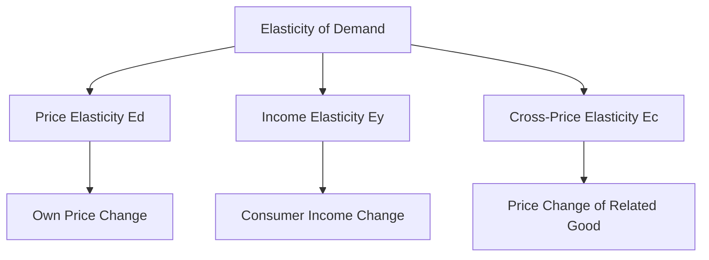

# Types price income cross price elasticity with mathematical derivation

## 1. Definition

Elasticity of demand measures how responsive the quantity demanded of a good is to changes in factors like its own price, consumer income, or the price of another good. The three main types are price elasticity of demand, income elasticity of demand, and cross-price elasticity of demand. Each type quantifies sensitivity using a numerical coefficient.

## 2. Concept Explanation

The basic idea behind elasticity is to understand consumer sensitivity. Knowing how much demand changes when a price or income changes is more useful than simply knowing the direction of change. Elasticity expresses this responsiveness as a ratio of percentage changes, making it a unit-free measure.

This works by calculating the percentage change in quantity demanded divided by the percentage change in the influencing factor. A high coefficient means demand is very responsive; a low coefficient means it is not. Elasticity is important because it helps businesses set prices, governments forecast tax revenue, and economists predict how markets react to policy changes. Without elasticity, we would only know that demand rises or falls, but not by how much.

## 3. Key Characteristics / Features

- **Unit-Free Measure:** Because elasticity uses percentage changes, it does not depend on units like rupees or kilograms. This allows comparison across different products and countries.
- **Relative Comparison:** It compares the rate of change in quantity to the rate of change in the determinant, not absolute numbers.
- **Sign Matters:** In price elasticity, the value is usually negative (law of demand), but we often look at the absolute value. Income elasticity can be positive (normal goods) or negative (inferior goods). Cross-price elasticity sign tells if goods are substitutes (positive) or complements (negative).
- **Point vs. Arc Elasticity:** Elasticity can be calculated at a single point on the demand curve or over an arc (average method) for discrete changes.
- **Determinant of Revenue:** Price elasticity directly affects whether a price rise increases or decreases total revenue for a seller.

## 4. Types / Classification

There are three major types of demand elasticity, each linked to a different determinant:

- **Price Elasticity of Demand (Ed):** Measures the responsiveness of quantity demanded to a change in the good's own price.
- **Income Elasticity of Demand (Ey):** Measures the responsiveness of quantity demanded to a change in consumer income.
- **Cross-Price Elasticity of Demand (Ec):** Measures the responsiveness of quantity demanded of one good to a change in the price of another related good.

## 5. Working / Mechanism

### Price Elasticity of Demand
1.  Observe an initial price (P1) and quantity demanded (Q1).
2.  The price changes to P2, and consumers adjust their quantity demanded to Q2.
3.  Calculate the percentage change in quantity demanded: $\frac{Q2 - Q1}{Q1} \times 100$.
4.  Calculate the percentage change in price: $\frac{P2 - P1}{P1} \times 100$.
5.  Divide the percentage change in quantity by the percentage change in price. The absolute value indicates the degree of elasticity.

### Income Elasticity of Demand
1.  Start with an initial income level (Y1) and quantity demanded (Q1).
2.  Income changes to Y2, leading to a new quantity demanded (Q2).
3.  Compute the percentage change in quantity demanded.
4.  Compute the percentage change in income.
5.  Divide the two percentages. A positive result indicates a normal good; a negative result indicates an inferior good.

### Cross-Price Elasticity of Demand
1.  Note the initial price of Good Y (Py1) and the quantity demanded of Good X (Qx1).
2.  The price of Good Y changes to Py2, and consumers adjust the quantity demanded of Good X to Qx2.
3.  Find the percentage change in quantity demanded of Good X.
4.  Find the percentage change in price of Good Y.
5.  Divide the two. A positive cross elasticity means the goods are substitutes; a negative value means they are complements.

## 6. Diagram

## 7. Mathematical Formulation

### Price Elasticity of Demand (Point Elasticity)

$$
E_d = \frac{\%\Delta Q_d}{\%\Delta P} = \frac{\Delta Q / Q}{\Delta P / P} = \frac{\Delta Q}{\Delta P} \times \frac{P}{Q}
$$

Where:
- $E_d$ = Price elasticity of demand
- $\Delta Q$ = Change in quantity demanded
- $\Delta P$ = Change in price
- $P$ = Original price
- $Q$ = Original quantity demanded

**Derivation:** The formula starts as the ratio of percentage changes. Multiply numerator and denominator by 100 to cancel percentages, yielding $(\Delta Q / Q) \div (\Delta P / P)$. Rearranging gives $\frac{\Delta Q}{\Delta P} \times \frac{P}{Q}$.

### Income Elasticity of Demand

$$
E_y = \frac{\%\Delta Q}{\%\Delta Y} = \frac{\Delta Q / Q}{\Delta Y / Y} = \frac{\Delta Q}{\Delta Y} \times \frac{Y}{Q}
$$

Where:
- $E_y$ = Income elasticity of demand
- $\Delta Q$ = Change in quantity demanded
- $\Delta Y$ = Change in income
- $Y$ = Original income
- $Q$ = Original quantity demanded

### Cross-Price Elasticity of Demand

$$
E_c = \frac{\%\Delta Q_x}{\%\Delta P_y} = \frac{\Delta Q_x / Q_x}{\Delta P_y / P_y} = \frac{\Delta Q_x}{\Delta P_y} \times \frac{P_y}{Q_x}
$$

Where:
- $E_c$ = Cross-price elasticity of demand
- $\Delta Q_x$ = Change in quantity demanded of good X
- $\Delta P_y$ = Change in price of good Y
- $P_y$ = Original price of good Y
- $Q_x$ = Original quantity demanded of good X

## 8. Example

**Price Elasticity:** The price of a notebook falls from ₹100 to ₹80, and its monthly demand rises from 200 to 300 units. The percentage change in quantity is 50% and in price is -20%. The price elasticity $E_d = 50\% / -20\% = -2.5$, which in absolute terms is 2.5 (highly elastic).

**Income Elasticity:** A family's monthly income rises from ₹50,000 to ₹60,000. Their demand for branded bread increases from 20 to 22 loaves. Quantity change is 10%, income change is 20%. $E_y = 10\% / 20\% = +0.5$, indicating a normal necessity.

**Cross-Price Elasticity:** The price of coffee rises from ₹200 to ₹240 per pack. The demand for tea increases from 100 to 140 packets. %ΔQt = 40%, %ΔPc = 20%. $E_c = +2.0$, showing tea and coffee are strong substitutes.

## 9. Analogy

Think of a rubber band. A very elastic rubber band stretches a lot when you pull it gently (a small force causes a large extension). Similarly, if a small price drop causes demand to stretch and increase a lot, demand is elastic. An inelastic rubber band hardly stretches even when you pull hard. Likewise, inelastic demand means a large price change causes only a tiny change in quantity demanded. For cross-price elasticity, imagine dance partners: if one partner steps forward (price rises), the other steps back (demand falls) for complements; if one steps forward, the other also steps forward (demand rises) for substitutes.

## 10. Comparison

| Feature | Price Elasticity | Income Elasticity | Cross-Price Elasticity |
|--------|-----------------|-------------------|------------------------|
| Cause | Change in own price | Change in consumer income | Change in price of related good |
| Formula | $\frac{\%\Delta Q}{\%\Delta P}$ | $\frac{\%\Delta Q}{\%\Delta Y}$ | $\frac{\%\Delta Q_x}{\%\Delta P_y}$ |
| Sign Interpretation | Usually negative; absolute value tells degree of responsiveness | Positive: normal good; Negative: inferior good | Positive: substitute; Negative: complement |
| Key Use | Pricing and revenue decisions | Forecasting demand with economic growth | Defining markets and competitive strategy |

## 11. Advantages

- Helps businesses predict the impact of price changes on total revenue.
- Enables classification of goods as necessities, luxuries, or inferior goods.
- Assists governments in setting tax rates on goods with inelastic demand (like tobacco) for stable revenue.
- Aids in understanding consumer behaviour during economic expansions or recessions.
- Provides insight into competitive relationships between substitute and complementary products.

## 12. Disadvantages / Limitations

- Elasticity estimates are valid only for small changes and a specific time period; they may not hold for large price swings.
- Accurate calculation requires reliable data, which may be difficult or expensive to obtain.
- The measure is static and does not capture dynamic loyalty or brand preferences.
- Point elasticity gives different values depending on the starting point; arc elasticity is needed for consistency.
- It assumes other factors constant, which is unrealistic in a continuously changing market.

## 13. Important Points / Exam Notes

- Elasticity is always a ratio of percentage changes, making it dimensionless and comparable.
- Price elasticity of demand is negative due to the law of demand, but we often drop the sign and use the absolute value.
- Demand is elastic if |Ed| > 1, inelastic if |Ed| < 1, and unit elastic if |Ed| = 1.
- Income elasticity is positive for normal goods and negative for inferior goods. Luxury goods typically have Ey > 1.
- Cross-price elasticity is positive for substitutes and negative for complements. Independent goods have cross elasticity close to zero.
- The formulas provided are point elasticity formulas; for large discrete changes, use arc elasticity using average values.

## 14. Applications / Use Cases

- **Pricing Strategy:** A cinema hall uses price elasticity to decide whether a ticket price cut during weekdays will increase overall revenue.
- **Tax Policy:** The government imposes high excise duties on cigarettes because their demand is price inelastic, ensuring stable tax revenue despite price hikes.
- **Market Segmentation:** Airlines charge different prices based on the income elasticity of business travelers (inelastic) versus leisure travelers (elastic).
- **Competitive Analysis:** A company calculates cross-price elasticity between its soft drink and a new rival's product to gauge competitive threat.
- **Economic Forecasting:** Planners use income elasticity to estimate how demand for energy and food will grow with national income.

## 15. MCQs

**Q1. Price elasticity of demand measures the responsiveness of quantity demanded to a change in:**

A. Income  
B. Price of related goods  
C. The good's own price  
D. Tastes and preferences  
**Answer:** C  
**Explanation:** Price elasticity specifically deals with the effect of a change in the good's own price.

**Q2. If the price elasticity of demand for a good is -0.8, then demand is:**

A. Perfectly elastic  
B. Unit elastic  
C. Elastic  
D. Inelastic  
**Answer:** D  
**Explanation:** The absolute value 0.8 is less than 1, indicating inelastic demand.

**Q3. The formula $E_y = \frac{\%\Delta Q}{\%\Delta Y}$ represents which type of elasticity?**

A. Price elasticity  
B. Income elasticity  
C. Cross-price elasticity  
D. Supply elasticity  
**Answer:** B  
**Explanation:** The letter Y denotes income, making it income elasticity of demand.

**Q4. A negative income elasticity of demand suggests that the good is:**

A. A luxury good  
B. A normal necessity  
C. An inferior good  
D. A substitute  
**Answer:** C  
**Explanation:** When income rises and demand falls, the good is inferior.

**Q5. If the cross-price elasticity between two goods is +1.5, they are:**

A. Complements  
B. Substitutes  
C. Unrelated  
D. Inferior goods  
**Answer:** B  
**Explanation:** A positive cross-price elasticity indicates that as the price of one good increases, demand for the other also increases, defining them as substitutes.

**Q6. Which type of elasticity helps a firm determine how a competitor's price change will affect its own sales?**

A. Price elasticity  
B. Income elasticity  
C. Cross-price elasticity  
D. Promotional elasticity  
**Answer:** C  
**Explanation:** Cross-price elasticity measures the impact of a change in the price of one firm's product on the demand for another firm's product.

**Q7. The point price elasticity formula derived from percentage changes is:**

A. $\frac{\Delta P}{\Delta Q} \times \frac{Q}{P}$  
B. $\frac{\Delta Q}{\Delta P} \times \frac{P}{Q}$  
C. $\frac{\Delta Q}{\Delta P} \times \frac{Q}{P}$  
D. $\frac{\Delta P}{\Delta Q} \times \frac{P}{Q}$  
**Answer:** B  
**Explanation:** The derivation of percentage changes yields $\frac{\Delta Q}{\Delta P} \times \frac{P}{Q}$.

**Q8. A zero cross-price elasticity between two goods indicates that they are:**

A. Close complements  
B. Strong substitutes  
C. Independent goods  
D. Inferior goods  
**Answer:** C  
**Explanation:** When the price change of one good causes no change in demand for the other, the goods are independent.

**Q9. Which of the following typically has an income elasticity greater than 1?**

A. Basic food grains  
B. Salt  
C. Luxury cars  
D. Public transport  
**Answer:** C  
**Explanation:** Luxury goods have income elasticity > 1, meaning demand rises faster than income.

**Q10. If a 10% fall in the price of a good causes a 20% rise in quantity demanded, the absolute value of price elasticity is:**

A. 0.5  
B. 1.0  
C. 1.5  
D. 2.0  
**Answer:** D  
**Explanation:** $E_d = \frac{20\%}{-10\%} = -2.0$, absolute value is 2.0.