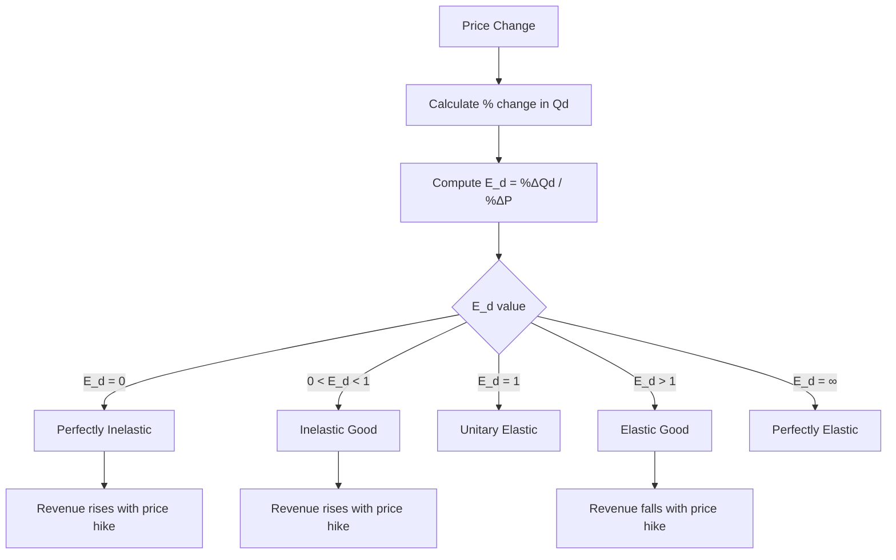

# Elastic and inelastic goods

## Video Explanation

* [https://www.youtube.com/watch?v=3ez10ADR_gM](https://www.youtube.com/watch?v=3ez10ADR_gM)

## Visual Aids

## 1. Definition

Elastic goods are products for which the quantity demanded changes by a larger percentage than the price change. Inelastic goods are products for which the quantity demanded changes by a smaller percentage than the price change. This classification is based on the price elasticity of demand.

---

## 2. Concept Explanation

The basic idea is that consumers react differently to price changes for different goods. Some goods are very sensitive to price: a small price drop causes a large increase in purchases. These are called elastic goods. Other goods are essential or have no close substitutes, so even a large price rise causes only a minor drop in the quantity bought. These are called inelastic goods.

How it works: For an elastic good, if the price falls by 10%, demand may rise by more than 10%, say 25%. Total revenue earned by the seller increases because the volume gain outweighs the price cut. For an inelastic good, a 10% price rise may reduce demand by only 2%. Total revenue rises because the drop in sales volume is small compared to the higher price charged.

Why it is important: Distinguishing elastic and inelastic goods helps businesses set prices to maximize revenue. It guides government tax policies—taxing inelastic goods (like petrol) yields stable revenue without greatly reducing consumption. For project managers, it informs demand forecasting when prices or costs change.

---

## 3. Key Characteristics / Features

- **Responsiveness:** Elastic goods show high responsiveness of quantity demanded to price changes; inelastic goods show low responsiveness.
- **Slope of demand curve:** Elastic goods have flatter demand curves; inelastic goods have steeper demand curves.
- **Substitute availability:** Goods with many close substitutes tend to be elastic; those with few or no substitutes are inelastic.
- **Nature of need:** Necessities like basic food and medicines are often inelastic; luxuries and comforts tend to be elastic.
- **Habit and addiction:** Addictive products like cigarettes are highly inelastic because consumers find it hard to reduce consumption.
- **Time period:** Over a longer time period, demand generally becomes more elastic as consumers find alternatives.
- **Share of budget:** Items that take a large share of income (like cars) usually have elastic demand; low-cost daily items may be inelastic.

---

## 4. Types / Classification

Based on the numerical value of price elasticity of demand (\(E_d\)), goods can be classified as follows:

- **Perfectly inelastic goods:** \(E_d = 0\). Quantity demanded does not change at all when price changes. The demand curve is vertical. Example: life-saving drug for a patient who must have it.
- **Inelastic goods (relatively inelastic):** \(0 < E_d < 1\). Percentage change in quantity demanded is less than percentage change in price. Demand curve is steep. Example: salt, petrol.
- **Unitary elastic goods:** \(E_d = 1\). Percentage change in quantity demanded equals percentage change in price. Total revenue remains constant. Example: some normal goods in a moderate price range.
- **Elastic goods (relatively elastic):** \(E_d > 1\). Percentage change in quantity demanded is greater than percentage change in price. Demand curve is relatively flat. Example: soft drinks, restaurant meals.
- **Perfectly elastic goods:** \(E_d = \infty\). Even a tiny price increase reduces quantity demanded to zero. The demand curve is horizontal. This occurs in perfectly competitive markets where many sellers sell identical products.

---

## 5. Working / Mechanism

1. Collect data on price and quantity demanded for the good.
2. Price is changed (e.g., increased by 10%) while all other factors remain constant.
3. Observe the resulting percentage change in quantity demanded.
4. Compute price elasticity of demand using the formula \(E_d = \frac{\%\ \text{change in quantity demanded}}{\%\ \text{change in price}}\).
5. Compare the absolute value of \(E_d\) with 1.
6. If \(|E_d| > 1\), classify the good as elastic. Revenue moves opposite to price direction.
7. If \(|E_d| < 1\), classify the good as inelastic. Revenue moves in the same direction as price.
8. If \(|E_d| = 1\), classify as unitary elastic. Revenue is unchanged.
9. Use the classification to decide pricing: for elastic goods, lower prices to boost revenue; for inelastic goods, higher prices can increase revenue.

---

## 6. Diagram

---

## 7. Mathematical Formulation

Price elasticity of demand is given by:

$$
E_d = \frac{\%\ \Delta Q_d}{\%\ \Delta P} = \frac{\Delta Q_d / Q_d}{\Delta P / P}
$$

Where:  
- \(E_d\) = Price elasticity of demand (usually taken in absolute value)  
- \(\Delta Q_d\) = Change in quantity demanded  
- \(Q_d\) = Original quantity demanded  
- \(\Delta P\) = Change in price  
- \(P\) = Original price  

Classification:  
- Elastic: \(|E_d| > 1\)  
- Inelastic: \(|E_d| < 1\)  
- Unitary elastic: \(|E_d| = 1\)  
- Perfectly inelastic: \(|E_d| = 0\)  
- Perfectly elastic: \(|E_d| = \infty\)

---

## 8. Example

Consider two goods: restaurant pizza and basic toothpaste. The pizza price falls by 20%, and quantity demanded rises by 50%. Elasticity = \(50 / 20 = 2.5 > 1\), so pizza is an elastic good. The toothpaste price rises by 30%, and quantity demanded falls by only 5%. Elasticity = \(5 / 30 \approx 0.17 < 1\), so toothpaste is an inelastic good. The pizza shop can boost revenue by offering discounts, while the toothpaste company can increase price without losing many customers.

---

## 9. Analogy

Imagine a rubber band and a wooden stick. When you pull a rubber band, it stretches a lot with little force—this is like an elastic good: a small price change causes a big demand change. A wooden stick hardly moves when you apply force—this is an inelastic good: demand barely moves despite a large price change.

---

## 10. Comparison

| Feature | Elastic Goods | Inelastic Goods |
|--------|---------------|-----------------|
| Meaning | Demand changes more than price in percentage | Demand changes less than price in percentage |
| Elasticity value | Greater than 1 (in absolute terms) | Less than 1 (in absolute terms) |
| Demand curve shape | Relatively flat | Relatively steep |
| Effect of price rise | Quantity demanded drops sharply, total revenue falls | Quantity demanded drops slightly, total revenue rises |
| Substitutes | Many close substitutes available | Few or no close substitutes |
| Examples | Soft drinks, movie tickets, luxury cars | Salt, petrol, life-saving drugs |

---

## 11. Advantages

- Helps firms set profit-maximizing prices based on whether the good is elastic or inelastic.
- Governments can design tax policies: taxing inelastic goods raises revenue without causing large market disruption.
- Project planners can forecast revenue changes when market prices fluctuate.
- Helps in segmenting markets: luxury segments (elastic) and necessity segments (inelastic) can be managed differently.
- Aids in understanding consumer behaviour and vulnerability to price shocks.

---

## 12. Disadvantages / Limitations

- Elasticity classification is estimated from data and may be inaccurate for new products.
- A good’s elasticity can change over time, making classifications temporary.
- The distinction between elastic and inelastic can be blurred when elasticity is close to 1.
- Does not consider income effects precisely; some goods may be inelastic for one income group but elastic for another.
- Real-world calculations require precise measurement of percentage changes, which is difficult.
- Extreme categories (perfectly elastic/inelastic) rarely exist in reality.

---

## 13. Important Points / Exam Notes

- Elastic goods: quantity demanded changes more than price in percentage terms; \(E_d > 1\).
- Inelastic goods: quantity demanded changes less than price in percentage terms; \(E_d < 1\).
- For elastic goods, a price cut increases total revenue; for inelastic goods, a price rise increases total revenue.
- Goods with many substitutes, luxury nature, and large budget share tend to be elastic.
- Goods with few substitutes, addictive nature, and necessity status tend to be inelastic.
- Perfectly inelastic demand (\(E_d = 0\)) means vertical demand curve; perfectly elastic (\(E_d = \infty\)) means horizontal demand curve.
- Time period matters: demand becomes more elastic in the long run.
- Examples: salt (inelastic), air travel for tourism (elastic), petrol (inelastic in short run).

---

## 14. Applications / Use Cases

- **Business pricing:** Supermarkets run discounts on elastic goods like snacks to attract more sales; they keep prices stable on inelastic staples.
- **Tax policy:** Governments heavily tax cigarettes (inelastic) to generate steady revenue without drastically reducing consumption.
- **Transportation:** Public bus fares for daily commuters (inelastic) can be increased moderately without huge loss of passengers.
- **Energy sector:** Petrol prices can rise substantially, yet daily vehicle use (inelastic) remains relatively stable in the short run.
- **Agriculture:** Demand for basic cereals (inelastic) means that bumper crops can cause sharp price drops and lower farm revenue.

---

## 15. MCQs

**Q1. An elastic good is one for which price elasticity of demand is:**  
A. Less than 1  
B. Equal to 0  
C. Greater than 1  
D. Equal to infinity only  
**Answer:** C  
**Explanation:** Elastic demand means percentage change in quantity demanded exceeds percentage change in price, so |E_d| > 1.

**Q2. Which of the following is most likely an inelastic good?**  
A. Branded clothing  
B. Cinema tickets  
C. Insulin for diabetic patients  
D. Restaurant meals  
**Answer:** C  
**Explanation:** Insulin is a life-saving necessity with no close substitutes, making its demand highly inelastic.

**Q3. If a 10% increase in price leads to a 15% decrease in quantity demanded, the good is:**  
A. Inelastic  
B. Unitary elastic  
C. Elastic  
D. Perfectly inelastic  
**Answer:** C  
**Explanation:** E_d = 15/10 = 1.5 > 1, so demand is elastic.

**Q4. Total revenue will increase if price rises for a good with:**  
A. Elastic demand  
B. Unitary elastic demand  
C. Inelastic demand  
D. Perfectly elastic demand  
**Answer:** C  
**Explanation:** For inelastic goods, quantity drop is proportionally smaller than price rise, so total revenue increases.

**Q5. A perfectly inelastic demand curve is:**  
A. Horizontal  
B. Vertical  
C. Downward sloping  
D. Upward sloping  
**Answer:** B  
**Explanation:** Perfectly inelastic means quantity demanded does not respond to price, shown by a vertical demand curve.

**Q6. Salt is a classic example of a good with:**  
A. Perfectly elastic demand  
B. Elastic demand  
C. Inelastic demand  
D. Unit elastic demand  
**Answer:** C  
**Explanation:** Salt is a necessity with no close substitutes, so its demand is highly inelastic.

**Q7. For which type of good does a price cut lead to higher total revenue?**  
A. Inelastic  
B. Elastic  
C. Perfectly inelastic  
D. Unitary elastic  
**Answer:** B  
**Explanation:** For elastic goods, the percentage increase in quantity demanded is greater than the percentage price cut, so revenue rises.

**Q8. If E_d = 1, the good is classified as:**  
A. Elastic  
B. Inelastic  
C. Unitary elastic  
D. Perfectly elastic  
**Answer:** C  
**Explanation:** Unitary elastic demand means percentage change in quantity equals percentage change in price.

**Q9. Over a longer time horizon, the demand for a good generally becomes:**  
A. More inelastic  
B. Perfectly inelastic  
C. More elastic  
D. Unchanged  
**Answer:** C  
**Explanation:** In the long run, consumers find substitutes and adjust habits, making demand more elastic.

**Q10. A demand curve that is a horizontal straight line represents:**  
A. Perfectly inelastic demand  
B. Inelastic demand  
C. Unitary elastic demand  
D. Perfectly elastic demand  
**Answer:** D  
**Explanation:** A horizontal demand curve indicates that even a tiny price rise reduces quantity demanded to zero (perfectly elastic).