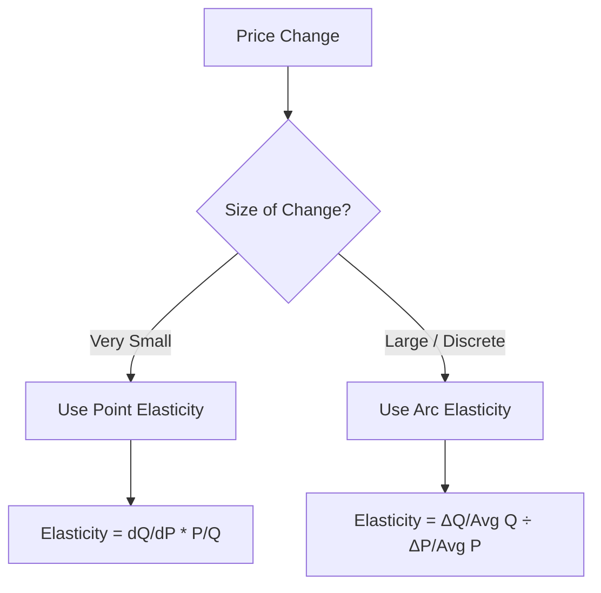

# Measurement of price elasticity Point elasticity and Arc elasticity

## Video Explanation

* [https://www.youtube.com/watch?v=9dZp1kz0L3E](https://www.youtube.com/watch?v=9dZp1kz0L3E)

## Visual Aids

## 1. Definition

Price elasticity of demand measures how much the quantity demanded of a good changes in response to a change in its price. The measurement methods are:

- **Point elasticity** measures elasticity at a single point on the demand curve. It is used for very small price changes.
- **Arc elasticity** measures elasticity over a range (or arc) of the demand curve between two points. It is used when the price change is large.

## 2. Concept Explanation

The basic idea is that we often need to know exactly how sensitive buyers are to a price change. Elasticity is a number, and two common ways to calculate that number are point elasticity and arc elasticity.

Point elasticity works by looking at the slope at one specific point on the demand curve. It uses the original price and quantity and a tiny price change. This method is precise when the demand curve is a smooth, straight line or when the price change is extremely small. For example, if the price of electricity increases by just half a percent, a power company can use point elasticity to estimate the small demand drop.

Arc elasticity is used when a price change is big. If we calculated elasticity using the original point or the new point, we would get two different answers depending on the direction of change. Arc elasticity solves this problem by taking the average of the initial and final prices and quantities. It gives a single, consistent elasticity measure for a stretch of the demand curve. This is important because in real business and engineering decisions, price changes are often significant, not tiny. Knowing the arc elasticity helps in making correct pricing and revenue forecasts.

## 3. Key Characteristics / Features

- **Point elasticity uses derivatives or small ratios.** It is calculated at a precise pair of price and quantity.
- **Point elasticity formula involves the slope of the demand curve.** For a straight-line demand curve, the elasticity changes at every point.
- **Arc elasticity uses averages.** It uses the midpoint of prices and quantities to avoid directional bias.
- **Arc elasticity provides a single value for a segment.** Whether the price rises or falls over that range, the calculated elasticity stays the same.
- **Point elasticity is a theoretical ideal for calculus.** It works best with known demand functions.
- **Arc elasticity is more practical for discrete data.** Real-world price and sales data often come in large jumps, so arc elasticity is applied.

## 4. Types / Classification

Under the measurement of price elasticity, the two approaches are:

- **Point Elasticity Method:** Also called the geometric method. It measures elasticity at an exact point on the demand curve. It is suitable for very small or infinitesimally small price changes.
- **Arc Elasticity Method:** Also called the midpoint method. It measures elasticity over a definite range or arc between two points on the demand curve. It is suitable for substantial price changes.

These are not types of elasticity like elastic or inelastic, but methods to calculate the elasticity coefficient.

## 5. Working / Mechanism

**Point elasticity calculation (using initial values):**
1.  Identify the original price \(P\) and original quantity demanded \(Q\) at that point.
2.  Note the small change in price \(\Delta P\) and the corresponding change in quantity \(\Delta Q\).
3.  Compute the percentage change in quantity: \(\frac{\Delta Q}{Q} \times 100\).
4.  Compute the percentage change in price: \(\frac{\Delta P}{P} \times 100\).
5.  Divide the percentage change in quantity by the percentage change in price. The result is point elasticity.

**Arc elasticity calculation (midpoint method):**
1.  Consider two points: initial price \(P_1\), quantity \(Q_1\), and new price \(P_2\), quantity \(Q_2\).
2.  Calculate the change in quantity: \(\Delta Q = Q_2 - Q_1\).
3.  Calculate the change in price: \(\Delta P = P_2 - P_1\).
4.  Find the average quantity: \(\frac{Q_1 + Q_2}{2}\).
5.  Find the average price: \(\frac{P_1 + P_2}{2}\).
6.  Arc elasticity = \(\frac{\Delta Q}{\text{Average Q}} \div \frac{\Delta P}{\text{Average P}}\). This yields a single elasticity value regardless of whether price moves from \(P_1\) to \(P_2\) or vice versa.

## 6. Diagram

## 7. Mathematical Formulation

**Point Elasticity Formula:**

$$
E_p = \frac{\Delta Q}{\Delta P} \times \frac{P}{Q}
$$

Where:
- \(E_p\) = Price elasticity of demand at a point
- \(\Delta Q\) = Small change in quantity demanded
- \(\Delta P\) = Small change in price
- \(P\) = Original price
- \(Q\) = Original quantity demanded

For very small changes, calculus notation is used: \(E_p = \frac{dQ}{dP} \times \frac{P}{Q}\).

**Arc Elasticity Formula (Midpoint Method):**

$$
E_{arc} = \frac{\frac{Q_2 - Q_1}{(Q_1 + Q_2)/2}}{\frac{P_2 - P_1}{(P_1 + P_2)/2}}
$$

Alternatively:

$$
E_{arc} = \frac{Q_2 - Q_1}{Q_1 + Q_2} \times \frac{P_1 + P_2}{P_2 - P_1}
$$

Where:
- \(P_1, Q_1\) = Initial price and quantity
- \(P_2, Q_2\) = Final price and quantity

## 8. Example

A shop sells 100 bags of cement at ₹400 per bag. When the price is increased to ₹500, sales drop to 60 bags.

**Point elasticity (using initial point, price increase):**
\(P = 400, Q = 100, \Delta P = +100, \Delta Q = -40\)
\(E_p = \frac{-40}{100} \div \frac{100}{400} = -0.4 \div 0.25 = -1.6\) (elastic at this starting point)

**Arc elasticity (using midpoint):**
\(Q_1 = 100, Q_2 = 60, P_1 = 400, P_2 = 500\)
Average quantity = (100 + 60)/2 = 80
Average price = (400 + 500)/2 = 450
\(E_{arc} = \frac{-40/80}{100/450} = \frac{-0.5}{0.2222} = -2.25\)

The absolute arc elasticity is 2.25, giving a single measure for the whole range. Note how the two methods give different numbers because the change is large.

## 9. Analogy

Measuring point elasticity is like checking the steepness of a road at exactly one spot using a tiny spirit level. It tells you how sharply the road rises at that pin-point location. Arc elasticity is like measuring the average steepness of the whole hill between two bus stops. It tells you the overall climb you experience on that entire stretch. If you only check one spot, you might miss the overall effort needed; if you need the overall picture, the average slope (arc) is more useful.

## 10. Comparison

| Feature | Point Elasticity | Arc Elasticity |
|--------|----------|----------|
| **Scope** | Measures elasticity at a single point | Measures elasticity over a range between two points |
| **Best used when** | Price change is infinitesimally small or demand function is known | Price change is large or only discrete data points are available |
| **Formula** | \( (\Delta Q / \Delta P) \times (P/Q) \) | \( (\Delta Q / \text{Avg } Q) / (\Delta P / \text{Avg } P) \) |
| **Directional bias** | Gives different values depending on whether price moves up or down if the change is large | Gives the same elasticity regardless of the direction of price change |
| **Precision** | Exact for a smooth, continuous function | An approximation for the segment |

## 11. Advantages

- **Point elasticity gives precise slope-sensitive estimates.** It is mathematically exact for small changes and helps in theoretical analysis.
- **Point elasticity is easy to compute if the demand equation is known.** With a linear demand curve, elasticity at any point can be found quickly.
- **Arc elasticity avoids direction bias.** It provides a consistent measure whether price increases or decreases between two values.
- **Arc elasticity is practical for real business data.** Firm records show discrete changes (e.g., price change from ₹90 to ₹100), making the midpoint method the right tool.
- **Arc elasticity gives a representative value for a segment.** It is the average responsiveness over that range, useful for planning markdowns or price hikes.

## 12. Disadvantages / Limitations

- **Point elasticity is misleading for large changes.** Using the original price and quantity for a big jump gives a different elasticity than using the new values.
- **Point elasticity requires knowledge of the exact demand function.** Without the function, approximating the slope is difficult.
- **Arc elasticity is only an approximation.** It assumes a linear relationship over the arc, but the true demand curve may be curved.
- **Arc elasticity may hide point-to-point variations.** If the arc covers a large segment, it averages out interesting differences in responsiveness.
- **Both methods assume other factors remain constant.** In reality, income, tastes, or prices of other goods may change simultaneously, distorting elasticity estimation.

## 13. Important Points / Exam Notes

- Point elasticity uses the slope of the demand curve at a specific price-quantity combination.
- For a straight-line demand curve, point elasticity varies from zero to infinity along the curve.
- Arc elasticity uses the average of the two prices and quantities to overcome the problem of inconsistent results.
- The midpoint formula is the standard method for arc elasticity.
- If the price change is small, point elasticity and arc elasticity give nearly identical results.
- The elasticity coefficient is usually negative (due to the law of demand), but we often take the absolute value.
- Arc elasticity is also called the “average elasticity” over a range.
- Formula for arc elasticity: \(E = \frac{Q_2 - Q_1}{Q_2 + Q_1} \times \frac{P_2 + P_1}{P_2 - P_1}\).
- In engineering economics, arc elasticity helps in break-even and pricing decisions when data is discrete.
- Always identify whether the problem requires a point or arc measure based on the size of the price change.

## 14. Applications / Use Cases

- **Pricing policy of a construction material supplier:** A supplier uses arc elasticity to decide whether a 15% price cut on bricks will increase total revenue, by calculating elasticity over the price range.
- **Electricity tariff revision:** A power distribution company uses point elasticity estimates from a known demand function to predict small consumption changes from a 2% tariff hike.
- **Transportation fare analysis:** Metro rail authorities measure arc elasticity of daily ridership when fares are raised from ₹20 to ₹30 to see the effect on revenue and crowd management.
- **Product launch pricing:** A laptop manufacturer uses arc elasticity between two proposed introductory prices to pick the one that maximizes sales revenue.
- **Project feasibility studies:** In a water supply project, engineers estimate arc elasticity of water demand to determine how usage will respond if a volumetric tariff is introduced.

## 15. MCQs

**Q1. Point elasticity of demand measures elasticity at**

A. A range between two points  
B. The midpoint of the demand curve only  
C. A single point on the demand curve  
D. The point where demand is unit elastic only  

**Answer:** C  
**Explanation:** Point elasticity is evaluated at one specific price-quantity combination.

---

**Q2. Arc elasticity uses which of the following to calculate average price and quantity?**

A. Only the original price and quantity  
B. The midpoint of the two prices and two quantities  
C. The slope of the demand curve  
D. The point of maximum revenue  

**Answer:** B  
**Explanation:** Arc elasticity uses the averages \((P_1+P_2)/2\) and \((Q_1+Q_2)/2\) to avoid direction bias.

---

**Q3. When price increases from ₹10 to ₹12 and quantity decreases from 50 to 40, what is the arc elasticity (absolute value)?**

A. 0.5  
B. 1.0  
C. 1.22  
D. 2.5  

**Answer:** C  
**Explanation:** \(\Delta Q = -10\), Avg Q = 45, \(\Delta P = 2\), Avg P = 11. Elasticity = \((-10/45)/(2/11) = (-0.2222)/(0.1818) = -1.22\). Absolute = 1.22.

---

**Q4. The main advantage of arc elasticity over point elasticity is that it**

A. Is easier to calculate using calculus  
B. Eliminates the direction bias for large price changes  
C. Works only for infinitesimally small changes  
D. Gives a different answer for price increase and decrease  

**Answer:** B  
**Explanation:** Arc elasticity yields the same value whether price goes up or down between two points, making it consistent.

---

**Q5. Which formula represents point elasticity?**

A. \(\frac{Q_2 - Q_1}{Q_2 + Q_1} \times \frac{P_2 + P_1}{P_2 - P_1}\)  
B. \(\frac{\Delta Q}{\text{Avg } Q} \div \frac{\Delta P}{\text{Avg } P}\)  
C. \(\frac{\Delta Q}{\Delta P} \times \frac{P}{Q}\)  
D. \(\frac{P_2 - P_1}{P_1} \times 100\)  

**Answer:** C  
**Explanation:** The standard point elasticity formula multiplies the slope ratio by the initial price-quantity ratio.

---

**Q6. For a large price change, using point elasticity with the initial values may**

A. Give the same result as arc elasticity  
B. Give a misleading elasticity value  
C. Yield zero elasticity  
D. Not be possible to calculate  

**Answer:** B  
**Explanation:** A large price change makes the point elasticity dependent on the chosen base, leading to inconsistent results.

---

**Q7. If a demand curve is a straight line, point elasticity**

A. Is constant at all points  
B. Varies from point to point  
C. Is always equal to 1  
D. Is always greater than 1  

**Answer:** B  
**Explanation:** Even though slope is constant, the \(P/Q\) ratio changes, so point elasticity differs along the line.

---

**Q8. Which method is also called the midpoint method?**

A. Point elasticity  
B. Cross elasticity  
C. Arc elasticity  
D. Income elasticity  

**Answer:** C  
**Explanation:** Arc elasticity uses the midpoint of price and quantity to calculate the average elasticity.

---

**Q9. A company raises price from ₹50 to ₹60, and sales drop from 500 to 400. Using arc elasticity, the price elasticity of demand is**

A. -1.0  
B. -0.82  
C. -1.22  
D. -2.0  

**Answer:** C  
**Explanation:** \(\Delta Q = -100\), Avg Q = 450, \(\Delta P = 10\), Avg P = 55. \((-100/450) / (10/55) = -0.2222 / 0.1818 = -1.222\). Absolute 1.22.

---

**Q10. In engineering economics, arc elasticity is preferred over point elasticity when**

A. The demand function is exactly known  
B. Price changes are infinitesimally small  
C. Only discrete price and quantity data are available  
D. The product is perfectly inelastic  

**Answer:** C  
**Explanation:** Real-world data often come as distinct observations; arc elasticity handles such discrete changes reliably.