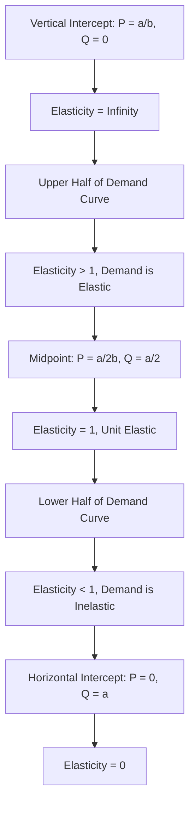

# Variation of price elasticity on a linear demand curve zero to infinity

## Video Explanation

* [https://www.youtube.com/watch?v=1s8p0cQ6f9k](https://www.youtube.com/watch?v=1s8p0cQ6f9k)

## Visual Aids

## 1. Definition

On a straight-line, downward-sloping demand curve, the price elasticity of demand changes at every point. It ranges from infinity at the price-axis intercept to zero at the quantity-axis intercept, passing through unit elasticity exactly at the midpoint of the curve. This continuous variation is a fundamental property of a linear demand function.

## 2. Concept Explanation

The basic idea is that the sensitivity of quantity to price is not the same everywhere on a linear demand curve. Even though the slope of the curve is constant, elasticity depends on both the slope and the specific price and quantity coordinates at that point.

How it works: Price elasticity of demand is calculated as the percentage change in quantity divided by the percentage change in price. Since the slope is fixed, the ratio of price to quantity (P/Q) varies along the curve. At very high prices and tiny quantities (near the vertical intercept), a small price cut causes a huge percentage increase in quantity, making demand infinitely elastic. As we move down the curve, price falls and quantity rises, so the P/Q ratio falls. At the midpoint, the percentage changes in price and quantity are exactly balanced, giving unit elasticity. Further down, near the horizontal intercept, quantity is large and price is tiny; a given percentage price change leads to a very small percentage quantity change, making demand inelastic, finally reaching zero elasticity.

Why it is important: Understanding this variation prevents the common mistake of assuming a product has the same elasticity everywhere. It helps firms set prices in the elastic region to increase revenue and avoid the inelastic region where price cuts reduce revenue. It is essential for accurate analysis of tax incidence and market adjustments.

## 3. Key Characteristics / Features

- **Constant Slope, Varying Elasticity:** The slope (ΔP/ΔQ) is the same along the entire straight line, but elasticity changes continuously.
- **Infinity at the Top:** At the point where quantity demanded is zero, the price elasticity is infinite (perfectly elastic).
- **Unit Elastic at the Midpoint:** Exactly halfway down the linear curve, the elasticity equals one.
- **Zero at the Bottom:** At the point where price is zero, the price elasticity is zero (perfectly inelastic).
- **Direction of Change:** Elasticity decreases steadily as we move down the demand curve from left to right.

## 4. Types / Classification

The linear demand curve can be divided into three distinct segments based on the absolute value of price elasticity:

- **Elastic Segment (Upper Half):** |Ed| > 1. A percentage change in price leads to a larger percentage change in quantity demanded. Total revenue increases when price falls.
- **Unit Elastic Point (Midpoint):** |Ed| = 1. The percentage change in quantity exactly equals the percentage change in price. Total revenue remains constant for a small price change.
- **Inelastic Segment (Lower Half):** |Ed| < 1. A percentage change in price leads to a smaller percentage change in quantity demanded. Total revenue decreases when price falls.

## 5. Working / Mechanism

1.  The demand curve is drawn as a straight line with the formula Q = a - bP, where a and b are positive constants.
2.  The constant slope (ΔQ/ΔP) is equal to -b. This value does not change.
3.  At any point (P, Q), point elasticity is given by Ed = (P/Q) × (ΔQ/ΔP).
4.  Since ΔQ/ΔP is constant, the elasticity depends directly on the ratio P/Q.
5.  At the vertical intercept, Q = 0, so P/Q becomes infinitely large, making elasticity infinite.
6.  Moving downward, price falls and quantity rises, so P/Q decreases, causing elasticity to fall.
7.  At the midpoint P/Q equals |1/(ΔQ/ΔP)|, which makes Ed = -1 (absolute value 1).
8.  At the horizontal intercept, P = 0, so P/Q = 0, making elasticity zero.

## 6. Diagram

## 7. Mathematical Formulation

Consider a linear demand curve:

$$
Q = a - bP \quad \text{or} \quad P = \frac{a}{b} - \frac{1}{b}Q
$$

The point price elasticity of demand is:

$$
E_d = \frac{\Delta Q}{\Delta P} \times \frac{P}{Q}
$$

For this linear curve, $\Delta Q / \Delta P = -b$ (constant). Therefore:

$$
E_d = -b \times \frac{P}{Q}
$$

The absolute value of elasticity is $|E_d| = b \times \frac{P}{Q}$.

- At the vertical intercept, $Q = 0$, so $|E_d| \to \infty$.
- At the midpoint, $Q = a/2$, $P = a/(2b)$, giving $|E_d| = b \times \frac{a/(2b)}{a/2} = 1$.
- At the horizontal intercept, $P = 0$, giving $|E_d| = 0$.

Thus, as we move down the straight line, $|E_d|$ declines continuously from infinity to zero.

## 8. Example

Take the linear demand function: Q = 120 - 4P. The vertical intercept is P = 30 (when Q = 0). The horizontal intercept is Q = 120 (when P = 0). The midpoint is at P = 15, Q = 60.

- At P = 30, Q = 0: Elasticity is infinite.
- At P = 15, Q = 60: $|E_d| = 4 \times \frac{15}{60} = 1$ (unit elastic).
- At P = 5, Q = 100: $|E_d| = 4 \times \frac{5}{100} = 0.2$ (inelastic).
- At P = 0, Q = 120: Elasticity is 0.

This clearly shows elasticity falling from infinity to zero along the curve.

## 9. Analogy

Think of a water slide in a park. At the very top, a tiny push causes a dramatic, fast movement — this is like infinite elasticity where a tiny price drop leads to a huge jump in quantity. Halfway down, you move at a steady, equal pace — unit elasticity where price and quantity changes balance. Near the bottom, you are moving very slowly; a big push barely changes your speed — this is like inelastic demand where large price cuts do not increase quantity much. Finally, at the exit pool, you have stopped completely — zero elasticity.

## 10. Comparison

| Feature | Elastic Segment (|Ed| > 1) | Unit Elastic Point (|Ed| = 1) | Inelastic Segment (|Ed| < 1) |
|--------|---------------------------------|-----------------------------------|-----------------------------------|
| Location on linear curve | Upper half, above midpoint | Exactly at the midpoint | Lower half, below midpoint |
| Change in quantity vs. price | %ΔQ > %ΔP | %ΔQ = %ΔP | %ΔQ < %ΔP |
| Effect of a price fall on total revenue | Total revenue increases | Total revenue stays constant | Total revenue decreases |
| Consumer sensitivity | High sensitivity to price changes | Proportional sensitivity | Low sensitivity to price changes |

## 11. Advantages

- Clarifies that elasticity is not a single number for a product but depends on the current price level.
- Helps businesses avoid pricing in the inelastic zone if the goal is to increase revenue with a price cut.
- Provides a visual guide to segment a market simply by observing where on the demand curve a firm is operating.
- Useful for explaining tax burden distribution: taxes shift supply, and the price effect depends on elasticity at the market equilibrium point.
- Strengthens the understanding of the relationship between slope and elasticity, avoiding confusion among students.

## 12. Disadvantages / Limitations

- Real-world demand curves are rarely perfectly straight lines, so the smooth variation is a simplification.
- The formulation assumes that the linear relationship remains valid for the entire price range, which may not hold in extreme conditions.
- Other factors like consumer loyalty, brand strength, and the presence of close substitutes can distort the clean stepwise pattern.
- Measuring the exact quantity intercept in a market is often impossible because no firm charges a price of zero.
- It does not account for long-run adjustments where consumer behaviour and technology may change the slope itself.

## 13. Important Points / Exam Notes

- On a linear demand curve, the slope (ΔP/ΔQ or ΔQ/ΔP) is constant, but elasticity is not constant.
- Elasticity = (P/Q) × (1 / slope in absolute terms). It varies because the P/Q ratio changes.
- The demand is elastic above the midpoint, unit elastic at the midpoint, and inelastic below the midpoint.
- At the vertical intercept, Q=0, so elasticity → ∞; at the horizontal intercept, P=0, so elasticity = 0.
- A price cut increases total revenue only in the elastic portion; it reduces revenue in the inelastic portion.

## 14. Applications / Use Cases

- **Pricing Strategy:** A mobile phone company that finds its current sales in the lower half of its estimated linear demand curve will avoid price cuts and consider price rises to boost total revenue.
- **Government Tax Policy:** To collect maximum tax with minimal deadweight loss, policy planners target goods whose market equilibrium lies in the inelastic portion of the demand curve, such as cigarettes.
- **Business Forecasting:** Managers quickly assess whether a planned discount will raise revenue by locating their current price relative to the midpoint of the empirical demand curve.
- **Market Entry:** A new firm entering a market evaluates if existing competitors are operating in the elastic or inelastic zone to decide its own pricing approach.
- **Agricultural Markets:** Farmers often face demand that lies in the inelastic portion for staple foods, meaning a bumper crop can lower total revenue due to price drops.

## 15. MCQs

**Q1. On a linear demand curve, the price elasticity of demand is infinite at the point where:**

A. Quantity demanded is maximum  
B. Price is zero  
C. Quantity demanded is zero  
D. The curve intersects the midpoint  
**Answer:** C  
**Explanation:** At zero quantity, the ratio P/Q becomes infinitely large, making elasticity infinite.

**Q2. The midpoint of a linear demand curve is characterized by which elasticity value?**

A. 0  
B. Infinity  
C. 1  
D. 0.5  
**Answer:** C  
**Explanation:** Exactly at the midpoint, percentage changes in price and quantity are equal, so Ed = -1, absolute value 1.

**Q3. If a firm is operating in the inelastic segment of its linear demand curve, a small decrease in price will cause total revenue to:**

A. Increase  
B. Decrease  
C. Remain constant  
D. Double  
**Answer:** B  
**Explanation:** In the inelastic zone (%ΔQ < %ΔP), a price fall reduces total revenue because the gain from more sales does not compensate for the lower price.

**Q4. The slope of a linear demand curve is constant, yet elasticity varies because it also depends on:**

A. Advertising expenditure  
B. The number of buyers  
C. The P/Q ratio  
D. The price of substitutes  
**Answer:** C  
**Explanation:** Ed = (ΔQ/ΔP) × (P/Q). With a constant first term, elasticity moves with the P/Q ratio.

**Q5. A demand function is given by Q = 200 – 5P. At P = 10, the absolute value of price elasticity is:**

A. 0.33  
B. 0.5  
C. 1.0  
D. 2.0  
**Answer:** B  
**Explanation:** Q at P=10 is 200 – 50 = 150. ΔQ/ΔP = -5, so |Ed| = 5 × (10/150) = 0.5.

**Q6. The segment of the linear demand curve where total revenue increases when price is reduced is the:**

A. Inelastic segment  
B. Elastic segment  
C. Unit elastic segment  
D. Horizontal intercept  
**Answer:** B  
**Explanation:** In the elastic region, quantity increase outweighs the price drop, pushing total revenue up.

**Q7. At the horizontal intercept of a linear demand curve, the price elasticity of demand equals:**

A. Infinity  
B. 1  
C. 0  
D. -1  
**Answer:** C  
**Explanation:** Price is zero, so P/Q = 0, making elasticity zero regardless of the slope.

**Q8. Which statement is true about a straight-line demand curve?**

A. Elasticity is constant at all points  
B. Elasticity increases as we move down the curve  
C. Elasticity decreases as we move down the curve  
D. Elasticity is negative only in the upper half  
**Answer:** C  
**Explanation:** As price falls and quantity rises, the P/Q ratio drops, so elasticity continuously decreases.

**Q9. The midpoint of the demand curve Q = 100 – 2P occurs at which price and quantity?**

A. P=50, Q=0  
B. P=25, Q=50  
C. P=20, Q=60  
D. P=0, Q=100  
**Answer:** B  
**Explanation:** The vertical intercept is P=50, horizontal is Q=100. The midpoint price is (50+0)/2 = 25, corresponding quantity = 100 – 2×25 = 50.

**Q10. Understanding the variation of elasticity along a linear demand curve helps a manager primarily to:**

A. Design the product packaging  
B. Decide whether a price reduction will boost revenue  
C. Calculate the number of employees needed  
D. Determine the firm's credit policy  
**Answer:** B  
**Explanation:** Knowing the current elasticity segment tells if a price cut or increase will move total revenue in the desired direction.