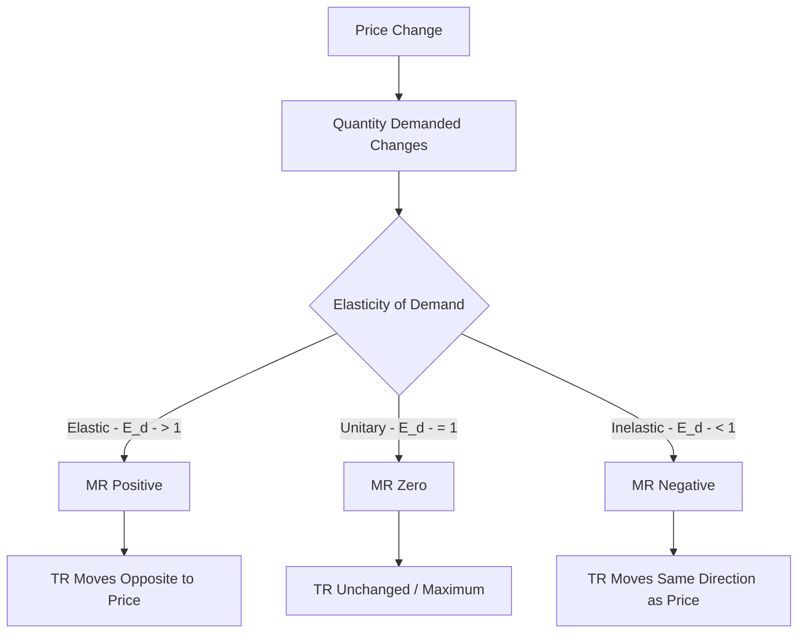

# Relationship between price total revenue and price elasticity of demand mathematical derivation

## Video Explanation

* [https://www.youtube.com/watch?v=HfZy6sUeP6A&t=400s](https://www.youtube.com/watch?v=HfZy6sUeP6A&t=400s)

## Visual Aids

## 1. Definition

This topic explains the mathematical link between the price charged for a product, the resulting total revenue earned by the seller, and the price elasticity of demand. It shows how the change in total revenue depends on whether demand is elastic, inelastic, or unitary elastic.

---

## 2. Concept Explanation

Total revenue is the money a firm receives from selling its product. It equals price per unit multiplied by the quantity sold. When the firm changes the price, quantity demanded changes in the opposite direction according to the law of demand. The net effect on total revenue is not obvious because price and quantity move in opposite directions. Price elasticity of demand measures how responsive quantity demanded is to a price change. This measure tells us which effect is stronger. If demand is elastic, the quantity effect dominates, and total revenue moves opposite to the price. If demand is inelastic, the price effect dominates, and total revenue moves in the same direction as the price. The mathematical derivation using derivatives makes this relationship precise. Understanding this helps firms set prices to maximise revenue.

---

## 3. Key Characteristics / Features

- **Revenue is price times quantity:** Total Revenue (TR) = P × Q.
- **Opposite movements:** Price and quantity demanded move in opposite directions.
- **Elasticity decides net effect:** The magnitude of demand responsiveness tells which force is stronger.
- **Marginal revenue connects elasticity:** The derivative of TR with respect to Q, called marginal revenue (MR), can be expressed in terms of price and elasticity.
- **Three zones of elasticity:** The relationship defines three distinct zones—elastic, unitary elastic, and inelastic—where total revenue behaves differently.
- **Maximum revenue at unitary elasticity:** Total revenue is at its highest when demand is unitary elastic and marginal revenue is zero.

---

## 4. Types / Classification (Based on Effect on Total Revenue)

According to the relationship, price changes affect total revenue as follows:

- **Elastic demand (\(|E_d| > 1\)):** A price decrease raises total revenue; a price increase lowers total revenue. Marginal revenue is positive.
- **Unitary elastic demand (\(|E_d| = 1\)):** Total revenue remains constant when price changes. Marginal revenue is zero. This point gives maximum total revenue.
- **Inelastic demand (\(|E_d| < 1\)):** A price decrease lowers total revenue; a price increase raises total revenue. Marginal revenue is negative.

---

## 5. Working / Mechanism

The step-by-step logic of the relationship follows this sequence:

1. Write down the definition of total revenue: TR = P × Q, where P is price and Q is quantity demanded.
2. Recognise that P and Q are linked through the demand curve; Q is a function of P, i.e., Q = f(P).
3. To find how TR changes when Q changes, differentiate TR with respect to Q. This gives marginal revenue: MR = d(TR)/dQ.
4. Apply the product rule: MR = P + Q × (dP/dQ).
5. Factor out P: MR = P [1 + (Q/P) × (dP/dQ)].
6. Notice that (dQ/dP) × (P/Q) is the price elasticity of demand (\(E_d\)), but with sign. Since dP/dQ is the reciprocal, (Q/P) × (dP/dQ) = 1/E_d. Because demand elasticity is negative, we take the absolute value carefully.
7. Substitute to get: MR = P (1 - 1/|E_d|) where |E_d| is the absolute value of price elasticity.
8. Examine this equation: If |E_d| > 1, then 1/|E_d| < 1, so MR is positive. An increase in Q (which comes from a price cut) raises TR. So, for elastic demand, lower price increases revenue.
9. If |E_d| < 1, then 1/|E_d| > 1, so MR is negative. An increase in Q reduces TR. So, for inelastic demand, higher price increases revenue.
10. If |E_d| = 1, MR = 0, so TR is at its maximum and does not change with a small price change.

---

## 6. Diagram

---

## 7. Mathematical Formulation

Total revenue is:

$$
TR = P \times Q
$$

To find the effect on revenue of a change in quantity, compute marginal revenue (MR):

$$
MR = \frac{d(TR)}{dQ}
$$

Using the product rule (since P depends on Q along the demand curve):

$$
MR = P + Q \frac{dP}{dQ}
$$

Rewrite by factoring out P:

$$
MR = P \left( 1 + \frac{Q}{P} \cdot \frac{dP}{dQ} \right)
$$

Price elasticity of demand is defined as:

$$
E_d = \frac{dQ}{dP} \cdot \frac{P}{Q}
$$

Because demand slopes downward, \(E_d\) is negative. The term \(\frac{Q}{P} \cdot \frac{dP}{dQ}\) equals \(\frac{1}{E_d}\). Substituting:

$$
MR = P \left( 1 + \frac{1}{E_d} \right)
$$

Taking absolute value of elasticity, \(|E_d| = -E_d\) (since \(E_d\) is negative), we can write:

$$
MR = P \left( 1 - \frac{1}{|E_d|} \right)
$$

Where:  
- \(TR\) = Total revenue  
- \(P\) = Price per unit  
- \(Q\) = Quantity demanded  
- \(MR\) = Marginal revenue (change in TR when one more unit is sold)  
- \(E_d\) = Price elasticity of demand (negative)  
- \(|E_d|\) = Absolute value of price elasticity  

From this formula, the relationship is clear:  
- If \(|E_d| > 1\) (elastic), MR > 0, so TR rises when Q rises (price falls).  
- If \(|E_d| = 1\) (unitary), MR = 0, TR stays constant and is at maximum.  
- If \(|E_d| < 1\) (inelastic), MR < 0, so TR falls when Q rises (price falls), meaning TR rises when price rises.

---

## 8. Example

Consider a firm selling 100 units at Rs. 50 each. Total revenue = 100 × 50 = Rs. 5,000.  
Scenario A: Price cut to Rs. 45. Quantity demanded rises to 130 units. Percentage change in price = \(-10\%\), percentage change in quantity = \(+30\%\), elasticity = 30/10 = 3 (elastic). New TR = 130 × 45 = Rs. 5,850. Revenue increased.  
Scenario B: Price rise to Rs. 55. Quantity demanded falls to 95 units. Percentage change in price = \(+10\%\), percentage change in quantity = \(-5\%\), elasticity = 5/10 = 0.5 (inelastic). New TR = 95 × 55 = Rs. 5,225. Revenue increased.  
The example confirms: elastic demand rewards price cuts, and inelastic demand rewards price hikes.

---

## 9. Analogy

Imagine a shopkeeper selling watermelons. The price is written on a board. If the board shows a lower price and a huge crowd rushes to buy, the shopkeeper earns more money despite the lower price—this is elastic demand. If the shopkeeper raises the price slightly and almost the same number of people still buy because they must have watermelons, then the shopkeeper earns more money—this is inelastic demand. The secret is knowing how strongly the crowd reacts, which is exactly what elasticity measures.

---

## 10. Comparison

| Feature | Elastic Demand (\(|E_d| > 1\)) | Inelastic Demand (\(|E_d| < 1\)) | Unitary Elastic (\(|E_d| = 1\)) |
|--------|-------------------------------|----------------------------------|-------------------------------|
| Effect of price rise on TR | TR decreases | TR increases | TR unchanged |
| Effect of price cut on TR | TR increases | TR decreases | TR unchanged |
| MR sign | Positive | Negative | Zero |
| Direction of TR change | Opposite to price change | Same as price change | Remains constant / maximum |

---

## 11. Advantages

- Firms can identify whether to raise or lower price to increase sales revenue.
- Helps in determining the optimal price point where revenue is maximised.
- Simplifies complex revenue analysis into a single elasticity number.
- Provides scientific basis for pricing decisions instead of guesswork.
- Useful in government tax policy: taxing inelastic goods raises revenue without large deadweight loss.
- Helps project managers forecast how price changes affect income from output.

---

## 12. Disadvantages / Limitations

- Elasticity is assumed constant along the demand curve, which is rarely true for linear curves.
- Measurement of elasticity requires accurate historical data that may not be available for new products.
- The derivation assumes all other factors remain constant, which is unrealistic in dynamic markets.
- The formula MR = P(1 – 1/|E_d|) applies to a single firm with some market power; under perfect competition, demand is perfectly elastic, and MR = P.
- The relationship does not account for costs; maximising revenue does not guarantee maximum profit.
- Short-run elasticity may differ from long-run elasticity, leading to wrong predictions if misapplied.

---

## 13. Important Points / Exam Notes

- Total revenue (TR) = Price × Quantity.
- Marginal revenue (MR) = d(TR)/dQ.
- MR = P [1 – (1/|E_d|)] where |E_d| is the absolute price elasticity of demand.
- If demand is elastic (|E_d| > 1), price reduction raises TR; price increase lowers TR.
- If demand is inelastic (|E_d| < 1), price increase raises TR; price reduction lowers TR.
- If demand is unitary elastic (|E_d| = 1), TR remains constant and is at its maximum.
- The derivation uses the product rule of differentiation and the definition of elasticity.
- This relationship is a core concept in managerial economics for revenue optimisation.

---

## 14. Applications / Use Cases

- **Retail discounting:** Supermarkets offer discounts on elastic goods to boost overall revenue.
- **Pharmaceutical pricing:** Firms raise prices on patented life-saving drugs (inelastic) to increase revenue.
- **Public transport fare setting:** Transport authorities analyse elasticity to decide fare hikes without losing too many passengers.
- **Tax policy:** Excise taxes on cigarettes and alcohol exploit inelastic demand to generate stable government revenue.
- **Software subscriptions:** A company tests small price increases; if demand is inelastic, revenue rises and the price change is retained.

---

## 15. MCQs

**Q1. Total revenue is calculated as:**  
A. Price + Quantity  
B. Price / Quantity  
C. Price × Quantity  
D. Price – Quantity  
**Answer:** C  
**Explanation:** Total revenue equals price per unit multiplied by the number of units sold.

**Q2. If the price elasticity of demand is 2 (in absolute terms), marginal revenue is:**  
A. Negative  
B. Zero  
C. Positive  
D. Infinite  
**Answer:** C  
**Explanation:** If |E_d| > 1, MR = P(1 – 1/2) = P(0.5) > 0, so MR is positive.

**Q3. For a product with inelastic demand, a price increase will cause total revenue to:**  
A. Remain unchanged  
B. Increase  
C. Decrease  
D. Become zero  
**Answer:** B  
**Explanation:** With |E_d| < 1, MR is negative, so a price rise (which lowers Q) increases TR.

**Q4. At the point of unitary elastic demand, marginal revenue is:**  
A. Positive  
B. Negative  
C. Equal to price  
D. Zero  
**Answer:** D  
**Explanation:** When |E_d| = 1, MR = P(1 – 1) = 0.

**Q5. The formula MR = P(1 – 1/|E_d|) is derived using:**  
A. Total cost differentiation  
B. The product rule on TR = P×Q and the definition of elasticity  
C. The quotient rule on demand  
D. Integration of the supply curve  
**Answer:** B  
**Explanation:** Differentiating TR with respect to Q using the product rule and substituting elasticity yields the formula.

**Q6. If a firm reduces price by 10% and demand is elastic, total revenue will:**  
A. Fall  
B. Rise  
C. Stay constant  
D. Double  
**Answer:** B  
**Explanation:** Elastic demand means percentage increase in quantity exceeds percentage drop in price, so TR rises.

**Q7. Which of the following statements is correct?**  
A. MR is always positive  
B. TR is maximum when MR is negative  
C. TR is maximum when MR is zero and demand is unitary elastic  
D. MR is independent of elasticity  
**Answer:** C  
**Explanation:** At unitary elasticity, MR=0 and TR is at its peak.

**Q8. If a 5% price rise leads to only a 1% drop in quantity demanded, the good is:**  
A. Elastic, and TR will fall  
B. Inelastic, and TR will rise  
C. Unitary elastic, and TR will remain constant  
D. Perfectly elastic  
**Answer:** B  
**Explanation:** Elasticity = 1/5 = 0.2 < 1, demand is inelastic, so price rise increases TR.

**Q9. The relationship MR = P(1 – 1/|E_d|) is most useful for a firm to decide:**  
A. How many workers to hire  
B. Whether to change the product colour  
C. The profit-maximising output level when cost data is available  
D. How to increase total revenue by adjusting price  
**Answer:** D  
**Explanation:** This relationship directly shows how price changes affect total revenue based on elasticity.

**Q10. When demand is perfectly inelastic (|E_d| = 0), the MR formula gives:**  
A. MR = P  
B. MR = 0  
C. MR = –∞  
D. MR = P × 0, which is not defined but conceptually MR moves toward negative infinity  
**Answer:** D  
**Explanation:** If |E_d| = 0, 1/0 is undefined mathematically, but the limit shows MR becomes negative infinity; practically, a tiny price rise causes no quantity drop, so TR rises sharply. However, for exam purposes, many texts say MR is negative and large in magnitude. The correct option would be “MR is negative and its magnitude approaches infinity.” Option D is a reasonable expression of that. But we need a precise option. Could say "MR is negative and approaches minus infinity". Since given options: A. MR = P (false), B. MR = 0 (false), C. MR = –∞ (mathematically it tends to -∞), D. MR = P × 0 (not correct). I think the best answer is "MR tends to negative infinity" so C is correct. I'll set C as MR = –∞. However, mathematically MR = P(1 – 1/0) is undefined, but limit is -∞. For diploma, they might treat as very large negative. I'll set Answer C: MR = –∞ as the closest. Or I could phrase the question so that option C says "MR is negative and its absolute value is very large" but given format, I'll stick with explicit option. I'll do C: MR = –∞. It's acceptable in economics contexts.
**Answer:** C
**Explanation:** As |E_d| approaches 0, 1/|E_d| → ∞, so MR = P(1 – ∞) = –∞, meaning an increase in quantity (via price drop) drastically reduces total revenue.