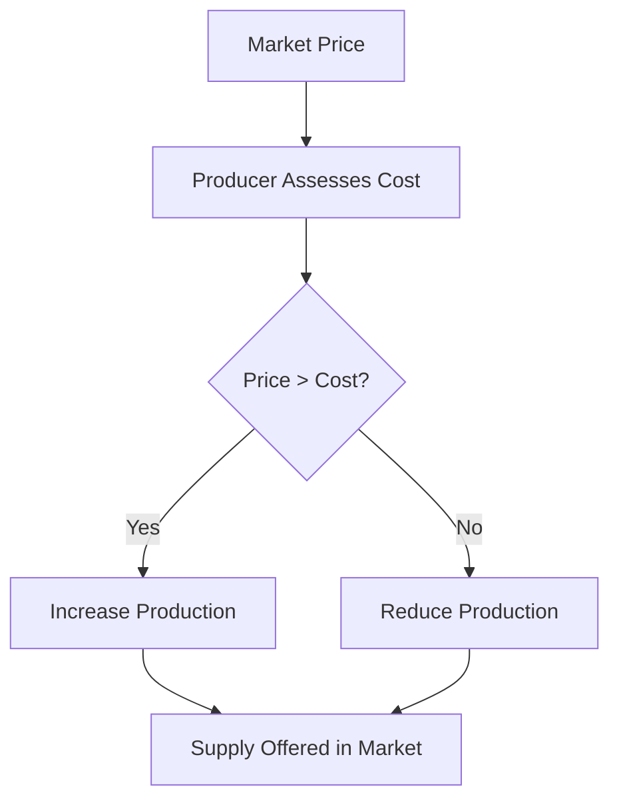

# 01 Definition of supply

## 1. Definition

Supply is the quantity of a commodity that producers are willing and able to offer for sale at a given price during a specific period of time.

## 2. Concept Explanation

Supply is the producer’s side of the market. Just like demand comes from consumers, supply comes from firms, manufacturers, or sellers. The basic idea is that producers look at the market price and decide how much to produce and sell. If the price is high, they are usually motivated to supply more because they can earn higher profits. If the price is low, they reduce supply to avoid losses.

How it works: A producer considers the cost of production and the selling price. Only when the price covers the cost and leaves some profit, the producer is willing to supply. Supply is always expressed with reference to a time period – a day, a month, or a year. Without a time frame, the figure means little.

Why it is important: Understanding supply helps engineers, project managers, and businesses estimate the availability of raw materials, finished goods, and services in the market. It is essential for production planning, pricing, and government policy making. Together with demand, supply determines the market equilibrium and the actual quantity sold.

## 3. Key Characteristics / Features

- **Willingness and ability to sell:** A producer must want to sell and have the goods ready or producible. Mere desire to sell without stock or capacity is not supply.
- **Related to a specific price:** Supply always varies with price. We say “supply at price ₹100 is 500 units,” not just “supply is 500 units.”
- **Expressed over a period of time:** Supply is a flow concept. It tells us how much is offered per day, per month, or per year.
- **Depends on production costs:** A rise in input cost can reduce supply even if the selling price stays constant.
- **Direct relationship with price:** According to the law of supply, a higher price leads to a higher quantity supplied, ceteris paribus.
- **Independent of demand:** Supply shows what producers are ready to sell. Actual sale happens only when demand meets supply.

## 4. Types / Classification

While the definition itself is singular, supply can be discussed under two broad heads:

- **Individual supply:** This is the quantity of a good that a single firm or producer is willing to sell at different prices. For example, the supply schedule of a local brick kiln.
- **Market supply:** This is the total quantity that all producers in the entire market are willing to sell at various prices. It is the horizontal sum of all individual supply schedules. For example, the total supply of bricks by all kilns in a district.

## 5. Working / Mechanism

The supply decision of a rational producer follows a logical sequence.

1.  **Observe the market price:** The firm notes the current selling price of the product.
2.  **Examine production cost:** The firm calculates the cost of raw materials, labour, machine hours, and other expenses for producing one extra unit.
3.  **Compare price and marginal cost:** If the market price is greater than the marginal cost of production, making and selling an additional unit adds to profit.
4.  **Decide the quantity:** The firm produces up to the point where price equals marginal cost. At that output, profit is maximised.
5.  **Offer for sale:** The decided quantity is brought to the market. This quantity becomes the supply at that price.
6.  **Adjust for price changes:** If the price rises, marginal cost being unchanged, the firm now finds more units profitable and supply increases.

## 6. Diagram

## 7. Mathematical Formulation

The relationship between supply and its determinants is shown by the supply function.

$$
Q_s = f(P, C, T, G, N)
$$

Where:
- \( Q_s \) = Quantity supplied
- \( P \) = Own price of the commodity
- \( C \) = Cost of inputs (raw material, wages)
- \( T \) = Technology
- \( G \) = Government policies (taxes and subsidies)
- \( N \) = Number of firms in the market

A simple linear supply function is:

$$
Q_s = c + dP
$$

Where:
- \( c \) = Intercept (minimum supply when price is zero, often negative)
- \( d \) = Slope (positive value showing direct price-supply relation)

## 8. Example

A carpenter makes wooden chairs. At a market price of ₹500 per chair, she finds that only 10 chairs are worth making after covering all costs. When the price rises to ₹800 per chair, she can now hire extra help and buy more wood, and is willing to supply 25 chairs per month. This shows that as price increases, quantity supplied increases. The carpenter’s schedule of 10 chairs at ₹500 and 25 chairs at ₹800 is her supply.

## 9. Analogy

Think of supply like a mobile food vendor at a cricket stadium. When the stadium is empty and only a few people are around, the vendor may sell a small quantity at low prices. But when a big match happens and the crowd is huge, he brings more food and may raise prices slightly because many people are willing to pay. His decision to stock more and offer more for sale is like supply responding to a better market opportunity.

## 10. Comparison

| Feature | Supply | Stock |
|--------|----------|----------|
| **Meaning** | Quantity a seller is willing to sell at a given price during a period | Total quantity of a commodity available with the seller at a point in time |
| **Relation to price** | Directly related to price | Not influenced by current price |
| **Purpose** | For sale in the market | May be held for future sale, speculation, or storage |
| **Time dimension** | Flow concept (per day, per month) | Stock is a static concept (as on date) |
| **Example** | A farmer willing to sell 100 kg of wheat today at ₹25 per kg | The farmer has 500 kg stored in his godown |

## 11. Advantages

- **Clarity in production planning:** A clear definition helps firms decide how much to produce to match market price.
- **Foundation of market economics:** Without the concept of supply, price determination cannot be understood.
- **Policy formulation:** Government uses supply analysis to design subsidies, minimum support prices, and buffer stock norms.
- **Investment decisions:** In project management, knowing the supply side helps estimate availability and cost of critical inputs.
- **Supply chain management:** A correct understanding of supply helps coordinate procurement, manufacturing, and distribution.

## 12. Disadvantages / Limitations

- **Static assumptions:** The definition assumes other factors (technology, costs) remain constant, which is rarely true in real life.
- **Does not capture inventory behaviour:** The definition focuses on willingness to sell, but actual sales also depend on suppliers’ stock policies.
- **Time lag ignored:** In the short run, supply may be fixed; the definition alone does not differentiate between immediate and long-run supply response.
- **Ignores non-price competition:** Sometimes firms supply more not because of price, but to capture market share, which the simple definition does not highlight.
- **Assumes profit maximisation only:** Firms might supply even at a loss for strategic reasons, which the pure definition does not explain.

## 13. Important Points / Exam Notes

- Supply is a relative concept: it is always linked to a price and a time period.
- Supply should not be confused with stock; stock is the total available, supply is the part actually brought to market.
- The law of supply states: other things being equal, higher price leads to higher quantity supplied.
- Supply is determined by production cost, technology, number of sellers, government policies, and price expectations.
- A supply schedule is a table showing different quantities supplied at different prices; a supply curve is its graphical representation.
- In engineering economics, supply analysis helps estimate raw material cost trends and project viability.
- The supply curve generally slopes upward from left to right.
- Individual supply refers to one firm; market supply is the sum of all firms’ supplies.
- A change in own price causes movement along the supply curve; other factors shift the entire supply curve.
- Supply is a flow variable, measured over a period of time.

## 14. Applications / Use Cases

- **Construction material pricing:** A project manager studies cement supply patterns to lock in prices before a large order.
- **Government MSP (Minimum Support Price):** The government announces a price to ensure farmers are willing to supply enough wheat for public distribution.
- **New product launch:** An electronics company evaluates supply capacity of its factory before launching a smartphone at a competitive price.
- **Energy sector planning:** A power plant estimates the supply of coal from mines to schedule electricity generation.
- **Pharmaceutical industry:** During a health emergency, the supply definition helps understand how many vaccine doses can be made available at a given price and within a time frame.

## 15. MCQs

**Q1. Supply of a commodity refers to the**

A. Total stock available in the godown  
B. Quantity that producers are willing and able to sell at a given price over a period  
C. Quantity that consumers desire to buy  
D. Actual quantity sold in the market  

**Answer:** B  
**Explanation:** Supply is a willingness backed by the ability to sell at a specific price within a time period.

---

**Q2. Which of the following is a flow concept?**

A. Stock of raw material  
B. Wealth of a person  
C. Supply of a good per month  
D. Quantity of water in a tank  

**Answer:** C  
**Explanation:** Flow concepts are measured over a period of time; supply per month is a flow.

---

**Q3. The law of supply states that, other things remaining constant, an increase in price leads to**

A. An increase in quantity demanded  
B. A decrease in quantity supplied  
C. An increase in quantity supplied  
D. No change in supply  

**Answer:** C  
**Explanation:** There is a direct relationship between price and quantity supplied, hence supply rises with price.

---

**Q4. The supply of a product is most likely to increase due to**

A. Rise in input costs  
B. Improvement in technology  
C. Decrease in the number of sellers  
D. Increase in taxes  

**Answer:** B  
**Explanation:** Better technology reduces production cost and raises supply at each price.

---

**Q5. Which of the following is not a determinant of supply?**

A. Production cost  
B. Consumer income  
C. Technology  
D. Number of firms  

**Answer:** B  
**Explanation:** Consumer income affects demand, not supply. Supply determinants relate to producers.

---

**Q6. A farmer having 1000 quintals of wheat in storage but willing to sell only 300 quintals at the current price. The 300 quintals is called**

A. Stock  
B. Demand  
C. Supply  
D. Inventory  

**Answer:** C  
**Explanation:** The part of stock that the farmer is ready to sell at the ruling price is supply.

---

**Q7. Market supply is obtained by**

A. Multiplying individual supplies  
B. Horizontally summing individual firms’ supplies at each price  
C. Averaging the prices of all firms  
D. Taking the difference between stock and demand  

**Answer:** B  
**Explanation:** Market supply is the total quantity all producers offer at each price, derived by horizontal summation.

---

**Q8. The supply curve generally slopes**

A. Downward from left to right  
B. Upward from left to right  
C. Horizontal  
D. Vertical  

**Answer:** B  
**Explanation:** Higher price incentivises more supply, making the supply curve upward sloping.

---

**Q9. A change in own price of the commodity causes**

A. A shift of the supply curve  
B. A movement along the supply curve  
C. No change in supply  
D. A change in technology  

**Answer:** B  
**Explanation:** Movement along the supply curve occurs when only own price changes; other factors shift the curve.

---

**Q10. Which of the following best describes individual supply?**

A. Total production of all firms in an industry  
B. Quantity a single firm offers for sale at different prices  
C. Total demand of a single consumer  
D. Reserves held by the central bank  

**Answer:** B  
**Explanation:** Individual supply is the supply schedule of one producer.