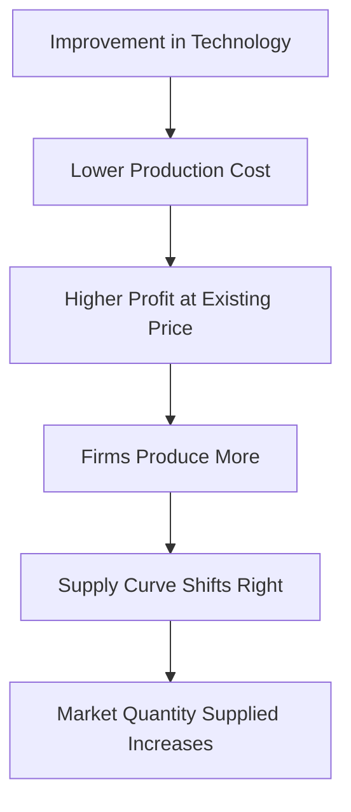

# Determinants of Supply

## 1. Definition

Determinants of supply are the various factors, other than the good's own price, that affect the quantity of a product that producers are willing and able to offer for sale. A change in any of these factors causes the entire supply curve to shift left or right.

## 2. Concept Explanation

The supply of a product does not depend only on its selling price. Many other elements influence how much firms want to produce and sell. Together, these are called the determinants of supply. The basic idea is simple. If any of these factors changes, the producers' willingness or ability to supply the good also changes.

This works through the production cost and profit motive. For example, if the price of an input like raw material falls, it becomes cheaper to make the product. Producers now earn more profit at the same selling price, so they are willing to supply more. The entire supply curve shifts to the right. Conversely, if a determinant like a new tax increases costs, supply decreases and the curve shifts left. Understanding these determinants is important because it helps businesses plan production, allows governments to predict policy impacts, and enables economists to explain market changes and price movements.

## 3. Key Characteristics / Features

- **Shift Factors:** These factors shift the entire supply curve. A rightward shift means an increase in supply; a leftward shift means a decrease in supply.
- **Ceteris Paribus Assumption:** The law of supply (positive relationship between price and quantity supplied) holds only when these determinants are constant.
- **Cost-Driven:** Most determinants influence supply by changing the cost of production or the profitability of producing the good.
- **Producer-Side Focus:** These factors relate to the sellers' capacity, technology, and incentives, not directly to consumer preferences.
- **Time-Dependent:** Some determinants, like technology, have long-term effects, while others, like weather, cause short-term supply changes.

## 4. Types / Classification

The major determinants that shift the supply curve can be classified as follows:

- **Input Prices (Factor Costs):** Prices of raw materials, labour, energy, and machinery. A rise in input prices increases production cost and decreases supply.
- **Technology:** Improvements in technology reduce production costs and increase supply. Obsolete technology may decrease supply.
- **Number of Sellers:** More firms entering the market increase total market supply. Exit of firms reduces supply.
- **Prices of Related Goods in Production:**
    - *Substitutes in Production (Competitive Supply):* If the price of wheat rises, farmers may shift land from maize to wheat, reducing maize supply.
    - *Complements in Production (Joint Supply):* An increase in the supply of beef also increases the supply of leather, as they are produced together.
- **Producer Expectations:** If firms expect the market price to rise in the future, they may hold back current supply to sell later. If a fall is expected, they rush to sell now.
- **Government Policies:** Taxes and subsidies. A tax increases cost and reduces supply. A subsidy reduces cost and increases supply. Regulations can also impact costs.
- **Natural Conditions and Other Factors:** Weather, pests, and diseases affect agricultural supply. Infrastructure and transport facilities also influence supply capacity.

## 5. Working / Mechanism

1.  A change occurs in one of the non-price determinants, for example, a reduction in the price of steel used to make cars.
2.  This directly lowers the cost of production for car manufacturers.
3.  At every possible selling price, producing cars now yields higher profits.
4.  Motivated by profit, firms increase their production quantity.
5.  Graphically, the supply curve shifts to the right, meaning a larger quantity is supplied at each price.
6.  The market moves toward a new equilibrium with a lower equilibrium price and higher quantity, assuming demand is unchanged.
7.  If the change were an increase in a cost (like a tax), the supply curve would shift left, raising price and lowering quantity.

## 6. Diagram

## 7. Mathematical Formulation

A general supply function expresses quantity supplied as a function of its determinants.

$$
Q_s = f(P, P_i, T, N, E, G, Z)
$$

Where:
- $Q_s$ = Quantity supplied of the good
- $P$ = Own price of the good (causes movement along the curve)
- $P_i$ = Prices of inputs (labour, raw materials)
- $T$ = Technology level
- $N$ = Number of sellers in the market
- $E$ = Producer expectations about future prices
- $G$ = Government policy variables (taxes and subsidies)
- $Z$ = Other factors like weather, infrastructure

## 8. Example

Consider the market for unbranded notebooks. A new paper-cutting machine is introduced that halves the time required to produce each notebook. This technology improvement drastically cuts the cost per notebook. As a result, at the same market price of ₹40 per notebook, manufacturers are now willing to supply a much larger quantity. The entire supply curve for notebooks shifts to the right, increasing the total number of notebooks available in the market.

## 9. Analogy

Think of a supply as a restaurant kitchen. The own price is like customer demand, but the supply of dishes depends on many other things. Input prices are the cost of vegetables; technology is the efficiency of the chef's oven; number of sellers is how many competing restaurants are on the street. If vegetables become cheaper, the kitchen can cook and serve more dishes even if menu prices remain the same. If the government imposes a new health regulation fee, the kitchen loses money and reduces its output. All these factors shift how much food the restaurant is willing to put out.

## 10. Comparison

| Feature | Change in Quantity Supplied | Change in Supply |
|--------|----------|----------|
| Cause | Change in the good's own price | Change in any non-price determinant (input costs, technology, etc.) |
| Graphical Effect | Movement along the same supply curve | Shift of the entire supply curve to the left or right |
| Assumption | All other determinants are held constant | The good's own price is held constant |
| Example | A rise in milk price increases the quantity of milk supplied | A drop in cattle feed price shifts the milk supply curve rightward |

## 11. Advantages

- Enables firms to forecast how changes in raw material costs will affect their production plans.
- Helps policymakers design effective subsidies or taxes to influence market supply.
- Allows businesses to react strategically to new technologies and stay competitive.
- Useful for predicting the impact of entry or exit of competitors on total market output.
- Enhances understanding of agricultural output cycles and seasonal price fluctuations.

## 12. Disadvantages / Limitations

- In the short run, some determinants like technology or number of firms cannot be changed easily.
- Real-world supply response is often delayed due to production lags, making predictions difficult.
- Measuring the exact impact of a single determinant is challenging because many factors change simultaneously.
- Producers do not always behave purely rationally; elements like risk aversion can alter supply decisions.
- Government policies may have unintended consequences that the basic model cannot capture.

## 13. Important Points / Exam Notes

- Determinants of supply shift the supply curve; own price causes movement along the curve.
- An increase in supply means the curve shifts right; a decrease shifts it left.
- Key shift factors: input costs, technology, number of sellers, expectations, taxes/subsidies, and related goods prices.
- Joint supply means two goods are produced together; a change in the price of one affects the supply of the other.
- The supply function captures the relationship between quantity supplied and all relevant determinants.

## 14. Applications / Use Cases

- **Agricultural Planning:** Governments monitor input prices (fertilizer, seeds) to predict crop supply and control food inflation.
- **Industrial Policy:** A subsidy on solar panel manufacturing is designed to shift the supply curve right, making green energy cheaper.
- **Business Strategy:** A car manufacturer invests in robotics (technology) to shift its supply curve rightwards and capture larger market share.
- **Competitive Analysis:** The exit of a major player from the market shifts total supply left, allowing remaining firms to enjoy higher prices.
- **Logistics Management:** An improvement in a region's road network reduces transportation costs, effectively shifting the supply curve of all local goods outward.

## 15. MCQs

**Q1. Which of the following is a determinant that shifts the supply curve?**

A. A change in the good's own price  
B. A change in consumer income  
C. A change in input prices  
D. A change in consumer tastes  
**Answer:** C  
**Explanation:** A change in input prices alters production cost and shifts supply. Own price changes cause movement along the curve.

**Q2. An improvement in production technology will most likely cause the supply curve to:**

A. Shift to the left  
B. Shift to the right  
C. Remain unchanged  
D. Become steeper  
**Answer:** B  
**Explanation:** Better technology lowers production cost, increasing supply at each price, shifting the curve right.

**Q3. The supply of beef and leather are an example of which relationship in production?**

A. Competitive supply  
B. Joint supply  
C. Substitute supply  
D. Independent supply  
**Answer:** B  
**Explanation:** Beef and leather are produced together; an increase in beef supply automatically increases leather supply.

**Q4. If the government imposes a new per-unit tax on a product, the immediate effect on supply is:**

A. An increase in supply  
B. A decrease in supply  
C. A movement down along the supply curve  
D. No change in supply  
**Answer:** B  
**Explanation:** A tax raises the cost of production, reducing the quantity firms are willing to supply at each price, shifting supply left.

**Q5. In a general supply function $Q_s = f(P, P_i, T)$, the variable $P_i$ represents:**

A. Price of the good  
B. Price of related consumer goods  
C. Prices of inputs  
D. Population  
**Answer:** C  
**Explanation:** $P_i$ denotes input prices, one of the key shift determinants of supply.

**Q6. A movement along the supply curve is caused by a change in:**

A. Technology  
B. Number of sellers  
C. The good's own price  
D. Producer expectations  
**Answer:** C  
**Explanation:** Only a change in the good's own price causes a movement along the supply curve; all other factors shift it.

**Q7. Which of the following would cause the supply curve for electric cars to shift to the left?**

A. A fall in the price of batteries  
B. An increase in subsidies for EV manufacturers  
C. A rise in wages for skilled assembly workers  
D. A technological breakthrough in motor efficiency  
**Answer:** C  
**Explanation:** Higher wages increase production cost, reducing supply. The other options lower costs and shift supply right.

**Q8. If producers expect the price of their product to increase sharply next month, their current supply will likely:**

A. Increase  
B. Decrease  
C. Stay constant  
D. Equal demand  
**Answer:** B  
**Explanation:** Firms will hold back goods today to sell more when the price is higher in the future.

**Q9. The entry of new firms into a perfectly competitive market will cause the total market supply curve to:**

A. Shift leftwards  
B. Shift rightwards  
C. Become vertical  
D. Unchanged  
**Answer:** B  
**Explanation:** An increase in the number of sellers adds to total output, shifting market supply to the right.

**Q10. A supply function is $Q_s = -50 + 20P - 5P_i$. Here, an increase in input price $P_i$ will:**

A. Increase quantity supplied  
B. Decrease quantity supplied  
C. Increase supply  
D. Have no effect  
**Answer:** B  
**Explanation:** The negative coefficient of $P_i$ shows that a higher input price reduces $Q_s$ at any given own price, shifting supply left.