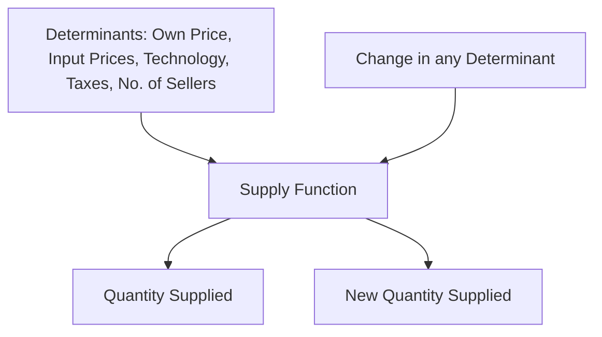

# Supply Function

## Video Explanation

* [https://www.youtube.com/watch?v=HfZy6sUeP6A](https://www.youtube.com/watch?v=HfZy6sUeP6A)

## Visual Aids

## 1. Definition

A supply function is a mathematical equation that expresses the quantity of a good that producers are willing and able to sell as a function of its own price and all other factors affecting supply. It shows the full relationship between quantity supplied and its determinants.

---

## 2. Concept Explanation

The basic idea is that the amount of a product a firm brings to the market depends not only on the selling price but also on input costs, technology, government policies, and many other elements. The supply function brings all these influences together in one structured equation.

How it works: Producers observe the market and their own costs. When the selling price rises, it becomes more profitable to produce and sell more, so quantity supplied increases. When input prices rise, production becomes costlier, so supply decreases. The supply function captures these numerical effects, allowing one to predict supply under different conditions.

Why it is important: The supply function helps firms plan production, estimate the impact of raw material price changes, and make long-term investment decisions. For policymakers, it shows how taxes or subsidies will influence total output. In engineering project management, supply functions are used to anticipate the availability and cost of construction materials and labour.

---

## 3. Key Characteristics / Features

- **Multivariate relationship:** Quantity supplied depends on several variables, not just the good’s own price.
- **Positive own-price coefficient:** By the law of supply, the own-price variable usually has a positive sign, meaning higher price increases quantity supplied.
- **Based on producer behaviour:** It reflects profit-maximising decisions by firms.
- **Quantitative tool:** It gives a formula to compute the exact quantity supplied for given values of the determinants.
- **Ceteris paribus basis:** When analysing the effect of one factor, other factors are assumed constant.
- **Time dimension:** Supply functions can be specified for the short run (some factors fixed) or the long run (all factors variable).
- **Estimated from data:** Like demand functions, they are derived using statistical methods from actual market data.

---

## 4. Types / Classification

Based on coverage:

- **Individual supply function:** Shows the supply relationship for a single firm. All determinants are at the firm level.
- **Market supply function:** The horizontal sum of all individual firms’ supply functions. It represents the total quantity supplied in the market at different price levels.

Based on time period:

- **Short-run supply function:** Some inputs (like factory size) are fixed; supply responds mainly to price changes using existing capacity.
- **Long-run supply function:** All inputs can change; firms can enter or exit the industry. The function includes factors like number of sellers.

Based on mathematical form:

- **Linear supply function:** Quantity supplied changes at a constant rate with respect to each determinant.
- **Non-linear supply function:** The rate of change is not constant; it may involve exponents or logarithms.

---

## 5. Working / Mechanism

1. Identify all important determinants of supply: own price, input prices, technology, government taxes/subsidies, number of sellers, expectations, and natural factors.
2. Collect data over a period for the good being studied.
3. Select a suitable mathematical form, often a linear equation for simplicity.
4. Use statistical regression to estimate the constant term and the coefficients for each independent variable.
5. Write the estimated supply function, e.g., \( Q_s = -50 + 10P - 3P_{raw} + 0.8T \).
6. To predict supply, plug in expected values of the determinants (price, input cost, technology index).
7. To see the effect of a single factor, change only its value while keeping others constant and note how \( Q_s \) changes.
8. The supply curve is derived from the supply function by holding all determinants except own price constant.

---

## 6. Diagram

---

## 7. Mathematical Formulation

A general supply function is written as:

$$
Q_s = f(P, P_i, T, G, N, E, F)
$$

Where:  
- \( Q_s \) = Quantity supplied of the good  
- \( P \) = Own price of the good  
- \( P_i \) = Prices of inputs (raw materials, labour, energy)  
- \( T \) = Technology level  
- \( G \) = Government policy (taxes increase cost, subsidies decrease cost)  
- \( N \) = Number of sellers in the market  
- \( E \) = Producers’ expectations about future prices  
- \( F \) = Natural or environmental factors (rainfall, climate)  

A specific linear form can be:

$$
Q_s = a + bP - cP_i + dT - eG + fN
$$

Where:  
- \( a \) = intercept (constant term)  
- \( b, c, d, e, f \) = coefficients showing the rate of change in \( Q_s \) per unit change in the respective variable.  
- The positive sign on \( P \) reflects the law of supply; negative sign on \( P_i \) shows higher input prices reduce supply.

---

## 8. Example

A brick manufacturer estimates its monthly supply function as:  
\( Q_s = 5000 + 20P - 15P_{clay} + 2K \)  
where \( P \) is the brick price per thousand, \( P_{clay} \) is the price of clay per ton, and \( K \) is a technology index (1 to 10).  
If \( P = ₹6000 \), \( P_{clay} = ₹200 \), and \( K = 5 \):  
\( Q_s = 5000 + 20(6000) - 15(200) + 2(5) \)  
\( = 5000 + 120000 - 3000 + 10 = 122010 \) bricks per month.  
If clay price rises to ₹250, all else equal:  
\( Q_s = 5000 + 120000 - 15(250) + 10 = 125010 - 3750 = 121260 \). Supply falls.

---

## 9. Analogy

Think of a farmer’s field. The amount of wheat the farmer grows depends on the market price of wheat (higher price encourages more planting), the cost of seeds and fertilizer (high cost reduces the area planted), the weather (good rain boosts output), and the government’s subsidies. The supply function is like a farming diary that records exactly how each factor changes the harvest size.

---

## 10. Comparison

| Feature | Supply Function | Supply Curve |
|--------|-----------------|--------------|
| Meaning | Equation showing quantity supplied as a function of all determinants | Graph showing quantity supplied against own price only |
| Variables included | Own price, input costs, technology, taxes, number of sellers, etc. | Only own price and quantity |
| Shifts | Represented by changing the values of non-price variables | The entire curve shifts when a non-price determinant changes |
| Use | Forecasting and causal analysis of all supply factors | Visualising the law of supply |

---

## 11. Advantages

- Enables accurate forecasting of production and material availability.
- Helps isolate the impact of each factor (e.g., raw material cost) on supply.
- Supports government policy design by predicting the effect of taxes or subsidies on output.
- Assists firms in production planning and capacity expansion decisions.
- Provides a scientific basis for pricing and inventory management.
- Essential for market equilibrium analysis when combined with a demand function.

---

## 12. Disadvantages / Limitations

- Reliable data collection for all determinants can be expensive and time-consuming.
- Assumes stable relationships; sudden technological breakthroughs or policy shifts can make the function obsolete.
- Real-world supply often involves nonlinearities and interactions that simple linear equations cannot capture.
- Measurement of qualitative variables like technology or expectations is difficult.
- In agriculture, natural factors like weather can cause unpredictable variation, reducing the accuracy of estimated functions.
- The function may not include all relevant determinants due to limited knowledge or data.

---

## 13. Important Points / Exam Notes

- Supply function: \( Q_s = f(P, P_i, T, G, N, \dots) \).
- Own price has a positive coefficient (law of supply).
- Input prices have negative coefficients (higher costs reduce supply).
- The supply curve is derived from the supply function by keeping all non-price determinants constant.
- A change in any non-price determinant shifts the supply curve.
- Linear form example: \( Q_s = a + bP - cP_i + dT \).
- Market supply function is the sum of individual firm supply functions.

---

## 14. Applications / Use Cases

- **Agriculture:** Estimating crop supply response to minimum support prices and fertilizer subsidies.
- **Manufacturing:** A steel plant uses its supply function to decide output levels when iron ore prices change.
- **Construction:** Project managers forecast the supply of cement and steel using such functions to plan procurement.
- **Energy sector:** Electricity supply function incorporates fuel costs, plant efficiency, and regulatory constraints.
- **Government policy:** Assessing how a carbon tax will affect the supply of goods from polluting industries.

---

## 15. MCQs

**Q1. The supply function shows quantity supplied as a function of:**  
A. Only price of the good  
B. All determinants of supply  
C. Only input prices  
D. Only technology level  
**Answer:** B  
**Explanation:** The supply function includes all factors that influence the producer’s willingness to sell.

**Q2. In a linear supply function, the coefficient of the own price is generally:**  
A. Negative  
B. Zero  
C. Positive  
D. Infinite  
**Answer:** C  
**Explanation:** According to the law of supply, as price rises, quantity supplied rises, so the coefficient is positive.

**Q3. Which of the following is a non-price determinant in a supply function?**  
A. Own price of the good  
B. Price of inputs  
C. Quantity demanded  
D. Consumer income  
**Answer:** B  
**Explanation:** Input prices affect the cost of production and are a key non-price supply determinant.

**Q4. A supply curve is derived from a supply function by:**  
A. Changing all variables at once  
B. Holding all non-price determinants constant  
C. Ignoring the law of supply  
D. Summing with the demand curve  
**Answer:** B  
**Explanation:** The supply curve isolates the relationship between own price and quantity supplied, assuming other factors are constant.

**Q5. The market supply function is obtained by:**  
A. Averaging each firm’s price  
B. Summing the quantity supplied by all firms at each price  
C. Subtracting individual firm supply from demand  
D. Multiplying individual supply by the number of consumers  
**Answer:** B  
**Explanation:** Market supply is the horizontal summation of all individual firms’ supply quantities.

**Q6. In the supply function \( Q_s = -20 + 15P - 4P_f \), if the price of fuel \( P_f \) increases, what happens to \( Q_s \)?**  
A. Increases by 15 units  
B. Decreases by 4 units for every 1 unit increase in \( P_f \)  
C. Stays constant  
D. Increases by 4 units  
**Answer:** B  
**Explanation:** The negative coefficient on \( P_f \) means that as fuel price rises, quantity supplied falls at a rate of 4 units per unit price increase.

**Q7. Which variable in a supply function captures the effect of excise tax?**  
A. Technology  
B. Government policy (G)  
C. Number of sellers  
D. Price of inputs  
**Answer:** B  
**Explanation:** Taxes and subsidies are part of government policy, which shifts the supply function.

**Q8. A change in which of the following would shift the supply curve?**  
A. Own price of the good  
B. A change in technology  
C. Quantity supplied  
D. None of the above  
**Answer:** B  
**Explanation:** A change in a non-price determinant like technology shifts the entire supply curve.

**Q9. If a linear supply function is \( Q_s = a + bP \) with \( b = 0 \), what does this imply?**  
A. Perfectly elastic supply  
B. Perfectly inelastic supply  
C. Supply follows the law of supply strictly  
D. Supply curve is downward sloping  
**Answer:** B  
**Explanation:** If \( b = 0 \), quantity supplied does not change with price, so supply is perfectly inelastic.

**Q10. The supply function is most useful for a project manager when:**  
A. Estimating demand for finished products  
B. Forecasting material availability and input costs  
C. Setting interest rates  
D. Designing consumer surveys  
**Answer:** B  
**Explanation:** It helps forecast supply conditions for materials and inputs, which is critical for project planning and procurement.