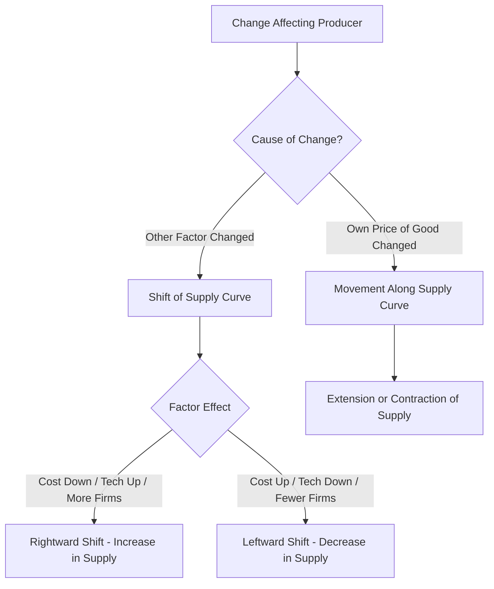

# 04 Supply curve and shift of supply curve

## 1. Definition

**Supply curve** is a graphical representation of the supply schedule. It shows the direct relationship between the price of a commodity and the quantity supplied, assuming all other factors remain constant.

**Shift of supply curve** means a change in the position of the entire supply curve, either to the right or to the left, caused by a change in factors other than the own price of the good.

## 2. Concept Explanation

The supply curve is drawn by plotting price on the vertical axis and quantity supplied on the horizontal axis. It normally slopes upward from left to right. This upward slope reflects the law of supply: higher the price, greater the quantity producers are willing to sell.

A shift of the supply curve is different from a movement along the curve. A movement along the same curve occurs only when the good’s own price changes. This is called a change in quantity supplied. A shift occurs when some other factor such as technology, input costs, taxes, or the number of sellers changes. In a shift, at every possible price, the quantity supplied becomes different from before.

This distinction is very important for engineers and project managers. A movement along the curve helps estimate how production responds to price changes. A shift explains why the entire market availability of a material may change even when its price is stable. Correctly identifying whether supply change is due to price or other factors leads to better procurement, costing, and project scheduling decisions.

## 3. Key Characteristics / Features

- **Supply curve slopes upward:** It illustrates that price and quantity supplied move in the same direction, ceteris paribus.
- **Movement is caused only by own price change:** An increase in price moves the quantity supplied upward along the curve; a decrease moves it downward.
- **Shift is caused by non-price factors:** Changes in input costs, technology, government policy, number of firms, or expectations shift the entire curve.
- **Rightward shift means increase in supply:** At each price, producers offer more than before.
- **Leftward shift means decrease in supply:** At each price, producers offer less than before.
- **Shift creates a new supply schedule:** The original table of price and quantity supplied becomes invalid, and a new one takes its place.

## 4. Types / Classification

Under supply curve analysis, we can classify changes into two broad types:

- **Movement along the supply curve (Change in quantity supplied):**
  - *Extension of supply:* Quantity supplied rises due to a rise in own price.
  - *Contraction of supply:* Quantity supplied falls due to a fall in own price.

- **Shift of the supply curve (Change in supply):**
  - *Increase in supply:* The entire curve shifts to the right. Causes include reduction in input prices, improvement in technology, decrease in taxes, increase in subsidies, or more firms entering the market.
  - *Decrease in supply:* The entire curve shifts to the left. Causes include rise in input costs, outdated technology, higher taxes, removal of subsidies, or firms leaving the market.

## 5. Working / Mechanism

The mechanism of a supply curve shift can be explained step-by-step.

1.  **Start with an initial supply curve:** A stable supply curve exists based on current input costs, technology, and number of sellers.
2.  **A non-price factor changes:** For instance, the government reduces GST on raw materials, or a new automated machine cuts labour cost.
3.  **Cost of production falls:** The firm can now produce the same quantity at a lower cost.
4.  **Producer’s willingness increases:** At the previous market price, the producer now earns higher profit or can afford to sell more.
5.  **Supply increases at every price:** The firm plans a larger output for each possible price.
6.  **Entire supply curve shifts right:** Graphically, the original supply curve moves to a new right-hand position.
7.  **Opposite for negative change:** If a new tax is imposed, cost rises and the curve shifts left.

## 6. Diagram

## 7. Mathematical Formulation

The general supply function shows how various factors affect supply.

$$
Q_s = f(P, C, T, G, N)
$$

Where:
- \( Q_s \) = Quantity supplied
- \( P \) = Own price of the good
- \( C \) = Input costs (materials, labour)
- \( T \) = Technology level
- \( G \) = Government policy (taxes or subsidies)
- \( N \) = Number of firms in the market

For a simple linear supply curve:

$$
Q_s = c + dP
$$

Where:
- \( c \) = Intercept, which captures the effect of all non-price factors (\( C, T, G, N \))
- \( d \) = Slope, showing responsiveness to own price

- **Movement along the curve:** Only \( P \) changes; \( c \) and \( d \) remain constant.
- **Shift of the supply curve:** A change in any factor other than \( P \) alters the intercept \( c \). A rise in \( c \) (due to better technology or lower input cost) shifts the curve right. A fall in \( c \) shifts it left.

## 8. Example

Consider the supply of ready-mix concrete in a city. The initial supply curve shows that at ₹4,000 per cubic metre, suppliers offer 500 cubic metres per day. If the price of cement drops sharply because of a new bulk discount, the cost of making concrete falls. Now, even if the selling price stays at ₹4,000, suppliers are willing to offer 700 cubic metres because their margin improves. The entire supply curve shifts to the right. This is an increase in supply. If later a pollution tax raises input costs, the curve shifts left, and at the same ₹4,000 price, supply may fall to 400 cubic metres.

## 9. Analogy

Imagine a lemonade stall at a park. If the market price of a glass of lemonade rises, the seller moves up her supply curve and makes more glasses. That is movement. Now suppose she buys a new automatic juicer that squeezes lemons three times faster and cheaper. Even if the price of lemonade remains the same, she is now willing to make and sell many more glasses because her cost per glass has fallen. The whole stall’s supply capability has shifted; this is a rightward shift of her supply curve.

## 10. Comparison

| Feature | Movement Along Supply Curve | Shift of Supply Curve |
|--------|----------|----------|
| **Meaning** | Change in quantity supplied due to own price change | Change in supply due to non-price factors |
| **Cause** | Change in the good’s own price | Change in input cost, technology, taxes, number of firms, etc. |
| **Graphical effect** | Upward or downward movement on the same curve | Entire curve shifts to a new position (right or left) |
| **Terminology** | Extension (price up) or Contraction (price down) of supply | Increase (rightward) or Decrease (leftward) in supply |
| **Supply schedule** | Same schedule; different point | New supply schedule |

## 11. Advantages

- **Clear diagnosis of market changes:** Knowing the difference helps a project manager understand whether a material price hike is due to reduced supply or something else.
- **Better production planning:** Firms can anticipate how their supply will respond to new technology or tax changes, independent of selling price.
- **Effective policy making:** The government can design subsidies to shift supply rightwards and make essential goods more available.
- **Investment decision support:** In energy projects, a rightward shift in fuel supply reduces price risk and improves project viability.
- **Strategic advantage:** Companies that can shift their supply curve outward through innovation gain a competitive edge by offering more at the same price.

## 12. Disadvantages / Limitations

- **Ceteris paribus assumption:** In reality, multiple factors may change together, making it hard to isolate a pure shift.
- **Time lags:** Cost reductions or technology improvements take time to shift the supply curve; immediate effects may be small.
- **Rigidities in real markets:** Contracts, storage limits, and capacity constraints may prevent supply from shifting quickly even if underlying factors improve.
- **Complex interactions:** A shift in supply can change market price, which then causes a movement along the new supply curve, complicating the analysis.
- **Data requirement:** To accurately measure a shift, one needs cost and technology data, which may be proprietary and hard to get.

## 13. Important Points / Exam Notes

- The supply curve is upward sloping, showing a direct price-supply relationship.
- Movement along the supply curve is called a change in quantity supplied; it is triggered only by own price change.
- Shift of the supply curve is called a change in supply; it is caused by factors other than own price.
- Rightward shift = increase in supply; leftward shift = decrease in supply.
- Non-price determinants include input prices, technology, taxes and subsidies, number of sellers, and future expectations.
- A fall in input costs or an improvement in technology shifts the supply curve rightwards.
- A rise in taxes or a decrease in the number of firms shifts the supply curve leftwards.
- The entire supply schedule becomes different after a shift.
- Do not confuse “increase in supply” (shift right) with “extension of supply” (movement up the curve due to price rise).
- In a linear supply function \( Q_s = c + dP \), a change in \( c \) represents a shift; a change in \( P \) moves along the curve.

## 14. Applications / Use Cases

- **Agricultural output:** A good monsoon and better seeds shift the supply curve of wheat to the right, increasing availability without any price rise.
- **Manufacturing cost reduction:** An automobile company introduces robotic welding, reducing labour cost and shifting its car supply curve rightward.
- **Tax policy in construction:** A cut in GST on steel shifts the supply curve of steel to the right, helping infrastructure projects by lowering input cost.
- **Energy sector subsidy:** A subsidy on solar panel manufacturing shifts the supply curve to the right, making panels cheaper and more abundantly available.
- **Exit of firms from market:** When several small cement plants close due to new environmental norms, the market supply curve of cement shifts leftward, raising prices for construction firms.

## 15. MCQs

**Q1. A supply curve shows the relationship between**

A. Income and demand  
B. Price and quantity supplied  
C. Price and quantity demanded  
D. Cost and revenue  

**Answer:** B  
**Explanation:** The supply curve graphically represents the quantity producers are willing to sell at each price.

---

**Q2. A movement along the supply curve is caused by**

A. Change in technology  
B. Change in input costs  
C. Change in own price of the good  
D. Change in number of firms  

**Answer:** C  
**Explanation:** An own price change leads to a movement along the existing supply curve; other factors shift the curve.

---

**Q3. A rightward shift of the supply curve indicates**

A. Decrease in supply  
B. Increase in quantity supplied due to price rise  
C. Increase in supply  
D. Contraction of supply  

**Answer:** C  
**Explanation:** A rightward shift means that at every price, producers are willing to supply more, which is an increase in supply.

---

**Q4. Which of the following will cause the supply curve to shift to the left?**

A. Improvement in technology  
B. Decrease in input prices  
C. Increase in taxes on the product  
D. Increase in subsidies  

**Answer:** C  
**Explanation:** Higher taxes raise production cost, making supply decrease at each price, shifting the curve left.

---

**Q5. When the price of a commodity rises, the quantity supplied increases. This is called**

A. Increase in supply  
B. Extension of supply  
C. Decrease in supply  
D. Shift in supply  

**Answer:** B  
**Explanation:** Extension of supply is a movement up along the same curve due to a higher price.

---

**Q6. A fall in the price of raw materials will**

A. Shift the supply curve to the left  
B. Cause a movement down the supply curve  
C. Shift the supply curve to the right  
D. Have no effect on supply  

**Answer:** C  
**Explanation:** Lower input costs increase profitability, encouraging more supply at every price, resulting in a rightward shift.

---

**Q7. The supply function is given as \( Q_s = -100 + 20P \). A new technology changes it to \( Q_s = -40 + 20P \). This indicates**

A. A movement along the curve  
B. A rightward shift of the supply curve  
C. A leftward shift of the supply curve  
D. No change in supply  

**Answer:** B  
**Explanation:** At any price, the quantity supplied is now higher because the intercept increased, which represents a rightward shift.

---

**Q8. Which of these pairs is correctly matched?**

A. Movement along supply curve – change in technology  
B. Shift of supply curve – change in own price  
C. Rightward shift – increase in input cost  
D. Leftward shift – firms exiting the market  

**Answer:** D  
**Explanation:** Fewer firms means less total supply at each price, causing a leftward shift.

---

**Q9. An increase in the number of sellers in a market will**

A. Shift the supply curve left  
B. Shift the supply curve right  
C. Cause a downward movement along the supply curve  
D. Cause an upward movement along the supply curve  

**Answer:** B  
**Explanation:** More sellers add to the total market supply at each price, shifting the curve to the right.

---

**Q10. A supply schedule changes because of a new government subsidy. The effect shown on a graph will be**

A. A movement up the supply curve  
B. A downward movement along the supply curve  
C. A rightward shift of the entire supply curve  
D. The curve becomes vertical  

**Answer:** C  
**Explanation:** A subsidy reduces cost and increases supply at all prices, shifting the whole curve to the right.