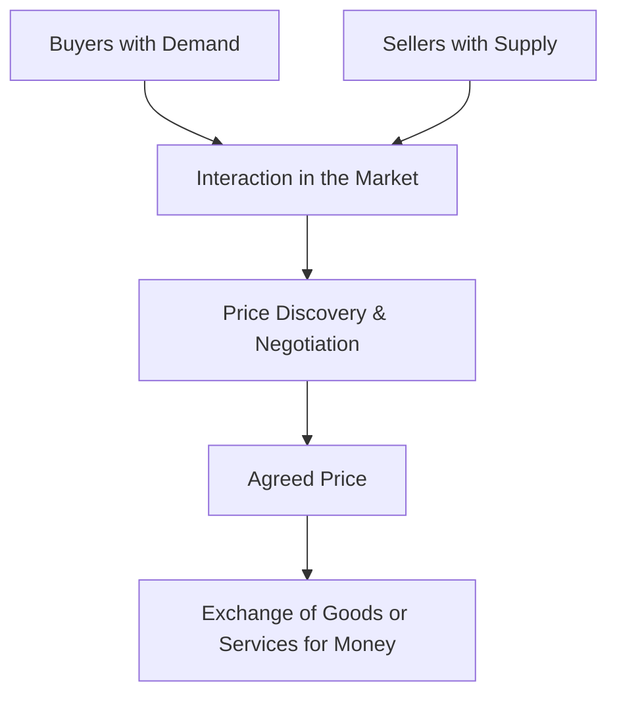

# Definition of Market

## 1. Definition

A market is any system or arrangement that brings buyers and sellers together to exchange goods, services, or resources. It does not require a physical place; a market exists wherever there is effective communication and the opportunity to trade.

## 2. Concept Explanation

The basic idea of a market is the meeting point of demand and supply. It is not just a physical bazaar but any platform where potential buyers and sellers can interact. The interaction may be face-to-face, over the telephone, or through an internet website. The market works by allowing buyers to express their willingness to pay and sellers to state the price at which they are ready to supply. Through this process, a price is discovered, and transactions take place. This price guides the allocation of scarce resources. Understanding what a market is is important because almost all economic activity revolves around market exchanges. It helps us analyze how prices are determined, how production is organized, and how goods reach consumers.

## 3. Key Characteristics / Features

- **Presence of Buyers and Sellers:** Both parties must be present or connected for an exchange to occur. One side alone does not create a market.
- **Exchange of a Product or Service:** A market exists for a specific commodity or a group of related commodities, such as the steel market or the labour market.
- **Price Mechanism:** Prices communicate information about scarcity and desire. They adjust to balance demand and supply.
- **Voluntary Exchange:** Transactions are based on mutual consent. Both buyer and seller expect to benefit from the trade.
- **No Physical Boundary Necessary:** A market can be a local shop, a national network, or a global online platform. It is defined by the scope of exchange relationships.

## 4. Types / Classification

Markets can be classified in several simple ways:

- **Based on Geographical Area:**
    - *Local Market:* Exchange happens within a small region, e.g., a village vegetable market.
    - *National Market:* Buyers and sellers operate across the entire country, e.g., the cement market.
    - *International Market:* Trade crosses national borders, e.g., the global crude oil market.
- **Based on Time of Delivery:**
    - *Spot Market:* Goods and money are exchanged immediately, e.g., buying vegetables with cash.
    - *Future Market:* Contracts are made today for delivery at a future date, e.g., buying a futures contract for wheat.
- **Based on Nature of Competition:**
    - *Perfect Market:* Many buyers and sellers, homogeneous products, free entry and exit (theoretical).
    - *Imperfect Market:* Includes monopoly, monopolistic competition, and oligopoly, where some firms have control over price.

## 5. Working / Mechanism

1.  **Sellers** bring a certain quantity of goods or services to the market and have a minimum price they are willing to accept.
2.  **Buyers** arrive with a desire to purchase and a maximum price they are willing to pay.
3.  Both parties interact, either by bidding, posting price lists, or negotiating directly.
4.  Through this interaction, the forces of demand and supply determine the **market price**.
5.  If the price is too high, a surplus occurs, and sellers reduce the price. If too low, a shortage occurs, and buyers bid the price up.
6.  The process continues until the **equilibrium price** is reached, where the quantity supplied equals the quantity demanded.
7.  At equilibrium, exchanges take place, and the market clears.

## 6. Diagram

## 7. Mathematical Formulation

A market is said to be in equilibrium when the quantity demanded equals the quantity supplied at a common price.

$$
Q_d = Q_s
$$

Where:
- $Q_d$ = Quantity demanded by all buyers at a given price
- $Q_s$ = Quantity supplied by all sellers at the same price

The price at which this equality holds is the market-clearing or equilibrium price.

## 8. Example

Consider the online ride-hailing market. Riders seeking transport (buyers) and drivers offering rides (sellers) interact through a mobile app. The app displays a fare (price) that matches rider requests with nearby drivers. When it rains and demand surges, the app raises the fare, attracting more drivers. This is a market working without a physical meeting place.

## 9. Analogy

Think of a market as a busy matchmaking event for trade. Buyers are like guests looking for specific dance partners (products). Sellers are the partners available. The music (price) plays, and partners pair up only when the beat is right. If the hall is too crowded with sellers and few buyers, the sellers must dance to a slower tune (lower price) to find a match. The event itself is the market, and the dance floor exists wherever the pairing happens.

## 10. Comparison

| Feature | Market | Marketplace (Bazaar) |
|--------|----------|----------|
| Meaning | A broad concept of any arrangement that links buyers and sellers for exchange. | A specific physical location where buyers and sellers meet face-to-face. |
| Scope | Can be local, national, or global; physical or virtual. | Usually a local, geographical area. |
| Form | Exists as an abstract system, like the stock market or online platform. | A concrete place, like a city shopping street. |
| Dependency | A marketplace is one type of market. | A physical embodiment of a market's function. |

## 11. Advantages

- Markets efficiently allocate resources to where they are most valued.
- Price signals incentivize producers to supply goods that consumers want.
- Voluntary exchange ensures that both parties gain from the transaction.
- Competition in markets encourages innovation and quality improvement.
- Markets can operate flexibly across borders without a central planner.

## 12. Disadvantages / Limitations

- Markets may fail to provide public goods like street lighting or national defence.
- They can lead to income inequality as rewards flow to owners of scarce resources.
- Externalities like pollution can occur because market prices may not reflect true social costs.
- Imperfect information can result in unfair trades and market breakdown.
- Monopolies and cartels can manipulate prices, harming consumers.

## 13. Important Points / Exam Notes

- A market is defined by the existence of exchange relationships, not by a physical place.
- The core function of a market is to determine prices and facilitate exchange.
- The concept of a market works for goods, services, labour, currency, and financial securities.
- Market equilibrium occurs at the price where quantity demanded equals quantity supplied.
- Markets can exist in various forms: spot, future, local, national, international, perfect, and imperfect.

## 14. Applications / Use Cases

- **E-Commerce Platforms:** Amazon and Flipkart are digital global markets connecting millions of buyers and sellers.
- **Stock Exchanges:** The National Stock Exchange (NSE) is an organized market for buying and selling company shares.
- **Agricultural Produce Market Committee (APMC):** Local regulated physical markets where farmers sell their crops to traders.
- **Freelance Marketplaces:** Websites like Upwork create a market for freelance services where clients (buyers) meet freelancers (sellers).
- **Foreign Exchange Market:** A decentralized global market for trading currencies, determining exchange rates.

## 15. MCQs

**Q1. In economics, a market is defined as:**

A. Only a physical place where goods are sold  
B. Any arrangement that brings buyers and sellers together  
C. A government-regulated shopping complex  
D. A shop with fixed prices  
**Answer:** B  
**Explanation:** A market is any system enabling exchange, not necessarily a physical location.

**Q2. The most essential feature of a market is:**

A. A loud environment  
B. The presence of a large building  
C. The interaction of buyers and sellers  
D. The involvement of currency notes  
**Answer:** C  
**Explanation:** The core of a market is the exchange relationship between buyers and sellers.

**Q3. A market that deals in immediate delivery of goods is called a:**

A. Future market  
B. Spot market  
C. Black market  
D. National market  
**Answer:** B  
**Explanation:** In a spot market, transactions are settled immediately, in contrast to future delivery.

**Q4. The online platform where users buy and sell second-hand goods is an example of a:**

A. Physical market  
B. Virtual market  
C. Local bazaar  
D. Regulated market  
**Answer:** B  
**Explanation:** Online platforms connect buyers and sellers electronically, creating a virtual market.

**Q5. A local vegetable market where buyers and sellers haggle in person is an example of a:**

A. Futures market  
B. Spot market and physical marketplace  
C. Imperfect international market  
D. Perfect national market  
**Answer:** B  
**Explanation:** It involves immediate exchange (spot) and happens at a physical location (marketplace).

**Q6. The term 'market mechanism' primarily refers to:**

A. Government setting prices  
B. The forces of demand and supply determining price and quantity  
C. Advertising strategies used by firms  
D. The physical layout of a shop  
**Answer:** B  
**Explanation:** The market mechanism is the process by which demand and supply interact to set prices and allocate resources.

**Q7. In a market, equilibrium exists when:**

A. Quantity demanded is double the quantity supplied  
B. Quantity supplied is more than quantity demanded  
C. Quantity demanded equals quantity supplied  
D. Government fixes the price  
**Answer:** C  
**Explanation:** Equilibrium is the balance point where the plans of buyers and sellers match.

**Q8. Which of the following is NOT a characteristic of a market?**

A. Voluntary exchange  
B. Absence of any rules  
C. Price as a signal  
D. Interaction between buyers and sellers  
**Answer:** B  
**Explanation:** All markets require some rules or norms to function; complete absence of rules would lead to chaos.

**Q9. The market for a single company’s stock traded on a national exchange is best described as a:**

A. Local physical market  
B. National regulated market  
C. International black market  
D. Future market only  
**Answer:** B  
**Explanation:** A stock exchange is a national market with regulations, connecting buyers and sellers across the country.

**Q10. The condition $Q_d = Q_s$ mathematically represents:**

A. Shortage in the market  
B. Surplus in the market  
C. Market equilibrium  
D. Government price control  
**Answer:** C  
**Explanation:** The equality of quantity demanded and quantity supplied defines a market in equilibrium.