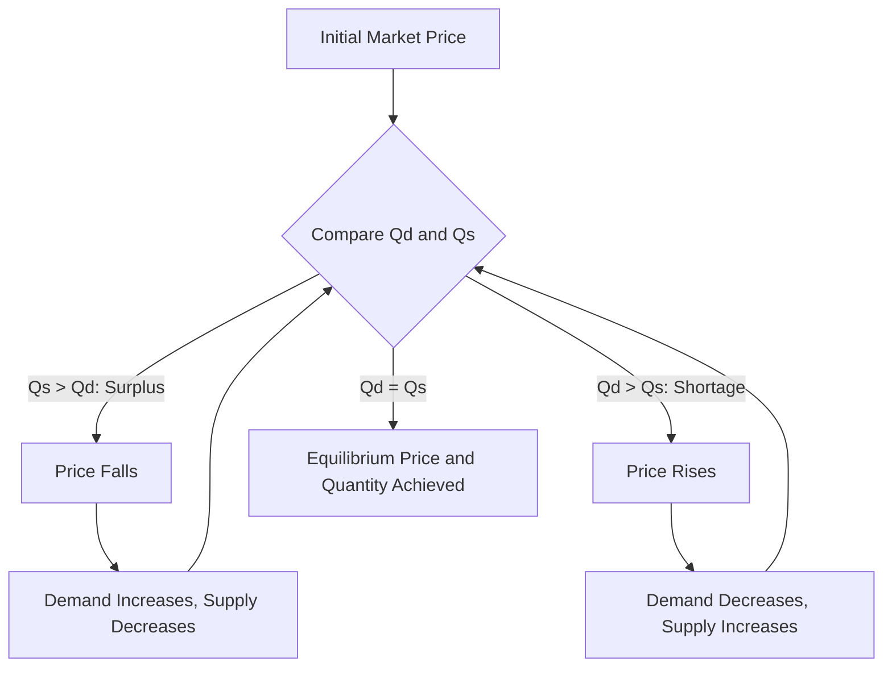

# Price mechanism determination of equilibrium price and quantity Numerical examples with graphical illustration

## Video Explanation

* [https://www.youtube.com/watch?v=1s8p0cQ6f9k](https://www.youtube.com/watch?v=1s8p0cQ6f9k)

## Visual Aids

## 1. Definition

The price mechanism is the process by which the forces of demand and supply interact in a free market to determine the equilibrium price and equilibrium quantity of a good. At the equilibrium price, the quantity demanded by consumers equals the quantity supplied by producers, leaving no shortage or surplus.

---

## 2. Concept Explanation

The basic idea is that buyers and sellers have opposite interests. Buyers want low prices, while sellers want high prices. The market resolves this tension through price adjustments. If the current price is too high, a surplus appears because quantity supplied exceeds quantity demanded. This forces sellers to cut the price to clear their stock. If the price is too low, a shortage appears because quantity demanded exceeds quantity supplied. Buyers then bid up the price. This automatic adjustment continues until the price reaches a level where demand equals supply.

How it works: Imagine a vegetable market. Suppose initially tomatoes are priced at ₹40 per kg, but at this price farmers bring 500 kg while customers want only 300 kg. The unsold 200 kg force farmers to lower the price. As the price drops, customers buy more and farmers bring less. At ₹30 per kg, demand and supply both equal 400 kg. No one is left with unsold stock, and no buyer goes empty-handed. This ₹30 is the equilibrium price, and 400 kg is the equilibrium quantity.

Why it is important: The price mechanism efficiently allocates scarce resources. It signals producers what to produce and how much, and signals consumers about the cost of goods. It eliminates the need for any central planner. For engineers and project managers, understanding equilibrium helps forecast price and output for materials, products, and services.

---

## 3. Key Characteristics / Features

- **Market clearing:** At equilibrium, quantity demanded equals quantity supplied; the market clears.
- **Automatic adjustment:** Any deviation from equilibrium creates forces that push price back toward the equilibrium level.
- **No excess burden:** There is neither surplus (excess supply) nor shortage (excess demand) at equilibrium.
- **Determined by both sides:** Equilibrium price and quantity depend on the entire demand and supply conditions, not on one side alone.
- **Dynamic concept:** Equilibrium is a point of rest but market conditions can shift it when demand or supply changes.
- **Efficient allocation:** The equilibrium outcome ensures that goods go to those who value them most and are produced at the lowest possible cost (in perfect markets).
- **Graphical intersection:** It is found where the demand curve and supply curve intersect.

---

## 4. Types / Classification

Based on stability:

- **Stable equilibrium:** If the market price is disturbed, it returns automatically to the original equilibrium. Most goods exhibit stable equilibrium because excess demand pushes prices up and excess supply pulls prices down.
- **Unstable equilibrium:** A rare situation where a small deviation takes the market further away from equilibrium. This may occur if supply slopes downward and is steeper than demand, but such cases are not common.
- **Neutral equilibrium:** The market remains at any new price without moving back or further away. This seldom occurs in real markets.

*(Note: For typical market analysis, we assume stable equilibrium.)*

---

## 5. Working / Mechanism

1. The market opens with a starting price, often based on previous transactions or producer expectations.
2. At this price, consumers plan to buy a certain quantity (demand) and producers plan to sell a certain quantity (supply).
3. Compare quantity demanded and quantity supplied.
4. If quantity supplied exceeds quantity demanded, a surplus exists. Sellers compete by lowering the price.
5. If quantity demanded exceeds quantity supplied, a shortage exists. Buyers compete and bid up the price.
6. Price adjustments change the plans of both sides: as price falls, demand rises and supply falls; as price rises, demand falls and supply rises.
7. This trial-and-error process continues until a price is found where quantity demanded exactly equals quantity supplied.
8. This is the equilibrium price. The corresponding quantity is the equilibrium quantity.
9. Unless demand or supply shifts, this price and quantity remain stable.

---

## 6. Diagram

---

## 7. Mathematical Formulation

Consider the following demand and supply functions:

Demand:  
$$
Q_d = a - bP
$$

Supply:  
$$
Q_s = c + dP
$$

Where:  
- \( Q_d, Q_s \) = Quantity demanded and supplied  
- \( P \) = Price  
- \( a, b, c, d \) = Positive constants (with \( a > c \) to ensure positive equilibrium)

Equilibrium occurs when \( Q_d = Q_s \):  
$$
a - bP = c + dP
$$

Solving for equilibrium price \( P^* \):  
$$
a - c = bP + dP
$$
$$
a - c = P(b + d)
$$
$$
P^* = \frac{a - c}{b + d}
$$

Substitute \( P^* \) into either equation to find equilibrium quantity \( Q^* \):  
$$
Q^* = a - bP^* \quad \text{or} \quad Q^* = c + dP^*
$$

---

## 8. Example (Numerical)

**Problem:**  
The daily demand for steel bars in a local market is given by \( Q_d = 500 - 10P \).  
The daily supply is \( Q_s = -100 + 20P \), where \( P \) is the price in ₹ per bar and quantity is in numbers of bars. Find the equilibrium price and quantity. Also show the market condition at \( P = ₹25 \) and \( P = ₹15 \).

**Solution:**

**Step 1: Find equilibrium.**  
Set \( Q_d = Q_s \):  
\( 500 - 10P = -100 + 20P \)  
\( 500 + 100 = 20P + 10P \)  
\( 600 = 30P \)  
\( P^* = \frac{600}{30} = ₹20 \)

Equilibrium quantity:  
\( Q^* = 500 - 10 \times 20 = 500 - 200 = 300 \) bars.  
(Check with supply: \( -100 + 20 \times 20 = -100 + 400 = 300 \).)

**Step 2: At \( P = ₹25 \):**  
\( Q_d = 500 - 10(25) = 500 - 250 = 250 \)  
\( Q_s = -100 + 20(25) = -100 + 500 = 400 \)  
Surplus = \( 400 - 250 = 150 \) bars. Price will tend to fall.

**Step 3: At \( P = ₹15 \):**  
\( Q_d = 500 - 10(15) = 500 - 150 = 350 \)  
\( Q_s = -100 + 20(15) = -100 + 300 = 200 \)  
Shortage = \( 350 - 200 = 150 \) bars. Price will tend to rise.

**Graphical Illustration (conceptual):** The demand curve slopes downward from 500 at P=0, hitting zero at P=50. The supply curve starts at -100 when P=0, becomes positive after P=5, and rises. They intersect at P=20, Q=300. At P=25, supply is above demand (surplus). At P=15, demand is above supply (shortage). The graph cannot be drawn in Mermaid but the equilibrium is clearly identified by solving.

---

## 9. Analogy

Imagine a school assembly where students represent demand and chairs represent supply. If chairs are too few (high price), students stand and the demand for chairs is higher than chairs available, so the school brings in more chairs (price falls). If there are too many empty chairs (low price), the school removes some chairs. The teacher adjusts until the number of students sitting exactly equals the number of chairs. That final number is the equilibrium, and the “price” is the adjustment mechanism.

---

## 10. Comparison

| Feature | Equilibrium (Market Clearing) | Disequilibrium (Surplus / Shortage) |
|--------|-------------------------------|--------------------------------------|
| Meaning | Quantity demanded exactly equals quantity supplied | Either excess supply (surplus) or excess demand (shortage) |
| Price tendency | No pressure to change | Price moves toward equilibrium |
| Market condition | Market clears, no unsold stock or unmet demand | Unsold pile-up or queues form |
| Example | Tomato market at ₹30/kg with 400 kg traded | At ₹40/kg, 500 kg supplied but only 300 kg demanded |

---

## 11. Advantages

- Eliminates guesswork in pricing by providing a clear target price.
- Efficiently allocates resources without central direction.
- Signals producers to increase or decrease output based on profitability.
- Helps consumers make informed decisions based on true costs.
- Provides a foundation for economic forecasting in project planning.
- Supports policy decisions—governments can predict the impact of taxes or subsidies on prices and quantities.

---

## 12. Disadvantages / Limitations

- Assumes perfect competition; many real markets have monopolies or controls that prevent free price movement.
- Ignores time lags; production cannot adjust instantly, causing temporary gluts or shortages.
- Does not account for externalities like pollution, where the market equilibrium may be socially undesirable.
- Information may be imperfect; consumers and producers may not know the true market price or quality.
- The model may not work for essential goods where government fixes prices (e.g., fuel).
- Some markets exhibit unstable equilibrium, making the static analysis invalid.

---

## 13. Important Points / Exam Notes

- Equilibrium price (\( P^* \)) is where \( Q_d = Q_s \).
- Mathematically, solve the two equations: \( a - bP = c + dP \) → \( P^* = (a-c)/(b+d) \).
- At any price above equilibrium, surplus exists and price falls.
- At any price below equilibrium, shortage exists and price rises.
- The equilibrium quantity is found by plugging \( P^* \) into demand or supply.
- Graphical representation: intersection of downward-sloping demand and upward-sloping supply.
- Essential tool for market analysis, project cost estimation, and policy design.

---

## 14. Applications / Use Cases

- **Construction projects:** Estimating the market-clearing price of cement and steel for tendering and budgeting.
- **Agriculture:** Determining the market price of crops at which farmers’ supply matches consumer demand during harvest.
- **Stock market:** Share prices adjust through continuous buying and selling until equilibrium is reached at each moment.
- **Rental housing:** Rent in a locality moves toward equilibrium where landlord supply matches tenant demand.
- **Transportation:** Ride-sharing fares surge when demand exceeds supply (shortage) and normalize when market clears.

---

## 15. MCQs

**Q1. Equilibrium price is the price at which:**  
A. Quantity supplied exceeds quantity demanded  
B. Quantity demanded exceeds quantity supplied  
C. Quantity demanded equals quantity supplied  
D. The government sets the price  
**Answer:** C  
**Explanation:** By definition, equilibrium occurs when demand equals supply, clearing the market.

**Q2. If at a given price, quantity supplied is 500 units and quantity demanded is 400 units, the market has a:**  
A. Shortage of 100 units  
B. Surplus of 100 units  
C. Equilibrium  
D. Price ceiling  
**Answer:** B  
**Explanation:** Surplus = Qs – Qd = 500 – 400 = 100 units. This will push the price down.

**Q3. Given \( Q_d = 300 - 5P \) and \( Q_s = -60 + 10P \), the equilibrium price is:**  
A. ₹10  
B. ₹20  
C. ₹24  
D. ₹36  
**Answer:** C  
**Explanation:** Set 300 – 5P = -60 + 10P → 360 = 15P → P = 24.

**Q4. The price mechanism automatically removes:**  
A. Only shortages  
B. Only surpluses  
C. Both shortages and surpluses  
D. Government intervention  
**Answer:** C  
**Explanation:** Price adjustments eliminate any excess demand or excess supply and move the market toward equilibrium.

**Q5. If the price is below equilibrium, there is a tendency for price to:**  
A. Rise  
B. Fall  
C. Remain constant  
D. Become negative  
**Answer:** A  
**Explanation:** At a price below equilibrium, quantity demanded exceeds quantity supplied (shortage), causing buyers to bid up the price.

**Q6. Which of the following is not a characteristic of equilibrium?**  
A. Qd = Qs  
B. No tendency to change  
C. Persistent excess demand  
D. Market-clearing condition  
**Answer:** C  
**Explanation:** Persistent excess demand indicates disequilibrium; at equilibrium, there is no excess demand.

**Q7. In a stable equilibrium, a small disturbance leads to:**  
A. A permanent new price  
B. An automatic return to the original equilibrium  
C. A continuous movement away from equilibrium  
D. Government price control  
**Answer:** B  
**Explanation:** Stable equilibrium has restorative forces; the market returns to original price and quantity after a disturbance.

**Q8. If demand function is \( Q_d = 1000 - 20P \) and supply is \( Q_s = -200 + 40P \), the equilibrium quantity is:**  
A. 600  
B. 400  
C. 800  
D. 1200  
**Answer:** A  
**Explanation:** Equate: 1000 – 20P = -200 + 40P → 1200 = 60P → P = 20. Then Q = 1000 – 20×20 = 600. So option A is correct.

**Q9. The demand curve for equilibrium analysis is drawn based on the assumption of:**  
A. Changing income  
B. Constant tastes, income, and other factors  
C. Zero price  
D. Infinite supply  
**Answer:** B  
**Explanation:** The demand curve assumes ceteris paribus, i.e., other determinants of demand are held constant.

**Q10. A surplus in the market will cause:**  
A. Price to rise  
B. Supply to increase  
C. Producers to lower the price  
D. Government to impose a price floor  
**Answer:** C  
**Explanation:** With unsold stock, sellers compete by reducing prices to attract buyers, driving the price down toward equilibrium.