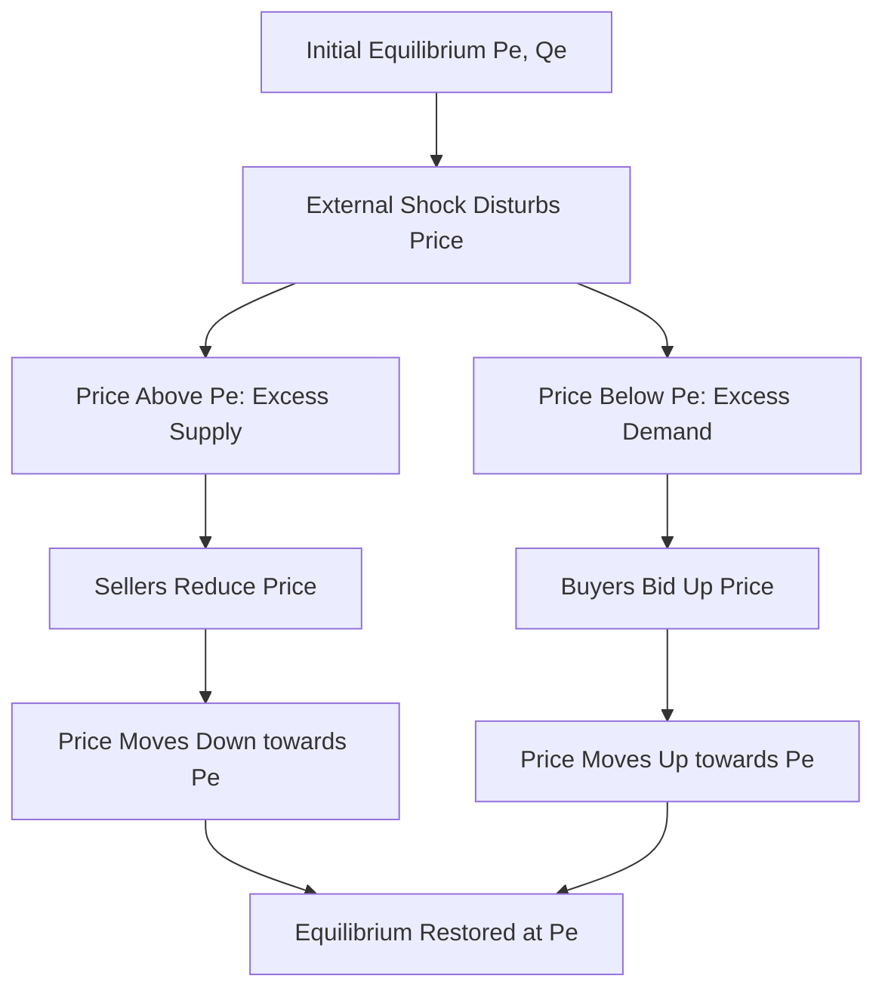

# Stability of equilibrium

## Video Explanation

* [https://www.youtube.com/watch?v=9dZp1kz0L3E](https://www.youtube.com/watch?v=9dZp1kz0L3E)

## Visual Aids

## 1. Definition

Stability of equilibrium refers to the property of a market equilibrium to restore itself after a small disturbance. An equilibrium is stable if, when the price is moved away from the equilibrium level, the forces of demand and supply automatically push it back. If the price moves further away, the equilibrium is unstable.

## 2. Concept Explanation

The basic idea of stability is whether a market can heal itself. In a competitive market, equilibrium is the point where quantity demanded equals quantity supplied. However, real-world shocks such as sudden changes in taste, input costs, or weather can push the price away from this point. Stability examines what happens next.

How it works: Suppose the market price is above equilibrium. At this higher price, there is excess supply. Sellers compete to clear their stock by lowering the price. As the price falls, quantity demanded rises and quantity supplied falls. This adjustment continues until the price returns to equilibrium. Conversely, if the price is below equilibrium, excess demand pushes the price up until equilibrium is restored. This self-correcting mechanism defines a stable equilibrium.

Why it is important: Stability tells us whether we can rely on markets to function smoothly. If an equilibrium is stable, small disturbances do not cause permanent chaos. Policymakers and businesses can be confident that the market will absorb shocks without collapsing. If an equilibrium is unstable, a small disturbance could lead to a completely different outcome, requiring intervention.

## 3. Key Characteristics / Features

- **Self-Correcting Mechanism:** In a stable equilibrium, market forces automatically eliminate shortages or surpluses.
- **Direction of Price Movement:** Excess supply drives price down; excess demand drives price up. This negative feedback loop is essential for stability.
- **Walrasian Stability Condition:** In the Walrasian approach, stability requires that a rise in price creates excess supply.
- **Marshallian Stability Condition:** In the Marshallian quantity-adjustment approach, stability requires that a rise in quantity causes the demand price to fall below the supply price.
- **Combination of Supply and Demand Slopes:** Stability depends on the relative slopes of demand and supply curves. Usually, a downward-sloping demand and an upward-sloping supply produce a stable equilibrium.

## 4. Types / Classification

Equilibrium stability can be classified based on the adjustment process and the nature of the curves.

- **Stable Equilibrium:** After a disturbance, price or quantity automatically returns to the original equilibrium. Most competitive markets exhibit this for normal goods.
- **Unstable Equilibrium:** A small disturbance moves the price or quantity further away from equilibrium. This is rare but possible with certain special demand or supply slopes.
- **Neutral Equilibrium:** After a disturbance, the market stays at the new position without any tendency to return or move further away.

Stability can also be analyzed under two famous adjustment frameworks:

- **Walrasian Stability (Price Adjustment):** Price adjusts in response to excess demand. Positive excess demand raises price, negative excess demand lowers it.
- **Marshallian Stability (Quantity Adjustment):** Quantity adjusts when the demand price differs from the supply price. If the demand price exceeds the supply price, quantity increases.

## 5. Working / Mechanism

We explain the Walrasian price-adjustment process, which is the most common method.

1.  The market is initially in equilibrium at price $P_e$ and quantity $Q_e$.
2.  An external shock, such as a sudden increase in popularity, shifts the demand curve right.
3.  At the old equilibrium price $P_e$, quantity demanded now exceeds quantity supplied. This creates excess demand.
4.  Buyers compete for the limited goods, bidding the price upward.
5.  As the price rises, quantity demanded falls (movement along the new demand curve) and quantity supplied rises (movement along the supply curve).
6.  This reduces the excess demand continuously.
7.  The price stops rising when it reaches a new equilibrium $P_{e2}$, where quantity demanded again equals quantity supplied.
8.  The market has moved from one stable equilibrium to another. If the initial shock is temporary, the system returns to the original $P_e$.

## 6. Diagram

## 7. Mathematical Formulation

The Walrasian stability condition can be stated in terms of the excess demand function $E(P)$.

$$
E(P) = Q_d(P) - Q_s(P)
$$

Equilibrium occurs at $P^*$ where $E(P^*) = 0$.

The equilibrium is locally stable if:

$$
\frac{dE(P)}{dP}\Bigg|_{P=P^*} < 0
$$

Where:
- $E(P)$ = Excess demand at price $P$
- $Q_d(P)$ = Quantity demanded function
- $Q_s(P)$ = Quantity supplied function
- $\frac{dE}{dP}$ = The derivative of excess demand with respect to price

This condition states that excess demand must decrease when price rises. Since $dE/dP = dQ_d/dP - dQ_s/dP$, and with $dQ_d/dP < 0$ (law of demand) and $dQ_s/dP > 0$ (law of supply), the condition is normally satisfied, making equilibria of standard markets stable.

## 8. Example

Consider the local market for mangoes. The normal equilibrium price is ₹80 per dozen. Due to heavy unseasonal rains, supply falls sharply. At ₹80, there is now a huge shortage. Mango lovers are willing to pay more, so prices start rising. As the price increases to ₹120, some buyers drop out, and farmers bring whatever remaining stock they have. The shortage shrinks. Eventually, the market settles at a new, higher equilibrium price of ₹110. Once the weather normalises and supply returns, the price falls back towards ₹80, showing the old equilibrium was stable and the system can adapt.

## 9. Analogy

Imagine a bowl with a marble inside. The bottom of the bowl is the equilibrium point. If you nudge the marble slightly, it rolls back to the bottom automatically. This is a stable equilibrium—the forces of gravity act like price adjustment. Now imagine turning the bowl upside down and balancing the marble on its dome. The apex is an unstable equilibrium. If you nudge the marble even slightly, it rolls away and never returns. Similarly, an unstable market equilibrium collapses under the smallest shock.

## 10. Comparison

| Feature | Stable Equilibrium | Unstable Equilibrium |
|--------|----------|----------|
| Response to disturbance | Price/quantity returns to original equilibrium | Price/quantity moves further away from original equilibrium |
| Feedback loop | Negative feedback (self-correcting) | Positive feedback (amplifying the disturbance) |
| Typical cause | Normal downward-sloping demand, upward-sloping supply | Unusual slopes, e.g., upward-sloping demand, or special cases |
| Real-world likelihood | Very common; standard market behaviour | Extremely rare; mainly theoretical |

## 11. Advantages

- Provides confidence that free markets can self-regulate without constant government intervention.
- Helps policymakers understand when intervention is unnecessary and when it is essential.
- Enables businesses to forecast that short-term price disruptions will fade, helping in inventory planning.
- Lays the theoretical foundation for comparative statics, a technique used to analyze effects of policy changes.
- Simplifies complex dynamic processes into a checkable condition on the slopes of supply and demand.

## 12. Disadvantages / Limitations

- Real markets may adjust very slowly due to price stickiness, contracts, or regulation, delaying the return to equilibrium.
- The stability condition is a local concept; large shocks can push the system into a completely different state.
- Assumes continuous and smooth adjustment, which is not true for markets where prices are fixed in the short run.
- Does not account for speculation and inventory behaviour that can make adjustments oscillatory or explosive.
- The theoretical models rest on ceteris paribus assumptions that rarely hold in complex economic systems.

## 13. Important Points / Exam Notes

- Equilibrium is stable if the market automatically returns to it after a disturbance.
- The Walrasian condition for stability: excess demand must decrease when price increases.
- Normal markets with downward-sloping demand and upward-sloping supply have stable equilibria.
- A market with a perfectly inelastic demand and a normal supply is also stable; excess demand falls as price rises.
- Unstable equilibria are possible theoretically, for example, with a positively sloped demand curve steeper than supply.
- The distinction between stable and unstable equilibrium is crucial for understanding when a market might fail or require regulation.

## 14. Applications / Use Cases

- **Price Controls:** When a government sets a price ceiling (rent control), it creates a shortage. If the equilibrium were stable, removing the control allows the price to rise back to equilibrium, clearing the market.
- **Agricultural Price Supports:** Governments often set minimum support prices (MSP). Analysing stability helps understand why market prices naturally fall below MSP at harvest time and why procurement is needed.
- **Financial Markets:** Stability analysis is used to determine if asset price bubbles are self-correcting or if they will crash, helping central banks decide on intervention.
- **Foreign Exchange Markets:** Economists study whether a currency's equilibrium exchange rate is stable to predict if a devaluation will correct a trade deficit.
- **Dynamic Market Models:** Cobweb models in agricultural economics examine stability when supply reacts with a one-period lag, important for crops like pulses and onions.

## 15. MCQs

**Q1. A market equilibrium is said to be stable if, after a disturbance, the price:**

A. Moves further away from equilibrium  
B. Stays exactly where the disturbance left it  
C. Returns to the original equilibrium  
D. Becomes fixed by government  
**Answer:** C  
**Explanation:** Stability means the market's self-correcting forces restore the original equilibrium.

**Q2. In the Walrasian price adjustment process, what happens when there is excess demand?**

A. Price falls  
B. Price rises  
C. Supply falls  
D. Government intervenes  
**Answer:** B  
**Explanation:** Excess demand (shortage) causes buyers to bid the price up.

**Q3. The condition for Walrasian stability is that excess demand must:**

A. Increase when price rises  
B. Decrease when price rises  
C. Equal zero at all prices  
D. Be independent of price  
**Answer:** B  
**Explanation:** $\frac{dE}{dP} < 0$ ensures that a rise in price reduces excess demand, pushing it back to zero.

**Q4. A normally shaped market with a downward-sloping demand and upward-sloping supply will have a:**

A. Unstable equilibrium  
B. Stable equilibrium  
C. Neutral equilibrium  
D. No equilibrium  
**Answer:** B  
**Explanation:** These slopes ensure excess demand falls when price rises, satisfying the stability condition.

**Q5. A marble resting at the bottom of a bowl is an analogy for:**

A. Unstable equilibrium  
B. Neutral equilibrium  
C. Stable equilibrium  
D. Disequilibrium  
**Answer:** C  
**Explanation:** A nudge causes it to return to the bottom, just as a stable market returns to equilibrium.

**Q6. If a small decrease in price creates a situation where quantity demanded exceeds quantity supplied, the market will self-correct by:**

A. Price rising back to equilibrium  
B. Price falling further  
C. Quantity supplied decreasing further  
D. Demand falling with no price change  
**Answer:** A  
**Explanation:** Excess demand pushes prices up until equilibrium is restored.

**Q7. Unstable equilibrium is most likely to occur when:**

A. The demand curve slopes downward and supply slopes upward  
B. The demand curve slopes upward and is steeper than the supply curve  
C. There are many buyers and sellers  
D. The product is a necessity  
**Answer:** B  
**Explanation:** An upward-sloping demand curve can violate the stability condition, potentially leading to instability.

**Q8. The stability of equilibrium is important for policymakers because it indicates:**

A. Whether price controls are always needed  
B. If a market can recover from shocks on its own  
C. The exact amount of tax revenue  
D. The number of firms in the market  
**Answer:** B  
**Explanation:** Knowing stability helps decide if government intervention is necessary after a shock.

**Q9. In the excess demand function $E(P) = Q_d(P) – Q_s(P)$, equilibrium occurs when:**

A. $E(P) > 0$  
B. $E(P) < 0$  
C. $E(P) = 0$  
D. $E(P) = 1$  
**Answer:** C  
**Explanation:** When excess demand is zero, quantity demanded equals quantity supplied.

**Q10. An increase in demand for a product with a stable equilibrium will initially create a shortage and then cause:**

A. A permanent surplus  
B. The price to fall continuously  
C. The price to rise until a new equilibrium is reached  
D. Supply to shift leftwards  
**Answer:** C  
**Explanation:** The shortage bids up price, which eventually settles at a new, higher equilibrium.