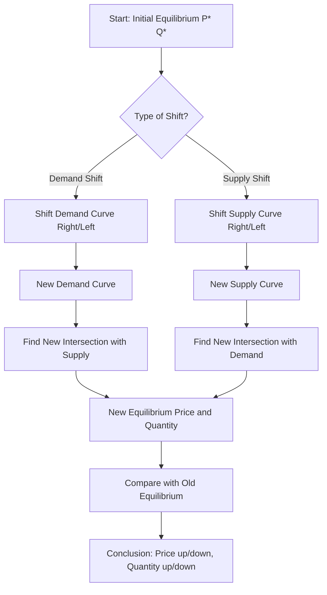

# Basic Comparative Static Analysis: Change in Equilibrium Due to Shift of Demand & Supply Curve (Numerical Problems with Graphical Illustration)

## 1. Definition

Comparative static analysis is a method used in economics to compare two equilibrium positions of a market before and after a change in an external factor, such as income, tastes, input costs, or technology. It shows how the equilibrium price and quantity adjust when either the demand curve or the supply curve, or both, shift.

---

## 2. Concept Explanation

The basic idea is that markets are constantly affected by outside events. For example, an increase in consumer income may raise the demand for a good. A new technology may reduce the cost of production and increase supply. Comparative static analysis does not describe the step-by-step adjustment process. Instead, it compares the old equilibrium and the new equilibrium directly. This helps us answer questions like “How will the price and quantity of cement change if government spending on infrastructure rises?” or “What happens to the price of smartphones if import duties are cut?”

How it works: We begin with an initial demand curve and supply curve that intersect at an initial equilibrium price and quantity. Then we allow an external factor to change. This shifts either the demand curve (to the right or left) or the supply curve (to the right or left), or both. We then find the new intersection point and compare it with the old one. The direction of the shift determines whether equilibrium price and quantity rise or fall.

Why it is important: This tool is widely used by managers, policy makers, and project planners to forecast market conditions. It helps in pricing, capacity planning, tax and subsidy analysis, and investment decisions. It provides a clear logical framework for predicting the impact of economic shocks and policy changes.

---

## 3. Key Characteristics / Features

- **Ceteris paribus assumption:** Only one factor is changed at a time while all others are held constant.
- **Compares two static points:** No information about time path or adjustment speed is given.
- **Based on demand–supply framework:** It uses the same demand and supply curves but with different positions.
- **Qualitative and quantitative:** It indicates the direction of change and, if numerical functions are given, the exact magnitude.
- **Simple and visual:** Using demand and supply graphs makes the shifts easy to visualise.
- **Widely applicable:** It can be used for goods, services, labour markets, and financial markets.

---

## 4. Types / Classification

Comparative static analysis typically examines four basic cases of shift:

- **Increase in demand (demand curve shifts right):** Caused by higher income, rise in price of substitute, fall in price of complement, favourable change in tastes, etc. Equilibrium price rises and equilibrium quantity rises.
- **Decrease in demand (demand curve shifts left):** Caused by lower income, fall in price of substitute, rise in price of complement, unfavourable taste change. Equilibrium price falls and equilibrium quantity falls.
- **Increase in supply (supply curve shifts right):** Caused by lower input prices, improvement in technology, subsidies, more sellers. Equilibrium price falls and equilibrium quantity rises.
- **Decrease in supply (supply curve shifts left):** Caused by higher input prices, deterioration of technology, taxes, exit of sellers. Equilibrium price rises and equilibrium quantity falls.

Sometimes both curves shift simultaneously. The final outcome depends on the relative magnitude of the shifts.

---

## 5. Working / Mechanism

1. Start with initial demand function \( Q_d = a - bP \) and supply function \( Q_s = c + dP \).
2. Solve for initial equilibrium price \( P^*_1 \) and quantity \( Q^*_1 \) by equating \( Q_d = Q_s \).
3. Identify the external change that shifts a curve. For example, income rises, so the demand intercept ‘a’ increases.
4. Write the new demand function with the changed intercept: \( Q_d = a' - bP \) (where \( a' > a \)).
5. Keep the supply function unchanged.
6. Solve for the new equilibrium \( P^*_2 \) and \( Q^*_2 \) using the new demand and old supply.
7. Compare \( P^*_2 \) with \( P^*_1 \) and \( Q^*_2 \) with \( Q^*_1 \) to see the direction and magnitude of change.
8. Repeat a similar procedure for a supply shift or combined shifts.
9. Graphically, draw the original curves, then draw the new shifted curve, and mark the old and new intersection points.

---

## 6. Diagram

---

## 7. Mathematical Formulation

General demand and supply functions:

$$
\begin{aligned}
Q_d &= \alpha - \beta P + \gamma Y \quad (\text{Y is income}) \\
Q_s &= \delta + \theta P + \lambda C \quad (\text{C is input cost})
\end{aligned}
$$

For comparative statics, we analyse how a change in \( Y \) or \( C \) affects equilibrium \( P^* \) and \( Q^* \).

Find equilibrium by setting \( Q_d = Q_s \):

$$
\alpha - \beta P + \gamma Y = \delta + \theta P + \lambda C
$$

Solve for \( P^* \):

$$
P^* = \frac{(\alpha - \delta) + \gamma Y - \lambda C}{\beta + \theta}
$$

Then:

$$
Q^* = \alpha - \beta P^* + \gamma Y
$$

Now, the effect of a change in income \( \Delta Y \) (with other factors constant) on \( P^* \) is:

$$
\Delta P^* = \frac{\gamma \Delta Y}{\beta + \theta}
$$

Since the denominator is positive, an increase in income raises \( P^* \). Similarly, an increase in input cost \( \Delta C \) (positive) will reduce \( P^* \) if \( \lambda \) is positive (depending on sign convention). In a linear supply \( Q_s = \delta + \theta P + \lambda C \), if \( \lambda \) is negative (higher cost shifts supply left), then \( \Delta P^* = \frac{-\lambda \Delta C}{\beta + \theta} \) – it will increase \( P^* \). The signs depend on how the shift variable enters the equation.

The comparative static derivatives are:

$$
\frac{\partial P^*}{\partial Y} = \frac{\gamma}{\beta + \theta}
$$
$$
\frac{\partial Q^*}{\partial Y} = \frac{\theta \gamma}{\beta + \theta}
$$

These show the sensitivity of equilibrium to the external factor.

---

## 8. Example (Numerical Problems)

**Problem 1: Shift in Demand**

Initial demand and supply for flat-screen TVs:

$$
\begin{aligned}
Q_d &= 2000 - 5P \\
Q_s &= -100 + 10P
\end{aligned}
$$
where \( P \) is in ₹ and \( Q \) is units per month.

**Initial equilibrium:**
Set \( 2000 - 5P = -100 + 10P \) → \( 2100 = 15P \) → \( P^*_1 = 140 \).
\( Q^*_1 = 2000 - 5(140) = 2000 - 700 = 1300 \) units.

Now, suppose due to a successful advertising campaign, consumer preference for flat-screen TVs increases significantly, causing the demand intercept to rise by 400 units at each price. New demand:

$$
Q_d = 2400 - 5P
$$

Supply unchanged. New equilibrium:

$$
2400 - 5P = -100 + 10P \implies 2500 = 15P \implies P^*_2 = 166.67
$$

Quantity: \( Q^*_2 = 2400 - 5(166.67) = 2400 - 833.35 = 1566.65 \) ≈ 1567 units.

**Result:** Both equilibrium price and quantity increased. Price rose from ₹140 to ₹166.67, quantity from 1300 to 1567 units.

---

**Problem 2: Shift in Supply**

Let the initial market be the same as above. Now suppose a new cheaper glass manufacturing technique reduces input costs, shifting the supply curve rightward. The new supply becomes:

$$
Q_s = 0 + 10P \quad (\text{previously } -100 + 10P)
$$

The supply now starts at origin (when P=0, Q=0). New equilibrium:

$$
2000 - 5P = 10P \implies 2000 = 15P \implies P^*_2 = 133.33
$$

Quantity: \( Q^*_2 = 2000 - 5(133.33) = 2000 - 666.67 = 1333.33 \) ≈ 1333 units.

**Result:** Price fell from ₹140 to ₹133.33, quantity increased from 1300 to 1333 units.

---

**Problem 3: Both Demand and Supply Shift (Combined)**

Suppose the demand increases (as in Problem 1 to \( Q_d = 2400 - 5P \)) and supply increases (as in Problem 2 to \( Q_s = 0 + 10P \)). Then:

$$
2400 - 5P = 10P \implies 2400 = 15P \implies P^* = 160
$$

Quantity: \( Q^* = 2400 - 5(160) = 2400 - 800 = 1600 \) units.

Compared to original (P=140, Q=1300): Price increased (to 160) and quantity increased (to 1600). Whether price rises or falls depends on which shift is larger. In this numerical example, demand shift dominated, so price rose. If supply shift had been larger, price could fall.

---

**Graphical Illustration (conceptual description):**
- Initially, demand (D1) and supply (S1) cross at E1 (140, 1300).
- For demand increase: D2 is to the right of D1, crosses S1 at E2 (166.67, 1567). Price up, quantity up.
- For supply increase: S2 is to the right of S1, crosses D1 at E3 (133.33, 1333). Price down, quantity up.
- For combined shift: D2 and S2 cross at E4 (160, 1600). Both movements are visible.

*(Note: Mermaid cannot draw Cartesian graphs, so numerical computation serves as the graphical illustration logic.)*

---

## 9. Analogy

Imagine a seesaw with fixed length (market). The demand side and supply side represent two children. Originally, they balance at a certain point (equilibrium). If the demand child puts on a heavy backpack (increase in demand), that side goes down (price and quantity rise). If the supply child becomes lighter (increase in supply), the supply side goes up (price falls, quantity rises). Comparative statics simply measures the new balance points without watching the seesaw move.

---

## 10. Comparison

| Feature | Shift in Demand (Rightward) | Shift in Supply (Rightward) |
|--------|-----------------------------|-----------------------------|
| Cause | Rise in income, positive taste change, price of substitute up | Fall in input cost, better technology, subsidy |
| Effect on equilibrium price | Increases | Decreases |
| Effect on equilibrium quantity | Increases | Increases |
| Common real-world example | Demand for ACs rises in summer | Laptop supply rises when chip prices fall |

---

## 11. Advantages

- Provides clear qualitative predictions of market changes.
- Helps government predict price effects of tax or subsidy policies.
- Useful for business pricing and production planning when external shocks occur.
- Simple and requires only basic algebra and graph reading.
- Can handle multiple simultaneous changes by comparing all relevant shifts.
- Builds strong foundation for advanced economic analysis.

---

## 12. Disadvantages / Limitations

- Ignores the time taken to reach the new equilibrium; real adjustments may be slow.
- Assumes ceteris paribus, which is rarely true; many factors change together.
- Does not explain how the market moves from one equilibrium to another (dynamics).
- Only as good as the estimated demand and supply equations.
- Does not account for market imperfections like monopoly or price controls.
- May give misleading results if the shift sizes are uncertain.

---

## 13. Important Points / Exam Notes

- Comparative static analysis compares two equilibrium states: before and after a shift.
- An increase in demand (rightward shift) raises both equilibrium price and quantity.
- A decrease in demand (leftward shift) lowers both price and quantity.
- An increase in supply (rightward shift) lowers price and raises quantity.
- A decrease in supply (leftward shift) raises price and lowers quantity.
- When both curves shift, the impact on price depends on the relative size of shifts; quantity generally moves in the same direction as the net shift in the curves.
- Mathematical procedure: equate new demand and supply equations, solve for new P and Q.
- Useful in forecasting the effect of income changes, cost fluctuations, and policy.

---

## 14. Applications / Use Cases

- **Agricultural policy:** Analysing how a bumper crop (supply increase) affects wheat prices and farmer income.
- **Taxation:** Estimating how an excise tax on fuel (supply decrease) will raise pump prices and reduce quantity sold.
- **Infrastructure projects:** Forecasting increase in cement demand due to public works and its effect on cement price.
- **Technology change:** Predicting how computer chip innovation (supply increase) makes electronics cheaper and more abundant.
- **Consumer trends:** Estimating how growing health awareness (demand increase) affects prices of organic food.

---

## 15. MCQs

**Q1. Comparative static analysis compares:**  
A. The entire time path of adjustment  
B. Two equilibrium points before and after a change  
C. Only the supply side of the market  
D. Only the demand side of the market  
**Answer:** B  
**Explanation:** It compares initial and final equilibrium without describing the transition.

**Q2. If the demand curve shifts right and supply remains unchanged, equilibrium price:**  
A. Falls and quantity falls  
B. Rises and quantity falls  
C. Rises and quantity rises  
D. Falls and quantity rises  
**Answer:** C  
**Explanation:** An increase in demand raises both equilibrium price and quantity.

**Q3. A leftward shift of the supply curve can be caused by:**  
A. Improvement in technology  
B. Decrease in input prices  
C. Imposition of a new tax on the product  
D. Increase in number of sellers  
**Answer:** C  
**Explanation:** A tax raises cost of production, decreasing supply (leftward shift).

**Q4. Originally, demand: \( Q_d = 100 - 2P \), supply: \( Q_s = -20 + 4P \). If demand increases to \( Q_d = 120 - 2P \), new equilibrium price becomes:**  
A. 12.5  
B. 20  
C. 23.33  
D. 30  
**Answer:** C  
**Explanation:** Set 120 – 2P = -20 + 4P → 140 = 6P → P = 23.33.

**Q5. With supply increase alone, we observe:**  
A. Price rises, quantity rises  
B. Price falls, quantity rises  
C. Price falls, quantity falls  
D. Price rises, quantity falls  
**Answer:** B  
**Explanation:** Rightward supply shift reduces price and increases quantity.

**Q6. In the example where demand shifted from \( Q_d = 2000 - 5P \) to \( 2400 - 5P \), equilibrium quantity rose from 1300 to approximately:**  
A. 1400  
B. 1567  
C. 1700  
D. 1200  
**Answer:** B  
**Explanation:** As computed, new Q ≈ 1567 units.

**Q7. When both demand and supply increase, equilibrium quantity will:**  
A. Definitely fall  
B. Definitely rise  
C. Remain unchanged  
D. Decrease if demand shift is larger  
**Answer:** B  
**Explanation:** Both rightward shifts push quantity upward, so quantity increases unambiguously.

**Q8. Which of the following is NOT an assumption of comparative static analysis?**  
A. Ceteris paribus  
B. Two equilibrium points are compared  
C. The adjustment process is instantaneous  
D. The market moves to a new equilibrium after a shock  
**Answer:** C  
**Explanation:** Comparative statics does not specify time or speed of adjustment.

**Q9. If a health scare reduces demand for red meat, the equilibrium price of red meat will:**  
A. Increase  
B. Decrease  
C. Remain constant  
D. First increase, then decrease  
**Answer:** B  
**Explanation:** A leftward shift in demand (decrease in demand) lowers price and quantity.

**Q10. The mathematical comparative static derivative \( \partial P^* / \partial Y \) measures:**  
A. The change in quantity when income changes  
B. The change in equilibrium price due to a change in income  
C. The slope of the demand curve  
D. The elasticity of supply  
**Answer:** B  
**Explanation:** It shows the sensitivity of equilibrium price to income.