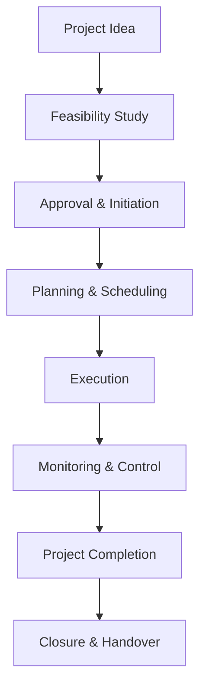

# 01 Definition and classification of projects

## 1. Definition

A **project** is a temporary endeavour undertaken to create a unique product, service, or result. It has a defined beginning and end, specific objectives, and allocated resources.

**Classification of projects** means grouping projects into categories based on their nature, size, purpose, funding source, or sector to help in better planning, execution, and management.

## 2. Concept Explanation

In engineering and business, routine work like operating a machine every day is called an operation. A project is different. It is done once, with a specific goal, and then it finishes. Building a bridge, developing a new software application, or setting up a power plant are all projects. They are not repeated exactly the same way again.

How it works: A project starts with an idea or a need. A team is formed, resources are allocated, and a plan is made. The project is executed, monitored, and finally closed when the goal is achieved. The entire effort is coordinated to meet targets of cost, time, quality, and scope.

Why classification is important: All projects are not the same. A hospital construction project is very different from a research project to design a new solar panel. Classification helps managers apply the right tools, funding methods, and control techniques. It also helps the government and investors decide which projects to support and how to evaluate their performance. Without classification, it is difficult to set priorities, measure risk, or compare projects.

## 3. Key Characteristics / Features

- **Temporary nature:** Every project has a fixed start date and a fixed end date. It is not a continuous activity.
- **Unique output:** The result of a project is always something new, even if similar projects have been done before.
- **Specific objectives:** A project is carried out to achieve clearly defined goals like cost, time, scope, and quality.
- **Resource constraints:** Projects operate within limits of money, manpower, materials, and time.
- **Cross-functional involvement:** Many different departments and specialists work together in a project.
- **Life cycle phases:** A project passes through stages like initiation, planning, execution, monitoring, and closure.

## 4. Types / Classification

Projects can be classified in several ways. The most common classifications used in engineering economics and project management are given below.

- **Based on purpose:**
  - *Industrial projects:* Setting up factories, power plants, or manufacturing units.
  - *Infrastructure projects:* Building roads, bridges, dams, airports, and metro rails.
  - *Social projects:* Hospitals, schools, water supply schemes, and sanitation projects.
  - *Research and development projects:* Designing new products, technologies, or processes.

- **Based on funding source:**
  - *Public sector projects:* Funded and executed by the government or its agencies.
  - *Private sector projects:* Owned and financed by private firms.
  - *Public-private partnership (PPP) projects:* Jointly funded and managed by the government and private entities.

- **Based on size and complexity:**
  - *Small projects:* Low investment, short duration, simple scope (e.g., renovating an office).
  - *Medium projects:* Moderate capital and resources (e.g., a 5 MW solar plant).
  - *Large/mega projects:* Huge investment, long duration, multiple stakeholders (e.g., metro rail network, large dam).

- **Based on investment nature:**
  - *New projects (Greenfield):* Built from scratch on unused land or facilities.
  - *Expansion/Brownfield projects:* Upgrading or expanding existing facilities.

- **Based on economic activity:**
  - *Construction projects:* Physical structures and civil works.
  - *IT and software projects:* System development and digital platforms.
  - *Manufacturing projects:* Setting up production lines and commissioning machines.

## 5. Working / Mechanism

A project, irrespective of its classification, generally follows a standard life-cycle mechanism.

1.  **Initiation:** Someone identifies a need or an opportunity. A feasibility study confirms whether the project idea is technically and economically viable.
2.  **Planning:** Detailed plans are made for scope, schedule, budget, and resource allocation. Risks are identified.
3.  **Organizing:** The project team is formed, funds are arranged, and necessary approvals are taken.
4.  **Execution:** Actual work begins. Materials are procured, machines are installed, and construction or development occurs as per the plan.
5.  **Monitoring and control:** Progress is continuously measured against the plan. If deadlines or costs are exceeded, corrective actions are taken.
6.  **Closure:** After objectives are met, the project is formally handed over to the user or client, documents are archived, and the team is released.

## 6. Diagram

## 7. Mathematical Formulation

Although project management is broad, the fundamental constraint equation is the **Project Triple Constraint**:

$$
\text{Project Success} = f(S, T, C)
$$

Where:
- \( S \) = Scope (what must be delivered)
- \( T \) = Time (schedule)
- \( C \) = Cost (budget)

A change in one variable affects the other two. Another simple representation of a project objective is:

$$
\text{Value} = \frac{\text{Benefits}}{\text{Costs + Time}}
$$

Both formulations help to evaluate and classify projects based on trade-offs between scope, time, and cost.

## 8. Example

Consider the construction of a 10-kilometre flyover in a city. It is a **public sector infrastructure project**. The government funds it, and its purpose is to reduce traffic congestion. It has a clear start and end date, a fixed budget of ₹500 crore, and a unique design. It can be classified as a **large, new (Greenfield), construction project** under the **public sector**. During its life, the project will go through feasibility study, design, tendering, construction, and final handover to the municipal corporation.

## 9. Analogy

Think of a project as preparing for a wedding. It has a fixed date (deadline), a budget, a unique set of guests and events. It is temporary and ends when the wedding is over. Different types of weddings (simple court marriage, grand destination wedding) are like classifications of projects based on size and complexity. In each case, planning, resources, and management effort change accordingly.

## 10. Comparison

| Feature | Project | Operations |
|--------|----------|----------|
| **Duration** | Temporary with a fixed end | Ongoing and repetitive |
| **Output** | Unique product or result | Same product or service repeatedly |
| **Goal** | Achieve the objective and close | Sustain the business process |
| **Example** | Building a flyover | Daily toll collection and maintenance of that flyover |
| **Team** | Disbands after completion | Remains permanent or evolves |

## 11. Advantages

- **Better resource allocation:** Classification helps allocate the right type and amount of money, labour, and machinery.
- **Appropriate management technique:** Different project types (e.g., IT vs. construction) use different scheduling and control tools.
- **Risk assessment:** Knowing the project category helps predict common risks and plan mitigation.
- **Policy formulation:** Governments can design separate policies for infrastructure, social, or industrial projects based on their classification.
- **Ease of comparison and benchmarking:** Performance of similar classified projects can be compared to set standards.

## 12. Disadvantages / Limitations

- **Rigid categories may mislead:** A project can have characteristics of multiple classes, making strict classification difficult.
- **Over-simplification:** Classification based on size alone ignores complexity or technology level, which might be more critical.
- **Changing nature:** A project may start as a small expansion but later turn into a major revamp, overlapping classifications.
- **Subjectivity:** Different organizations may classify the same project differently, leading to confusion in reporting.
- **Does not guarantee success:** Correct classification only helps in planning; actual performance depends on execution.

## 13. Important Points / Exam Notes

- A project is a temporary effort with a unique outcome, distinct from routine operations.
- Project classification helps in choosing the right funding model, technology, and management approach.
- Common bases for classification are purpose, funding source, size, investment nature, and economic activity.
- An infrastructure project like a dam is public sector; a factory by a private company is private sector.
- Greenfield projects are built on new sites; Brownfield projects expand or upgrade existing facilities.
- Mega projects involve very high capital and have significant environmental and social impact.
- Every project goes through at least four generic phases: initiation, planning, execution, and closure.
- The triple constraint (scope, time, cost) governs any project.
- Public-private partnership (PPP) combines government funding and private efficiency.
- Social projects focus on human development indicators like health and education, not only profit.

## 14. Applications / Use Cases

- **Project selection by banks:** Banks use classification to assess loan eligibility. Large infrastructure loans differ from small enterprise loans.
- **Government planning:** Five-year plans allocate budget to social, industrial, and infrastructure projects separately.
- **Engineering consultancy:** A firm decides whether to bid for a project based on its type and their expertise (e.g., highway vs. software project).
- **Investment portfolio:** Investors classify projects as high-risk/high-return (e.g., new R&D) or low-risk/stable (e.g., toll road extension).
- **Academic research:** Research projects are classified as basic or applied, guiding funding and evaluation criteria.

## 15. MCQs

**Q1. A project is best defined as a**

A. Routine daily activity  
B. Ongoing repetitive process  
C. Temporary endeavour to create a unique result  
D. Permanent department in a company  

**Answer:** C  
**Explanation:** A project has a clear beginning and end, producing a unique output.

---

**Q2. Which of the following is an example of an infrastructure project?**

A. Launching a new mobile phone  
B. Building a highway  
C. Auditing a company’s accounts  
D. Recruiting staff  

**Answer:** B  
**Explanation:** Infrastructure projects involve large physical structures like roads and bridges.

---

**Q3. A project funded and operated entirely by a private company is classified as**

A. Public sector project  
B. Social project  
C. Private sector project  
D. Research project  

**Answer:** C  
**Explanation:** Ownership and funding are private; government is not directly involved.

---

**Q4. What does Brownfield project refer to?**

A. A project on agricultural land  
B. Expanding or upgrading an existing facility  
C. A new project on unused land  
D. An environmental cleanup project  

**Answer:** B  
**Explanation:** Brownfield involves modification or expansion of an existing plant or facility.

---

**Q5. The triple constraint of a project includes**

A. Scope, Quality, Risk  
B. Scope, Time, Cost  
C. Time, Cost, Resource  
D. Cost, Risk, Quality  

**Answer:** B  
**Explanation:** The core constraints are scope, time, and cost, which must be balanced.

---

**Q6. In the project life cycle, the phase where the actual building or coding happens is**

A. Initiation  
B. Planning  
C. Execution  
D. Closure  

**Answer:** C  
**Explanation:** Execution phase delivers the physical work or development.

---

**Q7. Which of these is a social project?**

A. A steel plant  
B. A luxury hotel  
C. A primary health centre in a village  
D. A toll expressway  

**Answer:** C  
**Explanation:** Social projects aim at welfare, like health and education facilities.

---

**Q8. A Greenfield project means**

A. An environmental sustainability project  
B. A project that uses solar energy  
C. A completely new facility built from scratch  
D. A project that has zero cost  

**Answer:** C  
**Explanation:** Greenfield indicates building on a new, previously unused site.

---

**Q9. Classification of projects based on size helps managers in**

A. Ignoring small projects  
B. Applying different levels of control and resource allocation  
C. Avoiding government approvals  
D. Ensuring all projects have the same budget  

**Answer:** B  
**Explanation:** Large projects need more formal control systems than small ones.

---

**Q10. A joint project between the government and a private company for building a bridge is termed**

A. Pure public project  
B. Pure private project  
C. Public-Private Partnership (PPP)  
D. Social welfare project  

**Answer:** C  
**Explanation:** PPP shares investment, risks, and rewards between the public and private sector.