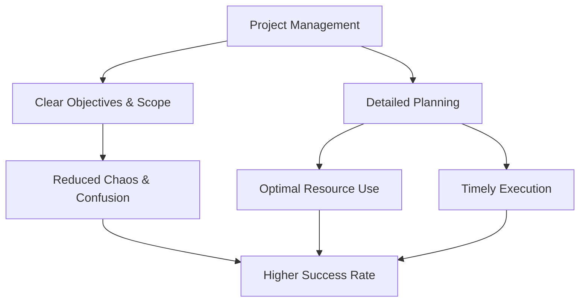

# Importance of Project Management

## 1. Definition

The importance of project management refers to the critical role that organized planning, execution, and control play in achieving specific project goals on time, within budget, and to the required quality standards. It highlights why applying structured methods is essential for turning ideas into successful outcomes.

## 2. Concept Explanation

Project management is not just about fancy charts and meetings. Its importance lies in its ability to bring order, clarity, and predictability to complex, temporary efforts. The basic idea is that any unique work with a defined start and end can easily fail without a systematic approach. Project management provides that system.

It works by breaking down a big goal into manageable tasks, assigning resources, tracking progress, and managing risks. This ensures that everyone knows what they must do, by when, and with what resources. Why is it important? Without project management, work becomes chaotic. Teams miss deadlines, costs overrun, and the final product may not even meet the customer's needs. Project management provides a roadmap and a disciplined driver, turning confusion into coordinated action. It is the single most reliable method to increase the chances of a project succeeding.

## 3. Key Characteristics / Features

- **Systematic Approach:** It replaces guesswork with a clear sequence of phases like initiation, planning, execution, monitoring, and closure.
- **Clear Accountability:** Every task has an owner, which ensures that responsibilities are defined and no work is left unattended.
- **Focus on Objectives:** It constantly aligns daily work with the overall project goals and business strategy, preventing drift.
- **Proactive Risk Handling:** It identifies potential problems early, allowing teams to prepare solutions before issues become disasters.
- **Measurable Progress:** It uses metrics and milestones to track how much work is done and how much budget and time are consumed.

## 4. Types / Classification

The importance of project management can be viewed from different angles based on the organizational benefits it provides.

- **Strategic Importance:** It ensures projects directly support the long-term goals of the company, such as entering a new market or launching a flagship product.
- **Operational Importance:** It improves daily work efficiency, streamlines resource use, and reduces waste and rework.
- **Financial Importance:** It helps complete projects within the approved budget, maximizing return on investment (ROI) and controlling cash outflows.
- **Human Resource Importance:** It develops team morale, reduces burnout through clear expectations, and fosters a collaborative environment.
- **Quality and Risk Importance:** It maintains quality standards and minimizes the chance of catastrophic project failure by managing uncertainties.

## 5. Working / Mechanism

1.  A project is initiated with a clear objective and a defined scope.
2.  A detailed plan is created outlining tasks, timelines, costs, and quality criteria.
3.  Resources like people, equipment, and money are allocated according to the plan.
4.  The project manager continuously monitors progress, comparing actual performance with the baseline.
5.  Deviations are immediately spotted, and the manager takes corrective actions, such as reassigning staff or rescheduling tasks.
6.  Risks are tracked and mitigated throughout, preventing small issues from becoming large failures.
7.  This structured loop of plan-execute-monitor-control ensures the final deliverable meets stakeholder expectations.

## 6. Diagram

## 7. Mathematical Formulation

Not applicable for this topic.

## 8. Example

A construction company wants to build a 200-bed hospital in 18 months. Without project management, materials may be ordered late, labourers sit idle, and costs skyrocket. By applying project management, the company sets a work breakdown structure, creates a material delivery schedule, and tracks daily output. The hospital is completed on time for the scheduled inauguration, within the ₹150 crore budget, and safely.

## 9. Analogy

Think of a large wedding with hundreds of guests. Without a wedding planner (project manager) and a checklist (project plan), the caterer may arrive late, decorations may be missing, and the bride's family may be stressed. With a proper project plan, every vendor knows the timeline, each task like mehendi and sangeet is scheduled, and the family enjoys the event. Project management is the wedding planner for any complex work.

## 10. Comparison

| Feature | Work Without Project Management | Work With Project Management |
|--------|----------|----------|
| Direction | No clear roadmap; ad-hoc decisions | Defined plan with milestones and deadlines |
| Resource Use | Overallocation or idle time; frequent shortages | Balanced allocation; resources available when needed |
| Budget Control | Costs frequently overrun; no early warning | Continuous cost tracking; early alerts on overspending |
| Risk Handling | Problems dealt with after they occur | Risks identified early with mitigation plans |
| Success Rate | Low predictability; high failure rate | High predictability; greater chance of meeting goals |

## 11. Advantages

- It significantly increases the probability of completing projects on time and within budget.
- It improves communication and coordination among team members and stakeholders.
- It helps in making informed decisions based on real-time data and progress reports.
- It reduces waste and rework by focusing on quality from the beginning.
- It creates a historical record of the project, helping future projects start faster.

## 12. Disadvantages / Limitations

- Overly formal project management can add administrative overhead, especially for very small projects.
- It requires skilled project managers, and poor management can be worse than none at all.
- Rigid planning may not adapt quickly enough in highly uncertain or rapidly changing environments.
- Initial setup of processes and documentation takes time, which may delay the start of actual work.
- Sometimes the focus on tools and reports overshadows original creativity and personal initiative.

## 13. Important Points / Exam Notes

- Project management provides a structured framework that greatly improves the odds of success for temporary, unique endeavors.
- Its core importance lies in delivering the right scope on time, within cost, and with the required quality.
- It aligns project output with the strategic direction of the organization.
- Effective project management is a key competitive advantage for organizations of all sizes.
- The absence of project management often results in scope creep, budget overruns, and stakeholder dissatisfaction.

## 14. Applications / Use Cases

- **IT Software Development:** Agile project management helps tech companies release new apps reliably every two weeks.
- **Infrastructure Projects:** Managing the construction of a metro rail line to avoid city-wide traffic chaos and ensure safety.
- **Event Management:** Organizing a major cricket league opening ceremony with thousands of attendees and live broadcast.
- **Product Launch:** Coordinating R&D, marketing, sales, and supply chain to launch a new motorcycle model across India.
- **Disaster Relief Operations:** NGOs and governments use project management to deliver food, shelter, and medicine efficiently after floods.

## 15. MCQs

**Q1. What is the primary reason project management is considered important?**

A. It creates many documents  
B. It increases the chance of project success  
C. It makes projects last longer  
D. It eliminates the need for a team  
**Answer:** B  
**Explanation:** Project management applies structured methods to meet goals, reducing failure risk.

**Q2. Without proper project management, which problem is most likely to occur?**

A. Smooth coordination  
B. Scope creep and budget overruns  
C. Early project delivery  
D. Reduced need for resources  
**Answer:** B  
**Explanation:** Uncontrolled changes and cost increases are common when no structured project control is in place.

**Q3. Which type of importance focuses on aligning a project with the company's long-term vision?**

A. Operational importance  
B. Strategic importance  
C. Financial importance  
D. Quality importance  
**Answer:** B  
**Explanation:** Strategic importance ensures projects contribute to overarching business objectives.

**Q4. How does project management help in handling risks?**

A. By ignoring small risks  
B. By reacting after a problem occurs  
C. By identifying and planning for risks in advance  
D. By transferring all risks to the client  
**Answer:** C  
**Explanation:** Proactive risk management is a core part of project management, involving early identification and mitigation.

**Q5. Project management improves resource utilization by:**

A. Allocating all resources to one task  
B. Avoiding planning altogether  
C. Matching resource availability with task schedules  
D. Hiring unlimited staff  
**Answer:** C  
**Explanation:** It balances resource demand with availability through scheduling, preventing both shortages and idle time.

**Q6. A project without a defined plan is often compared to:**

A. A well-oiled machine  
B. A ship sailing without a compass  
C. A fast train on a track  
D. A programmed robot  
**Answer:** B  
**Explanation:** Without a plan, the project lacks direction and is likely to drift, similar to a ship without navigation.

**Q7. Which of the following is a direct financial importance of project management?**

A. More team meetings  
B. Reduced project costs and avoidance of overruns  
C. Increased product weight  
D. Random resource allocation  
**Answer:** B  
**Explanation:** Effective cost control through monitoring ensures the project stays within the approved budget.

**Q8. The structured loop of plan-execute-monitor-control aims to:**

A. Create more paperwork  
B. Delay the project outcome  
C. Keep the project on track toward its objective  
D. Remove all communication within the team  
**Answer:** C  
**Explanation:** This continuous cycle detects deviations and corrects them to meet final deliverables.

**Q9. What is a major benefit of project management for team members?**

A. Unclear job roles  
B. High stress due to ambiguity  
C. Clear responsibilities and reduced confusion  
D. Constant overtime without reason  
**Answer:** C  
**Explanation:** Project management assigns clear tasks and deadlines, improving morale and clarity.

**Q10. For a small, two-person weekend task, overly formal project management may:

A. Be highly recommended  
B. Add unnecessary administrative burden  
C. Guarantee success  
D. Require a 100-page plan  
**Answer:** B  
**Explanation:** The scale of project management should fit the project; too much process on a tiny job wastes time.