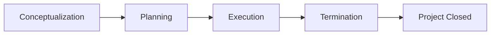
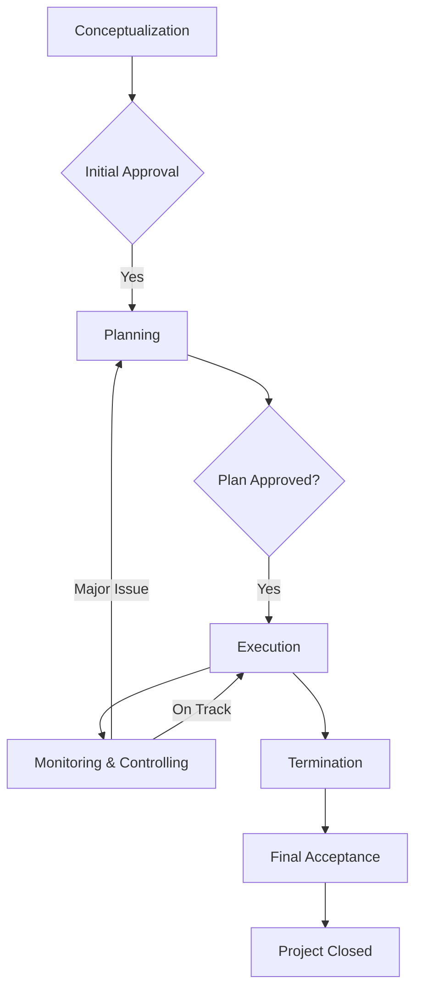

# Project life Cycle Conceptualization Planning Execution Termination

## Video Explanation

* [https://www.youtube.com/watch?v=GC7pN8Mjot8](https://www.youtube.com/watch?v=GC7pN8Mjot8)

## Visual Aids

## 1. Definition

The project life cycle is the complete set of sequential and sometimes overlapping phases that a project passes through from its initial idea to its final closure. It provides a structured framework that defines the work, deliverables, and approvals needed in each stage of a project.

---

## 2. Concept Explanation

Every project, whether constructing a bridge, developing software, or organizing an event, moves through a predictable series of phases. The four fundamental phases are conceptualization, planning, execution, and termination.

**Basic idea:** A project is not a single continuous activity. It is broken down into distinct stages. Each stage has a clear purpose and produces specific outputs. The project starts as a vague idea and gradually becomes a completed deliverable that is handed over to the customer.

**How it works:** In the conceptualization phase, the need for the project is identified and its feasibility is examined. Once approved, the planning phase defines exactly what will be done, by whom, when, and at what cost. The execution phase is where the actual physical or intellectual work is carried out. Finally, the termination phase ensures the project is formally closed, accepted, and all loose ends are tied.

**Why it is important:** The project life cycle brings order and control. It helps managers allocate resources efficiently, track progress, manage risks, and ensure that the final output meets the original requirements. Without it, projects often suffer from scope creep, budget overruns, and missed deadlines.

---

## 3. Key Characteristics / Features

- **Sequential phases:** Each phase follows a logical order. The output of one phase often becomes the input for the next.
- **Defined start and end:** Every phase has clear entry and exit criteria, including approval gates.
- **Varying resource requirements:** Cost and effort are low during conceptualization, peak during execution, and taper off during termination.
- **Decreasing uncertainty:** Risks and unknowns are highest at the start and gradually reduce as the project progresses.
- **Increasing cost of changes:** Making changes is cheap early in the life cycle but becomes very expensive later.
- **Deliverable focus:** Each phase produces a tangible deliverable (feasibility report, project plan, finished product, closure documents).
- **Stakeholder involvement:** Different stakeholders play major roles in different phases.

---

## 4. Types / Classification

While the basic four-phase model is universal, project life cycles can be classified into two broad types based on how the phases are arranged:

- **Predictive (Waterfall) life cycle:** The phases are completed one after another in a linear fashion. The scope, time, and cost are determined early in the planning phase. This is suitable for projects with well-understood requirements, like building construction.
- **Adaptive (Agile) life cycle:** The phases, especially planning and execution, are repeated in short cycles called iterations. Each cycle delivers a working part of the product. This suits projects where requirements change frequently, such as software development.

---

## 5. Working / Mechanism

1. **Conceptualization (Initiation):** Identify a need or opportunity. Conduct a feasibility study (technical, financial). Define project objectives and high-level scope. Develop a business case. If approved, a project charter is issued and a project manager is appointed.

2. **Planning:** Define the detailed scope and break the work into small tasks using a Work Breakdown Structure (WBS). Estimate time and cost for each task. Develop the project schedule (Gantt chart, network diagram). Prepare budgets, resource plans, risk management plans, and communication plans. The project plan is baselined after approval.

3. **Execution:** Acquire the project team, materials, and equipment. Carry out the planned activities as per specifications. Monitor and control the work by comparing actual progress with the plan. Manage changes, quality issues, and risks. Regularly communicate progress to stakeholders. This phase consumes the maximum resources.

4. **Termination (Closure):** Obtain formal acceptance of the final deliverable from the customer. Close all procurement contracts and settle financial accounts. Release project resources. Archive all documents and records. Conduct a lessons-learned review. Write the final project report and disband the team.

---

## 6. Diagram

*Phase flow diagram showing a linear life cycle. Feedback loops for monitoring and controlling exist between execution and planning.*

---

## 7. Mathematical Formulation

Not applicable. There is no universal mathematical formula for the project life cycle itself, although cost and effort distributions often follow specific curves (e.g., S-curve). Numerical techniques are used within each phase for estimation.

---

## 8. Example

**Project: Construction of a small flyover in a city.**

- **Conceptualization:** The traffic department identifies severe congestion at an intersection. A feasibility study is conducted, estimating costs at ₹15 crore and construction time of 18 months. The municipal corporation approves the project.

- **Planning:** Detailed structural design is prepared. A work breakdown structure is created listing all tasks from soil testing to road marking. A schedule with start and finish dates for each activity is developed. A budget is allocated. Tender documents are prepared.

- **Execution:** Contractors are hired through bidding. Site clearance and earthwork start. Piers, girders, and deck slab are constructed. Utilities are shifted. Road approaches are built. Regular quality tests and safety inspections are performed.

- **Termination:** The load test on the completed flyover is successful. The municipal body inspects and formally accepts the structure. Final bills are paid. The site office is dismantled. A project closure report is submitted.

---

## 9. Analogy

Think of making a detailed film (movie). First, the producer comes up with the story idea and checks if funds and audience exist (conceptualization). Then the script, budget, cast, and shooting schedule are finalized (planning). The camera rolls, scenes are shot, and editing is done (execution). Finally, the film is released, accounts are settled, and crew is thanked (termination). Just like a film project, skipping any of these phases creates chaos.

---

## 10. Comparison (Phases vs. Features)

| Feature | Conceptualization | Planning | Execution | Termination |
|--------|-------------------|----------|-----------|-------------|
| Main Focus | Idea and feasibility | Detailed roadmap | Producing deliverables | Formal closure |
| Cost Incurred | Very low (1–3%) | Low to moderate (5–10%) | High (80–85%) | Low (5–10%) |
| Key Output | Project charter / Business case | Project management plan | Completed product or service | Signed acceptance and final report |
| Risk Level | Highest uncertainty | Reducing | Moderate, controlled | Low |
| Stakeholder Interest | Intense by sponsors | High by planners | Peak by team and customer | Transfer of interest to operations |

---

## 11. Advantages

- Provides a clear and common framework that all team members can understand.
- Breaks a large complex task into manageable, logical steps.
- Facilitates better project control through reviews at the end of each phase.
- Early identification of problems is possible (e.g., during feasibility or planning).
- Allows effective resource planning; resources are not deployed until needed.
- Ensures that the final deliverable is aligned with the original objectives through constant checking.
- Supports continuous learning through phase-end documentation and lessons learned.

---

## 12. Disadvantages / Limitations

- The rigid sequential model does not easily accommodate changes once execution begins.
- It can be time-consuming and bureaucratic, especially in small projects.
- For innovative or unclear projects, full upfront planning is impractical.
- Clients may lose interest if the planning phase is long and no visible output appears quickly.
- Assumes that the initial concept remains valid throughout, which may not be true.
- Over-emphasis on phases can create mental barriers between team members at different stages.

---

## 13. Important Points / Exam Notes

- Project life cycle has four phases: Conceptualization → Planning → Execution → Termination.
- Cost and effort are lowest at the start, peak during execution, and drop at closure.
- Risk is highest at the beginning and decreases as the project progresses.
- The ability to influence outcomes is greatest during conceptualization and planning.
- The cost of making changes is lowest early and highest during or after execution.
- A phase-gate review is held at the end of each phase to decide whether to proceed with the next phase.
- The term “project life cycle” applies to the entire project; not to be confused with “product life cycle”.
- Waterfall is a linear life cycle; Agile is an iterative life cycle.
- The planning phase must establish the scope baseline before execution can commence.

---

## 14. Applications / Use Cases

- **Civil/Infrastructure projects:** Roads, bridges, dams follow a strict sequential life cycle from concept to handing over.
- **Software development:** Building an app may use an agile life cycle with repeated planning and execution loops, but still includes initiation and closure.
- **Industrial plant setup:** A new chemical plant goes from feasibility (conceptualization) through engineering design (planning), construction/commissioning (execution), to handover and closure.
- **Event management:** Organizing a music concert: concept approval, detailed planning (venue, artists), execution on the day, and post-event closure and settlement.
- **Research & Development:** A new drug discovery project moves from initial idea, through planning, to clinical trials (execution), and finally approval and closure.

---

## 15. MCQs

**Q1. The project life cycle consists of which set of phases?**  
A. Design, test, build, operate  
B. Conceptualization, planning, execution, termination  
C. Start, continue, finish, celebrate  
D. Initiation only  
**Answer:** B  
**Explanation:** The standard four phases of a project life cycle are conceptualization, planning, execution, and termination.

**Q2. In which phase is the project charter typically created?**  
A. Planning  
B. Execution  
C. Conceptualization  
D. Termination  
**Answer:** C  
**Explanation:** The project charter, which formally authorizes the project, is prepared during the conceptualization or initiation phase.

**Q3. The cost of making changes to the project is highest during:**  
A. Conceptualization  
B. Planning  
C. Execution  
D. Termination  
**Answer:** C  
**Explanation:** Once execution is underway, substantial work may have been completed, so rework costs are highest.

**Q4. Which phase consumes the maximum amount of project resources?**  
A. Conceptualization  
B. Planning  
C. Execution  
D. Termination  
**Answer:** C  
**Explanation:** Execution requires the bulk of manpower, materials, and money to produce the project deliverables.

**Q5. A phase-end review where the project is assessed before moving to the next phase is known as:**  
A. Sprint review  
B. Gate review or kill point  
C. Final audit  
D. Daily stand-up  
**Answer:** B  
**Explanation:** A gate review is held at the conclusion of a phase to decide whether to continue, redirect, or stop the project.

**Q6. Which life cycle type is best for a project with highly stable and well-understood requirements?**  
A. Agile  
B. Predictive (Waterfall)  
C. Hybrid  
D. Spiral  
**Answer:** B  
**Explanation:** Predictive life cycles work well when the scope can be fully defined before execution.

**Q7. Formal acceptance of the project deliverable occurs in which phase?**  
A. Planning  
B. Conceptualization  
C. Execution  
D. Termination  
**Answer:** D  
**Explanation:** Acceptance is obtained, contracts are closed, and final handover takes place during termination.

**Q8. Risk and uncertainty are typically highest at the start of the project and:**  
A. Stay constant  
B. Decrease as the project progresses  
C. Increase as the project progresses  
D. Fluctuate without pattern  
**Answer:** B  
**Explanation:** As more information becomes available and decisions solidify, uncertainty decreases.

**Q9. The primary output of the planning phase is:**  
A. The project charter  
B. The signed acceptance certificate  
C. The project management plan  
D. The final bill payment  
**Answer:** C  
**Explanation:** The planning phase yields a detailed project management plan covering scope, time, cost, quality, and risk.

**Q10. Lessons learned documentation is typically prepared during:**  
A. Conceptualization  
B. Planning  
C. Execution  
D. Termination  
**Answer:** D  
**Explanation:** Lessons learned are captured during project closure so they can benefit future projects.