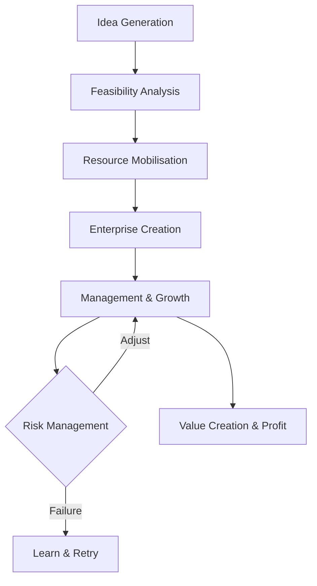

# 01 Concept Competencies Functions and Risks of entrepreneurship

## 1. Definition

**Entrepreneurship** is the process of identifying a business opportunity, gathering resources, and taking calculated risks to create, launch, and manage a new venture. It involves innovating, organising, and assuming responsibility for the outcome.

**Entrepreneurial competencies** are the underlying traits, skills, and knowledge that enable a person to perform entrepreneurial tasks successfully.

**Functions of an entrepreneur** refer to the key activities and roles an entrepreneur performs to establish and grow the enterprise.

**Risks of entrepreneurship** are the uncertainties and potential losses that an entrepreneur faces while running the business.

## 2. Concept Explanation

The basic idea of entrepreneurship goes beyond simply starting a small shop. It is about seeing a problem and building a solution that people will pay for. An entrepreneur is someone who does not wait for a job but creates jobs for others.

How it works: An entrepreneur observes the market, finds a gap or an unmet need, thinks of a product or service to fill that gap, and brings together land, labour, capital, and machinery. They coordinate these resources, take decisions, and sell the output. In doing so, they accept the possibility of both profit and loss.

Why it is important: Entrepreneurship drives economic growth. It creates employment, brings innovation to the market, and raises the standard of living. For diploma engineers, entrepreneurship provides a path to apply technical skills in one’s own business rather than only looking for a job. Understanding the concept, required competencies, functions, and risks helps a potential entrepreneur prepare better and increases the chance of success.

## 3. Key Characteristics / Features

- **Innovation and creativity:** Entrepreneurship involves introducing something new – a product, process, or way of doing business.
- **Risk‑bearing capacity:** The entrepreneur assumes the financial and personal risk of failure; profit is the reward for this risk.
- **Resource mobilisation:** An entrepreneur gathers and organises money, materials, manpower, and machines.
- **Value creation:** The goal is to create something that customers find more valuable than its cost.
- **Decision‑making authority:** The entrepreneur makes all critical business choices and accepts the consequences.
- **Persistence and determination:** Building a venture requires continuous effort, learning from mistakes, and not giving up early.
- **Visionary outlook:** Successful entrepreneurs see opportunities where others see nothing and anticipate future trends.

## 4. Types / Classification

Entrepreneurship can be classified based on the nature of business, motivation, or technology use.

- **Based on business type:**
  - *Manufacturing entrepreneurship:* Converts raw materials into finished goods (e.g., a small fabrication unit).
  - *Service entrepreneurship:* Offers intangible services (e.g., a repair workshop, IT services).
  - *Trading entrepreneurship:* Buys and sells goods (wholesale, retail).

- **Based on technology:**
  - *Traditional entrepreneurship:* Uses conventional methods and labour‑intensive processes.
  - *Innovative/tech‑based entrepreneurship:* Built around new technology or unique processes (start‑ups in AI, solar, etc.).

- **Based on motivation:**
  - *Opportunity‑based:* Started to seize a market opportunity.
  - *Necessity‑based:* Started due to lack of other employment options.

- **Based on social angle:**
  - *Social entrepreneurship:* Aims to solve social problems, not just make profit (e.g., low‑cost water filter for villages).

## 5. Working / Mechanism

The entrepreneurial process works in a step‑by‑step manner.

1.  **Idea generation:** The entrepreneur spots a problem or an unmet need and develops a business idea around it.
2.  **Feasibility analysis:** The idea is tested for technical, market, and financial viability. Competencies like analytical thinking come into play.
3.  **Resource assembly:** Land, labour, capital, and technology are brought together. The entrepreneur performs the organising function.
4.  **Enterprise creation:** The business is legally formed. Licences are obtained, and the product or service is developed.
5.  **Management and growth:** The entrepreneur manages operations, marketing, and finances daily. Leadership and communication competencies are vital here.
6.  **Risk management:** Sales may fluctuate, costs may rise, or technology may fail. The entrepreneur continuously adjusts plans and bears the financial consequences.
7.  **Harvesting / exit (if desired):** Eventually, the entrepreneur may sell the business or continue to expand.

## 6. Diagram

## 7. Mathematical Formulation

While entrepreneurship is largely qualitative, a simple risk‑return equation can be used:

$$
\text{Expected Return} = \sum (P_i \times R_i)
$$

Where:  
- \( P_i \) = Probability of outcome \( i \)  
- \( R_i \) = Return for outcome \( i \)

The entrepreneur’s task is to choose projects where:

$$
\text{Expected Return} > \text{Cost of Capital} + \text{Premium for Risk Bearing}
$$

This explains why entrepreneurs take higher risks only when expected rewards are proportionately higher.

## 8. Example

Consider a diploma engineer who notices that many small farmers struggle to process their produce. She develops a portable, affordable solar dryer. She mobilises a small loan, hires two helpers, manufactures the units, and sells them to farmers. In this process, she demonstrates:
- **Competencies:** Technical skill, opportunity recognition, perseverance.
- **Functions:** Idea generation, resource gathering, production, marketing.
- **Risk:** The dryer may not sell as expected; she may lose her invested savings.

Her venture is a classic case of manufacturing‑based opportunity entrepreneurship.

## 9. Analogy

Think of entrepreneurship like planting a fruit tree. You find a good spot (opportunity), prepare the soil and plant the seed (investment and resource assembly), water and protect it regularly (management function), survive storms and pests (risks), and wait for a long time before you get the fruit (profit). Your knowledge of gardening (competency) and willingness to work with uncertainty (risk‑bearing) determine if you get any harvest.

## 10. Comparison

| Feature | Entrepreneur | Manager |
|--------|----------|----------|
| **Role** | Owner and risk‑bearer | Employee who executes plans |
| **Objective** | Create and grow a venture | Run existing operations efficiently |
| **Risk** | Personal financial risk and uncertainty | Relatively low personal financial risk |
| **Reward** | Profit – variable and uncertain | Salary – fixed and regular |
| **Innovation** | Central to the role | May or may not be required |

## 11. Advantages

- **Self‑employment and independence:** Being your own boss gives professional freedom.
- **Unlimited income potential:** There is no salary cap; profit can grow many times.
- **Job creation:** A successful venture provides livelihoods to many families.
- **Innovation and societal progress:** New products and services improve life and push the economy forward.
- **Skill utilisation:** A technical diploma holder can directly use engineering skills to solve real problems and earn a living.

## 12. Disadvantages / Limitations

- **High risk of failure:** Many new businesses do not survive the first three years; financial loss and debt are real possibilities.
- **Irregular and uncertain income:** Unlike a salary, income may fluctuate wildly, especially in the early stages.
- **Heavy workload and stress:** The entrepreneur must handle multiple functions, often working long hours without immediate reward.
- **Multifaceted competency requirement:** One person needs technical, financial, and marketing knowledge, which is hard to master.
- **Social and family pressure:** Failure can affect self‑esteem and relationships, creating emotional stress.

## 13. Important Points / Exam Notes

- Entrepreneurship is the act of starting and running a business while bearing the associated risks.
- The three core competencies: knowledge (what to do), skill (how to do), and attitude (willingness to do).
- Key functions: idea generation, innovation, resource mobilisation, organisation, management, and risk‑bearing.
- Types of risks: financial risk, market risk, technology risk, management risk, and environmental risk.
- Entrepreneur is a job creator; manager is a job seeker (traditional distinction).
- Innovation does not always mean invention; small improvements also count.
- A “technopreneur” is an entrepreneur who uses technology as the core of the business.
- The process of entrepreneurship is continuous: idea → feasibility → resource → launch → manage → grow.
- Government schemes like MUDRA, Start‑up India, and DIC support first‑generation entrepreneurs.
- Failure is often seen as a learning experience; many successful entrepreneurs failed multiple times before.

## 14. Applications / Use Cases

- **Small‑scale manufacturing:** A diploma mechanical engineer starts a CNC job shop serving larger factories.
- **Repair and service centres:** An electrical diploma holder opens an authorised mobile and laptop service centre.
- **Construction start‑up:** A civil engineering diploma holder becomes a small contractor and starts taking up building projects.
- **Renewable energy:** A start‑up installing rooftop solar panels in a town, leveraging government subsidies.
- **IT services:** A diploma in computer engineering launches a small website development and digital marketing agency.

## 15. MCQs

**Q1. Entrepreneurship primarily involves**

A. Working for a government organisation  
B. Seeking a job in a multinational company  
C. Starting and managing a business with risk and innovation  
D. Only investing money in shares  

**Answer:** C  
**Explanation:** Entrepreneurship means creating a new venture while bearing risks.

---

**Q2. Which of the following is a key competency of a successful entrepreneur?**

A. Avoiding all risks  
B. Ability to identify opportunities  
C. Waiting for instructions  
D. Dependence on government subsidies  

**Answer:** B  
**Explanation:** Opportunity identification is a core entrepreneurial competency.

---

**Q3. The function of an entrepreneur that involves arranging money, machines, and materials is called**

A. Marketing  
B. Innovation  
C. Resource mobilisation  
D. Risk avoidance  

**Answer:** C  
**Explanation:** Resource mobilisation means assembling all inputs needed for production.

---

**Q4. Which type of risk is associated with changes in consumer tastes and preferences?**

A. Financial risk  
B. Market risk  
C. Technology risk  
D. Legal risk  

**Answer:** B  
**Explanation:** Market risk arises from shifts in demand, competition, and consumer behaviour.

---

**Q5. An individual who starts a business out of lack of other employment is called**

A. Opportunity entrepreneur  
B. Serial entrepreneur  
C. Necessity entrepreneur  
D. Social entrepreneur  

**Answer:** C  
**Explanation:** Necessity entrepreneurship is driven by the need to earn a living.

---

**Q6. Which of the following is not a characteristic of an entrepreneur?**

A. Risk‑bearing  
B. Innovation  
C. Working fixed hours only  
D. Resource coordination  

**Answer:** C  
**Explanation:** Entrepreneurs often work long, irregular hours, especially in early stages.

---

**Q7. The first step in the entrepreneurial process is**

A. Hiring employees  
B. Obtaining a loan  
C. Idea generation  
D. Setting up an office  

**Answer:** C  
**Explanation:** The process begins with identifying a viable business idea.

---

**Q8. A social entrepreneur primarily aims to**

A. Maximise personal wealth  
B. Solve a social problem through a sustainable venture  
C. Work as a government employee  
D. Avoid paying taxes  

**Answer:** B  
**Explanation:** Social entrepreneurship creates social value and may reinvest profits.

---

**Q9. Which of the following is an advantage of entrepreneurship?**

A. Guaranteed fixed monthly income  
B. Zero financial risk  
C. Independence and being your own boss  
D. No need for any skills  

**Answer:** C  
**Explanation:** Entrepreneurship offers the freedom to make independent decisions.

---

**Q10. A diploma engineer starting a small fabrication unit is an example of**

A. Service entrepreneurship  
B. Manufacturing entrepreneurship  
C. Trading entrepreneurship  
D. Agricultural entrepreneurship  

**Answer:** B  
**Explanation:** Producing physical goods qualifies as manufacturing entrepreneurship.