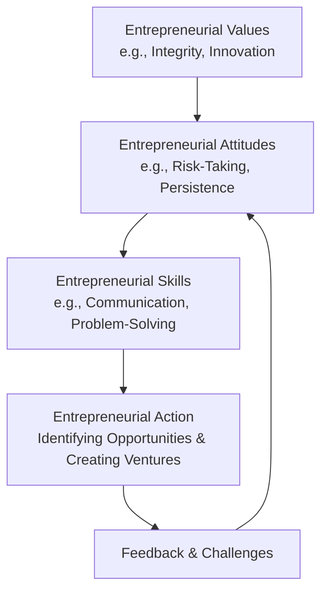

# Entrepreneurial Values Attitudes and Skills

## Video Explanation

* [https://www.youtube.com/watch?v=Hf6Q1uY6h8k](https://www.youtube.com/watch?v=Hf6Q1uY6h8k)

## Visual Aids

## 1. Definition

Entrepreneurial values, attitudes, and skills are the personal characteristics, mindsets, and abilities that drive an individual to recognise opportunities, take responsible risks, innovate, and successfully build and manage a new venture. Values are the core beliefs that guide behaviour; attitudes are the mental outlooks toward challenges; skills are the practical abilities to execute tasks.

## 2. Concept Explanation

Entrepreneurship is not just about having a business idea. It requires a special combination of inner qualities. The basic idea is that successful entrepreneurs are made, not just born, by cultivating the right values, attitudes, and skills.

Values like integrity and innovation form the ethical and creative foundation. Attitudes such as a willingness to take calculated risks and persistence in the face of failure provide the driving force. Skills like communication, planning, and problem-solving turn ideas into reality. These three elements work together. A person may have a great attitude but without the necessary skills, the venture fails. Similarly, skills without the right values can lead to unethical business practices. Understanding this combination is important because it helps aspiring entrepreneurs assess and develop themselves for the challenging journey of starting and sustaining a business.

## 3. Key Characteristics / Features

- **Interconnectedness:** Values, attitudes, and skills are not isolated. Strong values shape positive attitudes, and attitudes motivate the learning and application of skills.
- **Developable:** These qualities are not entirely inborn. They can be learned, practised, and strengthened through training, experience, and self-reflection.
- **Foundation for Behaviour:** They determine how an entrepreneur perceives problems, interacts with people, and makes decisions under uncertainty.
- **Source of Competitive Advantage:** An entrepreneur with a unique blend of strong values and innovative skills can differentiate their venture in the market.
- **Context Dependent:** While some qualities are universal, the specific mix of attitudes and skills required may vary with the industry, culture, and stage of the venture.

## 4. Types / Classification

Entrepreneurial qualities can be classified into three broad categories:

- **Entrepreneurial Values (the 'Why' and 'What is Right'):** These are the core beliefs. Examples include:
    - *Integrity:* Being honest and transparent in all dealings.
    - *Innovation:* Strong belief in continuous improvement and new ideas.
    - *Accountability:* Taking ownership of successes and failures.
- **Entrepreneurial Attitudes (the 'Mindset'):** These are the mental attitudes. Examples include:
    - *Risk-Taking:* Willingness to face uncertainty and invest resources.
    - *Persistence:* Never giving up despite setbacks and failures.
    - *Self-Confidence:* Belief in one's own ability to succeed.
- **Entrepreneurial Skills (the 'How'):** These are the practical abilities. Examples include:
    - *Communication and Networking:* Ability to convey ideas clearly and build relationships.
    - *Problem-Solving and Decision-Making:* Ability to analyse situations and choose effective solutions.
    - *Financial and Business Management:* Skills in budgeting, accounting, and strategic planning.

## 5. Working / Mechanism

The process of how values, attitudes, and skills drive entrepreneurial action works step-by-step in an interconnected way.

1.  An aspiring entrepreneur starts with a core **value**, such as a strong belief in solving a social problem.
2.  This value shapes a corresponding **attitude**, like a persistent, never-give-up mindset to overcome the challenges of bringing the solution to market.
3.  The attitude then fuels the motivation to acquire or sharpen necessary **skills**, such as learning how to prototype a product or pitch to investors.
4.  Armed with the skills, the entrepreneur takes **action**, like registering a company, building a minimum viable product, and approaching the first customer.
5.  During the entrepreneurial journey, **feedback** from the market and failures tests the original values and attitudes.
6.  The entrepreneur's deep-rooted values and resilient attitude ensure that they do not collapse but instead refine their skills and adapt their strategy.
7.  This continuous loop of belief, mindset, capability, and action eventually leads to a sustainable venture.

## 6. Diagram

## 7. Mathematical Formulation

Not applicable for this topic.

## 8. Example

Take the example of Ritesh Agarwal, the founder of OYO Rooms. His core value was to solve the real-world problem of budget hotel standardisation. His attitude was highly risk-taking and persistent; he dropped out of college and worked tirelessly despite early rejections. His skills included technology understanding, sales, networking, and pitching a vision to global investors. The combination of his value-driven problem identification, his persistent attitude, and his practical execution skills made OYO a global hospitality brand.

## 9. Analogy

Think of an entrepreneur as a pilot flying a plane. The **values** are the flight instruments and compass—they provide direction and ethics, telling the pilot what is right and true. The **attitude** is the mindset of the pilot—remaining calm in turbulence and confident that the destination can be reached. The **skills** are the actual flying technique—knowing which levers to pull and how to navigate. A pilot with all three reaches the destination safely; lack of any one component can lead to a crash.

## 10. Comparison

| Feature | Entrepreneurial Values | Entrepreneurial Skills |
|--------|-------------------------|-------------------------|
| Nature | Internal beliefs and ethics that guide what is important. | Practical abilities and techniques that can be measured and taught. |
| Focus | "Why" an entrepreneur behaves in a certain way. | "How" an entrepreneur performs specific tasks. |
| Development | Shaped over time through upbringing, culture, and reflection. | Learned through education, training, and practice. |
| Example | Believing in fairness and customer satisfaction above quick profit. | Knowing how to create a business plan or negotiate a contract. |

## 11. Advantages

- They provide a strong ethical compass, building long-term trust with customers, investors, and employees.
- A positive, resilient attitude helps entrepreneurs bounce back from failures and learn from mistakes.
- Strong problem-solving and communication skills enable effective team management and customer acquisition.
- Together, they help in identifying true market opportunities, not just flashy ideas.
- They make an entrepreneur self-reliant and adaptable, capable of navigating uncertain business environments.

## 12. Disadvantages / Limitations

- A very strong risk-taking attitude without sound analytical skills can lead to impulsive and costly decisions.
- Overconfidence in one's values or skills can lead to arrogance, ignoring valuable feedback from mentors or the market.
- Skills alone, without ethical values, can be used to build a profitable but exploitative business that harms society.
- The need to cultivate all three qualities simultaneously can be overwhelming and demanding for a beginner.
- These traits are difficult to measure quantitatively, making it hard for investors to assess an entrepreneur solely based on them.

## 13. Important Points / Exam Notes

- Entrepreneurial success is a product of three intertwined factors: values, attitudes, and skills.
- Values give ethical direction; attitudes provide motivational force; skills offer execution capability.
- These qualities are not fixed at birth; they can be intentionally cultivated through practice and learning.
- Integrity, innovation, risk-taking, persistence, and communication are highly sought-after entrepreneurial traits.
- The absence or imbalance of any one category can significantly increase the chances of venture failure.

## 14. Applications / Use Cases

- **Business Incubators and Training Programmes:** These centres design courses specifically to build entrepreneurial skills (like financial planning) and foster attitudes (like resilience).
- **Recruitment in Start-ups:** Early-stage start-ups look for team members who not only have technical skills but also the entrepreneurial attitude of ownership.
- **Self-Assessment:** Aspiring entrepreneurs use checklists of values, attitudes, and skills to understand their own strengths and areas for improvement.
- **Pitching to Investors:** Investors judge the entrepreneur's commitment (attitude), capability (skill), and trustworthiness (values) before deciding to fund the venture.
- **Social Entrepreneurship:** Solving social problems requires deeply held values of empathy and a persistent attitude to tackle complex ground-level challenges.

## 15. MCQs

**Q1. Which of the following is an example of an entrepreneurial value?**

A. Ability to prepare a cash flow statement  
B. Strong belief in honesty and innovation  
C. The number of contacts in a professional network  
D. Skill in using spreadsheet software  
**Answer:** B  
**Explanation:** Values are core beliefs like integrity and innovation that guide an entrepreneur's decisions.

**Q2. The willingness to face uncertainty and invest resources in a new idea is an entrepreneurial:**

A. Value  
B. Attitude  
C. Skill  
D. Technical know-how  
**Answer:** B  
**Explanation:** Risk-taking is a mindset or attitude that drives an entrepreneur to act despite uncertainty.

**Q3. Which category does "networking and communication ability" belong to?**

A. Entrepreneurial values  
B. Entrepreneurial attitudes  
C. Entrepreneurial skills  
D. Entrepreneurial ethics  
**Answer:** C  
**Explanation:** Communication is a practical ability, therefore it is a skill.

**Q4. Entrepreneurial attitudes primarily provide the entrepreneur with:**

A. Ethical grounding  
B. Practical tools to execute tasks  
C. Mental drive and mindset to persist  
D. Financial capital  
**Answer:** C  
**Explanation:** Attitudes like persistence and self-confidence create the psychological fuel to continue efforts.

**Q5. Which statement is correct about entrepreneurial skills?**

A. They are inborn and cannot be learned  
B. They are irrelevant to business success  
C. They can be developed through training and practice  
D. They are more important than values and attitudes  
**Answer:** C  
**Explanation:** Skills such as planning and marketing are teachable and can be improved over time.

**Q6. An entrepreneur who gives up after the first business failure is lacking in which quality?**

A. Integrity  
B. Communication skills  
C. Persistence  
D. Technical skills  
**Answer:** C  
**Explanation:** Persistence is the attitude that enables an entrepreneur to continue despite repeated failures.

**Q7. The pilot analogy for an entrepreneur suggests that values act as the:**

A. Engine  
B. Wheels  
C. Flight instruments and compass  
D. Fuel tank  
**Answer:** C  
**Explanation:** Values provide direction and ethical guidance, similar to navigation instruments.

**Q8. Which of the following is NOT a disadvantage of an unbalanced entrepreneurial mindset?**

A. Impulsive decisions due to excessive risk-taking  
B. Arrogance from overconfidence  
C. High trust from customers due to integrity  
D. Burnout from trying to master all skills at once  
**Answer:** C  
**Explanation:** High customer trust is a positive outcome, not a disadvantage.

**Q9. For long-term venture survival, the most balanced statement is:**

A. Skills are sufficient to build a trusted brand  
B. Only a strong attitude is needed to succeed  
C. A combination of values, attitudes, and skills is essential  
D. Values alone guarantee financial profit  
**Answer:** C  
**Explanation:** All three elements work together; a deficiency in any area can lead to failure.

**Q10. The ability to analyse a problem and choose the best course of action is a/an:**

A. Value  
B. Attitude  
C. Skill  
D. Inborn trait not improvable  
**Answer:** C  
**Explanation:** Problem-solving and decision-making are practical, learnable skills.