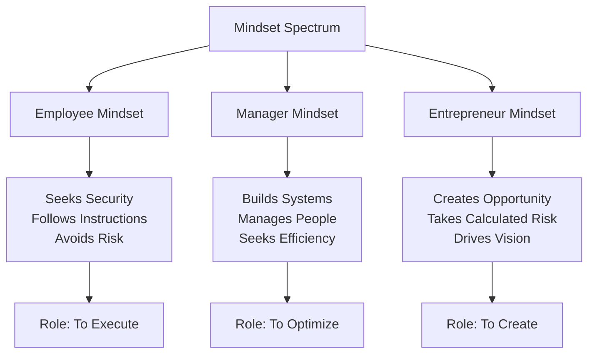

# Mindset of an Employee, Manager, and an Entrepreneur

## 1. Definition

Mindset refers to the established set of attitudes, beliefs, and ways of thinking that shapes how a person perceives their role, approaches work, handles challenges, and makes decisions. The employee mindset is task-execution oriented, the manager mindset is system and people oriented, and the entrepreneur mindset is opportunity and ownership oriented.

---

## 2. Concept Explanation

Every person in a working environment operates with a particular mental framework. This framework determines whether they wait for instructions, create instructions for others, or build something entirely new from scratch. The basic idea is that the way you think decides your actions.

**How it works:** An employee typically works within a defined role and follows processes. Their primary concern is doing the assigned job well and receiving a stable reward. A manager coordinates people and resources to meet organisational goals efficiently; they focus on planning, control, and optimisation. An entrepreneur identifies opportunities, takes calculated risks, and assembles resources to create value; they are vision-driven and comfortable with ambiguity.

**Why it is important:** Understanding these mindset differences helps individuals choose the right career path, build complementary teams, and develop the mental flexibility required for different roles. Organisations thrive when they have the right mix of all three mindsets. For a future business owner, shifting from an employee mindset to an entrepreneurial mindset is the first step toward success.

---

## 3. Key Characteristics / Features

The three mindsets can be identified by the following core features and attitudes.

**Employee Mindset:**
- **Security focused:** Priority is given to job stability, fixed working hours, and predictable income.
- **Role-based execution:** Accepts a specific job description and works within that boundary.
- **Compliance driven:** Prefers clear instructions and follows established rules and procedures.
- **Short-term reward orientation:** Measures success through monthly salary, increments, and perks.
- **Aversion to risk:** Seeks to avoid mistakes and personal financial exposure; lets the organisation bear the ultimate business risk.

**Manager Mindset:**
- **Efficiency focused:** Obsessed with getting work done through others with minimum waste of time and money.
- **Authority and accountability:** Takes ownership of team results and uses positional authority to delegate tasks.
- **Process orientation:** Builds systems, policies, and structures to bring order and predictability.
- **Interpersonal skills:** Motivates, coaches, and controls subordinates; resolves conflicts.
- **Balanced risk approach:** Takes calculated operational risks within the framework given by top management but avoids entrepreneurial risk.

**Entrepreneur Mindset:**
- **Opportunity driven:** Constantly looks for gaps in the market and innovative solutions.
- **Ownership and commitment:** Feels deep personal responsibility for the entire venture beyond official working hours.
- **Vision and direction:** Sets the vision, mission, and long-term goal; inspires others to join.
- **Comfort with uncertainty:** Makes decisions with incomplete information and adapts quickly.
- **Risk-taking and resilience:** Willing to invest personal money, face failure, and bounce back repeatedly.
- **Self-belief and internal locus of control:** Believes success depends on one’s own efforts and decisions, not external luck.

---

## 4. Types / Classification

There is no formal sub-classification, but for our understanding we can classify the working mindset into three clear types:

- **Task-oriented mindset (Employee):** The world revolves around a defined job responsibility. Success means “my work is done correctly and on time”.
- **Control-oriented mindset (Manager):** The world revolves around coordinating people and processes. Success means “my team achieved its targets within budget”.
- **Creation-oriented mindset (Entrepreneur):** The world revolves around building something from nothing. Success means “I created value and captured a market”.

---

## 5. Working / Mechanism (How each mindset operates day-to-day)

The daily thought process and actions differ significantly among the three.

1. **Morning thought:**  
   - Employee: “What tasks do I have to finish today?”  
   - Manager: “What do I need to get done through the team today?”  
   - Entrepreneur: “What new opportunity or problem can I address today?”

2. **Approach to a problem:**  
   - Employee: Reports the problem to the supervisor and awaits a solution.  
   - Manager: Gathers the team, analyses root cause, allocates resources, and monitors resolution.  
   - Entrepreneur: Sees the problem as a business opportunity; if it is painful for many people, it could become a product.

3. **Reaction to failure:**  
   - Employee: Worries about performance rating and job security.  
   - Manager: Tweaks the process, retrains staff, and analyses what went wrong to avoid repetition.  
   - Entrepreneur: Learns quickly, “fails forward”, and immediately pivots to a new approach.

4. **Resource perspective:**  
   - Employee: Expects resources to be provided by the company.  
   - Manager: Fights for budgets, optimises resource allocation, and shows utilisation reports.  
   - Entrepreneur: Bootstraps; starts with whatever is available and figures out how to multiply limited resources.

5. **Growth trajectory:**  
   - Employee: Aims for promotion, higher salary, and a better title.  
   - Manager: Aims for a larger team, bigger budget, and higher impact within the organisation.  
   - Entrepreneur: Aims to scale the business, create wealth, and build a legacy.

---

## 6. Diagram

---

## 7. Mathematical Formulation

*Not applicable. Mindset is a qualitative behavioural concept and is not expressed through mathematical equations.*

---

## 8. Example

Consider a software company.

- **An employee (a junior developer)** writes code for assigned modules, follows the design document, logs 9-hour workdays, and expects a fixed monthly salary at the end of the month. If a bug appears, they report it.
- **A manager (a project leader)** divides the project into tasks, assigns them to developers, conducts daily stand-up meetings, ensures the team meets deadlines, and manages client communication. If a project is delayed, they replan and negotiate for more resources.
- **An entrepreneur (the founder)** noticed that small businesses struggle with accounting. She came up with the idea of a simple mobile accounting app, invested her savings to build a prototype, attracted a co‑founder, and pitched to investors for funding. She works day and night, does sales, marketing, and product vision, and if the app fails, she will start another venture.

---

## 9. Analogy

Imagine a journey in an unknown forest.

- An **employee** is like a passenger who has bought a ticket for a guided forest tour. They sit in the vehicle, follow the guide’s instructions, enjoy the scenery, and expect the driver to take them safely back to the hotel. They take no risk about the route.
- A **manager** is the tour guide or team leader. They organise the group, decide the stops, manage the schedule, make sure everyone is comfortable, and report to the head office. They drive the vehicle but follow a pre‑approved tour map.
- An **entrepreneur** is the explorer who first mapped the forest, decided to start a tour business there, built the road, bought the vehicles, and invited people. There is no map; they create the map.

---

## 10. Comparison

| Feature | Employee Mindset | Manager Mindset | Entrepreneur Mindset |
|--------|------------------|-----------------|----------------------|
| Primary drive | Security and stability | Authority and efficiency | Autonomy and creation |
| Relationship with risk | Risk averse, wants safety | Risk aware, manages operational risk | Risk embracing, manages strategic risk |
| Time orientation | Short-term (daily/weekly) | Medium-term (quarterly/annually) | Long-term (vision for years) |
| Resource source | Provided by employer | Allocated by organisation | Self-generated or raised |
| View of rules | Follows rules strictly | Enforces and designs rules | Breaks or rewrites rules |
| Responsibility | For own tasks | For team output | For the entire venture |
| Reaction to uncertainty | Seeks clarity and guidance | Creates process to reduce uncertainty | Thrives in uncertainty |
| Financial reward | Fixed salary, bonus | Salary, team bonus, perquisites | Profit, equity, wealth creation |
| Failure impact | Loss of job or appraisal drop | Departmental underperformance | Personal financial loss, venture collapse |

---

## 11. Advantages (of understanding these mindsets)

- Helps individuals choose careers aligned with their natural thinking style.
- Enables students and professionals to consciously develop the mindset needed for their goal (e.g., shifting from employee to entrepreneur).
- Assists organisations in putting the right person in the right role.
- Encourages “intrapreneurship” – creating an entrepreneurial culture even inside large companies by identifying employees with entrepreneurial traits.
- Reduces conflict: understanding why a manager focuses on process while an entrepreneur wants rapid change helps in better teamwork.
- Promotes lifelong learning: one can deliberately adopt the positive traits of each mindset (employee’s discipline, manager’s planning, entrepreneur’s vision).

---

## 12. Disadvantages / Limitations (of stereotyping mindsets)

- Labelling a person with one mindset can create boxes; people often display a mix of all three.
- The employee mindset, if excessively negative, may be associated with a lack of initiative, but many employees are highly creative and proactive.
- The entrepreneurial mindset, if unchecked, can lead to over‑optimism, ignoring operational details, and burnout.
- Managers stuck strictly in a managerial mindset may resist necessary disruptive change and innovation.
- The mindset alone does not guarantee success; skills, resources, and timing are equally important.
- Cultural and economic background strongly influence mindset; comparisons should avoid blanket judgement.

---

## 13. Important Points / Exam Notes

- Employee mindset seeks security, defined tasks, and avoids risk; dominant thought: “What is my job?”
- Manager mindset seeks order, efficiency, and team results; dominant thought: “How can I get it done through people?”
- Entrepreneur mindset seeks opportunity, creation, and ownership; dominant thought: “What can I build?”
- Entrepreneurs have a high internal locus of control; they believe they create their own destiny.
- The three mindsets exist on a spectrum; many successful entrepreneurs start with an employee or manager mindset and evolve.
- An intrapreneur is an employee with an entrepreneurial mindset who innovates within an organisation.
- The “effectual reasoning” approach is common in entrepreneurs: they start with their means and allow goals to emerge, while manager/employee mindsets often use causal reasoning (set goal, find means).

---

## 14. Applications / Use Cases

- **Career counselling:** Helping students decide if they are suited for a job, management, or self-employment.
- **Start-up team building:** A founding team needs an entrepreneurial visionary, but as the company grows, it must bring in professional managers to create systems.
- **Corporate innovation:** Large companies run “innovation incubators” to encourage an entrepreneurial mindset among their employees and managers.
- **Personal development:** A person wanting to start a side business can analyse their current employee‑like habits (e.g., waiting for permission) and consciously adopt entrepreneurial behaviours (e.g., problem‑solving without full resources).
- **Policy making:** Government entrepreneurship development programmes aim to shift the job‑seeker mindset towards a job‑creator mindset among youth.

---

## 15. MCQs

**Q1. Which of the following best describes the employee mindset?**  
A. Creates vision, takes high risk, and builds organisations  
B. Follows instructions, seeks job security, and works within a defined role  
C. Optimises processes, manages teams, and allocates resources  
D. Invests personal capital to generate profit  
**Answer:** B  
**Explanation:** The employee mindset focuses on completing assigned tasks, valuing stability and clear career progression.

**Q2. The manager’s primary focus is on:**  
A. Creating new business opportunities from scratch  
B. Compliance with rules and avoiding all risk  
C. Getting work done through people efficiently  
D. Selling the company to investors  
**Answer:** C  
**Explanation:** A manager builds systems, manages team performance, and ensures targets are met with available resources.

**Q3. An entrepreneur is most characterised by:**  
A. Comfort with ambiguity and a strong drive to create new value  
B. Strict adherence to existing company policies  
C. Dependence on a fixed monthly salary  
D. Preferring detailed instructions for every task  
**Answer:** A  
**Explanation:** Entrepreneurs operate in uncertainty, see opportunities others miss, and build ventures around those insights.

**Q4. In terms of risk, which comparison is correct?**  
A. Employee: risk embracing; Entrepreneur: risk averse  
B. Manager: takes ultimate business risk; Employee: no risk  
C. Entrepreneur: personally bears business risk; Employee: risk is limited to job loss  
D. All three bear equal business risk  
**Answer:** C  
**Explanation:** An entrepreneur puts personal finances and reputation on the line. An employee’s main risk is losing a job, not the business losses.

**Q5. An “intrapreneur” is best described as:**  
A. A manager who strictly follows orders  
B. An employee with an entrepreneurial mindset innovating within a company  
C. An entrepreneur who works only in IT  
D. A consultant advising startups  
**Answer:** B  
**Explanation:** Intrapreneurs drive innovation inside established firms, acting like owners while being employees.

**Q6. Which statement reflects an entrepreneurial mindset?**  
A. “I will do exactly what the boss says today.”  
B. “Let me first see what budget is available before thinking of a solution.”  
C. “This problem is a massive opportunity; I will build a business around the solution.”  
D. “If the system fails, it is not my fault.”  
**Answer:** C  
**Explanation:** Entrepreneurs reframe problems as opportunities and take ownership of creating a solution.

**Q7. A major advantage of understanding these three mindsets is:**  
A. It allows stereotyping people rigidly  
B. It helps individuals make better career choices and build effective teams  
C. It proves entrepreneurs are better than managers  
D. It guarantees business success  
**Answer:** B  
**Explanation:** Recognising mindsets helps in role alignment, team composition, and self-development.

**Q8. Which of the following is a limitation of the entrepreneur mindset if taken to an extreme?**  
A. Over‑obsession with rules and procedures  
B. Fear of failure leading to inaction  
C. Over‑optimism, ignoring details, and risk of burnout  
D. Reluctance to take any credit for success  
**Answer:** C  
**Explanation:** Unchecked entrepreneurial energy can cause a founder to ignore operational details, make unrealistic projections, and suffer personal exhaustion.

**Q9. The phrase “internal locus of control” associated with entrepreneurs means:**  
A. They blame external factors for failures  
B. They believe success depends on their own actions and decisions  
C. They prefer to control other people’s lives  
D. They let luck determine the outcome  
**Answer:** B  
**Explanation:** Entrepreneurs feel they are in charge of their destiny, and outcomes are largely a result of their efforts and choices.

**Q10. In a start-up, the best early team often consists of:**  
A. Only employee‑minded individuals who want job security  
B. One entrepreneur visionary with all managerial and employee responsibilities  
C. A mix of an entrepreneurial visionary and managerially minded co‑founders to build systems  
D. No employees, only freelancers  
**Answer:** C  
**Explanation:** A start-up needs the vision and drive of an entrepreneur combined with the operational discipline of a managerial mindset to scale successfully.