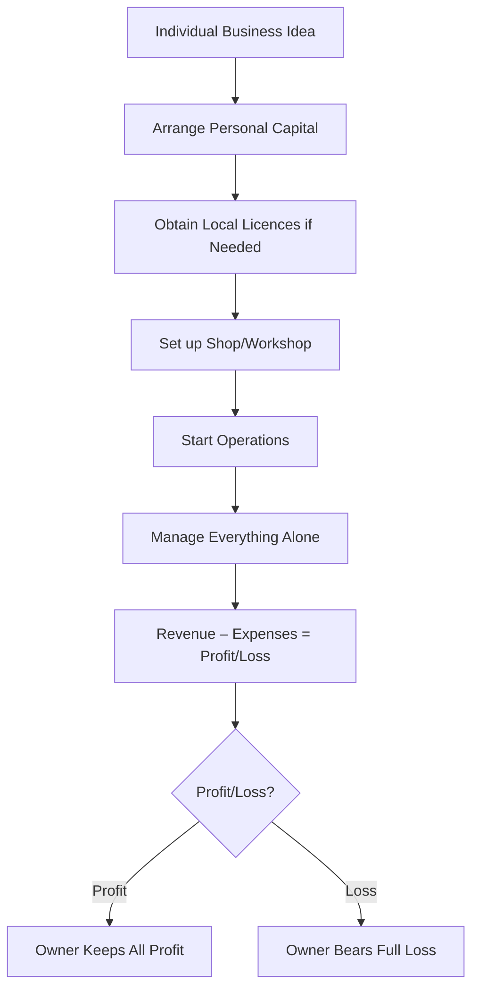

# Sole proprietorship

## Video Explanation

* [https://www.youtube.com/watch?v=2q3K5xX0WmE](https://www.youtube.com/watch?v=2q3K5xX0WmE)

## Visual Aids

## 1. Definition

A sole proprietorship is a form of business owned, managed, and controlled by a single individual. The owner bears all the risks and receives all the profits. There is no legal separation between the business and the owner.

## 2. Concept Explanation

Sole proprietorship is the simplest and oldest form of business ownership. In this form, one person puts in his own capital, uses his own skills, and manages the entire business alone. The business and the owner are considered the same entity in the eyes of the law. This means the owner is personally liable for all debts and obligations of the business.

How it works is straightforward. The sole proprietor decides what to produce or sell, finds a location, arranges funds, buys raw materials, hires helpers if needed, and sells the product or service. All decisions rest with him. Whatever profit is made belongs to him. If the business suffers a loss, he alone bears it. There are very few legal formalities to start and close the business.

This type of ownership is important because it allows an individual to start a business with minimal capital and procedural hurdles. For diploma-level students who want to start small workshops, repair centres, or retail shops, sole proprietorship is often the first step. It encourages self-employment and local entrepreneurship.

## 3. Key Characteristics / Features

- **Single ownership:** One person owns the entire business and provides the capital.
- **Unlimited liability:** The owner is personally liable for all business debts. Creditors can claim his personal assets if business assets fall short.
- **One-man control:** All decisions regarding purchases, sales, pricing, and expansion are taken by the proprietor alone.
- **No separate legal entity:** The business does not have a legal identity different from the owner. In case of a lawsuit, the owner is sued, not the business.
- **Sole claim on profit:** All profits of the business belong entirely to the proprietor.
- **Limited capital and size:** The ability to raise capital is limited to the proprietor’s personal savings and borrowing capacity, so the business usually remains small.
- **Easy formation and closure:** Minimal legal formalities are required to start or wind up the business.

## 4. Types / Classification

Sole proprietorships can be classified based on the nature of the business activity.

- **Trading sole proprietorship:** The owner buys finished goods and sells them to customers. Examples are a general store, a bakery shop, or a cloth merchant.
- **Manufacturing sole proprietorship:** The owner converts raw materials into finished goods. Examples are a small fabrication unit, a handmade soap business, or a paper cup manufacturing unit.
- **Service sole proprietorship:** The owner provides personal or professional services. Examples are a hair salon, a mobile repair shop, a dental clinic, or a tailoring unit.
- **Professional sole proprietorship:** The owner uses specialised knowledge and qualifications. Examples are a lawyer, a chartered accountant, or an architect practising individually.

## 5. Working / Mechanism

The process of establishing and running a sole proprietorship follows a clear sequence.

1.  **Identify a business idea:** The individual decides what product or service to offer based on his skills, market demand, and available capital.
2.  **Arrange capital:** The proprietor uses personal savings, borrows from family, friends, or banks, or takes a small government loan like MUDRA.
3.  **Decide the location:** A shop, a rented garage, an online platform, or a home-based workspace is selected.
4.  **Complete legal formalities (if any):** Depending on the nature of business, the proprietor may need a trade licence from the local municipal body, GST registration, or a Shops and Establishment certificate. Many small sole proprietorships operate with minimum paperwork.
5.  **Procure assets and materials:** The owner buys necessary tools, machinery, raw materials, and hires helpers if needed.
6.  **Commence operations:** Daily production or service delivery begins. The owner manages sales, keeps accounts, and deals with customers directly.
7.  **Manage finance and risk:** The owner collects revenue, pays expenses, keeps the remaining profit, and personally handles any shortfall or debt. All profit is reinvested or taken as personal income.
8.  **Wind up when desired:** If the owner decides to stop, he simply pays off creditors and closes the shop without any complex legal process.

## 6. Diagram

## 7. Mathematical Formulation

The net income of a sole proprietor is simply the revenue left after all expenses. Since the owner and business are one, the profit is the owner’s personal income.

$$
\text{Net Profit} = \text{Total Revenue} - \text{Total Expenses}
$$

Where:  
- Total Revenue = Sales of goods or services  
- Total Expenses = Cost of goods sold + Rent + Wages + Electricity + Licence fees + Interest on loan + Other operating expenses

All profit belongs to the sole proprietor. If the result is negative, it is a loss borne entirely by the owner.

## 8. Example

Ravi, a diploma holder in electrical engineering, decides to start a small electrical repair and rewinding shop in his village. He rents a small room for ₹3,000 per month, buys basic tools and testers with his savings of ₹40,000, and obtains a local trade licence. He works alone, rewinding motors and repairing home appliances. In a month, he earns ₹25,000 in service charges and spends ₹8,000 on materials and ₹3,000 on rent. His net profit is ₹14,000. Ravi is a sole proprietor. He keeps all the profit and bears all the risk; if the shop fails, he will have to pay debts from his own pocket.

## 9. Analogy

A sole proprietorship is like a fruit vendor selling mangoes from a cart. He buys the mangoes with his own money, decides the price, shouts to attract customers, and keeps whatever money is left at the end of the day. If the mangoes spoil, he takes the loss. No one else shares his profit or his loss. The cart, the mangoes, and the vendor are all part of one single effort, just like the sole proprietor and his business are one entity.

## 10. Comparison

| Feature | Sole Proprietorship | Partnership |
|--------|----------|----------|
| **Number of owners** | One | Two or more (up to 50 in banking, otherwise as per Partnership Act) |
| **Liability** | Unlimited, personal assets at risk | Unlimited, joint and several liability |
| **Decision making** | Quick, single person decides | Shared, may be slower due to consultation |
| **Capital** | Limited to owner’s resources | Larger, as partners pool resources |
| **Profit sharing** | All profit to the sole owner | Shared among partners as per agreement |
| **Legal formalities** | Very few | Partnership deed advisable, registration optional |

## 11. Advantages

- **Easy and inexpensive to start:** A sole proprietorship can be set up with minimal legal work and low cost.
- **Complete control:** The owner makes all decisions independently without having to consult anyone.
- **Secrecy:** Business secrets and financial information remain with one person only.
- **Direct motivation:** Since all profit goes to the owner, there is a strong personal incentive to work hard and reduce waste.
- **Quick decision making:** The absence of partners and a board allows immediate response to market changes.
- **Personalised customer relations:** The owner directly interacts with customers, which builds loyalty and trust.

## 12. Disadvantages / Limitations

- **Unlimited liability:** The owner’s personal property such as a house or car can be seized to pay business debts.
- **Limited capital:** It is difficult to expand the business beyond a certain size because capital comes only from one person’s savings and borrowing capacity.
- **Limited managerial ability:** One person cannot be an expert in all fields like marketing, finance, production, and technology.
- **Uncertain longevity:** The business often dissolves if the owner becomes ill, loses interest, or dies. There is no continuity.
- **Heavy workload:** The proprietor must handle all tasks personally, which can lead to stress and long working hours.
- **Difficulty in attracting skilled employees:** Small scale and uncertain future make it hard to hire and retain talented staff.

## 13. Important Points / Exam Notes

- Sole proprietorship is also called individual entrepreneurship or sole trader business.
- It is the most common form of business in India, especially for small trade, retail, and local services.
- The owner is called the “sole proprietor”. The business and the owner are not legally separate.
- Registration is not compulsory except for specific licences (e.g., GST, Shops and Establishments, FSSAI for food).
- The owner pays income tax on the business profit as per individual tax slab; the business itself is not taxed separately.
- Unlimited liability is the biggest disadvantage: if the business fails, the owner’s personal assets can be used to repay creditors.
- Risk is concentrated on one person; profit is also enjoyed by one person alone.
- The government encourages sole proprietorships through schemes like PMEGP and MUDRA Yojana.
- This form is ideal for businesses requiring small capital, direct customer contact, and limited scale.
- Decision making is fast, but ability to raise funds is low compared to a company or partnership.

## 14. Applications / Use Cases

- **Neighbourhood retail stores:** A single owner runs a small grocery, stationery, or medical store.
- **Technical service centres:** A diploma engineer starts a motor rewinding workshop or a mobile/laptop repair shop as a sole proprietor.
- **Freelancing and consulting:** A civil draughtsman offers his design services from home under his own name.
- **Artisan and handicraft business:** A potter or a weaver sells products directly or through a small outlet, bearing full cost and risk.
- **Small‑scale manufacturing unit:** A proprietor sets up a machine shop, a bakery, or a steel fabrication unit with one or two workers.

## 15. MCQs

**Q1. In a sole proprietorship, the business is owned and managed by**

A. Two persons  
B. A group of shareholders  
C. A single individual  
D. The government  

**Answer:** C  
**Explanation:** A sole proprietorship is a one‑person ownership and management.

---

**Q2. Which of the following is a major disadvantage of sole proprietorship?**

A. Easy formation  
B. Unlimited liability  
C. Direct motivation  
D. Quick decision making  

**Answer:** B  
**Explanation:** The owner’s personal assets are at risk to pay business debts.

---

**Q3. The life of a sole proprietorship is**

A. Always fixed by law  
B. Perpetual like a company  
C. Dependent on the owner’s life and willingness to continue  
D. Minimum 20 years  

**Answer:** C  
**Explanation:** The business may end upon the owner’s death, illness, or decision to close.

---

**Q4. Who receives the entire profit in a sole proprietorship?**

A. The investors  
B. Shareholders  
C. The sole proprietor  
D. Government as tax  

**Answer:** C  
**Explanation:** All profit belongs to the sole owner after paying taxes.

---

**Q5. Which of the following businesses is most suitable for a sole proprietorship form?**

A. A large steel plant  
B. A multi‑speciality hospital  
C. A neighbourhood barber shop  
D. A national airline  

**Answer:** C  
**Explanation:** Small‑scale, local service businesses fit the sole proprietorship model well.

---

**Q6. A sole proprietorship requires**

A. Mandatory registration with SEBI  
B. Complex incorporation documents  
C. Minimal legal formalities to start  
D. At least two directors  

**Answer:** C  
**Explanation:** It is the simplest business form with very few legal procedures.

---

**Q7. If a sole proprietor’s business incurs a loss and cannot pay its debts, the creditors can**

A. Only seize business assets  
B. Claim the proprietor’s personal property  
C. Take over the business only  
D. Do nothing  

**Answer:** B  
**Explanation:** Because the owner and business are legally the same, personal assets can be used to clear business debts.

---

**Q8. A diploma engineer opening a small fabrication unit alone is an example of**

A. Partnership  
B. Sole proprietorship  
C. Private limited company  
D. Cooperative society  

**Answer:** B  
**Explanation:** One person owning and running the unit is a sole proprietor.

---

**Q9. Which of the following is true about decision making in a sole proprietorship?**

A. Decisions are made by a board of directors  
B. Decisions require approval from partners  
C. Decisions are made quickly by the owner alone  
D. Decisions are taken by shareholders’ votes  

**Answer:** C  
**Explanation:** Since there is only one owner, decision making is fast and independent.

---

**Q10. The availability of capital in a sole proprietorship is**

A. Unlimited  
B. Raised from public through shares  
C. Limited to the owner’s personal funds and borrowing capacity  
D. As large as a public company  

**Answer:** C  
**Explanation:** A sole proprietor cannot issue shares or debentures, so capital is restricted.