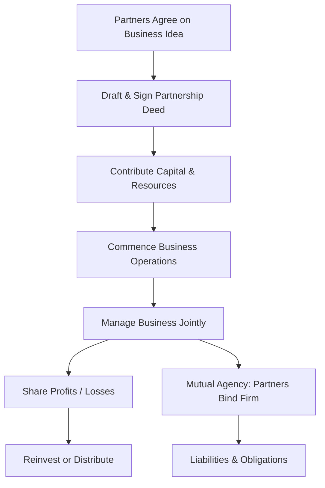

# Partnerships

## 1. Definition

A partnership is a business structure in which two or more individuals agree to share the ownership, profits, and responsibilities of running a business. It is governed by a partnership deed and, in many countries, by a specific partnership act. The partners pool their resources, skills, and capital to operate a common enterprise with a view to earning profit.

## 2. Concept Explanation

A sole proprietor often faces limitations in capital, skills, and decision-making capacity. Partnership overcomes this by bringing together multiple individuals. The basic idea is that by combining strengths, partners can build a larger, more resilient business than they could alone.

How it works: Partners sign a partnership deed that outlines capital contributions, profit-sharing ratios, duties, and procedures for resolving disputes. Each partner acts as an agent of the firm, meaning one partner's actions legally bind the entire partnership. Business income is taxed in the hands of the partners individually, and the partnership itself is not a separate taxable entity (depending on jurisdiction). In a general partnership, every partner has unlimited liability, exposing personal assets to business debts. This simple structure allows small businesses to start quickly with minimal legal formalities.

Why it is important: Partnership is a popular choice for professional services, small manufacturing units, and family-run businesses. It enables risk-sharing, pooled expertise, and faster decision-making compared to solo operations. The flexibility of the partnership model makes it attractive for start-ups that need collaboration without complex corporate structures.

## 3. Key Characteristics / Features

- **Two or More Partners:** There must be at least two individuals, with a typical maximum of 20 in ordinary business and 10 for banking partnerships.
- **Agreement (Partnership Deed):** The relationship is created by a contract, either written or oral, which defines mutual rights and obligations.
- **Sharing of Profits and Losses:** Partners distribute business profits among themselves in an agreed ratio; they also bear losses, unless otherwise stated.
- **Joint Ownership and Control:** Each partner has a right to participate in management and an ownership interest in the firm's assets.
- **Mutual Agency:** Every partner acts as both an agent and a principal; any partner can bind the entire firm to contracts and debts.
- **Unlimited Liability (General Partners):** In a general partnership, partners are personally liable for all business debts, even from their personal assets.

## 4. Types / Classification

Partnerships can be classified into several types based on liability and registration.

- **General Partnership (Ordinary Partnership):** All partners share unlimited liability and are involved in day-to-day management. Each partner can bind the firm by their actions. This is the most common type for small businesses.
- **Limited Partnership:** Comprises at least one general partner with unlimited liability and one or more limited partners whose liability is restricted to their invested capital. Limited partners cannot participate in management.
- **Limited Liability Partnership (LLP):** A modern hybrid form where all partners enjoy limited liability, and the firm is a separate legal entity. It combines benefits of a partnership and a corporation. LLPs are often used by professional service firms.

## 5. Working / Mechanism

1.  Potential partners identify a common business opportunity and agree on broad objectives.
2.  They negotiate and prepare a **Partnership Deed** covering name, capital, profit ratio, duties, dispute resolution, and dissolution terms.
3.  Partners contribute capital in cash, property, or skills, and the firm commences operations.
4.  All partners are authorized to manage; however, they often divide responsibilities based on expertise (e.g., one handles finance, another manages operations).
5.  The firm borrows money, enters contracts, and conducts business; any partner's actions within ordinary business bind the entire firm.
6.  Profits are shared as per the deed, and losses are borne accordingly. In absence of a deed, profits are shared equally.
7.  In case of a dispute, retirement, or death, the partnership is dissolved unless a new agreement is reached. Registration of the partnership (though not mandatory) provides legal advantages.

## 6. Diagram

## 7. Mathematical Formulation

Not applicable for this topic.

## 8. Example

Raj, Simran, and Balu are three friends who decide to start a graphic design studio. Raj contributes ₹5 lakhs, Simran brings ₹3 lakhs and her design software, and Balu provides ₹2 lakhs plus his client contacts. They sign a partnership deed stating Raj gets 40%, Simran 35%, and Balu 25% of profits. They name the firm "RBS Creative Partners". All three work full-time, share expenses, and jointly sign client contracts. This is a general partnership.

## 9. Analogy

Imagine a cricket team. Each player brings a unique skill—batting, bowling, fielding. The captain (managing partner) leads, but every player's performance counts. Victories (profits) are shared by the team, and defeats (losses) are collective. If the team incurs a fine, the entire squad is responsible. A partnership works exactly like this, pooling diverse talents to win the business game together.

## 10. Comparison

| Feature | Partnership | Sole Proprietorship |
|--------|-------------|---------------------|
| Owners | Two or more persons | Single individual |
| Capital | More capital through combined contributions | Limited to owner's resources |
| Decision-making | Shared, can be slow due to consensus needs | Quick, single person decides |
| Liability | Unlimited for general partners (joint and several) | Unlimited for the sole proprietor |
| Continuity | Dissolved on death or exit of a partner, unless agreed otherwise | Ceases on owner's death or retirement |
| Regulatory requirements | Partnership deed; optional registration | Minimal legal formalities |

## 11. Advantages

- It is easy to form with a simple agreement and low initial cost.
- Partners can raise more capital than a sole proprietor by pooling individual savings and borrowing capacity.
- The business benefits from combined skills, experience, and specialised expertise of multiple partners.
- Risk and responsibility are shared among all partners, reducing individual burden.
- Decision-making is more balanced due to consultation, which can lead to better business judgments.
- Losses, if any, are shared in the profit-sharing ratio, providing financial cushion.

## 12. Disadvantages / Limitations

- General partners have unlimited liability; their personal wealth is at risk for business debts.
- Disagreements and conflicts among partners can stall decisions and even lead to dissolution.
- The business may suffer from limited capital compared to corporate forms, hampering large-scale expansion.
- Partnership is not a separate legal entity (except LLP), so it lacks perpetual succession.
- A partner's mistake or fraudulent act can bind the entire firm, causing harm to all.
- The withdrawal or death of a partner often leads to dissolution, creating instability.

## 13. Important Points / Exam Notes

- A partnership is governed by the Indian Partnership Act, 1932 (in India).
- A partnership deed is the written agreement; it should clearly state capital, profit share, duties, and rules for dissolution.
- Registration of a partnership firm is not compulsory but highly recommended, as an unregistered firm cannot file suits against third parties.
- The maximum number of partners is 50 for an LLP; for a traditional partnership, RBI prescribes a limit of 10 for banking and 20 for other businesses.
- Every partner is an agent of the firm and of other partners for the purpose of business.
- In the absence of a deed, the partnership is unlimited, profits are shared equally, and no partner receives a salary or interest on capital.

## 14. Applications / Use Cases

- **Professional Services:** Lawyers, chartered accountants, architects, and doctors often form partnerships to combine expertise and share office infrastructure.
- **Family-run Businesses:** Small retail shops, restaurants, or manufacturing units run by siblings or cousins frequently operate as partnerships.
- **Creative Agencies:** Advertising, design, and event management startups where multiple founders bring different skill sets.
- **Farming and Agri-business:** Two or more farmers pooling land, equipment, and labour under a partnership to increase output.
- **Real Estate Ventures:** Partners joining to purchase and develop property, share risks, and distribute rental income.

## 15. MCQs

**Q1. What is the minimum number of persons required to form a partnership?**

A. 1  
B. 2  
C. 5  
D. 10  
**Answer:** B  
**Explanation:** A partnership requires at least two individuals to come together and carry on a business.

**Q2. In a general partnership, the liability of partners is:**

A. Limited to their capital invested  
B. Unlimited and joint and several  
C. Nonexistent  
D. Restricted to the managing partner only  
**Answer:** B  
**Explanation:** General partners have unlimited liability, meaning their personal assets can be used to settle business debts.

**Q3. The written agreement outlining the terms of a partnership is called:**

A. Memorandum of Association  
B. Articles of Association  
C. Partnership Deed  
D. Contract of Sale  
**Answer:** C  
**Explanation:** A partnership deed is the document that specifies rights, duties, and profit-sharing ratios among partners.

**Q4. Which type of partnership allows limited partners who do not participate in management and have liability limited to their investment?**

A. General partnership  
B. Limited partnership  
C. Sole proprietorship  
D. Cooperative society  
**Answer:** B  
**Explanation:** A limited partnership has at least one general partner with unlimited liability and one or more limited partners whose liability is capped at their contribution.

**Q5. Mutual agency means:**

A. Only the managing partner can act on behalf of the firm  
B. Every partner can bind the firm by their actions in ordinary course of business  
C. Partners have no authority to make contracts  
D. The firm acts as an agent for outside parties  
**Answer:** B  
**Explanation:** Mutual agency implies that each partner is both an agent and a principal, and their actions legally bind the entire partnership.

**Q6. If the partnership deed is silent on profit sharing, profits are shared:**

A. According to capital contributed  
B. In the ratio of 2:1  
C. Equally among all partners  
D. Only by the managing partner  
**Answer:** C  
**Explanation:** Under the Indian Partnership Act, 1932, in the absence of an agreement, profits and losses are shared equally.

**Q7. Which of the following is a major disadvantage of a partnership?**

A. Limited capital compared to sole proprietorship  
B. Unlimited liability for general partners  
C. Centralised decision-making  
D. Lack of varied skills  
**Answer:** B  
**Explanation:** The biggest drawback of a general partnership is the risk of personal assets being claimed for business debts.

**Q8. Registration of a partnership firm:**

A. Is compulsory under law  
B. Is optional, but unregistered firms face legal disabilities  
C. Makes the firm a separate legal entity  
D. Guarantees limited liability  
**Answer:** B  
**Explanation:** Registration is not mandatory, but an unregistered firm cannot file a suit against a third party to enforce rights.

**Q9. A Limited Liability Partnership (LLP) offers partners:**

A. Unlimited liability  
B. Limited liability and separate legal identity  
C. No right to manage  
D. Only one owner  
**Answer:** B  
**Explanation:** An LLP is a hybrid structure that provides limited liability to all partners and has a separate legal entity.

**Q10. The death of a partner in a general partnership typically results in:**

A. Automatic continuity with the legal heir  
B. Dissolution of the partnership, unless otherwise agreed  
C. Transfer of the deceased partner's shares freely  
D. A new corporation being formed  
**Answer:** B  
**Explanation:** Unless the partnership deed specifies continuation, the death of a partner dissolves the firm.