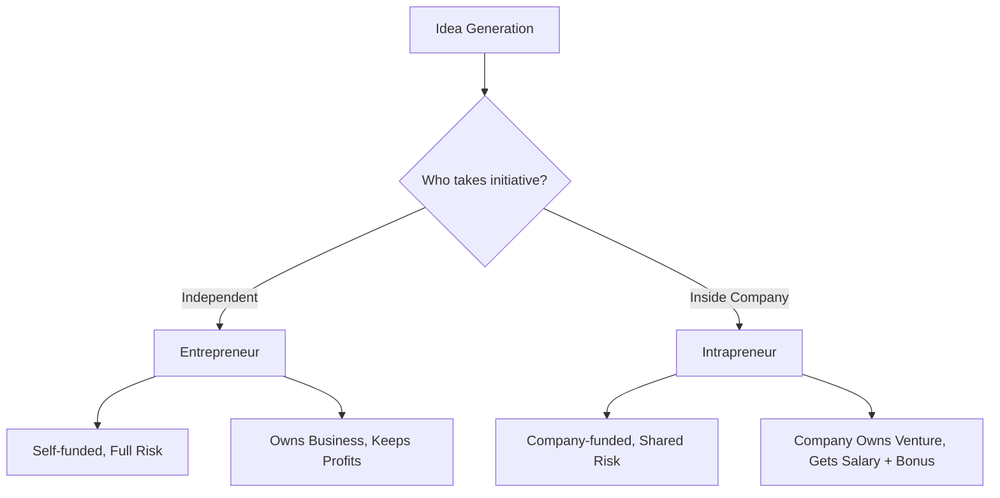

# 05 Difference between Entrepreneur and Intrapreneur

## 1. Definition

- **Entrepreneur:** An entrepreneur is a person who starts and runs a new business, taking on financial risks in the hope of earning profit.  
- **Intrapreneur:** An intrapreneur is an employee within an existing company who uses entrepreneurial skills to create new products, services, or processes without bearing the full financial risk.

## 2. Concept Explanation

An **entrepreneur** identifies a market opportunity, gathers resources, and builds a new venture from scratch. This journey involves complete ownership, decision-making power, and direct exposure to both profit and loss. The entrepreneur is fully responsible for the success or failure of the business.

An **intrapreneur**, on the other hand, works inside a large organisation. They act like an entrepreneur but operate within the company’s framework. The company provides funding, infrastructure, and support. The intrapreneur focuses on innovation and growth, and if the project fails, the company absorbs the loss, not the individual.

Why this difference is important:  
- It shows two paths to innovation – one independent and high-risk, the other internal and supported.  
- Understanding the distinction helps students choose their career path and organisations to foster internal talent.

## 3. Key Characteristics / Features

**Entrepreneur**
- Bears all financial and operational risks alone.
- Has full control over business decisions and strategy.
- Owns the enterprise and its profits completely.
- Raises capital from personal savings, loans, or investors.
- Motivates a team to achieve a personal vision.

**Intrapreneur**
- Takes calculated risks within the safety net of the parent company.
- Needs management approval for major decisions.
- Does not own the venture; the company owns the outcomes.
- Uses company resources, budget, and brand name.
- Works to align the project with the company’s long-term goals.

## 4. Types / Classification

While the focus is on the difference, both roles can be classified.

**Types of Entrepreneurs**
- **Innovative Entrepreneur:** Brings completely new ideas to the market (e.g., a new tech gadget).
- **Imitative Entrepreneur:** Copies existing business models and improves them.
- **Fabian Entrepreneur:** Cautious and adopts changes only when necessary.
- **Drone Entrepreneur:** Refuses to change even when the business is declining.

**Types of Intrapreneurs**
- **Product Champion:** Pushes a single new product idea with extreme dedication.
- **Process Innovator:** Improves internal operations to save cost and time.
- **Corporate Venture Manager:** Runs a new business unit like a startup inside the company.

## 5. Working / Mechanism

The way an entrepreneur and an intrapreneur bring an idea to life differs significantly.

**Entrepreneur’s process (step-by-step):**
1. The entrepreneur spots a gap in the market and forms a business idea.
2. They write a business plan and estimate the required capital.
3. They arrange funds from personal savings, banks, or investors.
4. They register the company, set up operations, and hire the initial team.
5. The business launches its product or service and acquires customers.
6. The entrepreneur keeps all profits or bears all losses personally.

**Intrapreneur’s process (step-by-step):**
1. The employee notices an opportunity for a new product or improvement within the company’s domain.
2. They prepare a detailed proposal and present it to senior management.
3. After receiving approval, the company allocates a budget and a dedicated team.
4. The intrapreneur leads the project, using the company’s resources, brand, and distribution.
5. If the project succeeds, the company benefits and the intrapreneur may receive rewards or promotion.
6. If it fails, the organisation absorbs the loss, and the intrapreneur returns to regular duties.

## 6. Diagram

## 7. Mathematical Formulation

Not applicable for this topic. The difference is conceptual and does not involve a mathematical formula.

## 8. Example

- **Entrepreneur:** Ritesh Agarwal started OYO Rooms from scratch. He raised money, built the brand, and faced all early losses. Today, he owns a large stake in the global chain.
- **Intrapreneur:** Paul Buchheit, a Google employee, developed Gmail in his 20% free time using Google’s servers and resources. Google retained ownership, and Buchheit received recognition and career growth, not direct venture equity.

## 9. Analogy

Consider farming. An **entrepreneur** is like a farmer who owns the land, buys seeds and fertiliser with their own money, and sells the crop. If the crop fails, the farmer alone suffers the loss.  
An **intrapreneur** is like a head gardener employed by a large estate. The gardener uses the owner’s land, tools, and money to grow a new exotic plant. If the plant dies, the estate bears the loss, and the gardener still receives a salary.

## 10. Comparison

| Feature | Entrepreneur | Intrapreneur |
|--------|----------|----------|
| Meaning | Person who starts and runs a new business independently. | Employee who innovates within an existing organisation. |
| Risk | Bears the full financial and operational risk. | Shares risk; the company absorbs major losses. |
| Capital | Raises funds from personal sources, loans, or investors. | Uses company-allocated budget and resources. |
| Ownership | Owns the business and its intellectual property. | Does not own; the company retains all rights. |
| Decision-making | Complete freedom and authority. | Needs approval from higher management. |
| Reward | Profits from the business if successful. | Salary, bonus, promotion, or recognition. |
| Failure | Can go bankrupt or lose personal assets. | May face job demotion or project closure, no personal bankruptcy. |
| Motivation | Independence, wealth creation, personal vision. | Career advancement, achievement within a safe framework. |

## 11. Advantages

**Advantages of an Entrepreneur**
- Complete control over company direction and culture.
- Potential for unlimited financial gain.
- Personal satisfaction from building something original.
- Flexibility to adapt quickly to market changes.

**Advantages of an Intrapreneur**
- Access to the company’s established resources, brand, and customers.
- Less personal financial risk; stable salary continues.
- Opportunity to innovate without worrying about budget and legal setup.
- Learning from experienced colleagues and proven systems.

## 12. Disadvantages / Limitations

**Disadvantages of an Entrepreneur**
- High stress due to financial uncertainty and long working hours.
- Risk of losing personal savings if the venture fails.
- Difficulty in raising funds and building credibility from zero.

**Disadvantages of an Intrapreneur**
- Limited freedom; ideas can be rejected by management.
- The company owns the innovation, leaving little personal equity.
- Rewards are often smaller compared to the profits generated.
- Can face internal politics and slow decision-making processes.

## 13. Important Points / Exam Notes

- An entrepreneur is a business owner; an intrapreneur is an employee who acts like an owner.
- The core difference lies in risk, ownership, and resource control.
- Entrepreneurs work outside an organisation; intrapreneurs work within one.
- A company can encourage intrapreneurship to boost innovation without spinning off separate startups.
- Famous intrapreneurial innovations include Gmail, Post-it notes, and PlayStation.
- Both roles require creativity, leadership, and problem-solving ability.

## 14. Applications / Use Cases

- **Startup incubators** support entrepreneurs with mentorship and seed funding to build new companies.
- **Corporate innovation labs** hire intrapreneurs to develop next-generation products under the parent brand.
- **Government schemes** (e.g., Startup India) distinguish between new venture promotion (entrepreneur) and internal R&D incentives (intrapreneur).
- **Large tech firms** like 3M and Google allow employees to spend a portion of their time on self-directed projects, tapping into intrapreneurial talent.

## 15. MCQs

**Q1. Who bears the full financial risk in a new venture?**  
A. Intrapreneur  
B. Entrepreneur  
C. Both equally  
D. Neither  
**Answer:** B  
**Explanation:** The entrepreneur invests personal resources and is liable for all losses.

**Q2. An intrapreneur works within which environment?**  
A. A startup they own  
B. An existing large organisation  
C. Government regulatory body  
D. Freelancing marketplace  
**Answer:** B  
**Explanation:** Intrapreneurs are employees who innovate inside a company.

**Q3. Which of the following is an example of an intrapreneur?**  
A. A person opening a new coffee shop  
B. An employee creating a new product for the company  
C. A freelancer developing a mobile app independently  
D. A farmer selling produce directly to consumers  
**Answer:** B  
**Explanation:** The employee uses company resources to innovate, which is intrapreneurship.

**Q4. What is a key advantage for an intrapreneur over an entrepreneur?**  
A. Full ownership of the product  
B. Total freedom to make all decisions  
C. Lower personal financial risk  
D. Higher potential profit share  
**Answer:** C  
**Explanation:** The intrapreneur does not bear the general financial loss; the company does.

**Q5. Which feature is unique to an entrepreneur?**  
A. Works within an existing firm  
B. Raises funds entirely from the organisation  
C. Owns the business and its profits  
D. Needs approval from a manager  
**Answer:** C  
**Explanation:** Ownership of the venture distinguishes an entrepreneur from an intrapreneur.

**Q6. Post-it notes were developed by an intrapreneur at 3M. This means the innovator**  
A. Founded 3M as a new business  
B. Left 3M to start a separate stationery company  
C. Used 3M’s resources to create the product  
D. Bought a licence from 3M  
**Answer:** C  
**Explanation:** The inventor was a 3M employee who innovated internally.

**Q7. What happens to an entrepreneur if the business fails?**  
A. They get a promotion  
B. They lose personal invested capital  
C. The company absorbs the loss  
D. They continue receiving a fixed salary  
**Answer:** B  
**Explanation:** Entrepreneurs face direct financial loss and possible bankruptcy.

**Q8. Which statement about decision-making is correct?**  
A. Entrepreneurs need management approval  
B. Intrapreneurs enjoy total autonomy  
C. Entrepreneurs make independent decisions  
D. Both have the same decision-making power  
**Answer:** C  
**Explanation:** Entrepreneurs have full control; intrapreneurs work under supervision.

**Q9. The term ‘intrapreneur’ combines which two words?**  
A. Internal + Entrepreneur  
B. International + Entrepreneur  
C. Internet + Entrepreneur  
D. Intro + Entrepreneur  
**Answer:** A  
**Explanation:** It refers to an ‘internal entrepreneur’ within an organisation.

**Q10. Which quality is common to both entrepreneurs and intrapreneurs?**  
A. Avoidance of all risk  
B. Preference for routine tasks  
C. Innovative thinking and initiative  
D. Dependency on others for every decision  
**Answer:** C  
**Explanation:** Both roles require creativity, leadership, and a proactive mindset.
