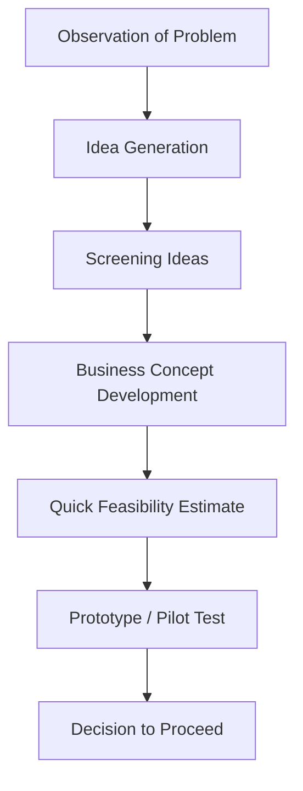

# 01 Concept

## 1. Definition

A business idea is a mental concept or thought that describes a possible product or service designed to solve a specific problem or fulfil a market need, with the potential to earn profit. It is the starting point of any entrepreneurial venture.

## 2. Concept Explanation

Every business begins with an idea. The basic idea is simple: someone observes a difficulty people face, a gap in the market, or a new technology, and imagines how to turn it into a product or service that people will pay for. This initial spark is the business idea.

How it works: A person scans the environment, notices a problem, and thinks of a solution. This solution is rough at first, but it points towards a clear direction – what to sell, to whom, and why it might work. The idea is then refined, tested with potential users, and shaped into a detailed business concept.

Why it is important: Without a solid business idea, there is no foundation for planning, investment, or growth. The quality of the idea often decides whether a start‑up will attract customers and funding. For diploma‑level entrepreneurs, a clear, simple business idea that makes technical sense can be the key to a successful and rewarding enterprise.

## 3. Key Characteristics / Features

- **Problem‑solving nature:** A good business idea addresses a genuine pain point or unfulfilled desire.
- **Clear target customer:** It defines exactly who will benefit and pay for the product or service.
- **Profit potential:** The idea must be able to generate more money than it costs to deliver.
- **Feasibility with available resources:** It can be executed with the entrepreneur’s skills, money, and time.
- **Simplicity and clarity:** The idea can be explained in one or two sentences without confusion.
- **Differentiation:** It offers something unique compared to existing alternatives, even if it is just better service or a lower price.
- **Scalability:** It has the potential to grow beyond a very small scale if demand exists.

## 4. Types / Classification

Business ideas can be grouped in several ways.

- **Based on output:**
  - *Product ideas:* Making and selling physical goods (e.g., a new style of eco‑friendly water bottle).
  - *Service ideas:* Offering intangible activities (e.g., mobile phone repair, tutoring).

- **Based on innovation:**
  - *Pioneering (new‑to‑market) ideas:* Something completely new that creates its own market (e.g., the first ride‑sharing app).
  - *Imitative (copycat) ideas:* Taking an existing successful business and replicating it in a new location or with a small twist.

- **Based on customer type:**
  - *B2B ideas:* Selling to other businesses (e.g., industrial automation solution).
  - *B2C ideas:* Selling directly to final consumers (e.g., a bakery, a salon).

- **Based on technology:**
  - *High‑tech ideas:* Depend on advanced technology (e.g., an AI‑based app).
  - *Low‑tech or traditional ideas:* Use common, proven methods (e.g., a welding workshop).

## 5. Working / Mechanism

A business idea develops through a logical sequence.

1.  **Observation:** The entrepreneur sees a problem, inconvenience, or trend in daily life or industry.
2.  **Idea generation:** Brainstorming possible solutions; this can come from personal experience, reading, or talking to people.
3.  **Screening and evaluation:** The raw ideas are filtered. Only those that match the entrepreneur’s skills, interests, and rough market potential are kept.
4.  **Concept development:** The chosen idea is expanded into a clear business concept – What exactly will be sold? Who will buy it? How will it be made or delivered?
5.  **Quick feasibility check:** A rough estimate of costs, possible selling price, and whether enough customers exist is done without deep research.
6.  **Prototype or pilot (if possible):** A small, low‑cost version of the product or service is tested with real users.
7.  **Decision to proceed:** If the feedback is positive, the entrepreneur moves towards a full feasibility study and business plan.

## 6. Diagram

## 7. Mathematical Formulation

A simple way to rate an idea’s potential is:

$$
Idea \ Score = \frac{Market \ Size \times Profit \ Margin}{Time \ to \ Launch + Capital \ Required}
$$

Where:  
- **Market Size** = Estimated number of potential customers or annual demand in rupees.  
- **Profit Margin** = Expected selling price minus direct cost per unit, expressed as a percentage.  
- **Time to Launch** = Months needed to start earning.  
- **Capital Required** = Total money needed to begin.

A higher score indicates an idea that could generate better returns with less effort and money.

## 8. Example

A diploma holder in civil engineering notices that many housing colonies lack affordable rainwater harvesting systems. His business idea is to design and install low‑cost rainwater filters and recharge pits for individual homes. The idea addresses a real problem (water scarcity), has clear customers (homeowners), uses his technical skills, and requires only basic fabrication equipment to start. This is an example of a service‑based, problem‑driven business idea.

## 9. Analogy

A business idea is like a seed. The seed contains the entire blueprint of a tree, but alone it does nothing. It needs the right soil (market), water (capital), and sunlight (effort) to germinate. Some seeds are stronger and better suited to the climate than others. Similarly, a business idea must be planted and nurtured to become a successful enterprise. A seed that is never planted – like an idea that is never actioned – never grows.

## 10. Comparison

| Feature | Business Idea | Business Opportunity |
|--------|--------------|----------------------|
| **Meaning** | A raw, unproven thought for a business | An idea that has been evaluated and found to have positive market demand and timing |
| **Stage** | Very early creative stage | Screened and validated stage |
| **Risk** | Very high, as almost nothing is known | Lower, because some evidence supports it |
| **Example** | “Let’s make an app for pet owners.” | “Research shows 50,000 pet owners in this city are willing to pay ₹200/month for such an app, and no competitor exists.” |

## 11. Advantages

- **Foundation for action:** A clear business idea gives direction and purpose to all planning activities.
- **Encourages innovation:** Generating ideas pushes people to think creatively about solving problems.
- **Low‑cost starting point:** Thinking and refining an idea costs almost nothing compared to starting a business.
- **Attracts support:** A strong idea can attract partners, mentors, and even investors.
- **Personal motivation:** An idea born from personal passion or experience keeps the entrepreneur driven during tough times.

## 12. Disadvantages / Limitations

- **Not all ideas are workable:** Many ideas fail when tested against the reality of cost, market size, or technology.
- **Easy to imitate:** A pure idea without protection (patent, strong brand, trade secret) can be copied quickly.
- **Idea alone is not enough:** Execution is everything; an excellent idea with poor implementation will fail.
- **Attachment may cause blindness:** An entrepreneur might fall in love with an idea and ignore negative feedback or facts.
- **Mistaking an idea for opportunity:** Jumping directly from idea to launch without proper evaluation is a common and expensive mistake.

## 13. Important Points / Exam Notes

- A business idea is the very first step of the entrepreneurial process.
- Ideas come from problems, complaints, hobbies, new technologies, and changes in laws or trends.
- An idea must describe the product/service, the customer, and the value it provides.
- Screening eliminates weak ideas; the selected idea becomes a business concept after adding details.
- A business idea is different from a business opportunity – opportunity means timing, demand, and feasibility have been checked.
- No idea is inherently good or bad; its success depends on execution, team, and market conditions.
- Brainstorming, mind mapping, and SCAMPER are common techniques to generate business ideas.
- An idea can be protected as intellectual property if it involves a novel invention (patent) or creative expression (copyright).
- For engineering diploma holders, ideas often arise from technical problems they can solve better or cheaper.
- Before investing money, always test the central assumption of the idea with a small experiment or survey.

## 14. Applications / Use Cases

- **Start‑up pitch competitions:** Students present a business idea to judges; the clarity and potential are evaluated.
- **New product development in a company:** Engineers brainstorm ideas for next year’s product line.
- **Government schemes:** Schemes like Start‑up India ask for an innovative business idea before providing support.
- **Community problem solving:** A local artisan identifies a need for affordable organic fertiliser and starts a small enterprise.
- **Freelance career start:** A diploma holder in computer engineering formulates an idea to offer low‑cost website development for small shops in his area.

## 15. MCQs

**Q1. A business idea is best described as**

A. A full business plan ready to execute  
B. A mental concept for a possible product or service that solves a problem  
C. A government registration certificate  
D. A financial loan for a start‑up  

**Answer:** B  
**Explanation:** It is the initial thought that might later become a business.

---

**Q2. Which of the following is the first step in the process of developing a business idea?**

A. Writing a business plan  
B. Observation of a problem or trend  
C. Taking a bank loan  
D. Hiring employees  

**Answer:** B  
**Explanation:** Ideas usually start by noticing a gap or a pain point.

---

**Q3. A good business idea should be**

A. Extremely complex  
B. Clear, simple, and able to solve a specific problem  
C. Expensive to implement  
D. Kept secret forever without sharing  

**Answer:** B  
**Explanation:** Clarity and a defined problem are marks of a promising idea.

---

**Q4. The term “screening” in the idea process means**

A. Advertising the idea  
B. Rejecting all ideas instantly  
C. Filtering ideas based on feasibility, skills, and market potential  
D. Filing a patent  

**Answer:** C  
**Explanation:** Screening helps keep only the ideas worth further development.

---

**Q5. What is the main difference between a business idea and a business opportunity?**

A. An idea is evaluated and proven; an opportunity is just a thought  
B. An idea is a raw thought; an opportunity is a validated idea with favourable conditions  
C. They are exactly the same  
D. An opportunity is always less profitable  

**Answer:** B  
**Explanation:** An opportunity has passed some feasibility and market checks.

---

**Q6. Which of the following is a product‑based business idea?**

A. Taxi service  
B. Mobile repair shop  
C. Manufacturing wooden furniture  
D. Yoga classes  

**Answer:** C  
**Explanation:** Manufacturing furniture creates a physical product.

---

**Q7. A diploma holder in mechanical engineering notices that many farmers need a low‑cost water pump. This is an example of**

A. A random dream  
B. A business idea triggered by an observation  
C. A government policy  
D. An established company  

**Answer:** B  
**Explanation:** The observation of a problem led to a potential business idea.

---

**Q8. The formula for a simple idea score (Market Size × Profit Margin) / (Time + Capital) helps to**

A. Calculate exact profit  
B. Compare the attractiveness of different raw ideas  
C. Guarantee success  
D. Replace a detailed feasibility report  

**Answer:** B  
**Explanation:** It provides a rough comparative ranking for initial screening.

---

**Q9. Why is execution considered more important than the idea itself?**

A. Because investors prefer action over thought  
B. A great idea with poor execution will fail, while a mediocre idea executed well may succeed  
C. Execution is the only legal requirement  
D. Ideas cannot be explained  

**Answer:** B  
**Explanation:** Many successful businesses were not based on entirely new ideas; excellent execution made the difference.

---

**Q10. An entrepreneur has a business idea but ignores all negative feedback from potential customers. This is an example of**

A. Good market research  
B. Emotional attachment leading to poor judgement  
C. Wise decision making  
D. Rapid prototyping  

**Answer:** B  
**Explanation:** Falling in love with an idea without validation is a common mistake.