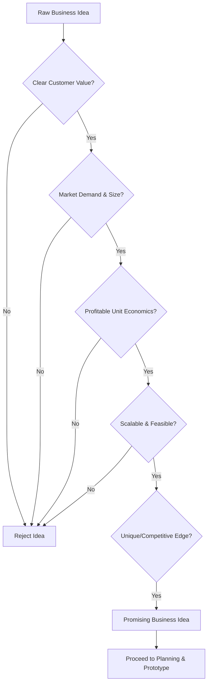

# Characteristics of a Promising Business Idea

## 1. Definition

A promising business idea is a concept for a product, service, or process that has the potential to be profitable, sustainable, and scalable. It solves a genuine problem or fulfills a strong need in the market, and possesses certain identifiable qualities that make it likely to succeed.

## 2. Concept Explanation

Any business starts with an idea, but not every idea becomes a successful venture. The basic idea is that brilliant business ideas share common traits that separate them from fleeting whims. A promising business idea is like a blueprint that has been checked for feasibility, demand, and longevity.

How it works: An aspiring entrepreneur generates many raw thoughts. Then they filter these thoughts through a set of tested characteristics, such as clear customer demand, profitability, uniqueness, and feasibility. Only ideas that meet most of these criteria move forward. This process weeds out weak concepts early.

Why it is important: Investing time, money, and effort into a weak idea is the fastest route to failure. Understanding the characteristics of a promising idea helps entrepreneurs choose the right opportunity. It provides a checklist to evaluate the idea before writing a business plan, building a prototype, or seeking funds. It increases the chances of building a venture that can survive competition, generate revenue, and grow.

## 3. Key Characteristics / Features

A promising business idea typically exhibits the following characteristics:

- **Clear Customer Value:** The idea must solve a real problem, relieve a pain point, or satisfy a strong desire for a specific group of people. Without this, there will be no buyers.
- **Adequate Market Demand:** There must be enough people or businesses willing and able to pay for the solution. A large, growing, or untapped market indicates high potential.
- **Profitability (Viable Economics):** Revenue from selling the product or service must significantly exceed costs. The idea must show a clear path to healthy profit margins.
- **Scalability:** The business model should allow growth without a proportional increase in costs. A promising idea can expand from serving 10 customers to 10,000 without breaking.
- **Feasibility:** The required technology, raw materials, skills, and legal permissions must be available and achievable. An idea that cannot be executed is just a dream.
- **Uniqueness and Competitive Edge:** The idea should offer something different from existing solutions — better quality, lower price, faster delivery, or a novel feature. This differentiation protects it from immediate copycats.
- **Durability (Long-term Relevance):** The need it fulfills should not be a temporary fad. The idea should have the potential to remain relevant over many years.

## 4. Types / Classification

While the characteristics of "promising" are universal, the underlying business ideas themselves can be classified to better analyse their strengths.

- **Innovative Breakthrough Ideas:** Revolutionary concepts that create a new market (e.g., the first smartphone). They carry high risk but offer enormous potential.
- **Imitative/Me-Too Ideas:** Adapted versions of successful businesses, often brought to a new geographic area or with minor improvements (e.g., a local food delivery app modelled on a global giant).
- **Service Gap Filling Ideas:** Ideas that identify an underserved customer need in an existing market (e.g., specialised repair services for electric vehicles).
- **Process Improvement Ideas:** Concepts that make the production or delivery of an existing product cheaper, faster, or better (e.g., using AI for inventory management in traditional retail).

## 5. Working / Mechanism (Steps to Validate a Promising Idea)

The following steps show how an entrepreneur can systematically check an idea against the key characteristics.

1.  Start with a raw idea and write it down in one clear sentence, stating the customer and the problem.
2.  Conduct secondary research (online, reports) to check if the market size and demand are large and growing.
3.  Talk to at least 20-30 potential customers to see if they genuinely feel the problem and would pay for the solution.
4.  Analyse competitors to confirm the idea is unique enough or can be delivered with a clear advantage.
5.  Prepare a simple financial model to check if the idea can be profitable. Estimate costs and revenue for a small scale.
6.  Evaluate if you and your team have the necessary skills, technology, and legal clearance to execute the idea.
7.  Consider if the business can be scaled: can you serve more customers online, through franchising, or by automation?
8.  If the idea satisfies most characteristics, proceed to a prototype or pilot test; if not, pivot or abandon.

## 6. Diagram

## 7. Mathematical Formulation

Not applicable for this topic.

## 8. Example

Ramesh, an engineering student, notices that hostel students in his town struggle with clean, affordable tiffin services. He brainstorms an idea: a subscription-based mobile app that connects home cooks with students for daily homemade meals. He checks the characteristics: Customer value is high (students need affordable, hygienic food). Demand exists (5000+ hostel students locally). It's profitable (home cooks charge less, he takes a 15% commission). It is scalable (the app can launch in other university towns). It is feasible (app development is low-cost, home cooks are plentiful). It has a unique edge over expensive restaurants. This idea satisfies the characteristics of a promising venture, and Ramesh decides to proceed.

## 9. Analogy

Think of planting a tree. A promising business idea is like a healthy seed that has the right characteristics: it belongs to a local variety (customer value), the climate and soil suit it (market demand), it will bear fruit in a few years (profitability), it can grow tall without falling (scalability), you have water and tools to plant it (feasibility), and it is not a weed that will die in a week (durability). You check these traits before investing your time digging and watering.

## 10. Comparison

| Feature | Promising Business Idea | Weak Business Idea |
|--------|------------------------|--------------------|
| Customer Pain Point | Solves an urgent, clear problem | The problem is vague or non-existent |
| Demand | Large enough target market ready to pay | Very few people care; market is too small |
| Profit Path | Clear revenue model with healthy margins | Costs exceed realistic revenue; no clear profit |
| Execution | Resources, tech, and skills available | Idea is beyond current capabilities or legal barriers |
| Competition | Unique angle or improvement over rivals | "Me-too" with no differentiation; easy to copy |

## 11. Advantages

- Reduces the risk of business failure immensely by filtering out weak ideas early.
- Saves time, money, and emotional energy that would be wasted on unviable concepts.
- Attracts investors and partners more easily because the idea is backed by solid characteristics.
- Provides a clear direction for product development and marketing, as customer value is already defined.
- Helps the entrepreneur stay confident and motivated because the groundwork indicates a high chance of success.

## 12. Disadvantages / Limitations

- Even a promising idea can fail due to poor execution, bad timing, or team issues; characteristics are not a guarantee.
- Over-analysing an idea against a checklist can lead to paralysis, delaying the launch in a fast-moving market.
- Uniqueness is hard to measure; some very successful businesses were imitative but executed brilliantly.
- The characteristics are qualitative; an entrepreneur might misjudge market demand or profitability due to optimistic bias.
- Customer preferences can shift after the idea is validated, rendering the initial promise irrelevant.

## 13. Important Points / Exam Notes

- A promising business idea is one that scores highly on customer value, demand, profitability, feasibility, scalability, and uniqueness.
- It is not just a "cool" thought; it must be backed by evidence and market testing.
- The idea should be scalable — meaning it can grow without a proportional rise in costs (e.g., software, franchising).
- Customer validation (talking to real users) is the most critical step to confirm desirability.
- Investors look for a "painkiller" idea (must-have) rather than a "vitamin" idea (nice-to-have).
- The characteristics form the basis of a feasibility analysis before writing a full business plan.

## 14. Applications / Use Cases

- **Start-up Pitch Competitions:** Judges evaluate submitted ideas against these exact characteristics to select winners.
- **Business Incubators:** They screen hundreds of applications and accept only those startups whose ideas show clear promise.
- **New Product Development in Companies:** Established firms use these characteristics to green-light internal innovation projects.
- **Government Subsidy Schemes:** Evaluation of entrepreneurship grants under schemes like MUDRA or Startup India often appraises the merit of the idea.
- **Personal Career Decisions:** An aspiring entrepreneur self-evaluates multiple ideas to decide which one to pursue full-time.

## 15. MCQs

**Q1. Which of the following is the most essential characteristic of a promising business idea?**

A. A fancy logo and brand name  
B. Availability of office space  
C. Clear value for a specific set of customers  
D. Permission from family  
**Answer:** C  
**Explanation:** Without solving a real problem or fulfilling a need for customers, no business can sustain.

**Q2. Scalability in a business idea means the venture can:**

A. Remain small forever  
B. Grow rapidly without a proportional increase in costs  
C. Survive only in one location  
D. Avoid paying taxes  
**Answer:** B  
**Explanation:** Scalable ideas allow the business to expand revenues without adding massive new costs each time.

**Q3. Which of the following would indicate an idea lacks market demand?**

A. Many customers say they would "probably" use it someday  
B. Customers immediately ask where to pay and when it launches  
C. A large number of people face the problem daily  
D. Existing substitutes are inconvenient and expensive  
**Answer:** A  
**Explanation:** Vague interest does not show real demand; a promising idea gets concrete signs of willingness to pay.

**Q4. The characteristic of 'durability' implies that the business idea should:**

A. Be a one-time fad  
B. Have long-term relevance and not be just a temporary trend  
C. Require no maintenance  
D. Only work in summer  
**Answer:** B  
**Explanation:** Durable ideas stay relevant over time, unlike fads that fade away quickly.

**Q5. An entrepreneur first sketches a rough idea, then checks if the technology exists to build it. This is testing for:**

A. Profitability  
B. Scalability  
C. Feasibility  
D. Uniqueness  
**Answer:** C  
**Explanation:** Feasibility relates to whether the idea can actually be executed with available resources and technology.

**Q6. An idea that offers "cheaper, faster, or better" delivery of an existing product is said to have:**

A. A competitive edge  
B. High legal risk  
C. No customer value  
D. Low profitability  
**Answer:** A  
**Explanation:** Doing something better than existing competitors gives a competitive advantage in the market.

**Q7. A business idea with a clear revenue model and a gross margin of 60% is strong on which characteristic?**

A. Durability  
B. Profitability  
C. Scalability  
D. Uniqueness  
**Answer:** B  
**Explanation:** Profitability refers to the ability to earn more revenue than costs; a clear model and good margin are signs of this.

**Q8. Why is "customer validation" important in evaluating a business idea?**

A. To get early sales  
B. To confirm the desirability and willingness to pay before full investment  
C. To design the logo  
D. To avoid writing a business plan  
**Answer:** B  
**Explanation:** Talking to potential customers verifies that they actually have the problem and want the solution, reducing risk.

**Q9. Which of the following is a disadvantage of relying only on a checklist of characteristics?**

A. It helps filter weak ideas  
B. A good idea can still fail due to poor execution, despite meeting all criteria  
C. It saves time in evaluation  
D. It attracts investors  
**Answer:** B  
**Explanation:** The characteristics are not a guarantee; execution, timing, and team quality are equally crucial.

**Q10. A "painkiller" business idea is one that:**

A. Sells only medical products  
B. Solves a nice-to-have problem for customers  
C. Addresses an urgent, must-solve problem  
D. Competes solely on price  
**Answer:** C  
**Explanation:** Painkiller ideas offer solutions to pressing problems, leading to higher demand and less price sensitivity compared to "vitamin" ideas that are just good to have.