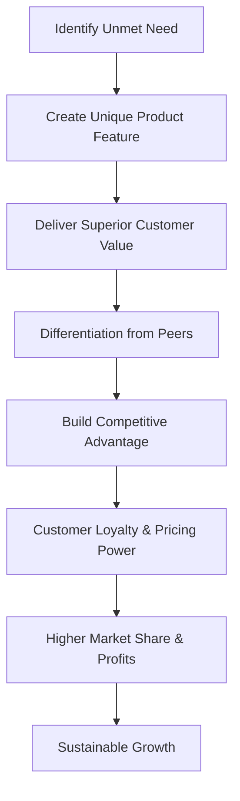

# Uniqueness of the Product or Service and its Competitive Advantage over Peers

## 1. Definition

Uniqueness refers to the distinctive features, design, function, or experience that sets a product or service apart from competing offerings. Competitive advantage is the edge a business gains when customers consistently prefer its unique product over alternatives, leading to higher sales, loyalty, or market share.

---

## 2. Concept Explanation

Every business idea must answer one simple question: “Why will customers choose this over what already exists?” Uniqueness is the special quality that differentiates the product. Competitive advantage is the business result of that uniqueness—the strong market position that is difficult for rivals to break.

How it works: A product can be unique because of a patented technology, an innovative business model, a superior design, or an exceptional customer experience. This uniqueness solves a customer problem better than competitors do. As a result, customers are willing to pay a premium, switch from existing options, or stay loyal. Over time, if the unique feature is hard to copy, the business builds a sustainable advantage that protects its profits and growth.

Why it is important: Without uniqueness, a product competes only on price, leading to thin margins. A clear competitive advantage makes the business attractive to investors, supports premium pricing, and creates a lasting space in the market. For a start-up, a strong, unique value proposition is often the difference between survival and failure.

---

## 3. Key Characteristics / Features

**Features of a unique product or service:**

- **Distinctive attribute:** It has a tangible or intangible feature that competitors do not possess.
- **Problem-solving novelty:** It addresses a customer pain point in a completely new or significantly better way.
- **Perceived value:** Customers recognise the difference and believe it is worth paying for.
- **Hard to imitate:** Patents, specialised know-how, strong branding, or unique partnerships protect the uniqueness.
- **Memorable identity:** The product stands out in the crowded market and is easily recalled by consumers.

**Features of competitive advantage derived from uniqueness:**

- **Superior value delivery:** The product offers more benefits relative to its cost than competitor offerings.
- **Customer preference and loyalty:** Buyers consistently choose this brand over others, even if substitutes exist.
- **Market share leadership:** The business captures and retains a larger slice of the market.
- **Sustainability:** The advantage endures over time because competitors cannot easily replicate the source of uniqueness.
- **Pricing power:** The firm can charge a premium without losing significant sales volume.

---

## 4. Types / Classification

Competitive advantage from uniqueness can be of three main types (based on Michael Porter’s generic strategies):

- **Differentiation advantage:** The product offers unique features, quality, or brand image that customers value. This allows the firm to charge a higher price. Example: a smartphone with a revolutionary foldable screen.
- **Cost advantage combined with uniqueness:** The uniqueness comes from a superior process that lowers cost without sacrificing quality. The firm can offer a unique product at a lower price than competitors. Example: a direct‑to‑consumer brand cutting out middlemen.
- **Focus advantage (niche):** The business targets a narrow segment with highly customised unique products that large competitors ignore. Uniqueness lies in deep specialisation. Example: a brand making ergonomic tools exclusively for dentists.

---

## 5. Working / Mechanism (How to build uniqueness and competitive advantage)

1. Study the market to identify gaps and customer frustrations that current products do not fully solve.
2. Brainstorm and design a product or service that eliminates those frustrations in a novel way.
3. Test the core unique feature with a small group of target customers (Minimum Viable Product or prototype).
4. Validate that customers perceive the uniqueness as valuable and are willing to pay for it.
5. Convert the uniqueness into hard-to-copy assets: file patents, build a strong brand, secure exclusive partnerships, or create unique data/technology.
6. Embed the unique feature into the business model and operational processes so it becomes scalable.
7. Craft a clear Unique Value Proposition (UVP) that communicates the difference to customers.
8. Continuously innovate and add layers of uniqueness, as competitors will eventually try to imitate the first advantage.

---

## 6. Diagram

---

## 7. Mathematical Formulation

While primarily qualitative, competitive advantage can be expressed conceptually as the net value surplus:

$$
\text{Competitive Advantage} = (\text{Customer Perceived Value}_{\text{Us}} - \text{Customer Perceived Value}_{\text{Next Best Competitor}})
$$

Where:  
- Perceived Value = (Benefits – Costs) from the customer’s viewpoint.  
If the result is positive and significant, the firm has a competitive edge. A more practical variation is:

$$
\text{Value Proposition} = \frac{\text{Unique Benefits}}{\text{Price + Switching Effort}}
$$

The higher the ratio compared to alternatives, the stronger the advantage.

---

## 8. Example

**Apple iPhone (2007):** Before the iPhone, smartphones had small screens and physical keyboards. Apple introduced a large multi‑touch screen, no stylus, and an intuitive interface controlled entirely by fingers. This unique design and user experience were not available in any competitor phone. Customers perceived massive value. The uniqueness gave Apple a powerful competitive advantage, allowing premium pricing and building a loyal customer base that still holds today.

**Zomato (early stage):** When Zomato started, it did not just list restaurants; it uploaded real photos of menus, dishes, and detailed user reviews. That visual and community‑driven uniqueness helped it stand out from plain directory services, attracting millions of users and creating a strong market lead.

---

## 9. Analogy

Imagine a classroom where every student has the same standard pencil. One student brings a mechanical pencil with a built‑in eraser and refillable lead. This pencil never needs sharpening (unique feature). Teachers and classmates notice it saves time and is always ready for use. The student becomes known for that smart tool, and others want the same pencil. The mechanical pencil is uniqueness; the reputation and desire it creates are the competitive advantage.

---

## 10. Comparison (Uniqueness vs. Competitive Advantage)

| Feature | Uniqueness | Competitive Advantage |
|--------|------------|-----------------------|
| Meaning | Special internal attribute of a product or service | Superior market position over rivals |
| Focus | Inside the product (design, tech, process) | External market outcome (sales, loyalty) |
| Measurement | By the distinctiveness of features | By market share, profitability, or retention |
| Timeframe | Exists as long as attribute remains unmatched | Lasts only if uniqueness is sustainable and relevant |
| Example | A watch powered by body heat | The watch brand captures 40% market share in premium segment |

---

## 11. Advantages

- A unique product can command a higher price and earn better profit margins.
- Customer loyalty increases because users find no perfect substitute elsewhere.
- Strong differentiation makes the brand memorable and reduces advertising spend.
- Competitors find it difficult to enter the niche or steal customers without offering the same uniqueness.
- The business becomes more resilient during price wars, as value-based customers do not switch solely on cost.
- Investors are more willing to fund a venture with a clear, durable competitive edge.

---

## 12. Disadvantages / Limitations

- Developing unique features can demand higher research, design, and production costs.
- Not every uniqueness is valued by customers; the market may see it as a “nice‑to‑have” not worth extra cost.
- Competitive advantage from uniqueness may be temporary if the feature is easily copied or if patents expire.
- Over‑focus on unique features can lead to neglecting basic quality, cost efficiency, or scalability.
- Customer tastes evolve; a once‑unique product can become obsolete if it fails to adapt.

---

## 13. Important Points / Exam Notes

- Uniqueness is what makes a product different; competitive advantage is the business success that difference brings.
- Unique features must be valued by customers and hard for rivals to imitate to build a sustainable advantage.
- Michael Porter’s generic strategies: differentiation, cost leadership, and focus.
- A Unique Value Proposition (UVP) summarises the special benefit a product offers.
- Advantage can be based on product, service, brand, process, or customer experience.
- The stronger the perceived value minus switching cost, the deeper the competitive moat.
- Continuous innovation is needed because every advantage erodes over time as competitors catch up.
- Common sources of uniqueness: technology, design, intellectual property, superior user experience, exclusive partnerships, and brand story.

---

## 14. Applications / Use Cases

- **Start‑up pitching:** Founders highlight the unique product attribute that solves a problem no one else addresses.
- **Marketing strategy:** The uniqueness becomes the core message in all advertisements and social media campaigns.
- **Product development:** R&D teams prioritise features that will yield a hard‑to‑copy advantage.
- **Investor evaluation:** Venture capitalists assess the durability of a start‑up’s competitive advantage before funding.
- **Strategic partnerships:** A unique technology may be licensed to big companies, creating an additional revenue stream.
- **Brand building:** Consistent delivery of a unique customer experience turns a product into a trusted brand.

---

## 15. MCQs

**Q1. Uniqueness of a product means:**  
A. It is the cheapest in the market  
B. It has the most advertisements  
C. It has a distinct feature that competitors do not offer  
D. It is sold only in one store  
**Answer:** C  
**Explanation:** Uniqueness is about having a distinctive attribute that sets the product apart from similar offerings.

**Q2. Competitive advantage results when:**  
A. The product is copied by all competitors  
B. Customers consistently prefer the unique product over alternatives  
C. The business sells at the lowest price  
D. The company files a patent  
**Answer:** B  
**Explanation:** A competitive edge exists when customers choose your product over others and remain loyal.

**Q3. Which of the following is a differentiation advantage?**  
A. Selling a similar product at the same price  
B. Offering a product with a unique, innovative feature that customers value  
C. Reducing workforce to cut costs  
D. Copying a competitor’s design  
**Answer:** B  
**Explanation:** Differentiation means providing unique value that commands a premium.

**Q4. A unique product feature must be:**  
A. Expensive to produce  
B. Recognised and valued by the customer  
C. Difficult to manufacture  
D. Registered with the government  
**Answer:** B  
**Explanation:** Uniqueness alone is not enough; customers must perceive it as beneficial and worth paying for.

**Q5. Which statement about sustainable competitive advantage is true?**  
A. It lasts forever without any further effort  
B. It is based on features that competitors cannot easily copy  
C. It always depends only on low price  
D. It does not require innovation  
**Answer:** B  
**Explanation:** A sustainable advantage comes from resoures or capabilities that are hard to imitate.

**Q6. The Unique Value Proposition (UVP) is:**  
A. The total cost of the product  
B. A statement explaining the special benefit a product delivers and why it is better  
C. A list of product materials  
D. The company’s profit margin  
**Answer:** B  
**Explanation:** UVP clearly communicates the unique benefits that set the offering apart.

**Q7. An example of a unique service is:**  
A. A restaurant selling pizza  
B. A banking app that uses fingerprint recognition for instant loan approval  
C. A grocery store with the same products as others  
D. A clothing shop with standard shirts  
**Answer:** B  
**Explanation:** The app’s novel instant loan feature with biometric security is a unique service not offered by all banks.

**Q8. If a unique feature is easily and quickly copied, the competitive advantage will be:**  
A. Permanent  
B. Long-lasting  
C. Temporary  
D. Strengthened  
**Answer:** C  
**Explanation:** Imitation erodes uniqueness and the advantage, making it short-lived unless the firm keeps innovating.

**Q9. Which of the following is NOT a source of uniqueness?**  
A. A patented technology  
B. A famous brand logo  
C. Selling at the market price without any extra features  
D. Exclusive partnership with a top designer  
**Answer:** C  
**Explanation:** Selling without any differentiating feature offers no uniqueness; it is just a plain commodity.

**Q10. A product that offers unique value at a lower cost than competitors achieves a:**  
A. Focus advantage only  
B. Combined cost and differentiation advantage  
C. Temporary loss  
D. Monopoly  
**Answer:** B  
**Explanation:** Delivering distinct benefits while keeping costs down creates a dual advantage that is very powerful.