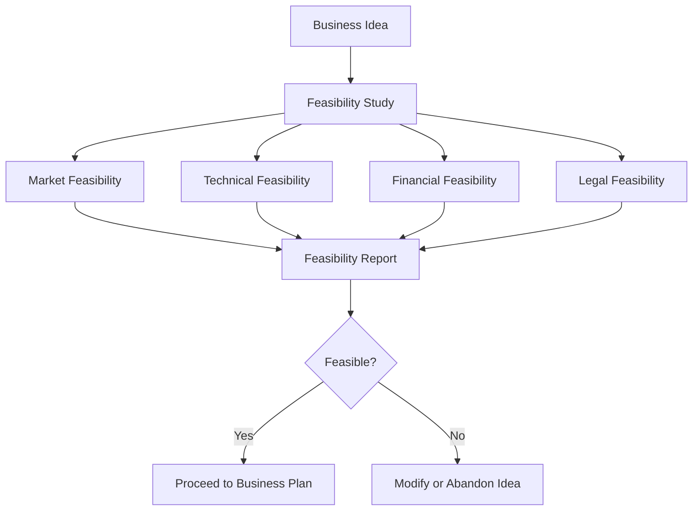

# Feasibility Study Concept

## Video Explanation

* [https://www.youtube.com/watch?v=2q3K5xX0WmE](https://www.youtube.com/watch?v=2q3K5xX0WmE)

## Visual Aids

## 1. Definition

A feasibility study is a systematic preliminary analysis that checks whether a business idea is practically possible, technically sound, economically viable, and legally permitted before committing significant resources.

## 2. Concept Explanation

After an entrepreneur has a business idea, the next logical question is: “Will this idea actually work in the real world?” A feasibility study answers this question. It is not a full business plan; it is a focused check‑up that examines the most critical unknowns.

The basic idea is to test the key assumptions of the business idea. How it works: the entrepreneur gathers data about the market, technical requirements, legal rules, and financial projections. Then, all this information is analysed to see if the idea can survive and make a profit. If the study reveals a fatal flaw, the idea is either dropped or modified before money is invested.

Why it is important: A feasibility study acts as a filter. It prevents an entrepreneur from pouring savings into a project that has no real demand, cannot be built with available technology, or is illegal. It significantly reduces the risk of business failure and gives confidence to investors, banks, and the entrepreneur himself.

## 3. Key Characteristics / Features

- **Preliminary evaluation:** It is done before a detailed business plan, as a first reality check.
- **Multi‑dimensional analysis:** It evaluates the idea from market, technical, financial, and legal angles.
- **Objective and fact‑based:** Decisions are based on collected data, not just gut feeling.
- **Go/No‑Go decision tool:** The primary output is a clear answer: proceed further or abandon the idea.
- **Time and resource efficient:** A good feasibility study is quick and inexpensive compared to a full business plan.
- **Identify fatal flaws early:** It helps discover problems like missing licences or too small a market before large costs are incurred.

## 4. Types / Classification

Feasibility studies are usually broken into distinct areas of analysis.

- **Market feasibility:** Checks if there are enough customers who want the product and are willing to pay. It looks at demand, competition, and target market size.
- **Technical feasibility:** Evaluates whether the required technology, machinery, raw materials, and technical skills are available and practical for the intended scale.
- **Financial feasibility:** Assesses the total capital requirement, expected revenue, operating cost, break‑even point, and whether the return is acceptable.
- **Legal and regulatory feasibility:** Verifies if the business meets all laws, licensing norms, environmental clearances, and other statutory requirements.
- **Operational feasibility:** Examines if the day‑to‑day processes, staffing, and logistics can actually work as imagined.

A comprehensive feasibility study covers all these types.

## 5. Working / Mechanism

A feasibility study follows a structured step‑by‑step process.

1.  **Define the project concept clearly:** Describe exactly what product or service will be offered and to whom.
2.  **Conduct market feasibility:** Research the total market size, growth, customer needs, and existing competitors. Estimate a realistic market share.
3.  **Perform technical feasibility:** List all inputs – raw materials, equipment, location, utilities, skilled labour. Check if everything is accessible at a reasonable cost.
4.  **Check legal feasibility:** Identify required licences, registrations, permits, and compliance with labour laws and environmental norms. Assess the ease of obtaining them.
5.  **Perform financial feasibility:** Estimate initial investment, monthly operating expenses, revenue forecast, break‑even period, and return on investment.
6.  **Analyse operational feasibility:** Consider how the product will be made or service delivered daily, and whether the team can handle it.
7.  **Make a decision:** If every dimension shows green light or manageable challenges, the feasibility is positive. If one critical area fails (e.g., legally not allowed or demand absent), the idea is not feasible.

## 6. Diagram

## 7. Mathematical Formulation

A simple financial feasibility indicator is the Feasibility Index (FI):

$$
FI = \frac{PV_{inflows}}{PV_{outflows}}
$$

Where:  
- \( PV_{inflows} \) = Present value of expected future cash inflows.  
- \( PV_{outflows} \) = Present value of the initial investment and future costs.

If \( FI > 1 \), the project passes financial feasibility. Another early check is the break‑even point:

$$
BEP \ (units) = \frac{Fixed \ Cost}{Price \ per \ Unit - Variable \ Cost \ per \ Unit}
$$

If the break‑even volume is less than realistic market demand, the project is likely feasible.

## 8. Example

A diploma engineer wants to set up a small CNC job‑work unit. The feasibility study includes:  
- **Market:** Ten large factories nearby need regular job work, and only two competitors exist. Demand is enough.  
- **Technical:** The required CNC machine is available at ₹15 lakh; raw material is locally procurable; the owner has the skill to operate.  
- **Financial:** Estimated monthly profit after all costs is ₹80,000; break‑even is within 18 months.  
- **Legal:** Only a trade licence and GST registration are needed, which are straightforward.  
All dimensions are positive, so the study declares the project feasible, and the engineer proceeds to prepare a full business plan.

## 9. Analogy

A feasibility study is like checking the weather before going on a mountain trek. You have a plan (the trek), but if a storm is coming (no market), your shoes are broken (lack of technical readiness), or you don’t have a permit (legal block), the trek will be a disaster. The feasibility study is the one‑hour check that tells you if you should pack your bags and go, change the date, or cancel the trip. It saves you from a costly and dangerous mistake.

## 10. Comparison

| Feature | Feasibility Study | Business Plan |
|--------|----------|----------|
| **Purpose** | Determine if the idea can work | Plan how the idea will be executed and managed |
| **Timing** | Before committing major resources | After feasibility is positive |
| **Depth** | Broad but shallow, checking critical unknowns | Detailed analysis of all business functions |
| **Output** | Go / No‑Go decision | Roadmap for launch, operations, and funding |
| **Document size** | Short report (10‑20 pages) | Comprehensive document (30‑50+ pages) |

## 11. Advantages

- **Reduces risk of failure:** It exposes fatal weaknesses before money is spent.
- **Saves time and capital:** Abandoning a bad idea early is better than losing everything after two years.
- **Attracts funding:** Banks and investors are more likely to trust a project that has undergone a feasibility check.
- **Clarifies resource needs:** It provides a realistic picture of machinery, team size, and money required.
- **Improves planning:** If the idea is feasible, the study data directly feeds into the business plan.

## 12. Disadvantages / Limitations

- **Not a guarantee of success:** A positive feasibility study only means the idea can work; execution challenges remain.
- **Data may be inaccurate:** Early‑stage market research is based on estimates, and wrong assumptions can mislead.
- **Cost of the study itself:** Even a basic study requires some time and sometimes a small budget for surveys.
- **Paralysis by analysis:** Overanalysing feasibility for too long may delay the launch and miss the market window.
- **Ignores dynamic factors:** The study is a snapshot; the market, technology, or laws could change quickly.

## 13. Important Points / Exam Notes

- A feasibility study asks the question “Can we do it?” while a business plan asks “How will we do it?”
- The four main pillars of feasibility: Market, Technical, Financial, Legal. Sometimes Operational and Environmental are added.
- Market feasibility includes demand estimation, customer surveys, and competitor analysis.
- Technical feasibility includes availability of raw material, machinery, location, and skilled labour.
- Financial feasibility uses simple tools like break‑even analysis, return on investment, and payback period.
- Legal feasibility includes checking business licences, environmental clearances, labour laws, and patent issues.
- A feasibility study should be time‑bound and small‑budget; it is a preliminary step, not a research project.
- If any feasibility dimension is hopeless, the entire project should be dropped or fundamentally re‑designed.
- Many government schemes expect a summary of feasibility in the loan application.
- The outcome can be “Feasible as proposed”, “Feasible with modifications”, or “Not feasible”.

## 14. Applications / Use Cases

- **Before starting a manufacturing unit:** Checking if the machine, power supply, and raw material are available at an acceptable cost.
- **Launching a mobile app:** Quick market test with a small survey group to see if users need the app.
- **Opening a new retail outlet:** Studying footfall, rental cost, and presence of competitors in that area.
- **Agricultural processing plant:** Assessing whether crop collection during the season is possible and if there is sufficient off‑take by buyers.
- **Franchise evaluation:** A student wanting to buy a franchise does a feasibility study on location and local demand before signing the contract.

## 15. MCQs

**Q1. A feasibility study is primarily conducted to**

A. Prepare a detailed marketing plan  
B. Check if a business idea is practical and viable  
C. Register a company  
D. Hire employees for the start‑up  

**Answer:** B  
**Explanation:** It determines whether the idea can realistically succeed.

---

**Q2. Which of the following is NOT a component of a feasibility study?**

A. Market feasibility  
B. Legal feasibility  
C. Employee monthly attendance record  
D. Technical feasibility  

**Answer:** C  
**Explanation:** Attendance records are operational details after launch, not a feasibility component.

---

**Q3. The market feasibility analysis answers the question**

A. Is the technology available?  
B. Will people buy the product at the expected price?  
C. What will be the legal structure?  
D. How many machines are needed?  

**Answer:** B  
**Explanation:** Market feasibility focuses on demand, customers, and competition.

---

**Q4. A feasibility study is conducted**

A. After the business has started making profit  
B. Before preparing a full business plan  
C. At the time of business closure  
D. Only by government agencies  

**Answer:** B  
**Explanation:** It is a pre‑planning step to filter ideas.

---

**Q5. If a feasibility study reveals that a required licence is impossible to obtain, the entrepreneur should**

A. Start the business anyway  
B. Proceed with the business plan  
C. Drop or modify the idea  
D. Ignore the legal issue  

**Answer:** C  
**Explanation:** Legal impossibility is a fatal flaw; the idea needs to be abandoned or changed.

---

**Q6. A break‑even analysis is part of which feasibility category?**

A. Legal feasibility  
B. Market feasibility  
C. Financial feasibility  
D. Operational feasibility  

**Answer:** C  
**Explanation:** Break‑even is a financial tool to see when costs are recovered.

---

**Q7. Which of the following is a characteristic of a good feasibility study?**

A. Based on assumptions without any data  
B. Takes several years to complete  
C. Objective and data‑driven, with a clear Go/No‑Go output  
D. Ignores competitor existence  

**Answer:** C  
**Explanation:** It must be fact‑based and give a definite recommendation.

---

**Q8. A feasibility study that checks whether skilled welders are available locally is an example of**

A. Market feasibility  
B. Technical feasibility  
C. Financial feasibility  
D. Legal feasibility  

**Answer:** B  
**Explanation:** Skill and resource availability are technical aspects.

---

**Q9. The main difference between a feasibility study and a business plan is that the feasibility study**

A. Is more detailed  
B. Decides whether to proceed; the business plan describes how to proceed  
C. Is prepared after the business plan  
D. Is required only for large companies  

**Answer:** B  
**Explanation:** Feasibility study = decision gate; business plan = execution roadmap.

---

**Q10. A diploma holder wants to set up a solar lamp assembly unit. Before investing, she should first**

A. Register a company  
B. Conduct a feasibility study  
C. Hire ten workers  
D. Place a bulk order for raw materials  

**Answer:** B  
**Explanation:** The feasibility study checks if the entire idea is viable before any major commitment.