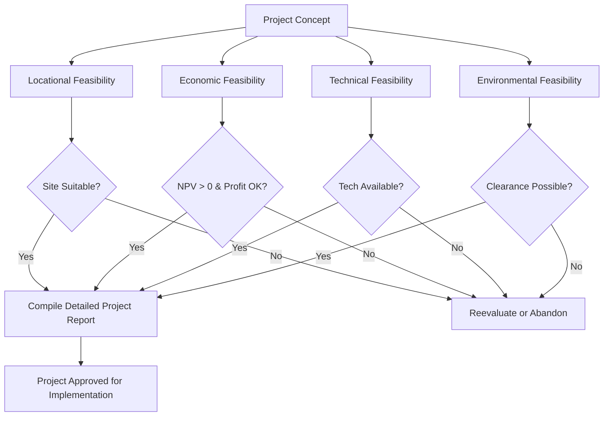

# Locational, Economic, Technical and Environmental Feasibility

## 1. Definition

Locational, economic, technical, and environmental feasibility are four critical assessments conducted before launching a project. They determine whether the chosen location is suitable, the venture can generate adequate profits, the required technology and skills are available, and the project will not cause unacceptable damage to the environment. Together, they form the backbone of a comprehensive feasibility study.

## 2. Concept Explanation

A business idea may appear brilliant on paper, but it must survive a ground-level reality check. A feasibility study breaks this reality check into specific areas. The basic idea is to answer four fundamental questions: Where should the business be set up? Can it make enough money? Is it technically possible? Will it harm nature and the community?

Locational feasibility examines factors like proximity to customers, raw materials, transport, and labour. Economic feasibility analyses costs, revenues, and profitability to confirm the venture can sustain itself. Technical feasibility evaluates the machinery, technology, and expertise required to produce the goods. Environmental feasibility studies the impact on air, water, land, and people, ensuring the project meets legal and social norms.

How it works: An entrepreneur or project team investigates each area systematically. Data is collected, specialists are consulted, and reports are prepared. If any of these four checks fails, the project is either rejected or modified.

Why it is important: Skipping these assessments can cause a project to fail due to a bad location, insufficient profits, technical breakdowns, or legal shutdowns due to pollution. Conducting them minimizes risk and increases the chance of long-term success.

## 3. Key Characteristics / Features

- **Comprehensive Screening:** Together, these four studies cover the major external and internal factors that can make or break a project.
- **Preventive Nature:** They identify fatal flaws early, before large sums of money are invested in land, machinery, or construction.
- **Interdependence:** A site that is economically perfect may be environmentally disastrous; thus, all four factors must be simultaneously acceptable.
- **Data-Driven Decisions:** Each feasibility analysis relies on real-world data — maps, financial projections, equipment specifications, and environmental test reports.
- **Legal and Regulatory Alignment:** Especially for location and environment, the study ensures compliance with zoning laws, pollution control norms, and community settlement acts.

## 4. Types / Classification

The four major types of feasibility studied under this topic are:

- **Locational Feasibility:** Examines the physical and geographical suitability of a project site. It considers raw material availability, access to markets, transportation links, labour supply, utility infrastructure (power, water), and climate conditions.
- **Economic Feasibility:** Assesses the financial viability. It includes estimation of capital costs, operating costs, revenue projections, break-even analysis, and return on investment. The aim is to confirm that the project can generate acceptable profits and withstand financial shocks.
- **Technical Feasibility:** Determines if the required technology, equipment, and technical skills are available. It covers production process selection, plant capacity, machinery requirements, maintenance support, and technology transfer possibilities.
- **Environmental Feasibility:** Evaluates the potential negative effects of the project on the natural and human environment. It studies air emissions, wastewater discharge, solid waste, noise, impact on flora and fauna, and displacement of people. It also checks compliance with environmental laws and the need for clearance from pollution control boards.

## 5. Working / Mechanism

The process of conducting these four feasibility studies involves sequential and parallel steps:

1.  A project concept is frozen, and a preliminary scope is defined.
2.  For **Locational Feasibility**: multiple potential sites are shortlisted. Each site is scored on raw material distance, market access, labour availability, power and water reliability, and transportation costs. The best site is selected.
3.  For **Economic Feasibility**: total capital and operating costs are estimated. Revenue is projected based on market demand and pricing. A cash flow statement is prepared. Tools like Net Present Value (NPV), Internal Rate of Return (IRR), and payback period are applied. If NPV > 0 and IRR > cost of capital, the project is economically feasible.
4.  For **Technical Feasibility**: the production technology is chosen. Required plant, machinery, and tools are listed. The availability of technical staff and training needs are assessed. Make-or-buy decisions are analysed.
5.  For **Environmental Feasibility**: a baseline environmental study of the chosen site is performed. Potential emissions, effluents, and ecological damage are predicted. Mitigation measures are planned, and the Environmental Impact Statement (EIS) is prepared for regulatory clearance.
6.  The findings of all four studies are compiled into a Detailed Project Report (DPR). If each feasibility is positive, the project is approved for implementation. If any is critically negative, the project is redesigned or abandoned.

## 6. Diagram

## 7. Mathematical Formulation

For **Economic Feasibility**, the Net Present Value (NPV) method is widely used.

$$
NPV = \sum_{t=1}^{n} \frac{CF_t}{(1 + r)^t} - I_0
$$

Where:
- $CF_t$ = Net cash flow (inflow minus outflow) in year $t$
- $r$ = Discount rate (cost of capital)
- $I_0$ = Initial investment
- $n$ = Project life in years

If $NPV > 0$, the project is economically feasible because it generates wealth above the cost of capital.

For **Locational Feasibility**, a simple cost comparison model can be used:

$$
\text{Total Location Cost} = C_{raw} + C_{trans} + C_{labour} + C_{util}
$$

Where each $C$ represents the annual cost of raw material transport, finished goods transport, labour, and utilities at a given site. The site with the lowest total cost, while meeting other qualitative criteria, is the most feasible.

## 8. Example

A bakery start-up in a small town wants to expand to a large automated plant. The feasibility study reveals:
- **Locational:** The proposed site is near the state highway, ensuring easy grain and flour supply and quick delivery to city shops. Labour is locally available.
- **Economic:** Total investment is ₹80 lakhs. Projected annual net profit is ₹22 lakhs. With a discount rate of 12%, the NPV over 5 years is positive ₹11 lakhs, and near break-even is in year 3.
- **Technical:** The fully automatic oven and packaging machine are available from a reputed supplier with a service warranty. The local ITI provides trained technicians.
- **Environmental:** The bakery will use LPG instead of coal, and wastewater will go to a soak pit. The pollution board grants consent easily.
All four clear, the project gets a green signal.

## 9. Analogy

Imagine you want to build a house. You first check if the plot is in a good neighborhood with schools and shops (locational feasibility). You then calculate if your savings and loan EMI fit your budget (economic feasibility). You verify that the design and materials can actually be built by the masons (technical feasibility). Finally, you ensure the construction won't cut down protected trees and follows building regulations (environmental feasibility). Only when all these checks pass, you start digging the foundation.

## 10. Comparison

| Feature | Locational Feasibility | Economic Feasibility | Technical Feasibility | Environmental Feasibility |
|--------|------------------------|-----------------------|------------------------|----------------------------|
| Primary Question | Is the place right? | Will it make money? | Can it be built/run? | Will it harm nature/people? |
| Key Focus | Access to inputs, markets, labour, infrastructure | Profitability, ROI, cash flow, break-even | Technology, skills, machinery, production process | Pollution, ecological damage, compliance |
| Tools and Methods | Site scoring, cost comparison matrices | NPV, IRR, payback, BEP | Capacity planning, technology assessment | EIA, pollution modelling, public hearing |
| Output | Shortlisted site recommendation | Financial viability report | Technical requirement specification | Environmental Impact Statement (EIS) |

## 11. Advantages

- It prevents businesses from investing in locations with hidden problems like poor supply chain or labour shortage.
- Economic feasibility ensures that the project is not a money-losing venture from the start, protecting investors' funds.
- Technical feasibility avoids choosing obsolete or unproven technology that could break down frequently.
- Environmental feasibility ensures legal compliance, avoiding future fines, shutdowns, and community protests.
- Together, they provide a holistic view that reduces overall project risk and builds confidence among lenders and stakeholders.

## 12. Disadvantages / Limitations

- Conducting all four studies requires time and expert fees, which can be costly for very small start-ups.
- The accuracy depends on assumptions and data quality; overly optimistic projections can mislead economic feasibility.
- Environmental feasibility can be a lengthy bureaucratic process, delaying the project significantly.
- In rapidly changing markets, a location that is feasible today may become less attractive due to policy changes or infrastructure decay.
- Focusing too rigidly on the initial feasibility report can prevent adaptive changes that might save a struggling project.

## 13. Important Points / Exam Notes

- A feasibility study tests the viability of a project, and the four critical dimensions are location, economics, technology, and environment.
- Locational feasibility is crucial for manufacturing units that depend heavily on raw materials or perishable goods.
- Economic feasibility is the most common go/no-go metric; a project with negative NPV should be rejected.
- Technical feasibility must confirm that the required technology is not just available but also reliable and maintainable.
- Environmental feasibility is mandatory under law for specific industries; clearance from the Pollution Control Board or Ministry is required.
- All four studies are compiled in a Detailed Project Report (DPR), which is essential for bank loans and government approvals.

## 14. Applications / Use Cases

- **Setting up a Cold Storage Unit:** Locational analysis near vegetable clusters, economic analysis of electricity cost and rent, technical analysis of refrigeration units, and environmental clearance for disposal of CFC gases.
- **Opening a Multi-speciality Hospital:** Locating in a city with good connectivity, economic viability through bed occupancy projections, technical study of medical equipment manufacturers, and environmental clearance for bio-medical waste management.
- **Ethanol Plant from Sugarcane:** Locating in a sugar belt, economic feasibility with fluctuating molasses prices, technical assessment of fermentation and distillation technology, and environmental study of effluents.
- **IT Services Export Firm:** Locational decision of a tier-1 city for talent access, economic model of billing rates, technical assessment of servers and cybersecurity, and minimal environmental impact but still energy usage study.
- **Hydroponics Farm on City Outskirts:** Locating near high-end consumer markets, economic study of premium salad pricing, technical feasibility of controlled environment technology, and environmental benefits often highlighted to gain subsidies.

## 15. MCQs

**Q1. Which feasibility study focuses on raw material availability, proximity to market, and transportation costs?**

A. Economic feasibility  
B. Technical feasibility  
C. Locational feasibility  
D. Environmental feasibility  
**Answer:** C  
**Explanation:** Locational feasibility assesses the suitability of a site based on access to inputs, markets, and infrastructure.

**Q2. Net Present Value (NPV) is a primary tool used in:**

A. Locational feasibility  
B. Economic feasibility  
C. Technical feasibility  
D. Environmental feasibility  
**Answer:** B  
**Explanation:** NPV calculates whether the present value of future cash flows exceeds the initial investment, indicating economic viability.

**Q3. Technical feasibility primarily examines:**

A. The effect of the project on the surroundings  
B. Availability of labour at the site  
C. Accessibility to customers  
D. Whether the required machinery and expertise can be obtained  
**Answer:** D  
**Explanation:** Technical feasibility ensures that the production technology, equipment, and skilled manpower are available and feasible.

**Q4. An Environmental Impact Statement (EIS) is the output of which feasibility study?**

A. Locational  
B. Economic  
C. Technical  
D. Environmental  
**Answer:** D  
**Explanation:** The EIS documents the predicted environmental effects and proposed mitigation, submitted for obtaining clearance.

**Q5. A project with a positive NPV is considered:**

A. Technically weak  
B. Environmentally unsafe  
C. Economically feasible  
D. Locationally unsuitable  
**Answer:** C  
**Explanation:** Positive NPV means the project generates value over the cost of capital, indicating economic feasibility.

**Q6. Which of the following is a critical factor in locational feasibility for a steel plant?**

A. Proximity to a tourist destination  
B. Availability of iron ore and coal deposits  
C. Software developer pool  
D. Proximity to an airport  
**Answer:** B  
**Explanation:** A steel plant needs large quantities of raw materials, so being near iron ore and coal sources minimizes transport costs.

**Q7. Before importing a complex machine from abroad, a company should conduct:**

A. Environmental feasibility only  
B. Economic feasibility only  
C. Locational feasibility  
D. Technical feasibility  
**Answer:** D  
**Explanation:** Technical feasibility would assess if the machine is compatible, maintainable, and if personnel can operate it.

**Q8. What is the main advantage of conducting all four feasibility studies before project launch?**

A. It ensures the project launch party is well organised  
B. It minimizes risk by identifying fatal flaws early  
C. It eliminates the need for a business plan  
D. It guarantees profit from day one  
**Answer:** B  
**Explanation:** Early identification of critical issues prevents wasted investment and allows for changes or a go/no-go decision.

**Q9. In economic feasibility, the break-even point refers to the level of output where:**

A. The project shuts down  
B. Total revenue equals total cost, resulting in zero profit or loss  
C. The government provides a subsidy  
D. The project reaches maximum production capacity  
**Answer:** B  
**Explanation:** Break-even is the no-profit-no-loss point, indicating the minimum sales needed to cover all costs.

**Q10. A project is planned near a bird sanctuary. Which feasibility study will likely highlight a major roadblock?**

A. Technical feasibility  
B. Economic feasibility  
C. Locational feasibility  
D. Environmental feasibility  
**Answer:** D  
**Explanation:** The environmental study would identify the risk to the sanctuary and the strict clearance norms required from forest and environment authorities.