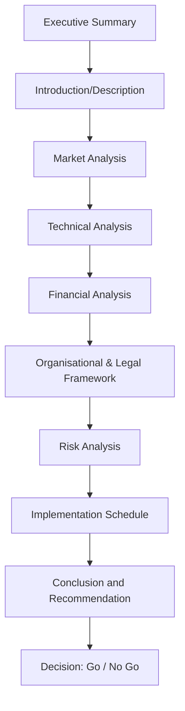

# Structure and Contents of a standard Feasibility Study Report

## Video Explanation

* [https://www.youtube.com/watch?v=1e9aM4Kz1bQ](https://www.youtube.com/watch?v=1e9aM4Kz1bQ)

## Visual Aids

## 1. Definition

A feasibility study report is a formal document that systematically evaluates the practicality, viability, and potential success of a proposed business idea or project. It examines technical, market, financial, legal, and operational aspects and concludes with a clear recommendation on whether to proceed with the venture.

---

## 2. Concept Explanation

Before launching a new business or expanding an existing one, it is essential to know if the idea can work in the real world. A feasibility study report collects all the necessary research, analysis, and calculations into one organised document.

How it works: The entrepreneur or a hired consultant studies the target market, required technology, capital needs, legal requirements, and expected revenues and costs. This information is then presented under well‑defined sections, each answering a specific question: Is there demand? Can we build it? Will it make a profit? What risks exist? The report ends with a judgment – go ahead, modify the idea, or drop it.

Why it is important: A good feasibility report saves time, money, and effort. It helps avoid starting a business doomed to fail. Investors and banks demand it before funding a project. It also gives the entrepreneur a clear roadmap of what must be done if the idea is approved.

---

## 3. Key Characteristics / Features

- **Structured format:** The report follows a standard sequence of sections, making it easy for any reader to find relevant information.
- **Evidence‑based:** Every statement about demand, cost, or profit is backed by data, surveys, quotations, or industry reports.
- **Multi‑dimensional analysis:** It covers market, technical, financial, legal, organisational, and environmental angles.
- **Objective and unbiased:** The report must present facts honestly, even if they are against the idea.
- **Forward‑looking:** It makes projections about future sales, costs, cash flows, and market conditions.
- **Decision‑oriented:** The final recommendation reduces the investment decision to a clear “Go” or “No Go”.
- **Standard length and depth:** It is comprehensive but not as detailed as a full business plan; it provides enough information to decide whether to start the business.

---

## 4. Types / Classification (Major Components of the Report)

Although the report itself is a single document, it is made up of several specialised studies that are separate chapters. These can be seen as types of feasibility analysis contained in the report:

- **Market feasibility analysis:** Investigates target customers, demand, competition, and pricing.
- **Technical feasibility analysis:** Evaluates technology, production process, plant location, machinery, and raw materials.
- **Financial feasibility analysis:** Calculates investment, operating costs, revenues, profitability, break-even point, and return on investment.
- **Organisational and legal feasibility:** Examines the legal form of the business, registration requirements, licences, and management team.
- **Risk analysis:** Identifies potential technical, market, economic, and regulatory risks and suggests mitigation measures.

---

## 5. Working / Mechanism (Step‑by‑step contents of a standard feasibility report)

A standard feasibility study report is arranged in the following order. Each step represents a section of the document.

1. **Executive Summary:** Provide a short summary of the entire study. Include the objective, major findings, and final recommendation. This is written last but placed first.
2. **Introduction / Description of the Venture:** Explain the business idea, the product or service, its unique features, and the goals of the study.
3. **Market Analysis:** Present information about the industry, target customers, estimated demand, market trends, competitors, and expected sales volume and price.
4. **Technical Analysis:** Describe the production process, required machinery and technology, plant location and layout, raw materials, utilities, and quality control measures.
5. **Financial Analysis:** Detail the total project cost, sources of finance, projected income statements, cash‑flow statements, balance sheets, break‑even analysis, and key profitability ratios.
6. **Organisational and Legal Framework:** Outline the proposed ownership structure (sole proprietorship, partnership, company), registration formalities, licences and permits needed, key management personnel, and staffing plan.
7. **Risk Analysis:** List the major risks (market, technical, financial, environmental) and suggest how each risk will be managed.
8. **Implementation Schedule:** Provide a timeline showing major activities from project approval to commencement of operations, often in a Gantt chart or table.
9. **Conclusions and Recommendation:** State clearly whether the project is feasible. If yes, recommend proceeding to the business plan stage. If not, state the reasons.

---

## 6. Diagram

---

## 7. Mathematical Formulation

The financial analysis section of the report often includes calculations like the Break‑Even Point (BEP), which can be stated as:

$$
\text{BEP (units)} = \frac{\text{Total Fixed Costs}}{\text{Selling Price per Unit} - \text{Variable Cost per Unit}}
$$

Where:  
- **Total Fixed Costs** = Costs that do not change with production volume (rent, salaries, insurance).  
- **Selling Price per Unit** = Price at which the product will be sold.  
- **Variable Cost per Unit** = Cost that changes with each unit produced (raw material, direct labour).

Net Present Value (NPV) is also a common financial indicator in the report:

$$
NPV = \sum_{t=1}^{n} \frac{CF_t}{(1 + r)^t} - C_0
$$

Where \( CF_t \) is the net cash inflow in year \( t \), \( r \) is the discount rate, and \( C_0 \) is the initial investment.

Including these in the report shows investors the exact point of profit and the time value of money.

---

## 8. Example

Consider a feasibility study report for **“FreshBite,” a proposed ready‑to‑eat salad chain** near corporate offices.

- **Executive Summary:** The study shows a demand for healthy fast food, low technical complexity, and a positive NPV of ₹15 lakh. The project is recommended for launch.
- **Market Analysis:** A survey reveals that 65% of office workers in the target area want a hygienic salad option. Six existing outlets, but none provide calorie‑counted meals with online ordering.
- **Technical Analysis:** Central kitchen required with cold storage; preparation involves only washing, chopping, and packing. Location identified near an IT park.
- **Financial Analysis:** Initial investment ₹20 lakh. Expected sales 300 salads per day at an average price of ₹120. Monthly fixed costs ₹1.2 lakh. Break‑even point 150 salads per day. Payback period 18 months.
- **Organisational Structure:** Partnership firm with two founders. Licence needed from FSSAI. Staff of 8.
- **Risk and Conclusion:** Major risks are raw material price fluctuation and low sales during weekends. Mitigation plan: long‑term contracts with vegetable vendors and corporate subscription plans. The project is feasible.

---

## 9. Analogy

Imagine you want to build a house on a plot of land. Before hiring an architect and buying bricks, you call a soil testing engineer and a surveyor. They check if the soil can bear the load, if the land is legally clear, and if water and electricity can reach the plot. Their findings are compiled into a “site feasibility report”. Based on that report, you decide whether to buy the land and start construction. A feasibility study report for a business idea plays the same role: it is the soil test before committing resources.

---

## 10. Comparison (Feasibility Study Report vs. Business Plan)

| Feature | Feasibility Study Report | Business Plan |
|--------|--------------------------|----------------|
| Purpose | To check if an idea will work | To detail how the idea will be implemented |
| Timing | Conducted before major commitment of funds | Prepared after the idea is found feasible |
| Level of detail | Broad analysis; key numbers and findings | Very detailed operational, marketing, and financial plans |
| Outcome | A “Go” or “No‑Go” decision | A roadmap for launching and running the business |
| Investment | Focused on viability, not on exact execution steps | Includes step‑by‑step action plan, milestones, and contingencies |
| Audience | Promoters, initial investors, banks for pre‑sanction | Investors, banks for final funding, management team |

---

## 11. Advantages

- Reduces the chance of business failure by identifying fatal flaws early.
- Helps in attracting external funding, as investors feel confident in a well‑researched project.
- Provides clarity to the entrepreneur about what is required in terms of money, skills, and time.
- Creates a solid foundation for writing a detailed business plan.
- Assists in comparing multiple project ideas and selecting the most promising one.
- Serves as a legal and strategic document for future reference.

---

## 12. Disadvantages / Limitations

- Conducting a full feasibility study takes time and money; some small businesses may skip it due to cost.
- The quality of the report depends heavily on the accuracy of assumptions; wrong data leads to a wrong conclusion.
- It might delay rapid action in a fast‑changing market where speed is critical.
- The study is based on current conditions; a sudden change in technology or government policy can make the report outdated.
- Over‑reliance on the report can create a false sense of security; it is not a guarantee of success.

---

## 13. Important Points / Exam Notes

- A feasibility study report answers: Will this business work?
- Standard structure: Executive summary, description, market analysis, technical analysis, financial analysis, organisational and legal framework, risk analysis, implementation schedule, and recommendation.
- It must be objective; even if the promoter loves the idea, a negative report should be respected.
- Common financial tools inside the report: Break‑Even Point, NPV, ROI, cash‑flow statement.
- Feasibility study precedes the business plan; if the study is negative, the business plan is never prepared.
- Many government agencies and banks require a feasibility report before sanctioning a loan for start‑ups.
- The report is used by the entrepreneur, potential partners, investors, and lenders.

---

## 14. Applications / Use Cases

- **New start‑up launch:** Before opening a restaurant, a feasibility study checks location, target customers, investment, and expected footfall.
- **Product line extension:** A garment manufacturer studies the feasibility of adding a school‑uniform division.
- **Infrastructure projects:** Governments prepare feasibility reports for bridges, highways, or metro lines before allocating funds.
- **Franchise evaluation:** A person interested in buying a franchise studies the feasibility of the brand in their city.
- **Non‑profit social enterprises:** A feasibility study ensures that a self‑employment programme for rural women will be economically sustainable.

---

## 15. MCQs

**Q1. The primary purpose of a feasibility study report is to:**  
A. Advertise the product  
B. Determine if the business idea is viable  
C. Prepare the final accounts  
D. Hire employees  
**Answer:** B  
**Explanation:** The report's main aim is to check whether the proposed idea can succeed before resources are invested.

**Q2. Which of the following is typically the first section of a feasibility report?**  
A. Market Analysis  
B. Financial Analysis  
C. Executive Summary  
D. Risk Analysis  
**Answer:** C  
**Explanation:** The executive summary appears first and gives an overview of the entire study.

**Q3. Technical analysis in a feasibility report deals with:**  
A. Advertising and promotion  
B. Machinery, technology, and production process  
C. Profit and loss statement  
D. Legal form of business  
**Answer:** B  
**Explanation:** Technical feasibility examines how the product will be made, what equipment is needed, and the location.

**Q4. The Break‑Even Point (BEP) is found in which section of the report?**  
A. Market Analysis  
B. Technical Analysis  
C. Financial Analysis  
D. Organisational Framework  
**Answer:** C  
**Explanation:** Break‑even analysis, NPV, and cash flow are part of the financial analysis section.

**Q5. A feasibility study is conducted ________ the business plan.**  
A. After  
B. Before  
C. Simultaneously  
D. Only if the business fails  
**Answer:** B  
**Explanation:** The feasibility study first confirms viability; only then is a detailed business plan written.

**Q6. Which of the following is NOT a standard component of a feasibility study report?**  
A. Market Analysis  
B. Financial Projections  
C. Detailed Daily Work Schedule of Employees  
D. Risk Assessment  
**Answer:** C  
**Explanation:** Daily employee micro‑schedules are not part of the feasibility report; high‑level staffing plans may be included.

**Q7. If a feasibility study finds the project unviable, the entrepreneur should:**  
A. Ignore the report and proceed  
B. Modify the business idea or abandon it  
C. Prepare the business plan anyway  
D. Immediately borrow money  
**Answer:** B  
**Explanation:** A negative feasibility report suggests that the idea as proposed will not succeed; the rational step is to alter the idea or stop.

**Q8. The risk analysis section of the report does which of the following?**  
A. Describes the colour of the logo  
B. Identifies potential threats and suggests how to manage them  
C. Details the production machine serial numbers  
D. Lists the personal assets of the owner  
**Answer:** B  
**Explanation:** It highlights possible problems (market, technical, financial) and mitigation strategies.

**Q9. A major advantage of a feasibility report is that it:**  
A. Guarantees 100% success  
B. Helps secure investor funding and reduces risk  
C. Eliminates the need for any further planning  
D. Removes all competition  
**Answer:** B  
**Explanation:** It builds investor confidence and minimizes the likelihood of entering a failed venture.

**Q10. The “Go” or “No‑Go” recommendation appears in the:**  
A. Market Analysis  
B. Technical Analysis  
C. Conclusion and Recommendation section  
D. Executive Summary only  
**Answer:** C  
**Explanation:** The final verdict based on the entire study is given in the Conclusion and Recommendation section; the executive summary may also mention it, but it is officially stated at the end.