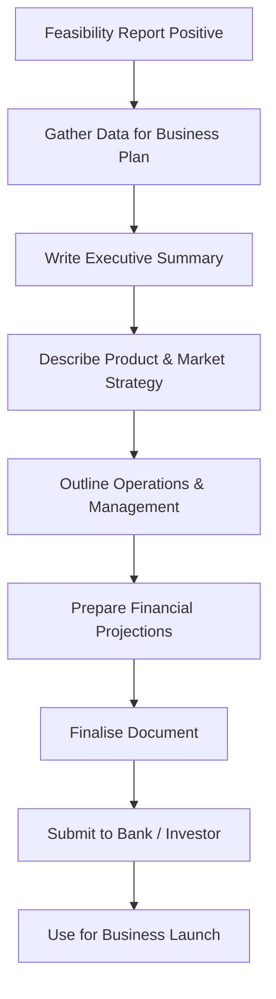

# 01 Concept

## 1. Definition

A business plan is a written document that describes in detail how a business will be created, operated, and grown. It outlines the business goals, the strategy to achieve them, the market analysis, the operational and financial plan, and the team involved.

## 2. Concept Explanation

A business plan is the road map of a venture. After an idea is found feasible, the entrepreneur needs a concrete plan that covers every aspect of the business. This plan explains what the business will do, who the customers are, how the product will reach them, who will manage the work, and how much money is needed and when it will come back.

How it works: The entrepreneur sits down and systematically puts the vision on paper. The plan forces him to answer tough questions. It is then used to guide actions, monitor progress, and convince banks or investors to fund the project. The act of writing a business plan itself reveals gaps in thinking and hidden assumptions.

Why it is important: Without a business plan, an entrepreneur is like a ship captain without a map. It provides direction, sets targets, and helps measure performance. For diploma‑level students, a well‑made business plan is often the key document required for obtaining loans under government schemes and for attracting partners. It reduces the chance of costly mistakes by thinking things through in advance.

## 3. Key Characteristics / Features

- **Written document:** A business plan is always a formal written record, not just a thought.
- **Forward‑looking:** It projects the business into the future, usually covering 3 to 5 years.
- **Comprehensive:** It covers marketing, operations, management, and finance in one integrated document.
- **Goal‑oriented:** It clearly states business objectives and the timeline to achieve them.
- **Data‑based:** Claims are supported by market research, technical facts, and financial calculations.
- **Flexible:** A business plan is not rigid; it can be updated as conditions change.
- **Communication tool:** It is used to explain the business to outsiders like bankers, investors, and potential partners.

## 4. Types / Classification

Business plans can be classified based on purpose and audience.

- **Internal business plan:** Used by the founding team for their own guidance. It may be short and focused on strategy, milestones, and budget.
- **External business plan:** Prepared for outsiders, mainly banks or investors. It includes detailed financial projections, security offered for loans, and a strong case for profitability.
- **Operational business plan:** Focuses on the day‑to‑day execution details for the first year.
- **Strategic business plan:** Lays out the long‑term vision and high‑level growth strategy often used by larger firms.
- **Lean start‑up plan:** A simplified, one‑page business plan that highlights key assumptions, customer segments, and value proposition; used for quick iteration.
- **Standard business plan:** A full‑length document with all standard sections like executive summary, company description, market analysis, etc., commonly required by banks.

## 5. Working / Mechanism

A business plan is developed through a logical sequence of steps.

1.  **Gather information:** Take outcomes from the feasibility study, market research, and technical specifications.
2.  **Write the executive summary:** Summarise the entire business idea, goals, funding needs, and profitability in one powerful page.
3.  **Describe the company and product:** Explain what the business will do, its legal form, and the unique value proposition of the product or service.
4.  **Present the market analysis:** Detail the target customers, market size, trends, and competitor analysis. Define the marketing and sales strategy to capture market share.
5.  **Outline the operational plan:** Describe the location, manufacturing or service process, machinery, raw materials, and labour required.
6.  **Present the management and organisational plan:** List the key team members, their qualifications, and the organisational structure.
7.  **Develop the financial plan:** Include start‑up cost, projected income statement, cash flow statement, balance sheet, and break‑even analysis.
8.  **Specify the funding request:** If seeking external funds, clearly state how much money is needed, for what purpose, and the proposed repayment or exit strategy.
9.  **Add supporting documents:** Attach necessary annexures like licence copies, quotations, technical drawings, and resumes.
10. **Review and finalise:** Proofread for errors, check consistency, and present the plan in a clean, professional format.

## 6. Diagram

## 7. Mathematical Formulation

Financial projections in a business plan include the capital requirement equation:

$$
\text{Total Capital Required} = \text{Fixed Capital} + \text{Working Capital}
$$

Break‑even analysis is a standard inclusion:

$$
\text{BEP (units)} = \frac{\text{Total Fixed Cost}}{\text{Selling Price per Unit} - \text{Variable Cost per Unit}}
$$

Where:  
- Fixed Capital = Cost of land, building, machinery.  
- Working Capital = Current assets minus current liabilities.  
- BEP = Number of units that must be sold to cover all costs.

These formulas help demonstrate the financial viability of the business idea in the plan.

## 8. Example

Neha, a diploma holder in computer science, wants to start a “Digital Payment Solutions” agency for small retailers. After a positive feasibility study, she writes a business plan. The plan states her company will offer installation of QR code payment systems, customer training, and technical support. It includes a market analysis of 500 small shops in her city, a monthly subscription model of ₹500 per shop, operations needing two field executives, a total initial investment of ₹80,000, and a break‑even of 160 shops in four months. She attaches her technical certification, a sample contract, and a cash flow projection showing profit from month five onwards. The plan helps her secure a ₹70,000 MUDRA loan.

## 9. Analogy

A business plan is like the architectural drawing of a house. Before a single brick is laid, the architect draws floor plans, calculates the cost, lists materials, and specifies where the kitchen and bedrooms will be. The drawing helps the owner visualise the house, get a loan from the bank, and guide the construction workers. If you start building without a plan, the walls may not meet, you will overspend, and the building may even collapse. Similarly, a business plan ensures that all parts of the business fit together before any money is spent.

## 10. Comparison

| Feature | Business Plan | Feasibility Study |
|--------|----------------|-------------------|
| **Main question** | “How will we build and run this business?” | “Can this business work?” |
| **Timing** | Prepared after feasibility is positive | Prepared before the business plan |
| **Depth** | Very detailed across all functions | Broad analysis of key uncertainties |
| **Use** | Roadmap for execution and funding proposal | Decision‑making tool (Go/No‑Go) |
| **Financial content** | Full projected income, cash flow, balance sheet | Rough estimates, break‑even, ROI |

## 11. Advantages

- **Provides clear direction:** A business plan keeps the entrepreneur focused on set goals and timelines.
- **Helps secure finance:** Banks and investors almost always require a detailed business plan before committing funds.
- **Uncovers hidden problems:** While writing, gaps in market knowledge, technical needs, or capital become visible.
- **Basis for measuring progress:** Actual performance can be compared against planned targets to identify deviations.
- **Attracts partners and key employees:** A professional plan inspires confidence in people who may want to join the venture.
- **Improves decision making:** By anticipating challenges, the entrepreneur can prepare backup strategies.

## 12. Disadvantages / Limitations

- **Time‑consuming:** Preparing a quality business plan takes significant time and mental effort.
- **Based on assumptions:** If market or cost assumptions are wrong, the entire plan becomes unreliable.
- **Rigidity:** Strictly following an outdated plan without adaptation can harm a business in a dynamic market.
- **False sense of security:** A beautifully written plan may give overconfidence; execution still remains the real challenge.
- **Requires skill:** A good business plan demands writing, financial, and analytical skills that a first‑time entrepreneur may lack.
- **Cost of preparation:** Hiring a professional to prepare the plan adds expense before any revenue.

## 13. Important Points / Exam Notes

- A business plan is the entrepreneur’s road map; it covers marketing, operations, management, and finance.
- The executive summary is written last but appears first – it is the most important section for a time‑pressed reader.
- A bankable business plan must demonstrate repayment ability through a cash flow statement and offer security or collateral details.
- A lean business plan can be a single page for internal use; an external plan may be 25–40 pages.
- The break‑even point and projected profit & loss statement are critical in the financial section.
- The plan must specify the legal form of business (sole proprietorship, partnership, company).
- Government scheme applications (PMEGP, MUDRA, etc.) require a standard business plan format with project report.
- A business plan is never final; it should be revised periodically, especially in the first year.
- The operational plan includes location, layout, machinery list, utility requirements, and manpower schedule.
- The marketing plan must show the 4Ps: Product, Price, Place (distribution), and Promotion.

## 14. Applications / Use Cases

- **Loan application:** A diploma engineer applying for a bank loan to buy a CNC machine submits a business plan with project cost and repayment schedule.
- **Start‑up incubators:** Incubators and accelerators (like those under Start‑up India) demand a business plan for selection.
- **Grant proposal:** NGOs or social enterprises submit a business plan to funding agencies for grants.
- **Franchise purchase:** Before buying a franchise, the purchaser must present a business plan to the franchisor showing local market potential.
- **Expansion of existing small business:** A successful sole proprietor writes a business plan when he wants to take a larger loan to open a second outlet.

## 15. MCQs

**Q1. A business plan is best defined as**

A. A verbal promise to investors  
B. A written document detailing business goals, strategy, and financial projections  
C. A government registration certificate  
D. A list of machines needed  

**Answer:** B  
**Explanation:** It is a comprehensive written roadmap for the venture.

---

**Q2. The most important section that appears first in a business plan is the**

A. Market analysis  
B. Financial plan  
C. Executive summary  
D. Operational plan  

**Answer:** C  
**Explanation:** The executive summary provides a concise overview and is often the deciding factor for a busy reader.

---

**Q3. Which of the following is NOT a reason for preparing a business plan?**

A. To secure a bank loan  
B. To guide day‑to‑day operations  
C. To replace the feasibility study entirely  
D. To attract investors  

**Answer:** C  
**Explanation:** A business plan builds upon a positive feasibility study; it does not replace it.

---

**Q4. The break‑even analysis in a business plan is used to calculate**

A. The number of units to sell to cover all costs  
B. The maximum profit possible  
C. The list of employees  
D. The total market size  

**Answer:** A  
**Explanation:** Break‑even point shows when total revenue equals total cost.

---

**Q5. Who is the primary audience for an external business plan?**

A. Only the entrepreneur  
B. The company’s workers  
C. Banks and investors  
D. Competitors  

**Answer:** C  
**Explanation:** External plans aim to convince lenders and investors of the venture’s viability.

---

**Q6. The operational section of a business plan describes**

A. The background of competitors  
B. The manufacturing process, machinery, and location  
C. The vision statement only  
D. The income tax returns of the owner  

**Answer:** B  
**Explanation:** Operations cover how the product or service will be produced and delivered.

---

**Q7. A business plan is considered flexible because it**

A. Is never written down  
B. Can be changed as the business environment or assumptions change  
C. Is printed on soft paper  
D. Does not contain any numbers  

**Answer:** B  
**Explanation:** A good plan is updated when new information becomes available.

---

**Q8. A lean start‑up plan primarily focuses on**

A. A 50‑page document with detailed appendix  
B. Key assumptions, customer segments, and a simplified value proposition  
C. Only the legal registrations  
D. The retirement plan of the entrepreneur  

**Answer:** B  
**Explanation:** Lean plans are concise and used for rapid iteration and testing.

---

**Q9. Financial projections in a business plan typically include**

A. Only the name of the bank  
B. Projected income statement, cash flow, and balance sheet  
C. A list of customers without any figures  
D. Only the advertising slogan  

**Answer:** B  
**Explanation:** These three statements provide a complete financial picture.

---

**Q10. A diploma holder wants to start a solar installation business and needs a loan. The bank will most likely ask for**

A. His educational degree only  
B. A detailed business plan with project report and financials  
C. A hand‑written note on plain paper  
D. Only a competitor’s brochure  

**Answer:** B  
**Explanation:** Banks require a structured business plan to assess the project’s repayment capability.